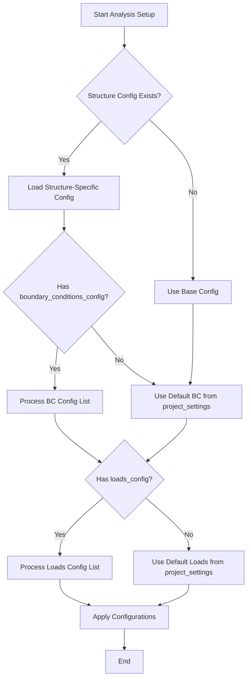
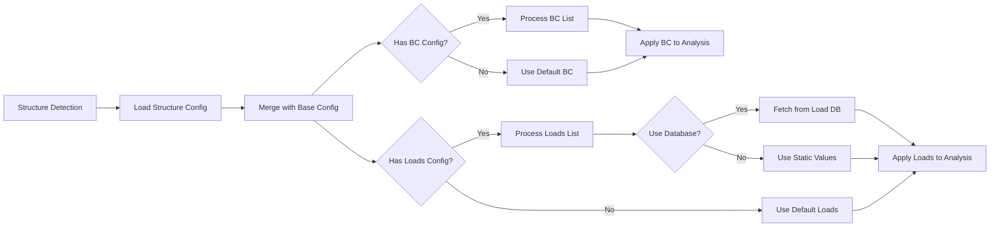

# Boundary Condition and Load Customization by Structure Type

## Purpose

Enable structure-type-specific configuration of boundary conditions and loads in the ANSYS automation system. Different structure types require different combinations of constraints and loading patterns, which currently cannot be flexibly configured per structure type.

## Problem Statement

Currently, the system applies a fixed set of boundary conditions and loads defined in the global project_settings.json file. However, different structure types require different combinations:

- Structure type 151 requires: Fixed Support + Rotation Constraints + Force (X, Y, Z components) + Bolt Pretension
- Structure type 131/132 requires: Fixed Support + Rotation Constraints + Force (X, Y, Z components) + Bolt Pretension

While these two types currently have identical requirements, the system must support future structure types with different boundary condition and load combinations. The existing architecture does not provide a flexible, extensible mechanism for defining structure-specific configurations, requiring code modifications to support new structure types.

## Current System Analysis

### Structure Type Detection
The system already detects structure types through the StructureDetector class, which extracts structure identifiers from model names using pattern matching. Structure types include 151, 131/132, 2045, and others.

### Configuration Hierarchy
The system implements a configuration hierarchy where structure-specific configurations can override base configurations through the merge_configs method in ConfigurationManager. This mechanism is already used for loading structure-specific settings.

### Boundary Conditions and Loads Application
The AnalysisManager applies boundary conditions and loads based on Named Selection patterns defined in project_settings.json. The current implementation reads from:
- boundary_conditions section for constraints
- loads section for force, moment, pressure, and other loading types

## Proposed Solution

### Structure-Specific Configuration Schema

Extend the structure-specific configuration file format to include boundary_conditions_config and loads_config sections that define which types of constraints and loads should be applied for each structure type.

| Configuration Section | Purpose | Structure |
|----------------------|---------|-----------|
| boundary_conditions_config | Defines which boundary condition types to apply | List of boundary condition definitions with type, named_selection, and parameters |
| loads_config | Defines which load types to apply | List of load definitions with type, named_selection, and parameters |

### Boundary Condition Types

| Type | Description | Parameters |
|------|-------------|------------|
| fixed_support | Fully constrained support | named_selection |
| rotation_constraint | Rotation prohibition (Remote Displacement with RotX=0, RotY=0, RotZ=0) | named_selection |
| displacement | Prescribed displacement | named_selection, components (x, y, z) |
| remote_displacement | Remote point displacement with rotations | named_selection, components (x, y, z, rotx, roty, rotz) |
| remote_force | Remote point force | named_selection |
| frictionless_support | Frictionless constraint | named_selection |
| compression_only_support | Compression-only contact | named_selection |

### Load Types

| Type | Description | Parameters |
|------|-------------|------------|
| force | Direct force application with X, Y, Z components | named_selection, use_database (boolean), components (fx, fy, fz) if not using database |
| moment | Direct moment application | named_selection, use_database (boolean) |
| pressure | Pressure load | named_selection, value or use_database |
| remote_force | Remote point force | named_selection, use_database (boolean) |
| bearing_load | Bearing load | named_selection, use_database (boolean) |
| bolt_pretension | Bolt pretension from bolt database | automatic (uses bolt patterns) |
| temperature | Temperature load | named_selection, value |

### Configuration File Structure

Structure-specific configuration files will be stored in config_files directory with naming pattern: structure_{type}_config.json

Example for structure type 151:

| Section | Content |
|---------|---------|
| boundary_conditions_config | List containing: fixed_support at gu_fixed, rotation_constraint at gu_remote_disp |
| loads_config | List containing: force with X/Y/Z components (use_database=true), bolt_pretension |

Example for structure type 131/132:

| Section | Content |
|---------|---------|
| boundary_conditions_config | List containing: fixed_support at gu_fixed, rotation_constraint at gu_remote_disp |
| loads_config | List containing: force with X/Y/Z components (use_database=true), bolt_pretension |

Note: Both types currently have identical configurations, but the extensible architecture allows future structure types to define different combinations.

### Enhanced AnalysisManager Behavior

The AnalysisManager will be enhanced to process structure-specific boundary condition and load configurations:

**Configuration Resolution Flow:**

**Boundary Condition Application Logic:**

For each boundary condition definition in the configuration:
1. Retrieve the boundary condition type
2. Locate the named selection specified
3. Create the appropriate boundary condition object in ANSYS
4. Apply specified parameters (e.g., rotation constraints for Remote Displacement)
5. Associate with the named selection

**Load Application Logic:**

For each load definition in the configuration:
1. Retrieve the load type
2. Locate the named selection specified
3. If use_database flag is true, retrieve load values from load_database based on structure type and execution parameters
4. If use_database is false, use specified static values
5. Create the appropriate load object in ANSYS
6. Apply load values with proper time step configuration
7. Associate with the named selection

### Parameter Specification Strategy

**Rotation Constraints:**

When boundary_conditions_config specifies a rotation_constraint type, the system will:
- Create Remote Displacement boundary condition
- Set all displacement components (X, Y, Z) to 0 (free displacement)
- Set rotation constraints: RotX = 0, RotY = 0, RotZ = 0 to prevent all rotations

For custom rotation constraints using remote_displacement type:
- Create Remote Displacement boundary condition
- Set specified displacement components to provided values
- Set rotation constraints to specified values (allowing partial rotation freedom if needed)

**Database-Driven vs Static Values:**

- When use_database = true: Load values are retrieved from load_database.json using structure type and execution identifiers. For forces, this includes all three components (fx, fy, fz) as defined in the database.
- When use_database = false: Load values are specified directly in the configuration with explicit numerical values for each component (fx, fy, fz for forces)

### Integration with Existing Components

**NamedSelectionManager:**

No changes required. The existing get_ns_by_name method will continue to resolve named selection references from configuration.

**ConfigurationManager:**

The existing merge_configs method already handles structure-specific configuration merging. The new boundary_conditions_config and loads_config sections will be automatically included in the merged configuration.

**ExecutionManager:**

No changes required. The existing execution flow will continue to call AnalysisManager methods, which will internally use the enhanced configuration processing.

## Configuration Examples

### Structure Type 151 Configuration

| Field | Value |
|-------|-------|
| Structure Type | 151 |
| Boundary Conditions | Fixed Support at gu_fixed, Rotation Constraint at gu_remote_disp |
| Loads | Force at gu_force with X/Y/Z components (from database), Bolt Pretension (automatic) |
| Special Notes | Identical to 131/132 configuration |

### Structure Type 131/132 Configuration

| Field | Value |
|-------|-------|
| Structure Type | 131/132 |
| Boundary Conditions | Fixed Support at gu_fixed, Rotation Constraint at gu_remote_disp |
| Loads | Force at gu_force with X/Y/Z components (from database), Bolt Pretension (automatic) |
| Special Notes | Identical to 151 configuration |

## Data Flow

## Validation Strategy

### Configuration Validation

Before applying boundary conditions and loads, the system will validate:

| Validation Check | Purpose |
|-----------------|---------|
| Named Selection Existence | Verify that all named selections referenced in configuration exist in the model |
| Parameter Completeness | Verify that all required parameters are specified for each boundary condition and load type |
| Database Reference Validity | Verify that database references (structure type, execution codes) exist in load_database.json |
| Type Compatibility | Verify that specified types are supported by the system |

### Error Handling

When validation fails:
- Log detailed error messages indicating missing named selections or invalid parameters
- Provide fallback to base configuration if structure-specific configuration is invalid
- Continue with partial configuration application where possible, skipping only invalid entries

## Backwards Compatibility

The enhancement maintains full backwards compatibility:

- If no structure-specific configuration exists, the system uses base project_settings.json as before
- If structure-specific configuration exists but does not include boundary_conditions_config or loads_config, the system falls back to base configuration sections
- Existing structure configurations without these new sections will continue to function unchanged

## Benefits

| Benefit | Description |
|---------|-------------|
| Flexibility | Different structure types can have completely different boundary condition and load combinations |
| Extensibility | New structure types with unique requirements can be added without modifying code - only configuration files |
| Maintainability | Boundary condition and load configurations are declarative and centralized in configuration files |
| Scalability | System can grow to support unlimited structure types through configuration |
| Clarity | Explicit configuration makes it clear which constraints and loads apply to each structure type |
| Reusability | Common boundary condition patterns (like current 151 and 131/132 shared configuration) can be reused across multiple structure types |
| Future-Proof | Architecture supports unknown future requirements through extensible configuration schema |

## Implementation Scope

### Configuration Schema Design
Define the structure of boundary_conditions_config and loads_config sections with all supported types and parameters.

### AnalysisManager Enhancement
Extend apply_boundary_conditions and apply_loads methods to process configuration lists and handle parameter specifications.

### Configuration File Creation
Create structure-specific configuration files for existing structure types (151, 131/132) with appropriate boundary condition and load definitions.

### Validation Logic
Implement configuration validation to check named selection existence, parameter completeness, and database references.

### Documentation
Document the new configuration schema, supported boundary condition and load types, and parameter specifications for future reference.
