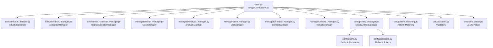
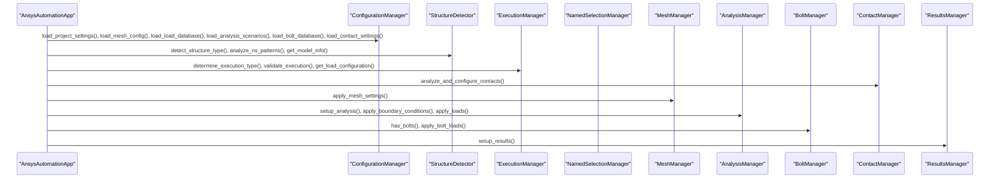
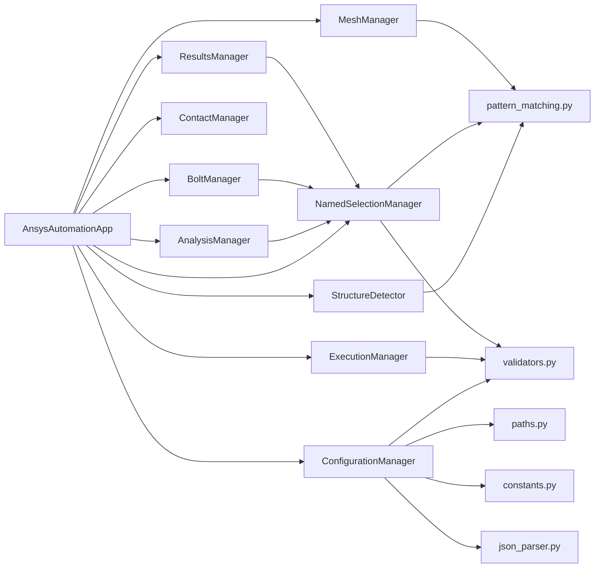

# API Reference

<cite>
**Referenced Files in This Document**
- [main.py](file://main.py)
- [core/__init__.py](file://core/__init__.py)
- [core/structure_detector.py](file://core/structure_detector.py)
- [core/execution_manager.py](file://core/execution_manager.py)
- [core/named_selection_manager.py](file://core/named_selection_manager.py)
- [managers/__init__.py](file://managers/__init__.py)
- [managers/mesh_manager.py](file://managers/mesh_manager.py)
- [managers/bolt_manager.py](file://managers/bolt_manager.py)
- [managers/contact_manager.py](file://managers/contact_manager.py)
- [managers/analysis_manager.py](file://managers/analysis_manager.py)
- [managers/results_manager.py](file://managers/results_manager.py)
- [config/__init__.py](file://config/__init__.py)
- [config/config_manager.py](file://config/config_manager.py)
- [config/paths.py](file://config/paths.py)
- [config/constants.py](file://config/constants.py)
- [utils/__init__.py](file://utils/__init__.py)
- [utils/pattern_matching.py](file://utils/pattern_matching.py)
- [utils/validators.py](file://utils/validators.py)
- [utils/json_parser.py](file://utils/json_parser.py)
</cite>

## Table of Contents
1. [Introduction](#introduction)
2. [Project Structure](#project-structure)
3. [Core Components](#core-components)
4. [Architecture Overview](#architecture-overview)
5. [Detailed Component Analysis](#detailed-component-analysis)
6. [Dependency Analysis](#dependency-analysis)
7. [Performance Considerations](#performance-considerations)
8. [Troubleshooting Guide](#troubleshooting-guide)
9. [Conclusion](#conclusion)
10. [Appendices](#appendices)

## Introduction
This document provides a comprehensive API reference for the AnsysAutomation system. It covers the public classes and methods used to automate ANSYS finite element analysis setup. The primary application orchestrator is AnsysAutomationApp, which coordinates configuration loading, structure detection, validation, and execution of analysis setup. Supporting core modules include StructureDetector, ExecutionManager, and NamedSelectionManager. Manager classes encapsulate domain-specific operations: MeshManager, AnalysisManager, BoltManager, ContactManager, and ResultsManager. Configuration and utilities provide hierarchical configuration loading, path resolution, constants, JSON parsing, pattern matching, and validation helpers.

## Project Structure
The system is organized into core, managers, config, and utils packages. The main entry point initializes and runs the automated workflow.

**Diagram sources**
- [main.py](file://main.py#L1-L270)
- [core/structure_detector.py](file://core/structure_detector.py#L1-L158)
- [core/execution_manager.py](file://core/execution_manager.py#L1-L154)
- [core/named_selection_manager.py](file://core/named_selection_manager.py#L1-L190)
- [managers/mesh_manager.py](file://managers/mesh_manager.py#L1-L104)
- [managers/analysis_manager.py](file://managers/analysis_manager.py#L1-L116)
- [managers/bolt_manager.py](file://managers/bolt_manager.py#L1-L68)
- [managers/contact_manager.py](file://managers/contact_manager.py#L1-L96)
- [managers/results_manager.py](file://managers/results_manager.py#L1-L62)
- [config/config_manager.py](file://config/config_manager.py#L1-L209)
- [config/paths.py](file://config/paths.py#L1-L73)
- [config/constants.py](file://config/constants.py#L1-L99)
- [utils/pattern_matching.py](file://utils/pattern_matching.py#L1-L71)
- [utils/validators.py](file://utils/validators.py#L1-L161)
- [utils/json_parser.py](file://utils/json_parser.py#L1-L170)

**Section sources**
- [main.py](file://main.py#L1-L270)
- [core/__init__.py](file://core/__init__.py#L1-L14)
- [managers/__init__.py](file://managers/__init__.py#L1-L18)
- [config/__init__.py](file://config/__init__.py#L1-L16)
- [utils/__init__.py](file://utils/__init__.py#L1-L18)

## Core Components
This section documents the principal classes and their public interfaces.

### AnsysAutomationApp
- Purpose: Orchestrates the end-to-end automation workflow.
- Initialization: Creates internal managers and configuration references.
- Public methods:
  - initialize_application(): Validates configuration path, initializes ConfigurationManager, detects structure type and model info, loads configuration hierarchy, and initializes managers.
  - run_validation(): Validates Named Selections presence, model structure, and configuration hierarchy.
  - execute_analysis_setup(): Determines execution type, validates execution, configures contacts, applies mesh settings, sets up analysis, applies loads and bolt pretension, and sets up results.
  - run(): Main entry point that sequences initialization, validation, and analysis setup, returning success/failure.

Key behaviors and side effects:
- Reads and merges configuration files; structure-specific configs override base settings.
- Interacts with ANSYS Model objects to create mesh, contacts, analyses, loads, and results.
- Uses managers to encapsulate domain logic and reduce coupling.

Exceptions:
- Raises System.Exception on configuration path errors, execution type determination failures, and runtime errors during setup.

Thread safety:
- Not explicitly synchronized; assumes single-threaded ANSYS scripting context.

Typical usage patterns:
- Instantiate AnsysAutomationApp, call run(), and handle return status.
- Error handling: Catch System.Exception and inspect printed messages for guidance.

**Section sources**
- [main.py](file://main.py#L27-L270)

### ConfigurationManager
- Purpose: Loads and validates configuration files, merges base and structure-specific configs, and validates the configuration hierarchy.
- Public methods:
  - load_project_settings(): Loads project settings.
  - load_mesh_config(): Loads mesh configuration.
  - load_load_database(): Loads load database.
  - load_analysis_scenarios(): Loads analysis scenarios.
  - load_bolt_database(): Loads bolt database.
  - load_contact_settings(): Loads contact settings.
  - load_all_configs(): Loads all main configuration files into a dictionary.
  - load_structure_config(structure_type): Loads structure-specific configuration if present.
  - merge_configs(base_config, structure_config): Recursively merges structure-specific overrides into base config.
  - create_default_config(config_type): Returns default configuration for a given type.
  - validate_config_hierarchy(structure_type): Checks existence of required files and optional structure-specific config; returns validity, missing files, and presence flag.

Return types and exceptions:
- load_* methods return parsed dictionaries; raise System.Exception on file or structure validation errors.
- merge_configs returns merged dictionary.
- validate_config_hierarchy returns tuple of (bool, list[str], bool).

Thread safety:
- Stateless; safe to use concurrently if underlying file system is thread-safe.

**Section sources**
- [config/config_manager.py](file://config/config_manager.py#L1-L209)
- [config/paths.py](file://config/paths.py#L1-L73)
- [config/constants.py](file://config/constants.py#L1-L99)

### StructureDetector
- Purpose: Detects structure type and category from model name and analyzes Named Selection patterns to infer configuration hints.
- Static methods:
  - detect_structure_type(): Returns (structure_type, structure_category) derived from model name patterns.
  - analyze_ns_patterns(): Returns a dictionary indicating presence of various NS categories and counts.
  - detect_load_configuration(): Returns a dictionary indicating detected load types from NS names.
  - detect_boundary_conditions(): Returns a dictionary indicating detected boundary condition types from NS names.
  - get_model_info(): Returns comprehensive model information including counts and body type breakdown.

Return value structures:
- detect_structure_type: tuple[str, str].
- analyze_ns_patterns: dict with boolean flags and counts.
- detect_load_configuration/detect_boundary_conditions: dict with boolean flags.
- get_model_info: dict with metadata and counts; may include an error field on failure.

Exceptions:
- get_model_info may print a warning and return partial info on failure.

Thread safety:
- Stateless static methods; safe to call concurrently.

**Section sources**
- [core/structure_detector.py](file://core/structure_detector.py#L1-L158)

### ExecutionManager
- Purpose: Determines execution type from model name, validates execution against load database, and retrieves load configuration.
- Public methods:
  - determine_execution_type(): Returns execution type identifier; raises System.Exception if undetermined.
  - validate_execution(execution_type): Validates execution existence and returns (execution_number, load_group); raises System.Exception if invalid.
  - get_load_configuration(execution_type): Builds load configuration including forces, moments, and load factors; raises System.Exception if invalid.
  - get_available_executions(): Returns list of available execution numbers.
  - get_available_load_groups(execution_number): Returns list of load groups for an execution; raises System.Exception if not found.

Return types and exceptions:
- determine_execution_type: str; raises System.Exception.
- validate_execution: tuple[str, str]; raises System.Exception.
- get_load_configuration: dict; raises System.Exception.
- get_available_executions: list[str].
- get_available_load_groups: list[str]; raises System.Exception.

Thread safety:
- Stateless; safe to use concurrently.

**Section sources**
- [core/execution_manager.py](file://core/execution_manager.py#L1-L154)
- [utils/validators.py](file://utils/validators.py#L133-L161)

### NamedSelectionManager
- Purpose: Manages Named Selection operations, validation, and queries.
- Public methods:
  - get_ns_by_name(ns_name): Returns Named Selection object or None; caches results.
  - get_ns_by_pattern(pattern): Returns list of matching Named Selections.
  - validate_required_ns(): Returns True if all required NS exist; prints warnings with details.
  - get_all_ns_names(): Returns list of all Named Selection names.
  - get_ns_by_type(ns_type): Returns list of Named Selections by type (load, bc, bolt, contact, remote).
  - find_ns_with_keywords(keywords): Returns list of Named Selections containing keywords.
  - validate_ns_for_analysis(): Returns comprehensive validation results including counts and missing details.
  - clear_cache(): Clears internal cache.

Return types and exceptions:
- get_ns_by_name/get_ns_by_pattern/get_all_ns_names/get_ns_by_type/find_ns_with_keywords: various lists or objects; no explicit exceptions.
- validate_required_ns/validate_ns_for_analysis: booleans and dicts; prints warnings rather than raising.

Thread safety:
- Not thread-safe due to internal cache; avoid concurrent use.

**Section sources**
- [core/named_selection_manager.py](file://core/named_selection_manager.py#L1-L190)
- [utils/pattern_matching.py](file://utils/pattern_matching.py#L1-L71)
- [utils/validators.py](file://utils/validators.py#L52-L67)

## Architecture Overview
The application follows a layered architecture:
- Entry point (AnsysAutomationApp) orchestrates workflow.
- Core modules encapsulate detection, execution, and NS management.
- Managers encapsulate domain logic and interact with ANSYS Model.
- Configuration and utilities provide reusable services.

**Diagram sources**
- [main.py](file://main.py#L51-L209)
- [core/structure_detector.py](file://core/structure_detector.py#L29-L158)
- [core/execution_manager.py](file://core/execution_manager.py#L16-L154)
- [core/named_selection_manager.py](file://core/named_selection_manager.py#L12-L190)
- [managers/mesh_manager.py](file://managers/mesh_manager.py#L20-L104)
- [managers/analysis_manager.py](file://managers/analysis_manager.py#L14-L116)
- [managers/bolt_manager.py](file://managers/bolt_manager.py#L17-L68)
- [managers/contact_manager.py](file://managers/contact_manager.py#L14-L96)
- [managers/results_manager.py](file://managers/results_manager.py#L15-L62)

## Detailed Component Analysis

### AnsysAutomationApp
- Initialization and run workflow:
  - initialize_application(): Validates configuration path, constructs ConfigurationManager, detects structure and model info, loads configurations, and initializes managers.
  - run_validation(): Validates NS presence, model structure, and configuration hierarchy.
  - execute_analysis_setup(): Determines execution type, validates execution, configures contacts, creates mesh, sets up analysis, applies loads and bolt pretension, and sets up results.
  - run(): Top-level orchestration with error handling and success reporting.

Typical usage:
- Instantiate AnsysAutomationApp and call run().
- Handle System.Exception for critical failures.

Error handling:
- Catches System.Exception and prints structured error messages; returns False on failure.

**Section sources**
- [main.py](file://main.py#L51-L270)

### ConfigurationManager
- load_config(file_path): Validates file existence and structure, parses JSON, and returns dictionary.
- load_* methods: Delegate to load_config with specific file paths.
- load_all_configs(): Returns a dictionary of all main configurations.
- load_structure_config(structure_type): Attempts to load structure-specific config if present.
- merge_configs(base_config, structure_config): Recursively merges structure-specific overrides.
- create_default_config(config_type): Returns default configuration for a given type.
- validate_config_hierarchy(structure_type): Checks required files and optional structure-specific config.

Typical usage:
- Call load_* methods to populate project_settings, mesh_config, load_database, analysis_scenarios, bolt_database, contact_settings.
- Use merge_configs to apply structure-specific overrides.

Error handling:
- Raises System.Exception on missing files or invalid structure.

**Section sources**
- [config/config_manager.py](file://config/config_manager.py#L1-L209)
- [config/paths.py](file://config/paths.py#L1-L73)
- [utils/json_parser.py](file://utils/json_parser.py#L142-L170)
- [utils/validators.py](file://utils/validators.py#L9-L25)

### StructureDetector
- detect_structure_type(): Matches model name against patterns to derive structure_type and category.
- analyze_ns_patterns(): Scans Named Selection names to detect presence of predefined categories.
- detect_load_configuration(): Infers load types from NS names.
- detect_boundary_conditions(): Infers boundary condition types from NS names.
- get_model_info(): Collects model metadata and body type counts.

Typical usage:
- Call detect_structure_type() and analyze_ns_patterns() early in initialization to inform configuration merging and validation.

Error handling:
- get_model_info prints a warning and returns partial info on failure.

**Section sources**
- [core/structure_detector.py](file://core/structure_detector.py#L1-L158)
- [utils/pattern_matching.py](file://utils/pattern_matching.py#L1-L71)

### ExecutionManager
- determine_execution_type(): Derives execution type from model name using project settings patterns and fallbacks.
- validate_execution(execution_type): Parses execution_type into execution_number and load_group; validates against load_database.
- get_load_configuration(execution_type): Builds load configuration including forces, moments, and load factors.
- get_available_executions()/get_available_load_groups(execution_number): Query helpers.

Typical usage:
- Use determine_execution_type() to select execution.
- Use validate_execution() to confirm availability.
- Use get_load_configuration() to obtain load parameters for analysis.

Error handling:
- Raises System.Exception on invalid execution type or missing groups.

**Section sources**
- [core/execution_manager.py](file://core/execution_manager.py#L1-L154)
- [utils/validators.py](file://utils/validators.py#L133-L161)

### NamedSelectionManager
- get_ns_by_name(ns_name): Cached retrieval of Named Selection by exact name.
- get_ns_by_pattern(pattern): Pattern-based matching using wildcard support.
- validate_required_ns(): Checks required NS from project settings.
- get_all_ns_names()/get_ns_by_type()/find_ns_with_keywords(): Query utilities.
- validate_ns_for_analysis(): Comprehensive validation report.
- clear_cache(): Resets internal cache.

Typical usage:
- Use validate_required_ns() and validate_ns_for_analysis() during validation phase.
- Use get_ns_by_type() and find_ns_with_keywords() to discover relevant NS for loads and BCs.

Error handling:
- Returns None or empty collections; prints warnings rather than raising.

**Section sources**
- [core/named_selection_manager.py](file://core/named_selection_manager.py#L1-L190)
- [utils/pattern_matching.py](file://utils/pattern_matching.py#L1-L71)
- [utils/validators.py](file://utils/validators.py#L52-L67)

### MeshManager
- apply_mesh_settings(): Applies mesh settings to all Named Selections, skipping special NS (loads/BCs/bolts).
- Internal helpers:
  - _is_load_or_bc_ns(ns_name): Determines if NS belongs to special categories.
  - _get_mesh_settings(ns_name): Resolves mesh settings based on name patterns and mesh_config.
  - _create_sizing_and_method(ns, mesh_settings): Creates sizing and automatic method with computed element size.

Typical usage:
- Call apply_mesh_settings() after contacts and boundary conditions are set.

Side effects:
- Modifies Model.Mesh by adding sizing and methods; regroups and generates mesh.

**Section sources**
- [managers/mesh_manager.py](file://managers/mesh_manager.py#L1-L104)
- [utils/pattern_matching.py](file://utils/pattern_matching.py#L1-L71)

### AnalysisManager
- setup_analysis(scenario_name, has_bolts): Sets analysis steps and solver options based on scenario.
- apply_boundary_conditions(analysis): Adds fixed support, displacement, remote displacement, and remote force as configured.
- apply_loads(analysis, load_config, scenario_name, has_bolts): Applies force, moment, and pressure loads with time steps and load factors.

Typical usage:
- Call setup_analysis() before applying loads.
- Use apply_boundary_conditions() and apply_loads() with load_config from ExecutionManager.

Side effects:
- Modifies Analysis objects by adding supports and loads.

**Section sources**
- [managers/analysis_manager.py](file://managers/analysis_manager.py#L1-L116)

### BoltManager
- has_bolts(): Detects presence of bolt-related Named Selections.
- get_correct_bolt_pretension(): Infers pretension from model body names or falls back to default.
- apply_bolt_loads(analysis, steps_count): Creates bolt pretension loads and configures subsequent steps.

Typical usage:
- Call has_bolts() to decide whether to adjust time steps.
- Call apply_bolt_loads() after analysis setup.

Side effects:
- Modifies Analysis by adding bolt pretension loads.

**Section sources**
- [managers/bolt_manager.py](file://managers/bolt_manager.py#L1-L68)
- [utils/pattern_matching.py](file://utils/pattern_matching.py#L1-L71)

### ContactManager
- analyze_and_configure_contacts(): Automatically configures contact pairs and applies contact settings based on contact_rules.
- Internal helpers:
  - _configure_contact(contact): Applies configuration to a single contact region.
  - _find_contact_config(contact_bodies, target_bodies): Matches bodies to rules.
  - _matches_config(contact_bodies, target_bodies, config): Checks pattern matches.
  - _apply_contact_config(contact, config): Applies contact properties.

Typical usage:
- Call analyze_and_configure_contacts() before mesh generation.

Side effects:
- Modifies Model.Connections by creating automatic connections and configuring contact regions.

**Section sources**
- [managers/contact_manager.py](file://managers/contact_manager.py#L1-L96)

### ResultsManager
- setup_results(): Configures solution information and creates deformation and stress intensity results for important Named Selections.
- Internal helpers:
  - _should_create_result_for_ns(ns_name, important_keywords): Decides whether to create results for a given NS.
  - _create_stress_result(ns): Creates appropriate stress result type.

Typical usage:
- Call setup_results() after analysis completion.

Side effects:
- Modifies Solution by adding total deformation and stress results.

**Section sources**
- [managers/results_manager.py](file://managers/results_manager.py#L1-L62)

## Dependency Analysis
- Module-level imports:
  - main.py imports core, managers, config, and utils modules.
  - Core modules import utils for pattern matching and validators.
  - Managers import utils for pattern matching and validators.
  - Configuration module imports utils for JSON parsing and validators, and paths/constants for file locations and defaults.
- Coupling:
  - AnsysAutomationApp depends on all core and manager classes.
  - Managers depend on project_settings, analysis_scenarios, and NamedSelectionManager.
  - ExecutionManager depends on load_database and validators.
  - ConfigurationManager depends on paths, constants, json_parser, and validators.
- Cohesion:
  - Each manager encapsulates a distinct domain, improving cohesion and reducing cross-module coupling.

**Diagram sources**
- [main.py](file://main.py#L1-L270)
- [config/config_manager.py](file://config/config_manager.py#L1-L209)
- [config/paths.py](file://config/paths.py#L1-L73)
- [config/constants.py](file://config/constants.py#L1-L99)
- [utils/pattern_matching.py](file://utils/pattern_matching.py#L1-L71)
- [utils/validators.py](file://utils/validators.py#L1-L161)
- [utils/json_parser.py](file://utils/json_parser.py#L1-L170)

**Section sources**
- [main.py](file://main.py#L1-L270)
- [config/config_manager.py](file://config/config_manager.py#L1-L209)

## Performance Considerations
- Caching: NamedSelectionManager caches NS lookups to reduce repeated traversal of Model.NamedSelections.Children.
- Pattern matching: Utilities use simple wildcard matching suitable for IronPython environments; keep patterns concise to minimize overhead.
- Mesh generation: MeshManager iterates over all NS; consider organizing NS names to optimize matching order.
- Validation: ConfigurationManager validates required keys and file existence; batch operations like load_all_configs() reduce repeated IO.
- Concurrency: Managers are stateless or have minimal shared state; however, NamedSelectionManager’s cache is not thread-safe.

[No sources needed since this section provides general guidance]

## Troubleshooting Guide
Common issues and resolutions:
- Configuration path not found:
  - Ensure CONFIG_PATH exists and contains required files.
  - Use validate_config_path() to verify.
- Missing configuration files:
  - Use validate_config_hierarchy(structure_type) to identify missing files.
- Execution type cannot be determined:
  - Check model name patterns in project_settings.execution.name_pattern and default_pattern.
  - ExecutionManager raises System.Exception if undetermined.
- Invalid execution or load group:
  - ExecutionManager.validate_execution() checks load_database keys; ensure execution_number and load_group exist.
- Named Selections missing:
  - Use NamedSelectionManager.validate_required_ns() and validate_ns_for_analysis() to locate missing NS.
- Mesh settings invalid:
  - Ensure mesh_config contains required keys; use validators to validate.
- Contact configuration warnings:
  - Review contact_rules and body name patterns; ContactManager logs warnings on misconfiguration.

**Section sources**
- [config/paths.py](file://config/paths.py#L45-L58)
- [config/config_manager.py](file://config/config_manager.py#L181-L209)
- [core/execution_manager.py](file://core/execution_manager.py#L16-L154)
- [utils/validators.py](file://utils/validators.py#L9-L25)
- [utils/validators.py](file://utils/validators.py#L133-L161)
- [core/named_selection_manager.py](file://core/named_selection_manager.py#L58-L190)
- [managers/contact_manager.py](file://managers/contact_manager.py#L14-L96)

## Conclusion
The AnsysAutomation system provides a modular, configurable framework for automating ANSYS analysis setup. AnsysAutomationApp orchestrates configuration loading, structure detection, validation, and execution. Core and manager classes encapsulate detection, execution, NS management, mesh, analysis, bolt, contact, and results logic. Configuration and utilities ensure robust file handling, validation, and pattern matching. Following the documented APIs and error handling patterns enables reliable automation of ANSYS workflows.

[No sources needed since this section summarizes without analyzing specific files]

## Appendices

### API Definitions and Specifications

- AnsysAutomationApp
  - Methods:
    - initialize_application() -> bool
    - run_validation() -> bool
    - execute_analysis_setup() -> tuple[str, str]
    - run() -> bool

- ConfigurationManager
  - Methods:
    - load_project_settings() -> dict
    - load_mesh_config() -> dict
    - load_load_database() -> dict
    - load_analysis_scenarios() -> dict
    - load_bolt_database() -> dict
    - load_contact_settings() -> dict
    - load_all_configs() -> dict[str, dict]
    - load_structure_config(structure_type) -> dict | None
    - merge_configs(base_config, structure_config) -> dict
    - create_default_config(config_type) -> dict
    - validate_config_hierarchy(structure_type) -> tuple[bool, list[str], bool]

- StructureDetector
  - Methods:
    - detect_structure_type() -> tuple[str, str]
    - analyze_ns_patterns() -> dict
    - detect_load_configuration() -> dict
    - detect_boundary_conditions() -> dict
    - get_model_info() -> dict

- ExecutionManager
  - Methods:
    - determine_execution_type() -> str
    - validate_execution(execution_type) -> tuple[str, str]
    - get_load_configuration(execution_type) -> dict
    - get_available_executions() -> list[str]
    - get_available_load_groups(execution_number) -> list[str]

- NamedSelectionManager
  - Methods:
    - get_ns_by_name(ns_name) -> object | None
    - get_ns_by_pattern(pattern) -> list[object]
    - validate_required_ns() -> bool
    - get_all_ns_names() -> list[str]
    - get_ns_by_type(ns_type) -> list[object]
    - find_ns_with_keywords(keywords) -> list[object]
    - validate_ns_for_analysis() -> dict
    - clear_cache() -> None

- MeshManager
  - Methods:
    - apply_mesh_settings() -> None

- AnalysisManager
  - Methods:
    - setup_analysis(scenario_name="standard_sequence", has_bolts=False) -> object
    - apply_boundary_conditions(analysis) -> None
    - apply_loads(analysis, load_config, scenario_name, has_bolts=False) -> None

- BoltManager
  - Methods:
    - has_bolts() -> bool
    - get_correct_bolt_pretension() -> float
    - apply_bolt_loads(analysis, steps_count) -> list[object]

- ContactManager
  - Methods:
    - analyze_and_configure_contacts() -> None

- ResultsManager
  - Methods:
    - setup_results() -> None

- Exceptions
  - System.Exception raised by:
    - validate_file_exists, validate_required_keys, validate_execution_type, validate_mesh_settings, validate_contact_settings
    - load_json_file, load_config, get_available_load_groups
    - determine_execution_type

- Thread Safety
  - Stateless classes (ConfigurationManager, StructureDetector, ExecutionManager, MeshManager, AnalysisManager, BoltManager, ContactManager, ResultsManager) are generally safe for concurrent use.
  - NamedSelectionManager is not thread-safe due to internal cache.

[No sources needed since this section consolidates previously analyzed information]