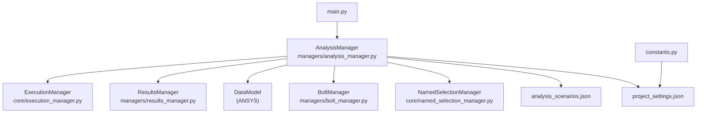
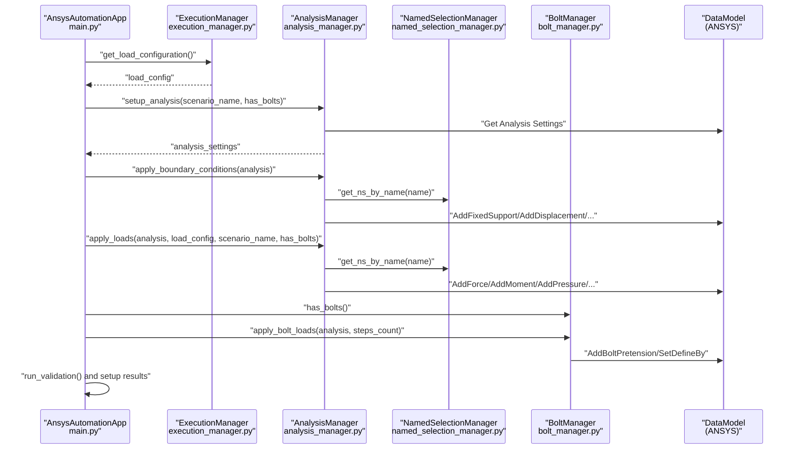
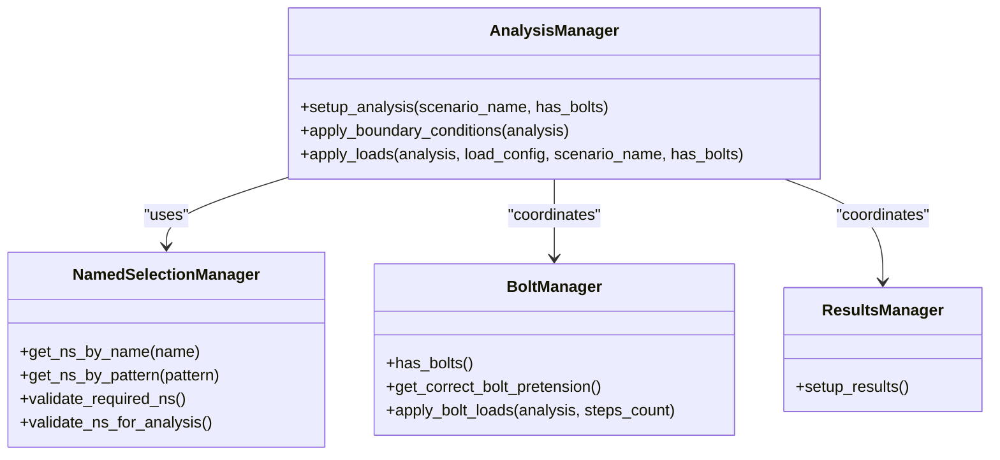
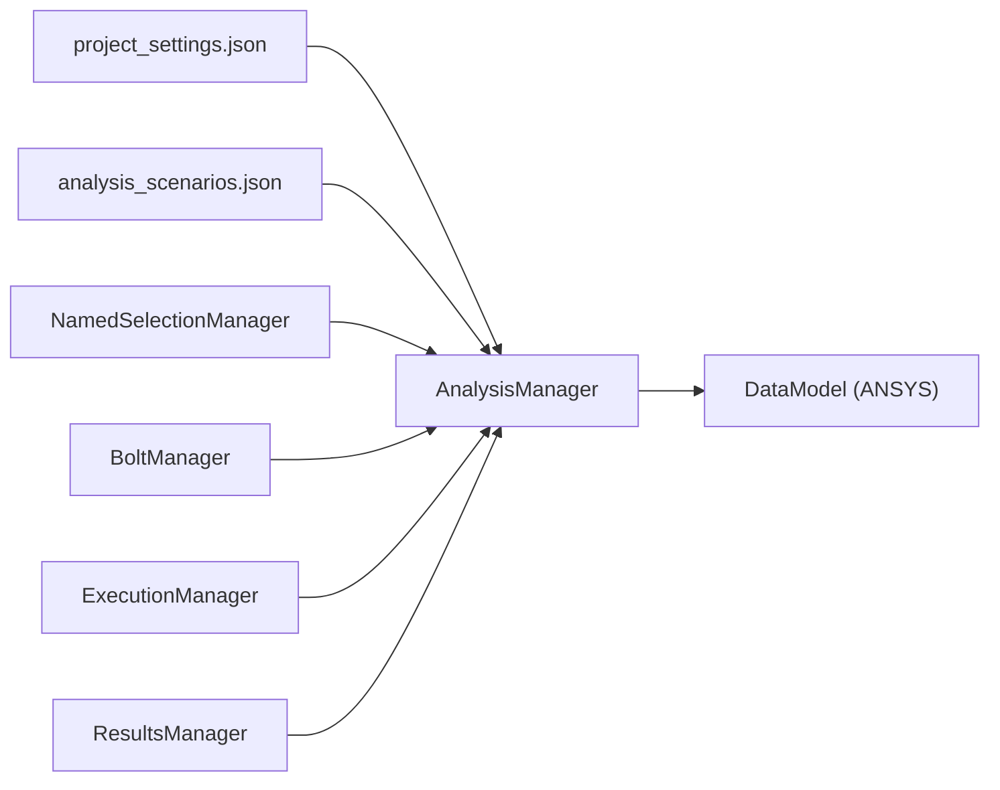
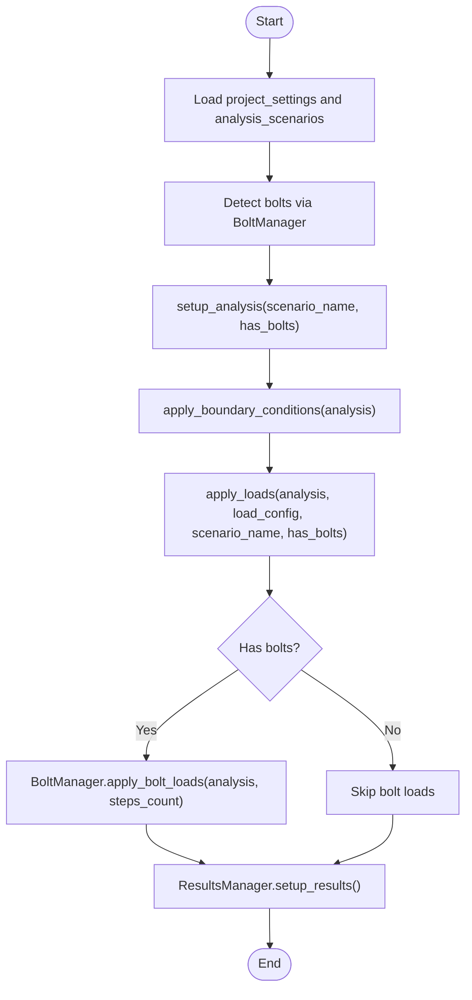

# AnalysisManager Class

<cite>
**Referenced Files in This Document**
- [analysis_manager.py](file://managers/analysis_manager.py)
- [analysis_scenarios.json](file://config_files/analysis_scenarios.json)
- [project_settings.json](file://config_files/project_settings.json)
- [named_selection_manager.py](file://core/named_selection_manager.py)
- [bolt_manager.py](file://managers/bolt_manager.py)
- [main.py](file://main.py)
- [constants.py](file://config/constants.py)
- [results_manager.py](file://managers/results_manager.py)
- [execution_manager.py](file://core/execution_manager.py)
</cite>

## Table of Contents
1. [Introduction](#introduction)
2. [Project Structure](#project-structure)
3. [Core Components](#core-components)
4. [Architecture Overview](#architecture-overview)
5. [Detailed Component Analysis](#detailed-component-analysis)
6. [Dependency Analysis](#dependency-analysis)
7. [Performance Considerations](#performance-considerations)
8. [Troubleshooting Guide](#troubleshooting-guide)
9. [Conclusion](#conclusion)
10. [Appendices](#appendices)

## Introduction
This document provides comprehensive API documentation for the AnalysisManager class, focusing on how it configures analysis parameters, applies boundary conditions and loads, integrates with ANSYS analysis objects and DataModel, and coordinates with other managers and configuration files. It also covers error conditions, performance implications of nonlinear analysis settings, and convergence strategies.

## Project Structure
AnalysisManager is part of the managers package and collaborates with configuration files and core utilities. The primary integration points are:
- Configuration files: project_settings.json and analysis_scenarios.json
- Named selection management: core/named_selection_manager.py
- Bolt load management: managers/bolt_manager.py
- Application orchestration: main.py
- Constants and defaults: config/constants.py
- Results setup: managers/results_manager.py
- Execution load configuration: core/execution_manager.py

**Diagram sources**
- [analysis_manager.py](file://managers/analysis_manager.py#L1-L116)
- [analysis_scenarios.json](file://config_files/analysis_scenarios.json#L1-L55)
- [project_settings.json](file://config_files/project_settings.json#L1-L56)
- [named_selection_manager.py](file://core/named_selection_manager.py#L1-L190)
- [bolt_manager.py](file://managers/bolt_manager.py#L1-L68)
- [results_manager.py](file://managers/results_manager.py#L1-L62)
- [execution_manager.py](file://core/execution_manager.py#L83-L122)
- [main.py](file://main.py#L114-L141)
- [constants.py](file://config/constants.py#L1-L99)

**Section sources**
- [analysis_manager.py](file://managers/analysis_manager.py#L1-L116)
- [main.py](file://main.py#L114-L141)

## Core Components
- AnalysisManager: Central orchestrator for analysis setup, boundary condition application, and load application. It depends on project_settings, analysis_scenarios, and NamedSelectionManager.
- NamedSelectionManager: Provides Named Selection lookup and validation.
- BoltManager: Detects bolts and applies bolt pretension loads with step-wise configuration.
- ExecutionManager: Supplies load configuration derived from load databases and execution types.
- ResultsManager: Sets up solution information and result sections.
- Configuration files: Define boundary conditions, loads, analysis scenarios, and units.

Key responsibilities:
- setup_analysis: Applies solver settings (steps, large deflection, Newton-Raphson option, nodal forces, miscellaneous toggles).
- apply_boundary_conditions: Adds fixed supports, displacements, remote displacements, and remote forces using Named Selections.
- apply_loads: Applies force, moment, pressure, and bearing loads with time-stepped load factors; handles bolt-inclusive scenarios.

**Section sources**
- [analysis_manager.py](file://managers/analysis_manager.py#L1-L116)
- [named_selection_manager.py](file://core/named_selection_manager.py#L1-L190)
- [bolt_manager.py](file://managers/bolt_manager.py#L1-L68)
- [execution_manager.py](file://core/execution_manager.py#L83-L122)
- [results_manager.py](file://managers/results_manager.py#L1-L62)
- [analysis_scenarios.json](file://config_files/analysis_scenarios.json#L1-L55)
- [project_settings.json](file://config_files/project_settings.json#L1-L56)

## Architecture Overview
The AnalysisManager sits at the center of the analysis setup pipeline. It reads configuration from project_settings and analysis_scenarios, resolves Named Selections via NamedSelectionManager, and interacts with ANSYS DataModel to configure analysis objects. It coordinates with BoltManager for bolt-inclusive scenarios and integrates with ExecutionManager for load configurations.

**Diagram sources**
- [main.py](file://main.py#L160-L200)
- [execution_manager.py](file://core/execution_manager.py#L83-L122)
- [analysis_manager.py](file://managers/analysis_manager.py#L1-L116)
- [named_selection_manager.py](file://core/named_selection_manager.py#L1-L190)
- [bolt_manager.py](file://managers/bolt_manager.py#L1-L68)

## Detailed Component Analysis

### AnalysisManager Class
AnalysisManager encapsulates the logic for configuring ANSYS analysis settings and applying boundary conditions and loads.

**Diagram sources**
- [analysis_manager.py](file://managers/analysis_manager.py#L1-L116)
- [named_selection_manager.py](file://core/named_selection_manager.py#L1-L190)
- [bolt_manager.py](file://managers/bolt_manager.py#L1-L68)
- [results_manager.py](file://managers/results_manager.py#L1-L62)

Implementation highlights:
- setup_analysis: Reads scenario steps and applies solver settings including Newton-Raphson option and output controls.
- apply_boundary_conditions: Adds fixed supports, displacements, remote displacements, and remote forces using Named Selections.
- apply_loads: Applies force, moment, and pressure loads with time-stepped load factors; adjusts time steps for bolt-inclusive scenarios.

**Section sources**
- [analysis_manager.py](file://managers/analysis_manager.py#L1-L116)
- [named_selection_manager.py](file://core/named_selection_manager.py#L1-L190)
- [bolt_manager.py](file://managers/bolt_manager.py#L1-L68)

### setup_analysis
Purpose:
- Configure analysis settings based on the selected scenario.
- Set number of steps, large deflection, Newton-Raphson option, nodal forces, and miscellaneous toggles.

Behavior:
- Retrieves Analysis Settings from DataModel.
- Uses scenario steps to set NumberOfSteps.
- Enables large deflection and miscellaneous options.
- Sets Newton-Raphson option to Unsymmetric.

Integration:
- Depends on analysis_scenarios.json for steps and load factors.
- Coordinates with has_bolts flag to adjust time stepping in apply_loads.

**Section sources**
- [analysis_manager.py](file://managers/analysis_manager.py#L14-L26)
- [analysis_scenarios.json](file://config_files/analysis_scenarios.json#L1-L55)

### apply_boundary_conditions
Purpose:
- Apply boundary conditions to the analysis using Named Selections.

Supported boundary conditions:
- Fixed support
- Displacement
- Remote displacement
- Remote force

Validation:
- Uses NamedSelectionManager to resolve Named Selections by name.
- Skips missing Named Selections and logs warnings.

**Section sources**
- [analysis_manager.py](file://managers/analysis_manager.py#L28-L59)
- [named_selection_manager.py](file://core/named_selection_manager.py#L1-L190)

### apply_loads
Purpose:
- Apply loads with proper step configuration and load factors.

Load types:
- Force: X, Y, Z components with time-stepped values.
- Moment: X, Y, Z components with time-stepped values.
- Pressure: Magnitude with time-stepped values.
- Bearing: Not explicitly handled in the shown code; see Notes below.

Time stepping and load factors:
- For bolt-inclusive scenarios, time steps include step 0 (pretension), and load factors start with 0.
- For non-bolt scenarios, time steps start from step 0 without prepending zero.

Sequence and configuration:
- Resolves Named Selections for each load type from project_settings.
- Applies load definitions and sets discrete time values and magnitudes.

Notes:
- The code snippet does not show bearing load application. If bearing loads are required, additional logic should be added similarly to force/moment.

**Section sources**
- [analysis_manager.py](file://managers/analysis_manager.py#L60-L116)
- [project_settings.json](file://config_files/project_settings.json#L1-L56)
- [execution_manager.py](file://core/execution_manager.py#L83-L122)

### Bolt-inclusive Scenarios
Behavior:
- When bolts are detected, apply_loads prepends a zero load factor and includes step 0 in time steps.
- BoltManager applies bolt pretension at step 0 and sets subsequent steps to lock.

Integration:
- main.py determines has_bolts and passes it to AnalysisManager.
- BoltManager uses project_settings loads bolt pattern to find bolt Named Selections.

**Section sources**
- [analysis_manager.py](file://managers/analysis_manager.py#L60-L116)
- [bolt_manager.py](file://managers/bolt_manager.py#L1-L68)
- [main.py](file://main.py#L182-L196)
- [project_settings.json](file://config_files/project_settings.json#L1-L56)

### Integration with ANSYS Analysis Objects and DataModel
- AnalysisManager uses DataModel to retrieve Analysis Settings and create/add analysis objects (supports, displacements, forces, moments, pressures).
- ResultsManager uses DataModel to configure Solution Information and create result objects.
- These integrations assume ANSYS scripting environment with DataModel availability.

**Section sources**
- [analysis_manager.py](file://managers/analysis_manager.py#L14-L26)
- [results_manager.py](file://managers/results_manager.py#L1-L62)

### Example analysis_scenarios.json Configurations
Effect on solver settings:
- standard_sequence: 3 steps, load factors [0.5, 1.0, 1.5], large deflection enabled, Newton-Raphson Unsymmetric, nodal forces Yes, miscellaneous toggles enabled.
- quick_check: 2 steps, load factors [0, 1.5], Newton-Raphson ProgramControlled, nodal forces No, miscellaneous disabled.
- detailed_analysis: 6 steps, load factors [0, 0.2, 0.5, 0.8, 1.0, 1.5], large deflection enabled, Newton-Raphson Unsymmetric, nodal forces Yes, miscellaneous toggles enabled.
- pretension_only: 1 step, load factors [0], large deflection disabled, Newton-Raphson ProgramControlled, nodal forces No, miscellaneous disabled.

Impact on solver behavior:
- More steps and load factors increase computational cost.
- Large deflection and Unsymmetric Newton-Raphson improve nonlinear accuracy but increase runtime.
- Nodal forces and miscellaneous toggles affect output verbosity and post-processing.

**Section sources**
- [analysis_scenarios.json](file://config_files/analysis_scenarios.json#L1-L55)

## Dependency Analysis
AnalysisManager depends on:
- project_settings.json for boundary conditions and load Named Selection names.
- analysis_scenarios.json for steps and load factors.
- NamedSelectionManager for resolving Named Selections.
- BoltManager for detecting bolts and applying bolt loads.
- ExecutionManager for load configuration (forces, moments, pressure, load factors).
- ResultsManager for result setup.

**Diagram sources**
- [analysis_manager.py](file://managers/analysis_manager.py#L1-L116)
- [analysis_scenarios.json](file://config_files/analysis_scenarios.json#L1-L55)
- [project_settings.json](file://config_files/project_settings.json#L1-L56)
- [named_selection_manager.py](file://core/named_selection_manager.py#L1-L190)
- [bolt_manager.py](file://managers/bolt_manager.py#L1-L68)
- [execution_manager.py](file://core/execution_manager.py#L83-L122)
- [results_manager.py](file://managers/results_manager.py#L1-L62)

**Section sources**
- [analysis_manager.py](file://managers/analysis_manager.py#L1-L116)
- [main.py](file://main.py#L114-L141)

## Performance Considerations
Nonlinear analysis settings:
- Large deflection enabled increases accuracy for geometric nonlinearities but raises computational cost.
- Newton-Raphson Unsymmetric improves robustness for nonlinear problems compared to symmetric variants.
- Nodal forces and miscellaneous toggles affect output size and post-processing overhead.

Convergence strategies:
- Increasing steps and load factors improves resolution but may require tighter tolerances or stabilization.
- For contact-heavy models, consider enabling contact-related miscellaneous options and adjusting contact settings via ContactManager.

Units and scaling:
- Ensure consistent units (force, moment, pressure, length, time) to avoid numerical issues.
- Scaling loads and geometry appropriately reduces ill-conditioning.

**Section sources**
- [analysis_scenarios.json](file://config_files/analysis_scenarios.json#L1-L55)
- [project_settings.json](file://config_files/project_settings.json#L1-L56)
- [results_manager.py](file://managers/results_manager.py#L1-L62)

## Troubleshooting Guide
Common error conditions:
- Missing Named Selections:
  - apply_boundary_conditions and apply_loads skip missing Named Selections and rely on NamedSelectionManager validation.
  - main.py runs validation and warns about missing required Named Selections.

- Invalid load factors:
  - apply_loads expects load_config to contain forces, moments, and pressure entries; missing entries default to zero or are skipped.

- Bolt-inclusive scenarios:
  - If bolts are present, ensure bolt pattern matches Named Selections and that bolt pretension values are valid.

- Convergence issues:
  - Reduce load increments, enable large deflection cautiously, and review contact settings.

Diagnostic aids:
- main.py prints detailed error messages for critical exceptions.
- NamedSelectionManager provides detailed missing NS information.

**Section sources**
- [analysis_manager.py](file://managers/analysis_manager.py#L28-L116)
- [named_selection_manager.py](file://core/named_selection_manager.py#L53-L94)
- [main.py](file://main.py#L232-L270)

## Conclusion
AnalysisManager centralizes ANSYS analysis setup, boundary condition application, and load configuration. Its design leverages configuration-driven scenarios and Named Selections to automate setup while allowing flexibility for bolt-inclusive analyses and nonlinear settings. Proper configuration of project_settings and analysis_scenarios ensures robust solver behavior and accurate results.

## Appendices

### API Reference

- setup_analysis(scenario_name="standard_sequence", has_bolts=False)
  - Purpose: Configure analysis settings based on scenario.
  - Parameters:
    - scenario_name: Name of scenario in analysis_scenarios.json.
    - has_bolts: Boolean indicating presence of bolt Named Selections.
  - Returns: Analysis settings object.

- apply_boundary_conditions(analysis)
  - Purpose: Apply boundary conditions using project_settings boundary conditions.
  - Parameters:
    - analysis: ANSYS analysis object.

- apply_loads(analysis, load_config, scenario_name, has_bolts=False)
  - Purpose: Apply force, moment, and pressure loads with time-stepped load factors.
  - Parameters:
    - analysis: ANSYS analysis object.
    - load_config: Dictionary containing forces, moments, pressure, and load_factors.
    - scenario_name: Name of scenario in analysis_scenarios.json.
    - has_bolts: Boolean indicating presence of bolt Named Selections.

**Section sources**
- [analysis_manager.py](file://managers/analysis_manager.py#L14-L116)
- [execution_manager.py](file://core/execution_manager.py#L83-L122)
- [analysis_scenarios.json](file://config_files/analysis_scenarios.json#L1-L55)
- [project_settings.json](file://config_files/project_settings.json#L1-L56)

### Configuration Examples and Effects

- standard_sequence
  - Steps: 3
  - Load factors: [0.5, 1.0, 1.5]
  - Solver settings: large deflection enabled, Newton-Raphson Unsymmetric, nodal forces Yes, miscellaneous toggles enabled.

- quick_check
  - Steps: 2
  - Load factors: [0, 1.5]
  - Solver settings: Newton-Raphson ProgramControlled, nodal forces No, miscellaneous disabled.

- detailed_analysis
  - Steps: 6
  - Load factors: [0, 0.2, 0.5, 0.8, 1.0, 1.5]
  - Solver settings: large deflection enabled, Newton-Raphson Unsymmetric, nodal forces Yes, miscellaneous toggles enabled.

- pretension_only
  - Steps: 1
  - Load factors: [0]
  - Solver settings: large deflection disabled, Newton-Raphson ProgramControlled, nodal forces No, miscellaneous disabled.

**Section sources**
- [analysis_scenarios.json](file://config_files/analysis_scenarios.json#L1-L55)

### Data Flow for Nonlinear Analysis

**Diagram sources**
- [main.py](file://main.py#L160-L200)
- [analysis_manager.py](file://managers/analysis_manager.py#L14-L116)
- [bolt_manager.py](file://managers/bolt_manager.py#L1-L68)
- [results_manager.py](file://managers/results_manager.py#L1-L62)