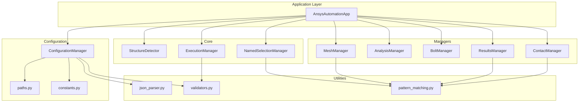
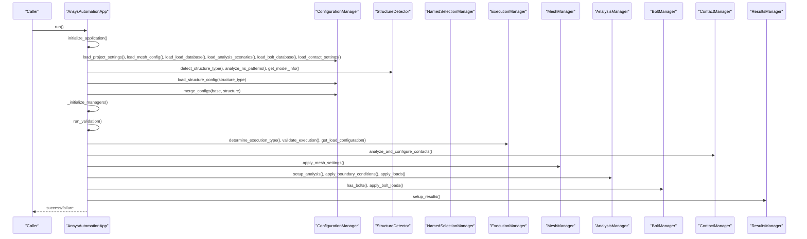
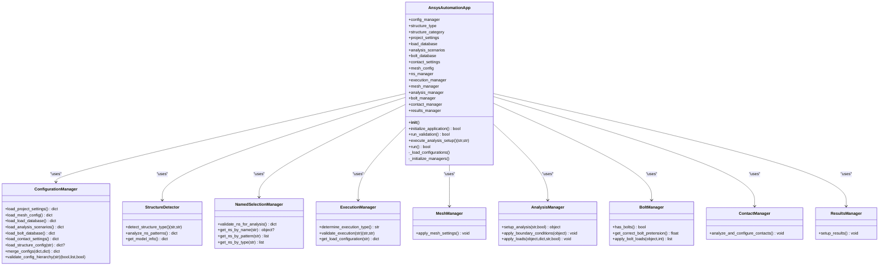
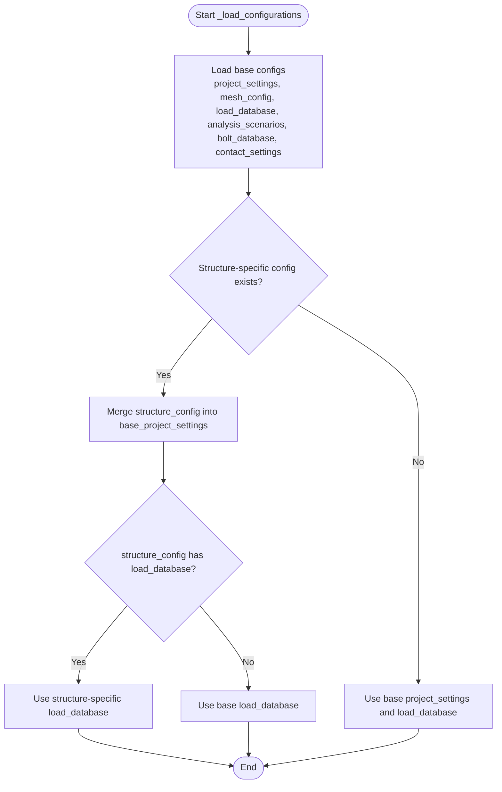
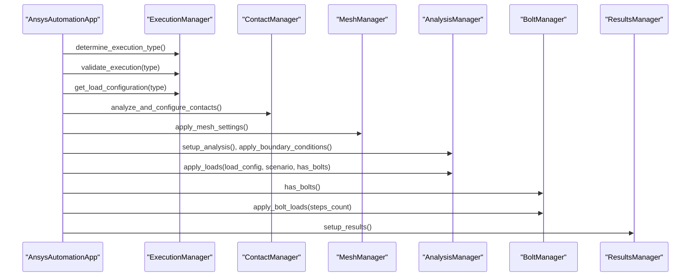
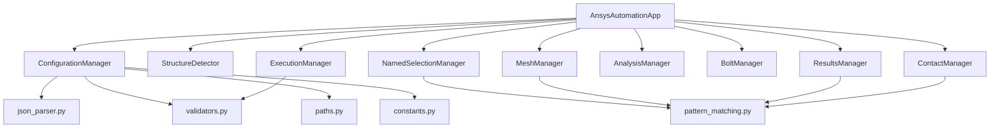

# AnsysAutomationApp Class

<cite>
**Referenced Files in This Document**
- [main.py](file://main.py)
- [config_manager.py](file://config/config_manager.py)
- [paths.py](file://config/paths.py)
- [constants.py](file://config/constants.py)
- [structure_detector.py](file://core/structure_detector.py)
- [named_selection_manager.py](file://core/named_selection_manager.py)
- [execution_manager.py](file://core/execution_manager.py)
- [mesh_manager.py](file://managers/mesh_manager.py)
- [analysis_manager.py](file://managers/analysis_manager.py)
- [bolt_manager.py](file://managers/bolt_manager.py)
- [contact_manager.py](file://managers/contact_manager.py)
- [results_manager.py](file://managers/results_manager.py)
- [json_parser.py](file://utils/json_parser.py)
- [validators.py](file://utils/validators.py)
- [pattern_matching.py](file://utils/pattern_matching.py)
</cite>

## Table of Contents
1. [Introduction](#introduction)
2. [Project Structure](#project-structure)
3. [Core Components](#core-components)
4. [Architecture Overview](#architecture-overview)
5. [Detailed Component Analysis](#detailed-component-analysis)
6. [Dependency Analysis](#dependency-analysis)
7. [Performance Considerations](#performance-considerations)
8. [Troubleshooting Guide](#troubleshooting-guide)
9. [Conclusion](#conclusion)
10. [Appendices](#appendices)

## Introduction
This document provides comprehensive API documentation for the AnsysAutomationApp class, the main orchestrator of the automation workflow. It explains the class’s role, constructor initialization, step-by-step initialization process, configuration loading and merging, manager instantiation, validation pipeline, analysis setup execution, error handling, and integration points with ANSYS API. Practical usage examples, exception specifications, and return types are included to help developers integrate and troubleshoot the automation workflow effectively.

## Project Structure
The AnsysAutomationApp class coordinates multiple modules:
- Configuration layer: ConfigurationManager, paths, constants
- Core orchestration: StructureDetector, NamedSelectionManager, ExecutionManager
- Managers: MeshManager, AnalysisManager, BoltManager, ContactManager, ResultsManager
- Utilities: JSON parsing, validators, pattern matching

**Diagram sources**
- [main.py](file://main.py#L27-L270)
- [config_manager.py](file://config/config_manager.py#L1-L209)
- [paths.py](file://config/paths.py#L1-L73)
- [constants.py](file://config/constants.py#L1-L99)
- [structure_detector.py](file://core/structure_detector.py#L1-L158)
- [named_selection_manager.py](file://core/named_selection_manager.py#L1-L190)
- [execution_manager.py](file://core/execution_manager.py#L1-L154)
- [mesh_manager.py](file://managers/mesh_manager.py#L1-L104)
- [analysis_manager.py](file://managers/analysis_manager.py#L1-L116)
- [bolt_manager.py](file://managers/bolt_manager.py#L1-L68)
- [contact_manager.py](file://managers/contact_manager.py#L1-L96)
- [results_manager.py](file://managers/results_manager.py#L1-L62)
- [json_parser.py](file://utils/json_parser.py#L1-L170)
- [validators.py](file://utils/validators.py#L1-L161)
- [pattern_matching.py](file://utils/pattern_matching.py#L1-L71)

**Section sources**
- [main.py](file://main.py#L27-L270)

## Core Components
- AnsysAutomationApp: Orchestrates initialization, validation, and analysis setup.
- ConfigurationManager: Loads and validates configuration files, merges structure-specific configs.
- StructureDetector: Determines structure type and analyzes model characteristics.
- NamedSelectionManager: Manages Named Selections and validations.
- ExecutionManager: Determines execution type and load configuration.
- MeshManager: Applies mesh settings per Named Selection.
- AnalysisManager: Sets up analysis parameters and applies boundary conditions and loads.
- BoltManager: Detects bolts and applies pretension loads.
- ContactManager: Automatically configures contact pairs.
- ResultsManager: Sets up result sections and stress intensity outputs.

**Section sources**
- [main.py](file://main.py#L27-L270)
- [config_manager.py](file://config/config_manager.py#L1-L209)
- [structure_detector.py](file://core/structure_detector.py#L1-L158)
- [named_selection_manager.py](file://core/named_selection_manager.py#L1-L190)
- [execution_manager.py](file://core/execution_manager.py#L1-L154)
- [mesh_manager.py](file://managers/mesh_manager.py#L1-L104)
- [analysis_manager.py](file://managers/analysis_manager.py#L1-L116)
- [bolt_manager.py](file://managers/bolt_manager.py#L1-L68)
- [contact_manager.py](file://managers/contact_manager.py#L1-L96)
- [results_manager.py](file://managers/results_manager.py#L1-L62)

## Architecture Overview
AnsysAutomationApp initializes configuration, detects structure type, loads and merges configurations, instantiates managers, runs validation, executes analysis setup, and handles errors. The workflow integrates with ANSYS API through Model and DataModel objects.

**Diagram sources**
- [main.py](file://main.py#L51-L249)
- [config_manager.py](file://config/config_manager.py#L73-L160)
- [structure_detector.py](file://core/structure_detector.py#L30-L158)
- [execution_manager.py](file://core/execution_manager.py#L16-L107)
- [mesh_manager.py](file://managers/mesh_manager.py#L20-L104)
- [analysis_manager.py](file://managers/analysis_manager.py#L14-L116)
- [bolt_manager.py](file://managers/bolt_manager.py#L17-L68)
- [contact_manager.py](file://managers/contact_manager.py#L14-L96)
- [results_manager.py](file://managers/results_manager.py#L15-L62)

## Detailed Component Analysis

### AnsysAutomationApp Class
- Role: Main orchestrator coordinating configuration loading, structure detection, manager initialization, validation, and analysis setup.
- Instance variables:
  - config_manager: ConfigurationManager instance
  - structure_type: Detected structure identifier
  - structure_category: Category of structure
  - project_settings: Merged project settings
  - load_database: Load database
  - analysis_scenarios: Analysis scenarios
  - bolt_database: Bolt database
  - contact_settings: Contact settings
  - mesh_config: Mesh configuration
  - ns_manager: NamedSelectionManager
  - execution_manager: ExecutionManager
  - mesh_manager: MeshManager
  - analysis_manager: AnalysisManager
  - bolt_manager: BoltManager
  - contact_manager: ContactManager
  - results_manager: ResultsManager

- __init__ method:
  - Initializes all instance variables to None for safe initialization and lazy instantiation.

- initialize_application method:
  - Validates configuration path
  - Initializes ConfigurationManager
  - Detects structure type and analyzes model info
  - Loads configurations and merges structure-specific overrides
  - Initializes managers
  - Returns boolean success indicator

- _load_configurations method:
  - Loads base configurations and structure-specific config if available
  - Merges structure config into base config with structure overrides taking precedence
  - Uses structure-specific load database if provided

- _initialize_managers method:
  - Instantiates all managers with appropriate dependencies

- run_validation method:
  - Validates Named Selections presence
  - Validates model structure
  - Validates configuration hierarchy and reports missing files

- execute_analysis_setup method:
  - Determines execution type and validates it against load database
  - Configures contacts
  - Creates mesh
  - Sets up analysis, applies boundary conditions and loads
  - Applies bolt loads when applicable
  - Sets up results
  - Returns execution type and load group

- run method:
  - Executes initialize_application, run_validation, execute_analysis_setup
  - Handles System.Exception and generic Exception with detailed messages
  - Returns boolean success indicator

- Exceptions:
  - System.Exception: Raised by configuration loading, validation, and ANSYS API operations
  - Generic Exception: Catches unexpected errors and returns failure

- Return types:
  - initialize_application: bool
  - run_validation: bool
  - execute_analysis_setup: tuple (execution_type, load_group)
  - run: bool

**Section sources**
- [main.py](file://main.py#L27-L249)

#### Class Diagram

**Diagram sources**
- [main.py](file://main.py#L27-L249)
- [config_manager.py](file://config/config_manager.py#L1-L209)
- [structure_detector.py](file://core/structure_detector.py#L1-L158)
- [named_selection_manager.py](file://core/named_selection_manager.py#L1-L190)
- [execution_manager.py](file://core/execution_manager.py#L1-L154)
- [mesh_manager.py](file://managers/mesh_manager.py#L1-L104)
- [analysis_manager.py](file://managers/analysis_manager.py#L1-L116)
- [bolt_manager.py](file://managers/bolt_manager.py#L1-L68)
- [contact_manager.py](file://managers/contact_manager.py#L1-L96)
- [results_manager.py](file://managers/results_manager.py#L1-L62)

### Configuration Loading and Merging
- Hierarchical loading:
  - Base configurations loaded via ConfigurationManager
  - Structure-specific configuration loaded if present
- Merging logic:
  - Structure-specific overrides take precedence over base configuration
  - Recursive merge for nested dictionaries
- Structure-specific overrides:
  - Load database can be replaced by structure-specific load database if provided

**Diagram sources**
- [main.py](file://main.py#L94-L121)
- [config_manager.py](file://config/config_manager.py#L119-L160)

**Section sources**
- [main.py](file://main.py#L94-L121)
- [config_manager.py](file://config/config_manager.py#L119-L160)

### Manager Initialization
- Managers instantiated with dependencies:
  - ns_manager: project_settings
  - execution_manager: project_settings, load_database
  - mesh_manager: mesh_config, project_settings
  - analysis_manager: project_settings, analysis_scenarios, ns_manager
  - bolt_manager: bolt_database, project_settings, ns_manager
  - contact_manager: contact_settings
  - results_manager: project_settings, ns_manager

**Section sources**
- [main.py](file://main.py#L122-L131)

### Validation Pipeline
- Named Selections validation:
  - Checks required NS for boundary conditions and loads
  - Reports missing NS details
- Model structure validation:
  - Confirms availability of Model, Geometry, NamedSelections
- Configuration hierarchy validation:
  - Ensures all required configuration files exist
  - Indicates presence of structure-specific config

**Section sources**
- [named_selection_manager.py](file://core/named_selection_manager.py#L138-L187)
- [validators.py](file://utils/validators.py#L68-L92)
- [config_manager.py](file://config/config_manager.py#L181-L209)

### Analysis Setup Workflow
- Execution type determination:
  - Determines execution type from model name using patterns
  - Validates against load database and retrieves load configuration
- Contact configuration:
  - Automatically configures contact pairs and applies rules
- Mesh creation:
  - Applies sizing and automatic mesh methods per Named Selection
- Analysis setup:
  - Sets analysis parameters and applies boundary conditions and loads
  - Applies bolt loads when bolts detected
- Results configuration:
  - Sets up solution information and creates stress results for important Named Selections

**Diagram sources**
- [main.py](file://main.py#L160-L209)
- [execution_manager.py](file://core/execution_manager.py#L16-L107)
- [contact_manager.py](file://managers/contact_manager.py#L14-L96)
- [mesh_manager.py](file://managers/mesh_manager.py#L20-L104)
- [analysis_manager.py](file://managers/analysis_manager.py#L14-L116)
- [bolt_manager.py](file://managers/bolt_manager.py#L17-L68)
- [results_manager.py](file://managers/results_manager.py#L15-L62)

**Section sources**
- [main.py](file://main.py#L160-L209)
- [execution_manager.py](file://core/execution_manager.py#L16-L107)
- [contact_manager.py](file://managers/contact_manager.py#L14-L96)
- [mesh_manager.py](file://managers/mesh_manager.py#L20-L104)
- [analysis_manager.py](file://managers/analysis_manager.py#L14-L116)
- [bolt_manager.py](file://managers/bolt_manager.py#L17-L68)
- [results_manager.py](file://managers/results_manager.py#L15-L62)

### Practical Usage Examples
- Instantiation and execution:
  - Create an instance of AnsysAutomationApp
  - Call run() to execute the full workflow
  - Handle return boolean to determine success

- Example usage path:
  - [main.py](file://main.py#L250-L270)

**Section sources**
- [main.py](file://main.py#L250-L270)

### Exceptions and Error Handling
- System.Exception:
  - Configuration path validation failures
  - Missing configuration files
  - Invalid configuration structure
  - Model structure validation failures
  - Execution type validation failures
  - ANSYS API operation failures
- Generic Exception:
  - Unexpected errors caught and reported

**Section sources**
- [paths.py](file://config/paths.py#L45-L58)
- [config_manager.py](file://config/config_manager.py#L26-L51)
- [validators.py](file://utils/validators.py#L1-L25)
- [validators.py](file://utils/validators.py#L133-L161)
- [main.py](file://main.py#L234-L248)

### Integration Points with ANSYS API
- Model and DataModel:
  - Access to Model.Name, Model.Geometry, Model.NamedSelections, Model.Mesh, Model.Connections
  - DataModel.GetObjectsByName for Solution Information and Solution
- Object creation:
  - Analysis Settings, Fixed Support, Displacement, Remote Displacement, Remote Force, Force, Moment, Pressure, Bolt Pretension, Contact Region
- Enums and quantities:
  - NewtonRaphsonType, OutputControlsNodalForcesType, ContactType, ContactDetectionPoint, ContactInitialEffect, MethodType, ElementOrder, DataModelObjectCategory
- Units:
  - Quantities with N, N·mm, MPa, mm, s, rad

**Section sources**
- [main.py](file://main.py#L182-L209)
- [analysis_manager.py](file://managers/analysis_manager.py#L14-L116)
- [contact_manager.py](file://managers/contact_manager.py#L14-L96)
- [results_manager.py](file://managers/results_manager.py#L15-L62)
- [constants.py](file://config/constants.py#L92-L99)

### Thread Safety Considerations
- The application uses ANSYS API objects (Model, DataModel) which are typically accessed from the ANSYS scripting context. Ensure that the automation runs within the ANSYS environment and that no external threading is introduced that could interfere with ANSYS API state.
- Avoid concurrent modifications to the model while the automation is running.

[No sources needed since this section provides general guidance]

## Dependency Analysis
- Coupling:
  - AnsysAutomationApp depends on all managers and configuration components
  - Managers depend on shared utilities (pattern matching, validators)
- Cohesion:
  - Each manager encapsulates a specific domain (mesh, analysis, contacts, etc.)
- External dependencies:
  - ANSYS API (Model, DataModel)
  - System.IO for file operations
  - Regular expressions for pattern matching

**Diagram sources**
- [main.py](file://main.py#L27-L249)
- [config_manager.py](file://config/config_manager.py#L1-L209)
- [json_parser.py](file://utils/json_parser.py#L142-L170)
- [validators.py](file://utils/validators.py#L1-L161)
- [pattern_matching.py](file://utils/pattern_matching.py#L1-L71)
- [paths.py](file://config/paths.py#L1-L73)
- [constants.py](file://config/constants.py#L1-L99)

**Section sources**
- [main.py](file://main.py#L27-L249)
- [config_manager.py](file://config/config_manager.py#L1-L209)

## Performance Considerations
- Minimize repeated lookups:
  - Cache Named Selections in NamedSelectionManager
  - Reuse loaded configurations across managers
- Efficient pattern matching:
  - Use simple_pattern_match and match_any_pattern judiciously
- Mesh generation:
  - Avoid unnecessary mesh operations by filtering special Named Selections
- Contact configuration:
  - Limit contact rule checks to relevant pairs

[No sources needed since this section provides general guidance]

## Troubleshooting Guide
- Configuration path not found:
  - Ensure CONFIG_PATH exists and contains required files
  - Use validate_config_path() to verify
- Missing configuration files:
  - Confirm all six main configuration files exist
  - Check validate_config_hierarchy() for missing files
- Invalid configuration structure:
  - Verify required keys for each configuration type
  - Use validate_required_keys() and _validate_config_structure()
- Model structure validation failures:
  - Ensure Model, Geometry, and NamedSelections are available
- Execution type validation failures:
  - Confirm execution type format and presence in load database
- ANSYS API errors:
  - Check that ANSYS session is active and objects are accessible

**Section sources**
- [paths.py](file://config/paths.py#L45-L58)
- [config_manager.py](file://config/config_manager.py#L181-L209)
- [validators.py](file://utils/validators.py#L26-L51)
- [validators.py](file://utils/validators.py#L68-L92)
- [validators.py](file://utils/validators.py#L133-L161)

## Conclusion
AnsysAutomationApp provides a robust, modular framework for automating ANSYS analyses. Its clear separation of concerns, comprehensive validation, and structured workflow enable reliable automation across diverse structures. By leveraging ConfigurationManager for configuration management, StructureDetector for model insights, and specialized managers for each domain, the system ensures consistent and repeatable analysis setups.

## Appendices

### API Reference Summary
- AnsysAutomationApp
  - __init__: Initializes instance variables
  - initialize_application: Validates path, loads configs, detects structure, merges configs, initializes managers
  - _load_configurations: Loads base and structure-specific configs, merges with overrides
  - _initialize_managers: Instantiates all managers
  - run_validation: Validates Named Selections, model structure, and configuration hierarchy
  - execute_analysis_setup: Determines execution type, configures contacts, mesh, analysis, loads, bolt handling, results
  - run: Orchestrates full workflow with error handling

- Exceptions:
  - System.Exception: Configuration, validation, and ANSYS API errors
  - Generic Exception: Unexpected errors

- Return types:
  - initialize_application: bool
  - run_validation: bool
  - execute_analysis_setup: tuple (execution_type, load_group)
  - run: bool

**Section sources**
- [main.py](file://main.py#L27-L249)