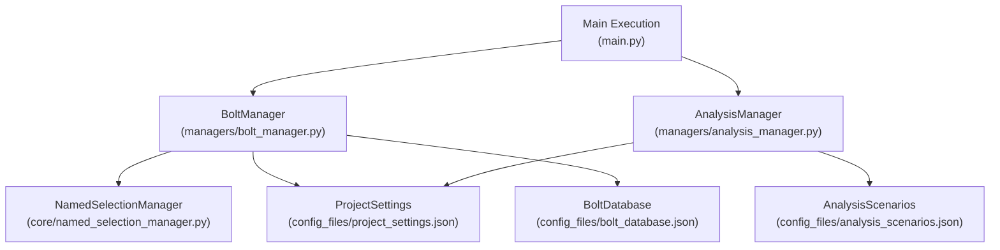
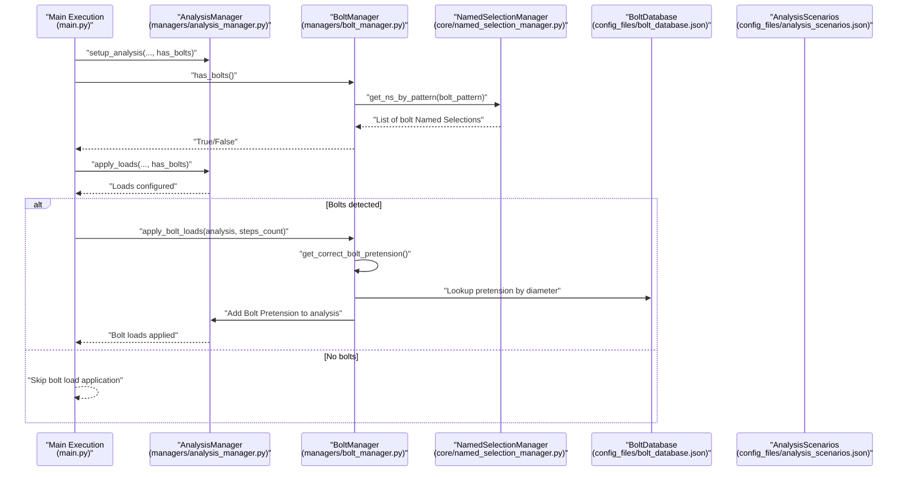
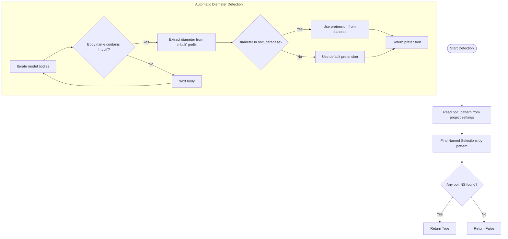
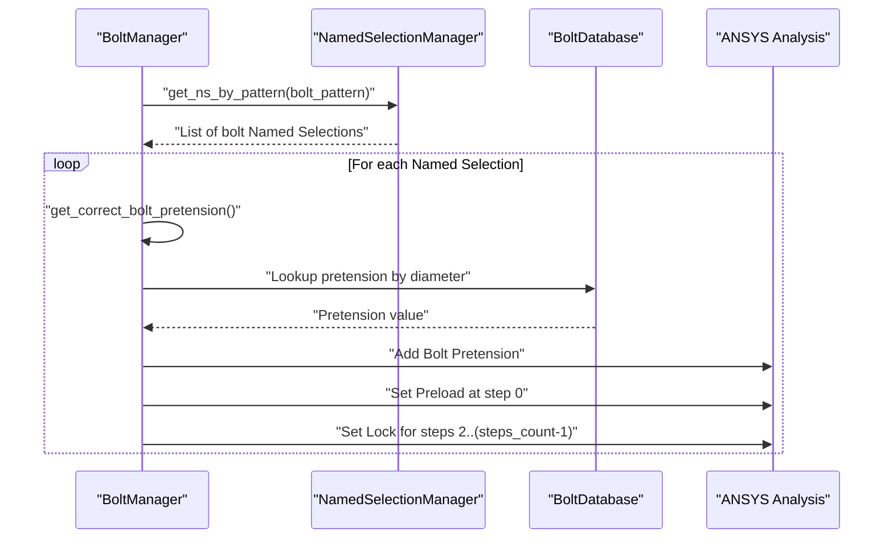
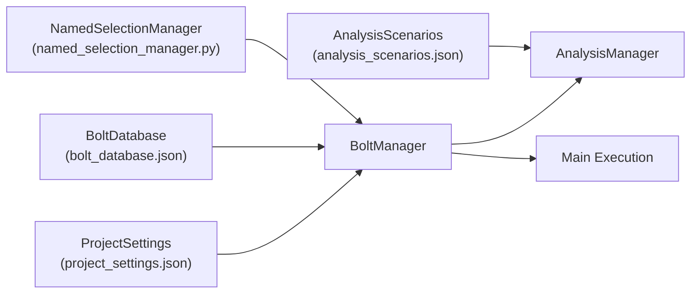

# BoltManager Class

<cite>
**Referenced Files in This Document**
- [bolt_manager.py](file://managers/bolt_manager.py)
- [named_selection_manager.py](file://core/named_selection_manager.py)
- [bolt_database.json](file://config_files/bolt_database.json)
- [project_settings.json](file://config_files/project_settings.json)
- [analysis_scenarios.json](file://config_files/analysis_scenarios.json)
- [main.py](file://main.py)
- [analysis_manager.py](file://managers/analysis_manager.py)
- [pattern_matching.py](file://utils/pattern_matching.py)
</cite>

## Table of Contents
1. [Introduction](#introduction)
2. [Project Structure](#project-structure)
3. [Core Components](#core-components)
4. [Architecture Overview](#architecture-overview)
5. [Detailed Component Analysis](#detailed-component-analysis)
6. [Dependency Analysis](#dependency-analysis)
7. [Performance Considerations](#performance-considerations)
8. [Troubleshooting Guide](#troubleshooting-guide)
9. [Conclusion](#conclusion)

## Introduction
This document provides comprehensive API documentation for the BoltManager class responsible for detecting bolts and applying pretension loads in ANSYS Automation. It explains constructor dependencies, bolt detection logic, pretension calculation, and integration with ANSYS bolt pretension objects and step sequencing. It also covers error handling, performance considerations, and best practices for bolt naming conventions.

## Project Structure
The BoltManager class resides in the managers package and collaborates with:
- Named Selection Manager for identifying bolt-related Named Selections
- Project settings for bolt pattern and units
- Bolt database for pretension values
- Analysis manager and main execution flow for step sequencing and load application

**Diagram sources**
- [bolt_manager.py](file://managers/bolt_manager.py#L1-L68)
- [named_selection_manager.py](file://core/named_selection_manager.py#L1-L190)
- [project_settings.json](file://config_files/project_settings.json#L1-L56)
- [bolt_database.json](file://config_files/bolt_database.json#L1-L47)
- [analysis_scenarios.json](file://config_files/analysis_scenarios.json#L1-L55)
- [main.py](file://main.py#L160-L210)
- [analysis_manager.py](file://managers/analysis_manager.py#L1-L116)

**Section sources**
- [bolt_manager.py](file://managers/bolt_manager.py#L1-L68)
- [named_selection_manager.py](file://core/named_selection_manager.py#L1-L190)
- [project_settings.json](file://config_files/project_settings.json#L1-L56)
- [bolt_database.json](file://config_files/bolt_database.json#L1-L47)
- [analysis_scenarios.json](file://config_files/analysis_scenarios.json#L1-L55)
- [main.py](file://main.py#L160-L210)
- [analysis_manager.py](file://managers/analysis_manager.py#L1-L116)

## Core Components
- BoltManager: Central orchestrator for bolt detection and pretension load application.
- NamedSelectionManager: Provides pattern-based Named Selection discovery and validation.
- ProjectSettings: Supplies bolt pattern and unit configuration.
- BoltDatabase: Maps bolt sizes to pretension forces.
- AnalysisManager and AnalysisScenarios: Control step counts and load sequences.

Key responsibilities:
- Detect bolts via Named Selection patterns and body name patterns.
- Determine pretension force from database using diameter extracted from body names.
- Apply ANSYS Bolt Pretension loads with step sequencing.
- Provide fallback pretension when automatic detection fails.

**Section sources**
- [bolt_manager.py](file://managers/bolt_manager.py#L1-L68)
- [named_selection_manager.py](file://core/named_selection_manager.py#L1-L190)
- [project_settings.json](file://config_files/project_settings.json#L1-L56)
- [bolt_database.json](file://config_files/bolt_database.json#L1-L47)
- [analysis_scenarios.json](file://config_files/analysis_scenarios.json#L1-L55)
- [analysis_manager.py](file://managers/analysis_manager.py#L1-L116)

## Architecture Overview
The BoltManager integrates with the broader automation pipeline during analysis setup. It is invoked by the main execution flow to detect bolts and apply pretension loads according to configured analysis scenarios.

**Diagram sources**
- [main.py](file://main.py#L160-L210)
- [analysis_manager.py](file://managers/analysis_manager.py#L1-L116)
- [bolt_manager.py](file://managers/bolt_manager.py#L1-L68)
- [named_selection_manager.py](file://core/named_selection_manager.py#L1-L190)
- [bolt_database.json](file://config_files/bolt_database.json#L1-L47)
- [analysis_scenarios.json](file://config_files/analysis_scenarios.json#L1-L55)

## Detailed Component Analysis

### BoltManager API Reference
- Constructor
  - Parameters:
    - bolt_database: Dictionary mapping bolt sizes to pretension values.
    - project_settings: Dictionary containing project configuration including bolt pattern.
    - named_selection_manager: Instance of NamedSelectionManager for bolt detection.
  - Responsibilities:
    - Store references to configuration and managers.
    - Provide methods for bolt detection and load application.

- has_bolts()
  - Purpose: Determine whether any bolt-related Named Selections exist in the model.
  - Detection logic:
    - Reads bolt pattern from project settings under loads.bolt_pattern.
    - Uses NamedSelectionManager.get_ns_by_pattern to find matching Named Selections.
    - Returns True if any matches are found.

- get_correct_bolt_pretension()
  - Purpose: Automatically determine the correct pretension force by inspecting model bodies.
  - Detection logic:
    - Iterates through all bodies in the model geometry.
    - Filters bodies whose names contain "mbolt".
    - Extracts diameter from the body name using a regular expression pattern that captures digits and decimals after "mbolt".
    - Looks up the pretension value in the bolt_database using the extracted diameter as a key.
    - Falls back to a default pretension value if no matching diameter is found.

- apply_bolt_loads(analysis, steps_count)
  - Purpose: Apply ANSYS Bolt Pretension loads to all identified bolt locations.
  - Workflow:
    - Retrieves bolt Named Selections using the bolt pattern from project settings.
    - For each Named Selection:
      - Determines pretension force via get_correct_bolt_pretension().
      - Creates a Bolt Pretension object on the analysis.
      - Sets the Location to the Named Selection.
      - Defines Preload at step 0 using the determined pretension force.
      - Applies Lock definition for subsequent steps beyond step 1.
      - Appends the created load to a list and prints progress.
    - Returns the list of created bolt loads.

- Automatic Diameter Detection from Naming Conventions
  - Pattern: Body names containing "mbolt" followed by a numeric diameter (supports integers and decimals).
  - Extraction: Regular expression captures the numeric portion immediately after "mbolt".
  - Mapping: The captured diameter string is used as a key to look up pretension in bolt_database.json.

- Integration with ANSYS Bolt Pretension Objects and Step Sequencing
  - Step 0: Preload is set to the calculated pretension force.
  - Steps 2..(steps_count-1): Defined as Lock to simulate operational loading after initial pretension.
  - Steps 1: Not explicitly configured; the loop starts at index 2, so step 1 remains unchanged from default behavior.

- Error Handling
  - Missing bolt Named Selections: Handled implicitly by returning an empty list when no matches are found.
  - Missing bolt bodies or invalid diameter formats: get_correct_bolt_pretension falls back to a default pretension value.
  - Exceptions during load creation: apply_bolt_loads catches exceptions and prints a warning, continuing with remaining Named Selections.

**Section sources**
- [bolt_manager.py](file://managers/bolt_manager.py#L1-L68)
- [named_selection_manager.py](file://core/named_selection_manager.py#L1-L190)
- [project_settings.json](file://config_files/project_settings.json#L1-L56)
- [bolt_database.json](file://config_files/bolt_database.json#L1-L47)
- [analysis_scenarios.json](file://config_files/analysis_scenarios.json#L1-L55)
- [analysis_manager.py](file://managers/analysis_manager.py#L1-L116)
- [pattern_matching.py](file://utils/pattern_matching.py#L1-L71)

### Bolt Detection Logic
- Named Selection Pattern Matching
  - The bolt pattern is read from project settings under loads.bolt_pattern.
  - NamedSelectionManager.get_ns_by_pattern uses a simple wildcard pattern matcher to find matching Named Selections.
  - The pattern supports "*" wildcards and is compatible with IronPython environments.

- Body Name Pattern Matching
  - get_correct_bolt_pretension inspects model bodies for names containing "mbolt".
  - A regular expression extracts the numeric diameter following "mbolt".
  - The extracted diameter is used as a key to retrieve pretension from bolt_database.json.

**Diagram sources**
- [bolt_manager.py](file://managers/bolt_manager.py#L1-L68)
- [named_selection_manager.py](file://core/named_selection_manager.py#L1-L190)
- [project_settings.json](file://config_files/project_settings.json#L1-L56)
- [bolt_database.json](file://config_files/bolt_database.json#L1-L47)

**Section sources**
- [bolt_manager.py](file://managers/bolt_manager.py#L1-L68)
- [named_selection_manager.py](file://core/named_selection_manager.py#L1-L190)
- [project_settings.json](file://config_files/project_settings.json#L1-L56)
- [bolt_database.json](file://config_files/bolt_database.json#L1-L47)

### Pretension Application Workflow
- Steps:
  - Detect bolts via Named Selections.
  - Determine pretension force automatically or via fallback.
  - Create Bolt Pretension objects and configure step definitions.
  - Integrate with AnalysisManager for step sequencing.

**Diagram sources**
- [bolt_manager.py](file://managers/bolt_manager.py#L1-L68)
- [named_selection_manager.py](file://core/named_selection_manager.py#L1-L190)
- [bolt_database.json](file://config_files/bolt_database.json#L1-L47)
- [analysis_scenarios.json](file://config_files/analysis_scenarios.json#L1-L55)

**Section sources**
- [bolt_manager.py](file://managers/bolt_manager.py#L1-L68)
- [analysis_scenarios.json](file://config_files/analysis_scenarios.json#L1-L55)

### Example Bolt Database Entries and Mapping
- Bolt database entries include explicit diameter keys and a default entry.
- Mapping:
  - Keys represent bolt diameters (integers or decimals).
  - Values include diameter and pretension fields.
  - get_correct_bolt_pretension uses the extracted diameter string as a key to retrieve pretension.

Example mapping highlights:
- Diameter keys: "5", "6", "8", "10", "12", "16", "20", "24", "30", "36", "default".
- Pretension values: Numerical values in Newtons.

**Section sources**
- [bolt_database.json](file://config_files/bolt_database.json#L1-L47)
- [bolt_manager.py](file://managers/bolt_manager.py#L1-L68)

### Integration with ANSYS and Step Sequencing
- Step Counting:
  - The main execution determines steps_count based on analysis scenarios.
  - apply_bolt_loads uses steps_count to configure Lock definitions for steps beyond step 1.

- Load Application:
  - AnalysisManager applies loads and sets up time steps.
  - BoltManager adds Bolt Pretension loads with Preload at step 0 and Lock for later steps.

**Section sources**
- [main.py](file://main.py#L160-L210)
- [analysis_scenarios.json](file://config_files/analysis_scenarios.json#L1-L55)
- [analysis_manager.py](file://managers/analysis_manager.py#L1-L116)
- [bolt_manager.py](file://managers/bolt_manager.py#L1-L68)

## Dependency Analysis
- Internal Dependencies:
  - BoltManager depends on NamedSelectionManager for bolt detection.
  - BoltManager reads project settings for bolt pattern and units.
  - BoltManager consults bolt_database.json for pretension values.

- External Integrations:
  - Main execution flow invokes BoltManager during analysis setup.
  - AnalysisManager coordinates step sequencing and load application.

**Diagram sources**
- [bolt_manager.py](file://managers/bolt_manager.py#L1-L68)
- [named_selection_manager.py](file://core/named_selection_manager.py#L1-L190)
- [project_settings.json](file://config_files/project_settings.json#L1-L56)
- [bolt_database.json](file://config_files/bolt_database.json#L1-L47)
- [analysis_scenarios.json](file://config_files/analysis_scenarios.json#L1-L55)
- [analysis_manager.py](file://managers/analysis_manager.py#L1-L116)
- [main.py](file://main.py#L160-L210)

**Section sources**
- [bolt_manager.py](file://managers/bolt_manager.py#L1-L68)
- [named_selection_manager.py](file://core/named_selection_manager.py#L1-L190)
- [project_settings.json](file://config_files/project_settings.json#L1-L56)
- [bolt_database.json](file://config_files/bolt_database.json#L1-L47)
- [analysis_scenarios.json](file://config_files/analysis_scenarios.json#L1-L55)
- [analysis_manager.py](file://managers/analysis_manager.py#L1-L116)
- [main.py](file://main.py#L160-L210)

## Performance Considerations
- Large Models:
  - get_correct_bolt_pretension iterates through all bodies; for models with many bodies, this can be expensive.
  - Recommendation: Limit body iteration scope by filtering bodies with "mbolt" early or by using Named Selections to narrow scope.

- Pattern Matching:
  - get_ns_by_pattern performs linear scanning of Named Selections; ensure bolt_pattern is specific enough to minimize matches.

- Step Sequencing:
  - Applying Lock definitions for many steps can increase setup time; keep steps_count minimal when appropriate.

- Caching:
  - Consider caching bolt detection results and pretension lookups if repeated calls occur within the same session.

[No sources needed since this section provides general guidance]

## Troubleshooting Guide
Common issues and resolutions:
- Missing bolt Named Selections:
  - Verify loads.bolt_pattern in project settings matches actual Named Selection names.
  - Ensure Named Selections exist in the model and are named consistently.

- Invalid diameter formats:
  - get_correct_bolt_pretension expects "mbolt" followed by a numeric diameter.
  - If body names do not match the expected pattern, fallback pretension is used.

- Missing bolt bodies:
  - If no bodies contain "mbolt", fallback pretension is applied.
  - Confirm model geometry includes bodies with the expected naming convention.

- Exceptions during load creation:
  - apply_bolt_loads catches exceptions and continues; review warnings for specific Named Selection failures.

- Step sequencing:
  - Ensure steps_count aligns with analysis scenarios; step 0 is Preload, steps 2..(steps_count-1) are Lock.

**Section sources**
- [bolt_manager.py](file://managers/bolt_manager.py#L1-L68)
- [named_selection_manager.py](file://core/named_selection_manager.py#L1-L190)
- [project_settings.json](file://config_files/project_settings.json#L1-L56)
- [analysis_scenarios.json](file://config_files/analysis_scenarios.json#L1-L55)

## Conclusion
The BoltManager class centralizes bolt detection and pretension load application, integrating seamlessly with Named Selections, project settings, and the ANSYS analysis workflow. By leveraging automatic diameter detection from body names and a configurable bolt database, it streamlines pretension modeling while providing robust fallbacks and error handling. Following best practices for bolt naming conventions and step sequencing ensures reliable and efficient simulations.