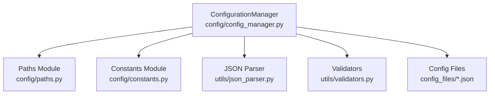
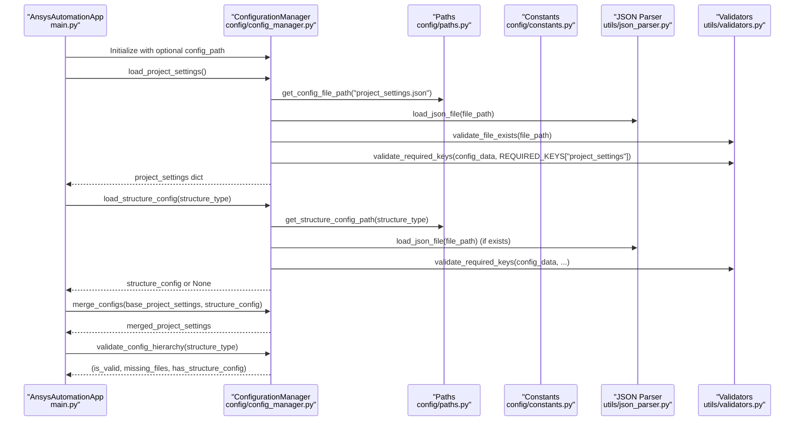
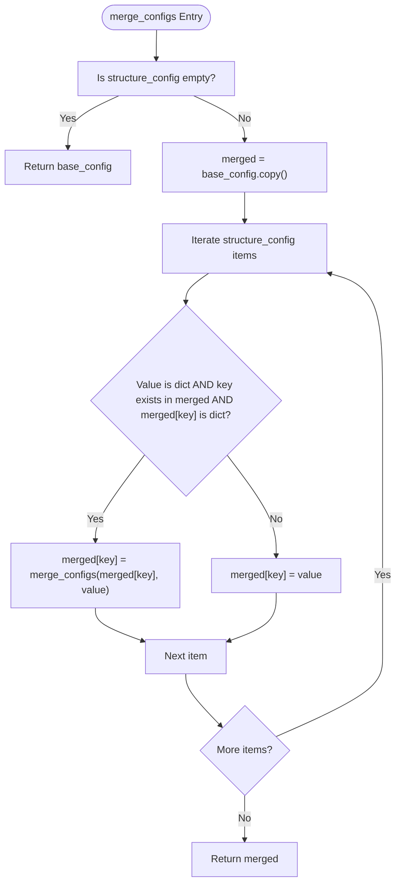
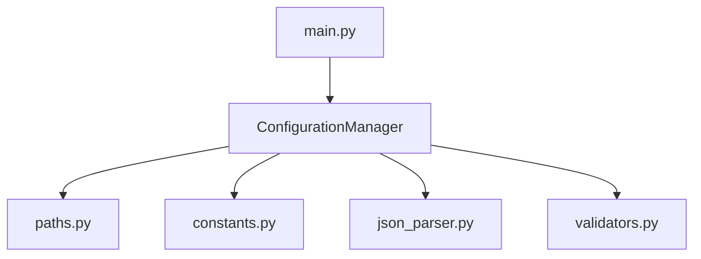

# ConfigurationManager Class

<cite>
**Referenced Files in This Document**
- [config_manager.py](file://config/config_manager.py)
- [constants.py](file://config/constants.py)
- [paths.py](file://config/paths.py)
- [json_parser.py](file://utils/json_parser.py)
- [validators.py](file://utils/validators.py)
- [project_settings.json](file://config_files/project_settings.json)
- [mesh_config.json](file://config_files/mesh_config.json)
- [analysis_scenarios.json](file://config_files/analysis_scenarios.json)
- [bolt_database.json](file://config_files/bolt_database.json)
- [contact_settings.json](file://config_files/contact_settings.json)
- [main.py](file://main.py)
</cite>

## Table of Contents
1. [Introduction](#introduction)
2. [Project Structure](#project-structure)
3. [Core Components](#core-components)
4. [Architecture Overview](#architecture-overview)
5. [Detailed Component Analysis](#detailed-component-analysis)
6. [Dependency Analysis](#dependency-analysis)
7. [Performance Considerations](#performance-considerations)
8. [Troubleshooting Guide](#troubleshooting-guide)
9. [Conclusion](#conclusion)
10. [Appendices](#appendices)

## Introduction
This document provides comprehensive API documentation for the ConfigurationManager class responsible for hierarchical configuration loading and validation in the automation pipeline. It explains how the class manages base configuration files, validates required keys, loads structure-specific configurations, merges configurations, and validates the configuration hierarchy. It also lists exceptions, describes internal dependencies on utility modules, and provides usage examples and performance considerations.

## Project Structure
The ConfigurationManager resides in the configuration layer and orchestrates loading and validation of JSON-based configuration files. It relies on:
- Paths module for resolving file locations
- Constants module for default values and required keys
- Utilities for JSON parsing and validation
- Configuration files under config_files for actual data

**Diagram sources**
- [config_manager.py](file://config/config_manager.py#L1-L209)
- [paths.py](file://config/paths.py#L1-L73)
- [constants.py](file://config/constants.py#L1-L99)
- [json_parser.py](file://utils/json_parser.py#L1-L170)
- [validators.py](file://utils/validators.py#L1-L161)

**Section sources**
- [config_manager.py](file://config/config_manager.py#L1-L209)
- [paths.py](file://config/paths.py#L1-L73)
- [constants.py](file://config/constants.py#L1-L99)

## Core Components
- ConfigurationManager: Central class for loading, validating, merging, and validating configuration hierarchy.
- Paths module: Resolves base configuration path and constructs file paths for base and structure-specific configs.
- Constants module: Provides default configurations and required keys for validation.
- JSON parser utilities: Loads and parses JSON files, including comment removal and whitespace normalization.
- Validators: Validates file existence and required keys in configuration dictionaries.

Key responsibilities:
- Hierarchical loading: Load base configs, optionally load structure-specific config, and merge them.
- Validation: Ensure required keys exist per file type and validate file presence.
- Defaults: Provide default configurations for missing or partial data.
- Reporting: Validate configuration hierarchy and report missing files and optional structure config presence.

**Section sources**
- [config_manager.py](file://config/config_manager.py#L1-L209)
- [paths.py](file://config/paths.py#L1-L73)
- [constants.py](file://config/constants.py#L1-L99)
- [json_parser.py](file://utils/json_parser.py#L1-L170)
- [validators.py](file://utils/validators.py#L1-L161)

## Architecture Overview
The ConfigurationManager coordinates configuration loading and validation across the system. The main application initializes the configuration manager, detects structure type, loads base configurations, optionally loads structure-specific configuration, merges them, and proceeds with managers initialization.

**Diagram sources**
- [main.py](file://main.py#L94-L121)
- [config_manager.py](file://config/config_manager.py#L1-L209)
- [paths.py](file://config/paths.py#L1-L73)
- [constants.py](file://config/constants.py#L1-L99)
- [json_parser.py](file://utils/json_parser.py#L1-L170)
- [validators.py](file://utils/validators.py#L1-L161)

## Detailed Component Analysis

### ConfigurationManager.__init__
- Purpose: Initializes the configuration manager with an optional custom configuration path. If no path is provided, it uses the default base path from the paths module.
- Parameters:
  - config_path (str, optional): Custom configuration directory path. Defaults to the module-level CONFIG_PATH.
- Behavior:
  - Stores the provided or default configuration path for later use in constructing file paths.
- Exceptions:
  - Inherits path validation from the paths module during subsequent operations.

**Section sources**
- [config_manager.py](file://config/config_manager.py#L17-L24)
- [paths.py](file://config/paths.py#L10-L10)

### ConfigurationManager.load_config
- Purpose: Loads a single configuration file, performs existence checks, parses JSON, and validates required keys based on file type.
- Parameters:
  - file_path (str): Absolute path to the configuration file to load.
- Returns:
  - dict: Parsed configuration dictionary.
- Behavior:
  - Validates file existence using the validators module.
  - Parses JSON using the JSON parser utility.
  - Calls internal validation to ensure required keys for the detected file type.
- Exceptions:
  - Raises System.Exception if the file is not found or if JSON parsing fails.
  - Raises System.Exception if required keys are missing for the file type.

**Section sources**
- [config_manager.py](file://config/config_manager.py#L26-L51)
- [validators.py](file://utils/validators.py#L9-L24)
- [json_parser.py](file://utils/json_parser.py#L142-L170)
- [config_manager.py](file://config/config_manager.py#L52-L72)

### ConfigurationManager._validate_config_structure
- Purpose: Validates configuration structure against required keys determined by the file name.
- Parameters:
  - file_path (str): Path to the configuration file.
  - config_data (dict): Parsed configuration dictionary.
- Behavior:
  - Extracts the file name and checks for specific substrings to determine the file type.
  - Uses required keys from the constants module to validate presence of mandatory keys.
- Exceptions:
  - Raises System.Exception if any required key is missing for the detected file type.

**Section sources**
- [config_manager.py](file://config/config_manager.py#L52-L72)
- [constants.py](file://config/constants.py#L36-L42)

### Base Configuration Loaders
The ConfigurationManager provides dedicated loaders for each base configuration file. Each loader resolves the file path via the paths module and delegates to load_config for validation and parsing.

- load_project_settings
  - Loads project_settings.json.
  - Returns parsed dictionary.
  - File path resolution: get_config_file_path("project_settings.json").

- load_mesh_config
  - Loads mesh_config.json.
  - Returns parsed dictionary.
  - File path resolution: get_config_file_path("mesh_config.json").

- load_load_database
  - Loads load_database.json.
  - Returns parsed dictionary.
  - File path resolution: get_config_file_path("load_database.json").

- load_analysis_scenarios
  - Loads analysis_scenarios.json.
  - Returns parsed dictionary.
  - File path resolution: get_config_file_path("analysis_scenarios.json").

- load_bolt_database
  - Loads bolt_database.json.
  - Returns parsed dictionary.
  - File path resolution: get_config_file_path("bolt_database.json").

- load_contact_settings
  - Loads contact_settings.json.
  - Returns parsed dictionary.
  - File path resolution: get_config_file_path("contact_settings.json").

- load_all_configs
  - Loads all base configuration files and returns a dictionary keyed by configuration names.

**Section sources**
- [config_manager.py](file://config/config_manager.py#L73-L117)
- [paths.py](file://config/paths.py#L13-L31)

### Structure-Specific Configuration Loader
- load_structure_config(structure_type)
  - Purpose: Load structure-specific configuration if it exists.
  - Parameters:
    - structure_type (str): Identifier for the structure type.
  - Returns:
    - dict: Structure-specific configuration if file exists; otherwise None.
  - Behavior:
    - Constructs the structure-specific file name using get_structure_config_path.
    - Checks file existence; if present, loads and validates using load_config.
    - On failure to load, prints a warning and returns None.
  - Exceptions:
    - Prints a warning and returns None if the structure-specific file fails to load.

**Section sources**
- [config_manager.py](file://config/config_manager.py#L119-L136)
- [paths.py](file://config/paths.py#L32-L43)

### Configuration Merging
- merge_configs(base_config, structure_config)
  - Purpose: Merge structure-specific configuration into base configuration with structure priority.
  - Parameters:
    - base_config (dict): Base configuration dictionary.
    - structure_config (dict): Structure-specific configuration dictionary.
  - Returns:
    - dict: Merged configuration dictionary.
  - Behavior:
    - If structure_config is empty/None, returns base_config.
    - Creates a shallow copy of base_config.
    - Iterates over structure_config entries:
      - If both values are dictionaries and the key exists in base_config, recursively merges them.
      - Otherwise, replaces the key’s value with the structure value.
  - Notes:
    - Structure configuration takes precedence over base configuration for overlapping keys.

**Diagram sources**
- [config_manager.py](file://config/config_manager.py#L138-L159)

**Section sources**
- [config_manager.py](file://config/config_manager.py#L138-L159)

### Default Configuration Creation
- create_default_config(config_type)
  - Purpose: Provide default configuration for a given type when base configuration is unavailable.
  - Parameters:
    - config_type (str): Type of configuration (e.g., project_settings, mesh_config).
  - Returns:
    - dict: Default configuration dictionary for the specified type.
  - Behavior:
    - Returns predefined defaults from constants for supported types.
    - Returns empty dict for unsupported types.

**Section sources**
- [config_manager.py](file://config/config_manager.py#L161-L179)
- [constants.py](file://config/constants.py#L7-L33)
- [constants.py](file://config/constants.py#L45-L82)

### Configuration Hierarchy Validation
- validate_config_hierarchy(structure_type)
  - Purpose: Validate that all required base configuration files exist and optionally report whether a structure-specific configuration file exists.
  - Parameters:
    - structure_type (str): Identifier for the structure type.
  - Returns:
    - tuple: (is_valid: bool, missing_files: list[str], has_structure_config: bool).
  - Behavior:
    - Builds a list of required base configuration file paths.
    - Checks existence of each file and collects missing file names.
    - Checks for the existence of the structure-specific configuration file.
    - Returns validation status, missing files, and structure config presence.

**Section sources**
- [config_manager.py](file://config/config_manager.py#L181-L209)
- [paths.py](file://config/paths.py#L60-L73)

### Internal Dependencies and Utilities
- JSON Parsing:
  - load_json_file(file_path): Reads and parses JSON content, removes comments, and raises System.Exception on errors.
  - parse_json(json_string): Parses JSON strings into Python objects with support for comments and whitespace stripping.

- Validation:
  - validate_file_exists(file_path): Ensures file exists; raises System.Exception if not found.
  - validate_required_keys(config_dict, required_keys, context): Validates presence of required keys; raises System.Exception with a contextual message if missing.

- Paths:
  - get_config_file_path(filename): Combines base CONFIG_PATH with a filename.
  - get_structure_config_path(structure_type): Generates structure-specific file name and returns full path.
  - validate_config_path(): Validates base CONFIG_PATH existence; raises System.Exception if not found.

- Constants:
  - DEFAULT_SETTINGS: Default project settings used for fallbacks.
  - REQUIRED_KEYS: Required keys per configuration file type.
  - DEFAULT_* constants: Defaults for analysis scenarios, bolt database, contact settings, mesh settings, and units.

**Section sources**
- [json_parser.py](file://utils/json_parser.py#L142-L170)
- [json_parser.py](file://utils/json_parser.py#L1-L141)
- [validators.py](file://utils/validators.py#L9-L24)
- [validators.py](file://utils/validators.py#L26-L50)
- [paths.py](file://config/paths.py#L10-L43)
- [constants.py](file://config/constants.py#L7-L42)
- [constants.py](file://config/constants.py#L45-L99)

## Dependency Analysis
The ConfigurationManager depends on the paths module for file path construction, the constants module for defaults and required keys, and utility modules for JSON parsing and validation. The main application integrates ConfigurationManager to orchestrate configuration loading and validation.

**Diagram sources**
- [config_manager.py](file://config/config_manager.py#L1-L209)
- [paths.py](file://config/paths.py#L1-L73)
- [constants.py](file://config/constants.py#L1-L99)
- [json_parser.py](file://utils/json_parser.py#L1-L170)
- [validators.py](file://utils/validators.py#L1-L161)
- [main.py](file://main.py#L94-L121)

**Section sources**
- [config_manager.py](file://config/config_manager.py#L1-L209)
- [main.py](file://main.py#L94-L121)

## Performance Considerations
- Repeated file access:
  - Each load_* method triggers file existence checks and JSON parsing. If callers repeatedly load the same files, consider caching loaded configurations in memory to avoid redundant disk I/O.
- Caching opportunities:
  - Cache base configurations after first load.
  - Cache structure-specific configurations per structure_type.
  - Cache merged configurations when structure_type remains unchanged.
- Validation overhead:
  - validate_config_hierarchy iterates over all required files. For large deployments, consider batching checks or caching directory existence.
- JSON parsing:
  - load_json_file strips comments and whitespace before parsing. If configuration files are large, consider pre-processing or streaming approaches to reduce memory usage.
- I/O concurrency:
  - Current implementation performs synchronous file operations. For improved throughput, consider asynchronous I/O or parallelizing independent loads.

[No sources needed since this section provides general guidance]

## Troubleshooting Guide
Common issues and resolutions:
- Missing configuration files:
  - validate_config_hierarchy reports missing files. Ensure all base configuration files exist in the configured base path.
- File not found errors:
  - load_config raises System.Exception when a file is missing. Verify the base path and file names.
- JSON parsing errors:
  - load_json_file raises System.Exception on parsing failures. Check for malformed JSON or unsupported comment syntax.
- Missing required keys:
  - _validate_config_structure and validators.raise System.Exception when required keys are absent. Ensure configuration files include all required keys for their type.
- Structure-specific configuration load failures:
  - load_structure_config prints a warning and returns None if structure-specific file fails to load. Validate the structure-specific file and retry.

**Section sources**
- [config_manager.py](file://config/config_manager.py#L26-L51)
- [config_manager.py](file://config/config_manager.py#L119-L136)
- [validators.py](file://utils/validators.py#L9-L24)
- [validators.py](file://utils/validators.py#L26-L50)
- [json_parser.py](file://utils/json_parser.py#L142-L170)

## Conclusion
The ConfigurationManager class centralizes configuration management with robust loading, validation, and merging capabilities. It enforces required keys per file type, supports structure-specific overrides, and provides reporting for configuration hierarchy completeness. By leveraging the paths and constants modules and utility parsers and validators, it ensures reliable configuration handling across the automation pipeline.

[No sources needed since this section summarizes without analyzing specific files]

## Appendices

### API Reference Summary

- __init__(config_path=None)
  - Initializes with optional custom configuration path.
  - Parameters: config_path (str, optional).
  - Exceptions: Inherits path validation from paths module.

- load_config(file_path)
  - Loads and validates a single configuration file.
  - Parameters: file_path (str).
  - Returns: dict.
  - Exceptions: System.Exception on file not found or parsing/validation errors.

- load_project_settings()
  - Loads project_settings.json.
  - Returns: dict.

- load_mesh_config()
  - Loads mesh_config.json.
  - Returns: dict.

- load_load_database()
  - Loads load_database.json.
  - Returns: dict.

- load_analysis_scenarios()
  - Loads analysis_scenarios.json.
  - Returns: dict.

- load_bolt_database()
  - Loads bolt_database.json.
  - Returns: dict.

- load_contact_settings()
  - Loads contact_settings.json.
  - Returns: dict.

- load_all_configs()
  - Loads all base configuration files.
  - Returns: dict.

- load_structure_config(structure_type)
  - Loads structure-specific configuration if exists.
  - Parameters: structure_type (str).
  - Returns: dict or None.

- merge_configs(base_config, structure_config)
  - Merges structure-specific configuration into base configuration.
  - Parameters: base_config (dict), structure_config (dict).
  - Returns: dict.

- create_default_config(config_type)
  - Creates default configuration for a given type.
  - Parameters: config_type (str).
  - Returns: dict.

- validate_config_hierarchy(structure_type)
  - Validates required base files and structure-specific file presence.
  - Parameters: structure_type (str).
  - Returns: tuple (is_valid: bool, missing_files: list[str], has_structure_config: bool).

**Section sources**
- [config_manager.py](file://config/config_manager.py#L17-L209)

### Usage Examples

- Basic loading and merging:
  - Initialize ConfigurationManager.
  - Load base configurations using load_* methods.
  - Optionally load structure-specific configuration using load_structure_config.
  - Merge using merge_configs to produce the effective configuration.
  - Validate hierarchy using validate_config_hierarchy.

- Example call flow:
  - See the main application’s configuration loading sequence for a practical example.

**Section sources**
- [main.py](file://main.py#L94-L121)
- [config_manager.py](file://config/config_manager.py#L73-L117)
- [config_manager.py](file://config/config_manager.py#L119-L159)
- [config_manager.py](file://config/config_manager.py#L181-L209)

### Exceptions
- System.Exception is raised by:
  - load_config for file not found or JSON parsing errors.
  - load_json_file for file not found or parsing errors.
  - validate_file_exists for missing files.
  - validate_required_keys for missing required keys.
  - validate_config_path for invalid base path.

**Section sources**
- [config_manager.py](file://config/config_manager.py#L26-L51)
- [json_parser.py](file://utils/json_parser.py#L142-L170)
- [validators.py](file://utils/validators.py#L9-L24)
- [validators.py](file://utils/validators.py#L26-L50)
- [paths.py](file://config/paths.py#L45-L57)

### Configuration Files and Required Keys
- project_settings.json
  - Required keys: project, execution, boundary_conditions, loads.
  - Example usage: project name, version, execution patterns, boundary conditions, loads, mesh settings, solution settings, units.

- mesh_config.json
  - Required keys: mesh_settings.
  - Example usage: mesh settings per component category.

- analysis_scenarios.json
  - Required keys: standard_sequence.
  - Example usage: standard sequences, quick checks, detailed analyses, pretension-only scenarios.

- bolt_database.json
  - Required keys: default.
  - Example usage: bolt diameters and pretension values.

- contact_settings.json
  - Required keys: contact_rules.
  - Example usage: contact rules and advanced settings.

**Section sources**
- [constants.py](file://config/constants.py#L36-L42)
- [project_settings.json](file://config_files/project_settings.json#L1-L56)
- [mesh_config.json](file://config_files/mesh_config.json#L1-L85)
- [analysis_scenarios.json](file://config_files/analysis_scenarios.json#L1-L55)
- [bolt_database.json](file://config_files/bolt_database.json#L1-L47)
- [contact_settings.json](file://config_files/contact_settings.json#L1-L130)