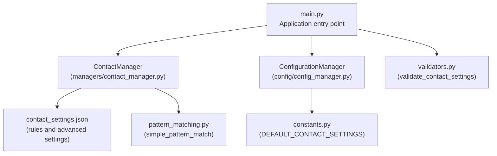
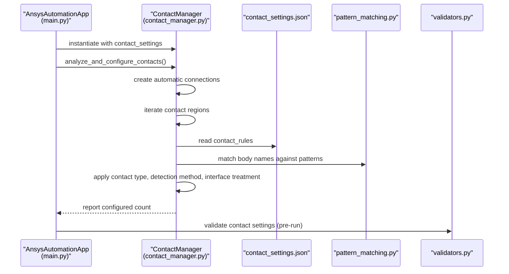
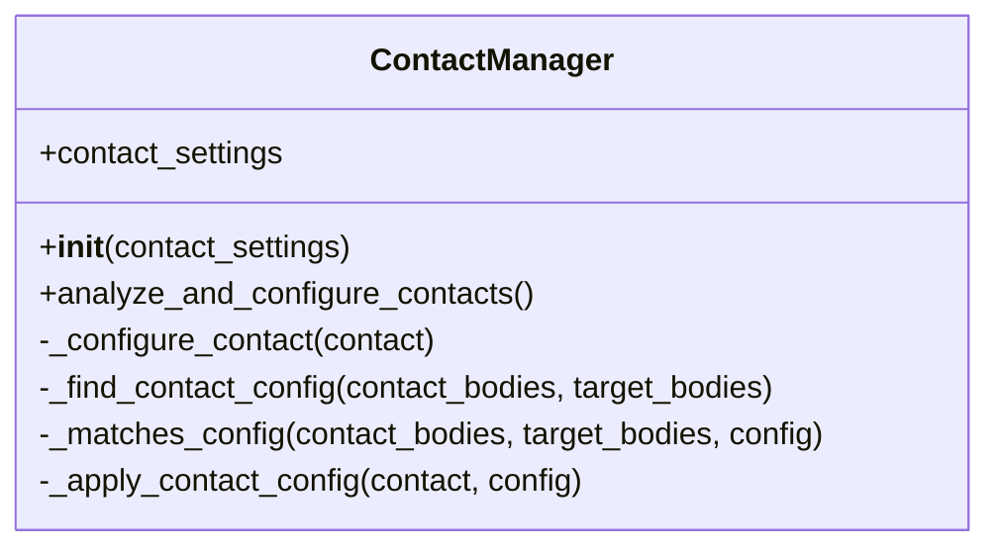
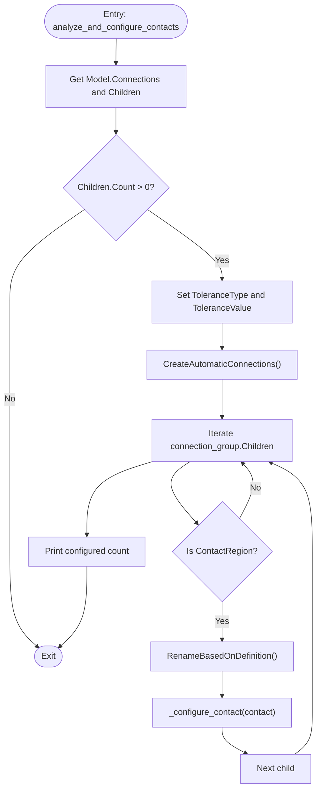
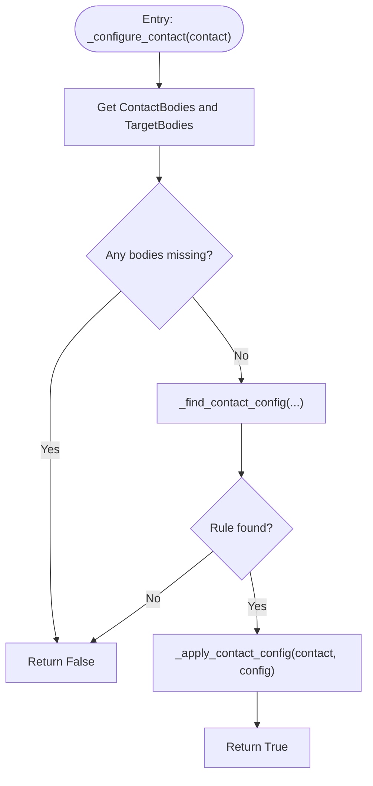
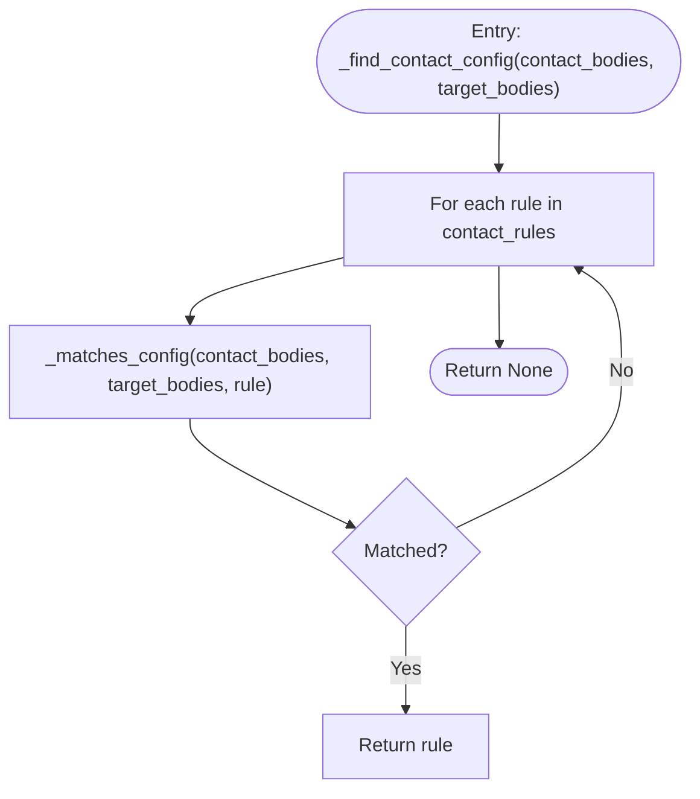
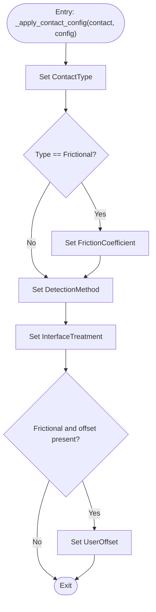
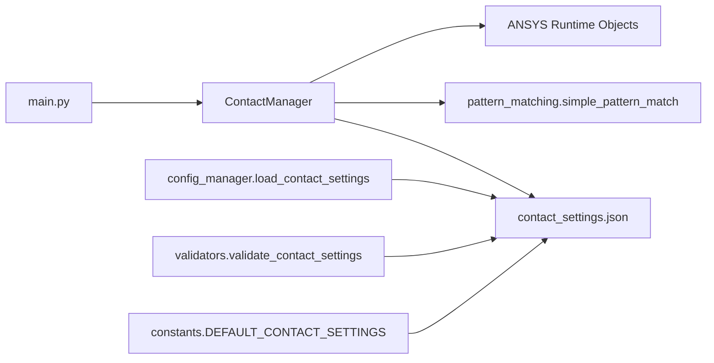

# ContactManager Class

<cite>
**Referenced Files in This Document**
- [contact_manager.py](file://managers/contact_manager.py)
- [contact_settings.json](file://config_files/contact_settings.json)
- [pattern_matching.py](file://utils/pattern_matching.py)
- [validators.py](file://utils/validators.py)
- [config_manager.py](file://config/config_manager.py)
- [constants.py](file://config/constants.py)
- [main.py](file://main.py)
</cite>

## Table of Contents
1. [Introduction](#introduction)
2. [Project Structure](#project-structure)
3. [Core Components](#core-components)
4. [Architecture Overview](#architecture-overview)
5. [Detailed Component Analysis](#detailed-component-analysis)
6. [Dependency Analysis](#dependency-analysis)
7. [Performance Considerations](#performance-considerations)
8. [Troubleshooting Guide](#troubleshooting-guide)
9. [Conclusion](#conclusion)

## Introduction
This document provides comprehensive API documentation for the ContactManager class responsible for automatically detecting and configuring contact pairs in ANSYS Mechanical based on body name patterns. It explains how the class initializes with contact settings, how it analyzes automatic contact regions, and how it applies contact configurations derived from a JSON rule set. It also covers error handling, performance considerations, and best practices for naming bodies to ensure reliable contact detection.

## Project Structure
The ContactManager integrates with the broader automation pipeline:
- It is instantiated by the application entry point and invoked during automated analysis setup.
- It reads contact rules from a JSON configuration file and validates them using utility validators.
- It uses a lightweight pattern-matching utility to match body names against wildcard patterns.

**Diagram sources**
- [main.py](file://main.py#L120-L135)
- [contact_manager.py](file://managers/contact_manager.py#L1-L40)
- [contact_settings.json](file://config_files/contact_settings.json#L1-L130)
- [pattern_matching.py](file://utils/pattern_matching.py#L1-L31)
- [config_manager.py](file://config/config_manager.py#L98-L116)
- [validators.py](file://utils/validators.py#L111-L131)
- [constants.py](file://config/constants.py#L63-L82)

**Section sources**
- [main.py](file://main.py#L120-L135)
- [contact_manager.py](file://managers/contact_manager.py#L1-L40)
- [contact_settings.json](file://config_files/contact_settings.json#L1-L130)
- [pattern_matching.py](file://utils/pattern_matching.py#L1-L31)
- [config_manager.py](file://config/config_manager.py#L98-L116)
- [validators.py](file://utils/validators.py#L111-L131)
- [constants.py](file://config/constants.py#L63-L82)

## Core Components
- ContactManager: Orchestrates automatic contact detection and configuration. It relies on contact_settings to select appropriate contact rules for each detected pair.
- contact_settings.json: Defines contact rules with patterns for contact and target bodies, contact type, detection method, interface treatment, friction coefficient, offset, and trimming behavior. Also includes advanced settings for formulation and stiffness update.
- pattern_matching.py: Provides simple wildcard pattern matching compatible with IronPython to match body names against patterns.
- validators.py: Validates that contact settings contain required keys and structure.
- config_manager.py: Loads contact_settings.json and exposes it to the application.
- constants.py: Supplies default contact settings if needed.

**Section sources**
- [contact_manager.py](file://managers/contact_manager.py#L1-L40)
- [contact_settings.json](file://config_files/contact_settings.json#L1-L130)
- [pattern_matching.py](file://utils/pattern_matching.py#L1-L31)
- [validators.py](file://utils/validators.py#L111-L131)
- [config_manager.py](file://config/config_manager.py#L98-L116)
- [constants.py](file://config/constants.py#L63-L82)

## Architecture Overview
The ContactManager participates in the automated analysis setup sequence. It is constructed with contact_settings and later invoked to configure contacts after automatic connection creation.

**Diagram sources**
- [main.py](file://main.py#L120-L135)
- [contact_manager.py](file://managers/contact_manager.py#L14-L40)
- [contact_settings.json](file://config_files/contact_settings.json#L1-L130)
- [pattern_matching.py](file://utils/pattern_matching.py#L1-L31)
- [validators.py](file://utils/validators.py#L111-L131)

## Detailed Component Analysis

### ContactManager API
- Role: Automatically detects contact pairs from ANSYS automatic connections and configures them according to rules defined in contact_settings.
- Initialization dependency: Requires a contact_settings dictionary containing "contact_rules" and optional "advanced_settings".
- Key methods:
  - analyze_and_configure_contacts(): Creates automatic connections, iterates generated contact regions, renames them based on definition, and applies configuration.
  - _configure_contact(contact): Retrieves contact bodies, finds a matching rule, and applies it.
  - _find_contact_config(contact_bodies, target_bodies): Iterates rules and selects the first that matches both sides.
  - _matches_config(contact_bodies, target_bodies, config): Uses simple wildcard pattern matching for each body.
  - _apply_contact_config(contact, config): Sets contact type, friction coefficient (when applicable), detection method, interface treatment, and optional offset.

**Diagram sources**
- [contact_manager.py](file://managers/contact_manager.py#L1-L96)

**Section sources**
- [contact_manager.py](file://managers/contact_manager.py#L1-L96)

### Algorithm: analyze_and_configure_contacts
- Steps:
  1. Access ANSYS Connections and Children.
  2. Set tolerance type/value on the connection group.
  3. Create automatic connections.
  4. Iterate children of the connection group; for each ContactRegion:
     - Rename based on definition.
     - Attempt to configure the contact using _configure_contact.
  5. Print a summary of configured pairs.

**Diagram sources**
- [contact_manager.py](file://managers/contact_manager.py#L14-L40)

**Section sources**
- [contact_manager.py](file://managers/contact_manager.py#L14-L40)

### Algorithm: _configure_contact
- Steps:
  1. Retrieve contact and target bodies.
  2. If either is empty, return False.
  3. Find a matching rule via _find_contact_config.
  4. If found, apply configuration via _apply_contact_config and return True; otherwise return False.

**Diagram sources**
- [contact_manager.py](file://managers/contact_manager.py#L39-L72)

**Section sources**
- [contact_manager.py](file://managers/contact_manager.py#L39-L72)

### Algorithm: _find_contact_config and _matches_config
- _find_contact_config:
  - Iterates contact_rules and returns the first rule whose patterns match both contact and target bodies.
- _matches_config:
  - For each body in contact_bodies, checks if its name matches the contact_pattern.
  - For each body in target_bodies, checks if its name matches the target_pattern.
  - Returns True only if both conditions are satisfied.

**Diagram sources**
- [contact_manager.py](file://managers/contact_manager.py#L60-L76)
- [pattern_matching.py](file://utils/pattern_matching.py#L1-L31)

**Section sources**
- [contact_manager.py](file://managers/contact_manager.py#L60-L76)
- [pattern_matching.py](file://utils/pattern_matching.py#L1-L31)

### Applying Contact Configuration: _apply_contact_config
- Sets:
  - ContactType from config["type"].
  - FrictionCoefficient when type is Frictional.
  - DetectionMethod from config["detection_method"].
  - InterfaceTreatment from config["interface_treatment"].
  - Optional UserOffset when type is Frictional and offset is provided.
- Errors are caught and printed; the method returns False on failure.

**Diagram sources**
- [contact_manager.py](file://managers/contact_manager.py#L77-L96)

**Section sources**
- [contact_manager.py](file://managers/contact_manager.py#L77-L96)

### Contact Settings Schema and Examples
- contact_rules: Array of rules with:
  - name: Rule identifier.
  - contact_pattern: Wildcard pattern matched against contact bodies.
  - target_pattern: Wildcard pattern matched against target bodies.
  - type: Contact type (e.g., Bonded, Frictional).
  - detection_method: Detection method for contact.
  - interface_treatment: Initial effect for contact.
  - friction_coefficient: Used when type is Frictional.
  - offset: Optional user offset (mm).
  - trim_contact: Boolean indicating whether to trim contact.
  - behavior: Additional behavior setting.
- advanced_settings:
  - formulation: Augmented Lagrange.
  - normal_stiffness: Program controlled.
  - update_stiffness: Each iteration.
  - stabilization: None.

Example patterns from the default rules:
- Bolt-to-bolt: contact_pattern "mbolt*", target_pattern "mbolt*"
- Bolt-to-washer: contact_pattern "mbolt*", target_pattern "shaiba*"
- Washer-to-washer: contact_pattern "shaiba*", target_pattern "shaiba*"
- Bolt-to-nut: contact_pattern "mbolt*", target_pattern "mgaika*"
- Bolt-to-opora: contact_pattern "mbolt*", target_pattern "opora*"
- Flange contact: contact_pattern "flanec*", target_pattern "flanec*"
- Support contact: contact_pattern "opora*", target_pattern "truba*"
- Base contact: contact_pattern "osnovanie*", target_pattern "opora*"
- Weld contact: contact_pattern "shov*", target_pattern "*" (any)
- Default frictional: contact_pattern "*", target_pattern "*" (catch-all)

Body naming conventions that trigger detection:
- Bodies with names starting with "mbolt" for bolts.
- Bodies with names starting with "shaiba" for washers.
- Bodies with names starting with "mgaika" for nuts.
- Bodies with names starting with "flanec" for flanges.
- Bodies with names starting with "opora" for supports.
- Bodies with names starting with "truba" for pipes.
- Bodies with names starting with "osnovanie" for base plates.
- Bodies with names starting with "shov" for welds.

**Section sources**
- [contact_settings.json](file://config_files/contact_settings.json#L1-L130)

### ANSYS Contact Region Parameters Configured
- ContactType: Bonded or Frictional.
- FrictionCoefficient: Applied when type is Frictional.
- DetectionMethod: From config["detection_method"].
- InterfaceTreatment: From config["interface_treatment"].
- UserOffset: Applied when type is Frictional and offset is provided.
- TrimContact: Controlled by the rule’s trim_contact flag.

**Section sources**
- [contact_manager.py](file://managers/contact_manager.py#L77-L96)
- [contact_settings.json](file://config_files/contact_settings.json#L1-L130)

### Error Handling
- During automatic contact configuration:
  - General exceptions are caught and reported as warnings; the process continues.
- During individual contact configuration:
  - Exceptions are caught and reported; the method returns False.
- During application initialization:
  - Contact settings are validated to ensure required keys exist before use.
- During configuration loading:
  - The configuration manager validates presence and structure of contact_settings.json.

Ambiguity and missing bodies:
- If a contact pair lacks either contact or target bodies, the configuration is skipped.
- If no rule matches, the contact remains unconfigured.

**Section sources**
- [contact_manager.py](file://managers/contact_manager.py#L14-L40)
- [contact_manager.py](file://managers/contact_manager.py#L39-L72)
- [validators.py](file://utils/validators.py#L111-L131)
- [config_manager.py](file://config/config_manager.py#L98-L116)

## Dependency Analysis
- ContactManager depends on:
  - contact_settings.json for rule definitions.
  - pattern_matching.simple_pattern_match for wildcard name matching.
  - ANSYS runtime objects (Model.Connections, DataModel, ContactType, ContactDetectionPoint, ContactInitialEffect, Quantity, ContactToleranceType) for configuration.
- Configuration pipeline:
  - config_manager.py loads contact_settings.json.
  - constants.py supplies defaults if needed.
  - validators.py ensures required keys are present.
  - main.py constructs ContactManager with contact_settings and invokes the configuration routine.

**Diagram sources**
- [contact_manager.py](file://managers/contact_manager.py#L1-L96)
- [pattern_matching.py](file://utils/pattern_matching.py#L1-L31)
- [contact_settings.json](file://config_files/contact_settings.json#L1-L130)
- [config_manager.py](file://config/config_manager.py#L98-L116)
- [validators.py](file://utils/validators.py#L111-L131)
- [constants.py](file://config/constants.py#L63-L82)
- [main.py](file://main.py#L120-L135)

**Section sources**
- [contact_manager.py](file://managers/contact_manager.py#L1-L96)
- [pattern_matching.py](file://utils/pattern_matching.py#L1-L31)
- [contact_settings.json](file://config_files/contact_settings.json#L1-L130)
- [config_manager.py](file://config/config_manager.py#L98-L116)
- [validators.py](file://utils/validators.py#L111-L131)
- [constants.py](file://config/constants.py#L63-L82)
- [main.py](file://main.py#L120-L135)

## Performance Considerations
- Complexity:
  - Matching per contact region is O(R × (C + T)) where R is the number of rules, C is the number of contact bodies, and T is the number of target bodies.
  - With many contact regions and many rules, total complexity scales with the number of regions.
- Recommendations:
  - Keep contact_rules minimal and ordered from most specific to least specific to reduce average matching cost.
  - Use specific patterns (e.g., "mbolt*") to avoid broad catch-all patterns that could increase false positives and matching overhead.
  - Limit the number of automatic contact regions by refining geometry and named selections before invoking automatic connections.
  - Prefer targeted contact regions over global automatic detection when possible.

[No sources needed since this section provides general guidance]

## Troubleshooting Guide
Common issues and resolutions:
- Missing or invalid contact_settings.json:
  - Ensure the file exists and contains "contact_rules". The loader validates required keys.
- Ambiguous or no matching rule:
  - Verify body names match the intended patterns. Add or refine rules in contact_settings.json.
- Missing bodies in a contact pair:
  - Confirm both contact and target bodies are selected in the automatic connection. If either is empty, the configuration is skipped.
- Unexpected contact type or parameters:
  - Check the rule’s type, detection_method, interface_treatment, and friction_coefficient.
- Performance problems with many contact interfaces:
  - Reduce the number of automatic regions, refine patterns, and simplify rules.

**Section sources**
- [config_manager.py](file://config/config_manager.py#L98-L116)
- [validators.py](file://utils/validators.py#L111-L131)
- [contact_manager.py](file://managers/contact_manager.py#L39-L72)
- [contact_settings.json](file://config_files/contact_settings.json#L1-L130)

## Conclusion
The ContactManager automates contact pair configuration by leveraging a structured rule set and simple wildcard pattern matching. By organizing body names consistently and maintaining a focused set of rules, teams can achieve reliable, repeatable contact setups in ANSYS. Proper validation and error handling ensure robust operation, while performance best practices help manage large models with many interfaces.