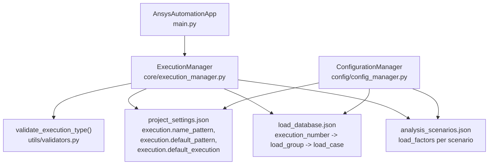
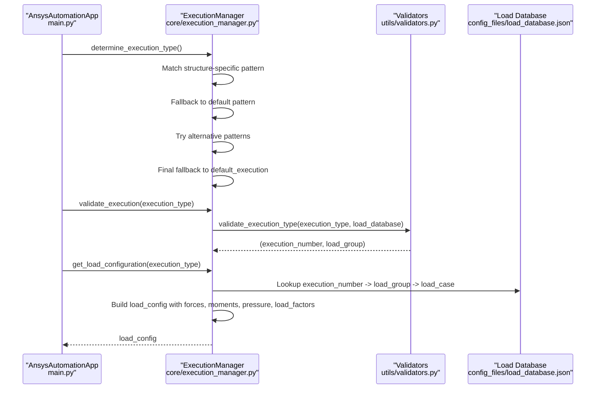
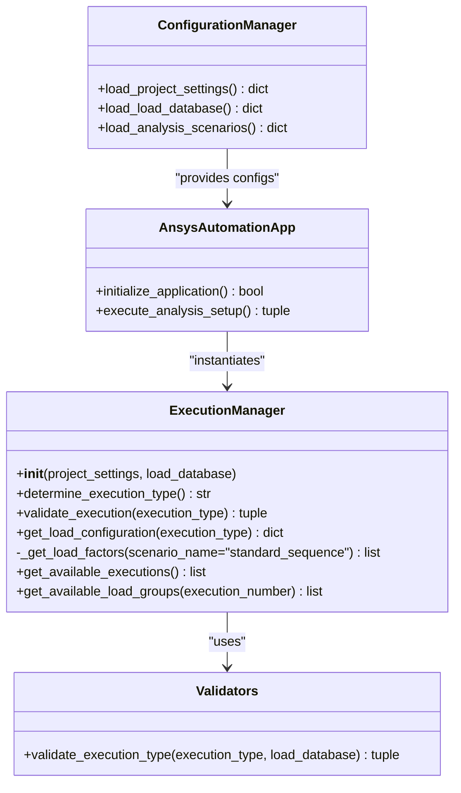
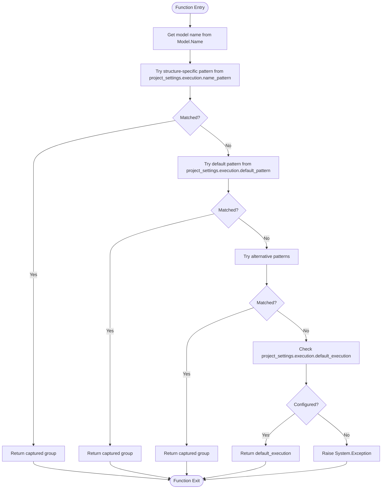
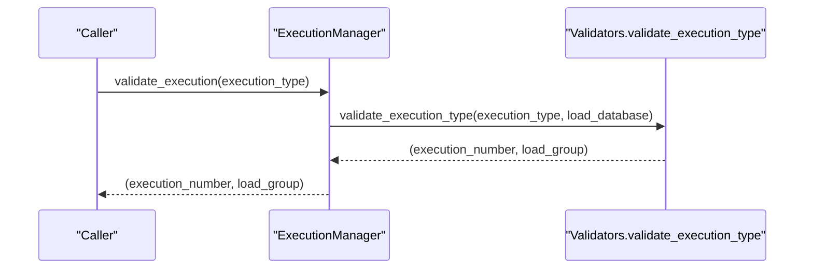
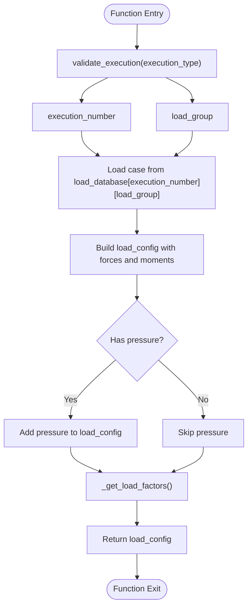

# ExecutionManager Class

<cite>
**Referenced Files in This Document**
- [execution_manager.py](file://core/execution_manager.py)
- [validators.py](file://utils/validators.py)
- [project_settings.json](file://config_files/project_settings.json)
- [load_database.json](file://config_files/load_database.json)
- [analysis_scenarios.json](file://config_files/analysis_scenarios.json)
- [main.py](file://main.py)
- [config_manager.py](file://config/config_manager.py)
</cite>

## Table of Contents
1. [Introduction](#introduction)
2. [Project Structure](#project-structure)
3. [Core Components](#core-components)
4. [Architecture Overview](#architecture-overview)
5. [Detailed Component Analysis](#detailed-component-analysis)
6. [Dependency Analysis](#dependency-analysis)
7. [Performance Considerations](#performance-considerations)
8. [Troubleshooting Guide](#troubleshooting-guide)
9. [Conclusion](#conclusion)
10. [Appendices](#appendices)

## Introduction
This document provides comprehensive API documentation for the ExecutionManager class. It explains how the class determines and validates execution types based on model names and load databases, constructs load configurations, and integrates with configuration-driven pattern customization. It also covers error handling, database exploration utilities, and practical usage examples for execution planning and validation workflows.

## Project Structure
ExecutionManager resides in the core module and collaborates with configuration files and validators:
- Core class: core/execution_manager.py
- Validation utility: utils/validators.py
- Configuration files:
  - config_files/project_settings.json
  - config_files/load_database.json
  - config_files/analysis_scenarios.json
- Application orchestration: main.py
- Configuration loader: config/config_manager.py

**Diagram sources**
- [execution_manager.py](file://core/execution_manager.py#L1-L154)
- [validators.py](file://utils/validators.py#L133-L161)
- [project_settings.json](file://config_files/project_settings.json#L8-L15)
- [load_database.json](file://config_files/load_database.json#L1-L414)
- [analysis_scenarios.json](file://config_files/analysis_scenarios.json#L1-L55)
- [main.py](file://main.py#L120-L131)
- [config_manager.py](file://config/config_manager.py#L73-L117)

**Section sources**
- [execution_manager.py](file://core/execution_manager.py#L1-L154)
- [main.py](file://main.py#L120-L131)
- [config_manager.py](file://config/config_manager.py#L73-L117)

## Core Components
- ExecutionManager: Central class for execution type determination, validation, and load configuration construction.
- Validators: Utility functions for validating execution types against the load database.
- Configuration files: Provide pattern customization and load database structure.

Key responsibilities:
- Determine execution type from model name using structured patterns and fallbacks.
- Validate execution type against the load database.
- Build load configuration with forces, moments, pressure, and load factors.
- Explore available executions and load groups in the database.

**Section sources**
- [execution_manager.py](file://core/execution_manager.py#L12-L154)
- [validators.py](file://utils/validators.py#L133-L161)
- [project_settings.json](file://config_files/project_settings.json#L8-L15)
- [load_database.json](file://config_files/load_database.json#L1-L414)

## Architecture Overview
ExecutionManager participates in the automated analysis pipeline orchestrated by AnsysAutomationApp. The app initializes configuration, detects structure type, merges structure-specific settings, and then delegates execution planning to ExecutionManager.

**Diagram sources**
- [main.py](file://main.py#L160-L205)
- [execution_manager.py](file://core/execution_manager.py#L16-L106)
- [validators.py](file://utils/validators.py#L133-L161)
- [load_database.json](file://config_files/load_database.json#L1-L414)

## Detailed Component Analysis

### ExecutionManager.__init__
- Purpose: Initialize ExecutionManager with project settings and load database.
- Dependencies:
  - project_settings: Provides execution pattern configuration (name_pattern, default_pattern, default_execution).
  - load_database: Provides load definitions for execution types.

Behavior:
- Stores project_settings and load_database as instance attributes for later use.

**Section sources**
- [execution_manager.py](file://core/execution_manager.py#L12-L15)
- [project_settings.json](file://config_files/project_settings.json#L8-L15)

### determine_execution_type
- Purpose: Determine execution type from the model name using a multi-stage pattern matching sequence.
- Inputs: Model name (retrieved from Model.Name).
- Returns: Execution type identifier (e.g., "02-02-F1").
- Exceptions: System.Exception raised if no pattern matches and default_execution is not configured.

Pattern matching sequence:
1. Structure-specific pattern:
   - Uses project_settings["execution"]["name_pattern"].
   - If matched, returns the captured group representing the execution type.
2. Default pattern:
   - Uses project_settings["execution"]["default_pattern"] with a sensible default if not provided.
   - If matched, returns the captured group.
3. Alternative patterns:
   - Attempts additional patterns to match variations (e.g., "151-02-F1", "custom_001-02-F1", "02-02", "151").
   - Returns the first successful match.
4. Final fallback:
   - Uses project_settings["execution"]["default_execution"] if configured.
   - Returns the configured default if present.
5. Failure:
   - Raises System.Exception with a descriptive message indicating failure to determine execution type.

Integration with configuration-driven customization:
- name_pattern and default_pattern are configurable in project_settings.json under execution.
- default_execution provides a safety net when no patterns match.

Examples of valid model names and expected execution types:
- "02-02-F1" → "02-02-F1" (matches default pattern)
- "151-02-F1" → "151-02-F1" (matches alternative pattern)
- "custom_001-02-F1" → "custom_001-02-F1" (matches alternative pattern)
- "02-02" → "02-02" (matches alternative pattern)
- "151" → "151" (matches alternative pattern)
- If none match and default_execution is set to "05-50-F2", returns "05-50-F2".

**Section sources**
- [execution_manager.py](file://core/execution_manager.py#L16-L59)
- [project_settings.json](file://config_files/project_settings.json#L8-L15)

### validate_execution
- Purpose: Validate that an execution type exists in the load database and return the normalized execution_number and load_group.
- Inputs: execution_type (string).
- Returns: tuple (execution_number, load_group).
- Exceptions: System.Exception raised if execution_number or load_group is not found.

Validation logic:
- Splits execution_type by "-" and derives execution_number and load_group.
- Ensures execution_number exists in load_database.
- Ensures load_group exists under execution_number.
- Returns normalized (execution_number, load_group).

Integration:
- Relies on utils/validators.py for validation and normalization.

**Section sources**
- [execution_manager.py](file://core/execution_manager.py#L61-L74)
- [validators.py](file://utils/validators.py#L133-L161)

### get_load_configuration
- Purpose: Construct a load configuration dictionary for a given execution type.
- Inputs: execution_type (string).
- Returns: dict containing:
  - execution_number (string)
  - load_group (string)
  - forces (dict of nominal forces)
  - moments (dict of nominal moments, defaulting to zeros if absent)
  - pressure (optional, included if present in load_case)
  - load_factors (list derived from scenario)
- Exceptions: System.Exception raised if execution_type is invalid.

Processing logic:
- Validates execution_type and obtains (execution_number, load_group).
- Retrieves load_case from load_database using execution_number and load_group.
- Builds load_config with forces and moments.
- Adds pressure if present in load_case.
- Retrieves load_factors via _get_load_factors.

**Section sources**
- [execution_manager.py](file://core/execution_manager.py#L76-L106)
- [load_database.json](file://config_files/load_database.json#L1-L414)

### _get_load_factors
- Purpose: Retrieve load factors for a given analysis scenario.
- Inputs: scenario_name (string), default "standard_sequence".
- Returns: list of numeric load factors.
- Behavior:
  - Supports predefined scenarios: standard_sequence, quick_check, detailed_analysis, pretension_only.
  - Returns a default sequence if scenario_name is not recognized.

Integration with analysis_scenarios.json:
- The scenario metadata (steps, analysis_settings) is defined in analysis_scenarios.json.
- _get_load_factors returns load_factors aligned with scenario steps.

**Section sources**
- [execution_manager.py](file://core/execution_manager.py#L108-L128)
- [analysis_scenarios.json](file://config_files/analysis_scenarios.json#L1-L55)

### get_available_executions
- Purpose: Enumerate all available execution numbers in the load database.
- Returns: list of execution numbers (strings).

**Section sources**
- [execution_manager.py](file://core/execution_manager.py#L129-L136)
- [load_database.json](file://config_files/load_database.json#L1-L414)

### get_available_load_groups
- Purpose: Enumerate all load groups available for a given execution number.
- Inputs: execution_number (string).
- Returns: list of load group identifiers (strings).
- Exceptions: System.Exception raised if execution_number is not found in the load database.

**Section sources**
- [execution_manager.py](file://core/execution_manager.py#L138-L154)
- [load_database.json](file://config_files/load_database.json#L1-L414)

## Architecture Overview

**Diagram sources**
- [execution_manager.py](file://core/execution_manager.py#L12-L154)
- [validators.py](file://utils/validators.py#L133-L161)
- [config_manager.py](file://config/config_manager.py#L73-L117)
- [main.py](file://main.py#L120-L205)

## Detailed Component Analysis

### determine_execution_type Flowchart

**Diagram sources**
- [execution_manager.py](file://core/execution_manager.py#L16-L59)
- [project_settings.json](file://config_files/project_settings.json#L8-L15)

### validate_execution Sequence

**Diagram sources**
- [execution_manager.py](file://core/execution_manager.py#L61-L74)
- [validators.py](file://utils/validators.py#L133-L161)

### get_load_configuration Construction

**Diagram sources**
- [execution_manager.py](file://core/execution_manager.py#L76-L106)
- [load_database.json](file://config_files/load_database.json#L1-L414)

## Dependency Analysis
- ExecutionManager depends on:
  - project_settings.json for pattern configuration.
  - load_database.json for load definitions.
  - utils/validators.py for execution validation.
  - analysis_scenarios.json indirectly via _get_load_factors for load factors.
- Orchestration:
  - main.py instantiates ExecutionManager with loaded configurations.
  - config/config_manager.py loads and merges configurations, including structure-specific overrides.

Potential circular dependencies:
- None observed between ExecutionManager and its dependencies.

External dependencies:
- System.Exception for error signaling.
- Regular expressions for pattern matching.

**Section sources**
- [execution_manager.py](file://core/execution_manager.py#L12-L154)
- [validators.py](file://utils/validators.py#L133-L161)
- [main.py](file://main.py#L120-L131)
- [config_manager.py](file://config/config_manager.py#L73-L117)

## Performance Considerations
- Pattern matching uses regular expressions; ensure patterns are efficient and avoid excessive alternations.
- Validation is O(1) lookups in load_database for execution_number and load_group.
- get_load_configuration performs constant-time dictionary access and minimal computation.
- Consider caching frequently accessed load cases if repeated lookups occur in tight loops.

## Troubleshooting Guide
Common exceptions and error messages:
- System.Exception raised when determine_execution_type cannot determine execution type:
  - Message indicates failure to determine execution type from the model name.
- System.Exception raised when validate_execution cannot find execution_number:
  - Message indicates loads not found for the execution number.
- System.Exception raised when validate_execution cannot find load_group:
  - Message indicates the load group was not found for the execution number.
- System.Exception raised when get_available_load_groups is called with an unknown execution_number:
  - Message indicates the execution number was not found in the load database.

Resolution steps:
- Verify project_settings.json execution.name_pattern and default_pattern match the model naming convention.
- Confirm load_database.json contains the expected execution_number and load_group entries.
- Ensure model name follows one of the supported patterns or configure default_execution appropriately.

**Section sources**
- [execution_manager.py](file://core/execution_manager.py#L16-L59)
- [validators.py](file://utils/validators.py#L155-L161)
- [load_database.json](file://config_files/load_database.json#L1-L414)

## Conclusion
ExecutionManager centralizes execution type determination and validation, enabling robust load configuration construction from the load database. Its configuration-driven pattern matching and fallback mechanisms provide flexibility across diverse model naming conventions. Integration with configuration files and validators ensures reliable operation and clear error reporting.

## Appendices

### API Reference Summary
- determine_execution_type(): Determines execution type from model name using structured, default, and alternative patterns with a final fallback.
- validate_execution(execution_type): Validates execution type against load database and returns (execution_number, load_group).
- get_load_configuration(execution_type): Builds load_config with forces, moments, optional pressure, and load_factors.
- _get_load_factors(scenario_name): Returns load factors for a given scenario.
- get_available_executions(): Lists all execution numbers in the load database.
- get_available_load_groups(execution_number): Lists load groups for an execution number.

### Usage Examples
- Execution planning workflow:
  - Determine execution type from model name.
  - Validate against load database.
  - Build load configuration.
  - Apply boundary conditions and loads via AnalysisManager.
- Validation workflow:
  - Use get_available_executions and get_available_load_groups to explore database contents.
  - Validate a candidate execution type before proceeding.

**Section sources**
- [main.py](file://main.py#L160-L205)
- [execution_manager.py](file://core/execution_manager.py#L76-L154)