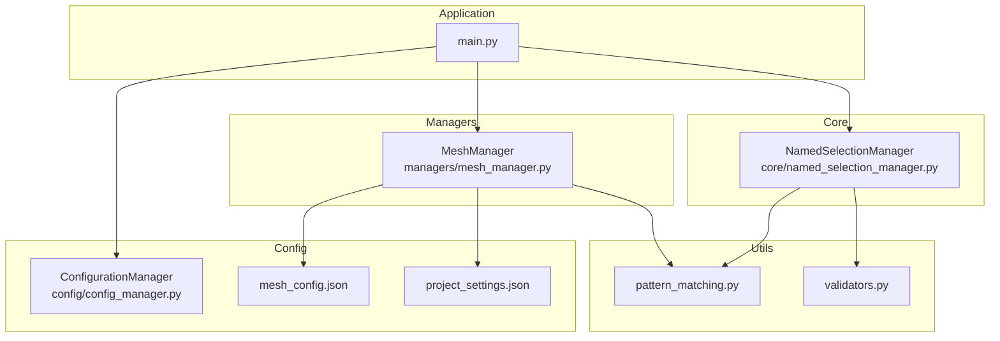
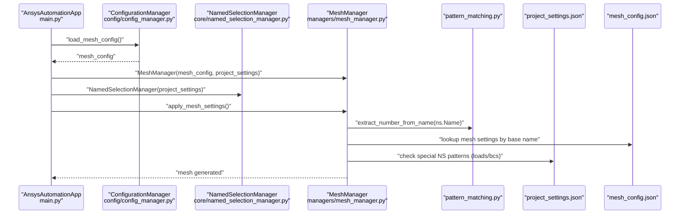
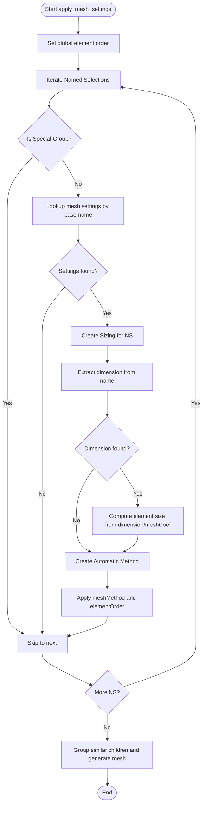
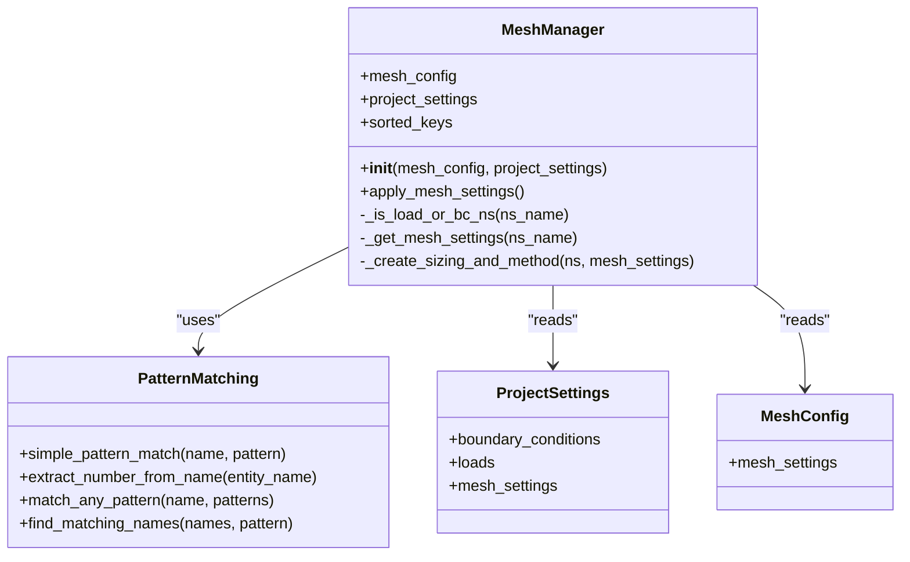

# MeshManager Class

<cite>
**Referenced Files in This Document**
- [mesh_manager.py](file://managers/mesh_manager.py)
- [mesh_config.json](file://config_files/mesh_config.json)
- [project_settings.json](file://config_files/project_settings.json)
- [named_selection_manager.py](file://core/named_selection_manager.py)
- [pattern_matching.py](file://utils/pattern_matching.py)
- [validators.py](file://utils/validators.py)
- [config_manager.py](file://config/config_manager.py)
- [main.py](file://main.py)
</cite>

## Table of Contents
1. [Introduction](#introduction)
2. [Project Structure](#project-structure)
3. [Core Components](#core-components)
4. [Architecture Overview](#architecture-overview)
5. [Detailed Component Analysis](#detailed-component-analysis)
6. [Dependency Analysis](#dependency-analysis)
7. [Performance Considerations](#performance-considerations)
8. [Troubleshooting Guide](#troubleshooting-guide)
9. [Conclusion](#conclusion)
10. [Appendices](#appendices)

## Introduction
This document provides comprehensive API documentation for the MeshManager class responsible for applying mesh settings from configuration to Named Selections in ANSYS. It explains the constructor’s dependencies on mesh_config and project_settings, the apply_mesh_settings workflow, how body dimensions influence mesh sizing, integration with ANSYS meshing controls and element type settings, error handling, performance considerations for large assemblies, and best practices for organizing mesh configuration.

## Project Structure
MeshManager resides in the managers package and integrates with configuration files, pattern matching utilities, and the Named Selection Manager. The main application orchestrates loading configurations and invoking MeshManager during automated analysis setup.

**Diagram sources**
- [mesh_manager.py](file://managers/mesh_manager.py#L1-L104)
- [mesh_config.json](file://config_files/mesh_config.json#L1-L85)
- [project_settings.json](file://config_files/project_settings.json#L1-L56)
- [named_selection_manager.py](file://core/named_selection_manager.py#L1-L190)
- [pattern_matching.py](file://utils/pattern_matching.py#L1-L71)
- [validators.py](file://utils/validators.py#L1-L161)
- [config_manager.py](file://config/config_manager.py#L1-L209)
- [main.py](file://main.py#L1-L270)

**Section sources**
- [mesh_manager.py](file://managers/mesh_manager.py#L1-L104)
- [main.py](file://main.py#L120-L180)

## Core Components
- MeshManager: Applies mesh settings to Named Selections based on configuration-driven rules and pattern matching.
- mesh_config.json: Defines mesh settings keyed by base names, including mesh coefficient, method, and element order.
- project_settings.json: Provides project-wide settings, including boundary conditions, loads, and mesh-related defaults.
- NamedSelectionManager: Manages Named Selections, including validation and pattern-based retrieval.
- pattern_matching.py: Utilities for wildcard pattern matching and extracting numeric parts from names.
- validators.py: Validation helpers for configuration and model structure.
- ConfigurationManager: Loads and merges configuration files, validates required keys, and provides defaults.

**Section sources**
- [mesh_manager.py](file://managers/mesh_manager.py#L1-L104)
- [mesh_config.json](file://config_files/mesh_config.json#L1-L85)
- [project_settings.json](file://config_files/project_settings.json#L1-L56)
- [named_selection_manager.py](file://core/named_selection_manager.py#L1-L190)
- [pattern_matching.py](file://utils/pattern_matching.py#L1-L71)
- [validators.py](file://utils/validators.py#L1-L161)
- [config_manager.py](file://config/config_manager.py#L1-L209)

## Architecture Overview
MeshManager participates in the automated analysis pipeline initiated by the main application. It receives pre-loaded mesh_config and project_settings, iterates through Named Selections, applies mesh sizing and methods, and triggers mesh generation.

**Diagram sources**
- [main.py](file://main.py#L94-L121)
- [main.py](file://main.py#L122-L131)
- [main.py](file://main.py#L177-L180)
- [mesh_manager.py](file://managers/mesh_manager.py#L20-L104)
- [pattern_matching.py](file://utils/pattern_matching.py#L32-L46)
- [mesh_config.json](file://config_files/mesh_config.json#L1-L85)
- [project_settings.json](file://config_files/project_settings.json#L1-L56)

## Detailed Component Analysis

### MeshManager API
Responsibilities:
- Initialize with mesh_config and project_settings.
- Iterate Named Selections, skip special load/boundary condition groups, and apply mesh settings.
- Compute element size from body dimensions embedded in names.
- Configure automatic mesh methods and element orders.
- Group similar children and generate the mesh.

Key methods and behavior:
- Constructor: Sorts mesh settings keys by length (longest first) to improve pattern matching precedence.
- apply_mesh_settings: Sets global element order, iterates Named Selections, filters out special groups, resolves settings, creates sizing and method entries, and generates the mesh.
- _is_load_or_bc_ns: Uses project_settings to exclude Named Selections associated with loads or boundary conditions.
- _get_mesh_settings: Matches Named Selection names to configured base names and extracts numeric parts to infer dimensions.
- _create_sizing_and_method: Creates Sizing and Automatic Method entries, sets element size and method parameters, and applies element order.

Integration points:
- Uses pattern_matching utilities for wildcard matching and dimension extraction.
- Relies on project_settings for special group exclusion and defaults.
- Interacts with ANSYS meshing controls via Model.Mesh APIs.

Error handling:
- Catches exceptions during mesh creation per Named Selection and prints a warning.
- Validates configuration structure via ConfigurationManager and validators.

Performance considerations:
- Sorting mesh settings keys by length ensures longest-match precedence.
- Skipping special Named Selections reduces unnecessary processing.
- Using dimension-derived sizing avoids manual per-part configuration.

Best practices:
- Organize mesh_config.json with descriptive base names that reflect geometry families.
- Include representative dimensions in Named Selection names for accurate sizing.
- Keep mesh settings grouped by geometry type and reuse common patterns.

**Section sources**
- [mesh_manager.py](file://managers/mesh_manager.py#L12-L104)
- [pattern_matching.py](file://utils/pattern_matching.py#L8-L31)
- [pattern_matching.py](file://utils/pattern_matching.py#L32-L46)
- [project_settings.json](file://config_files/project_settings.json#L16-L38)
- [config_manager.py](file://config/config_manager.py#L26-L51)
- [validators.py](file://utils/validators.py#L93-L110)

### apply_mesh_settings Workflow
High-level flow:
- Set global element order.
- Enumerate Named Selections.
- Skip special groups (loads/boundary conditions).
- Resolve mesh settings for each Named Selection using base name matching.
- Create Sizing with element size derived from dimension and mesh coefficient.
- Create Automatic Method with selected method and element order.
- Group similar children and generate mesh.

**Diagram sources**
- [mesh_manager.py](file://managers/mesh_manager.py#L20-L104)
- [pattern_matching.py](file://utils/pattern_matching.py#L32-L46)
- [mesh_config.json](file://config_files/mesh_config.json#L1-L85)

**Section sources**
- [mesh_manager.py](file://managers/mesh_manager.py#L20-L104)

### Pattern Matching and Dimension Extraction
- Base name matching: Keys in mesh_config.json are matched against the base part of Named Selection names. Longer keys take precedence.
- Dimension extraction: Numeric suffixes are extracted from names to compute element size via mesh coefficient.
- Special group detection: Uses project_settings to exclude Named Selections that represent loads or boundary conditions.

**Section sources**
- [mesh_manager.py](file://managers/mesh_manager.py#L58-L74)
- [pattern_matching.py](file://utils/pattern_matching.py#L32-L46)
- [project_settings.json](file://config_files/project_settings.json#L16-L33)

### Integration with ANSYS Meshing Controls
- Sizing: Adds a Sizing entry and assigns it to the Named Selection, then computes element size from dimension and mesh coefficient.
- Method: Adds an Automatic Method entry and sets Method and ElementOrder attributes.
- Special methods:
  - MultiZone: SurfaceMeshMethod set to a specific value.
  - Sweep: Algorithm set to Axisymmetric.
- Element order: Applied globally and per method.

**Section sources**
- [mesh_manager.py](file://managers/mesh_manager.py#L75-L104)

### Relationship Between Named Selection Manager and Mesh Application Efficiency
- NamedSelectionManager provides validation and pattern-based retrieval, reducing ambiguity in mesh application.
- MeshManager relies on project_settings to exclude special Named Selections, preventing redundant or incorrect mesh operations.
- Efficient filtering and caching in NamedSelectionManager can reduce repeated lookups and improve overall runtime.

**Section sources**
- [named_selection_manager.py](file://core/named_selection_manager.py#L1-L190)
- [mesh_manager.py](file://managers/mesh_manager.py#L41-L57)
- [project_settings.json](file://config_files/project_settings.json#L16-L33)

## Dependency Analysis
MeshManager depends on:
- mesh_config.json for mesh settings keyed by base names.
- project_settings.json for special group exclusions and defaults.
- pattern_matching.py for wildcard matching and dimension extraction.
- ANSYS Model.Mesh APIs for creating sizing and methods and generating the mesh.

**Diagram sources**
- [mesh_manager.py](file://managers/mesh_manager.py#L12-L104)
- [pattern_matching.py](file://utils/pattern_matching.py#L1-L71)
- [project_settings.json](file://config_files/project_settings.json#L1-L56)
- [mesh_config.json](file://config_files/mesh_config.json#L1-L85)

**Section sources**
- [mesh_manager.py](file://managers/mesh_manager.py#L12-L104)
- [pattern_matching.py](file://utils/pattern_matching.py#L1-L71)
- [project_settings.json](file://config_files/project_settings.json#L1-L56)
- [mesh_config.json](file://config_files/mesh_config.json#L1-L85)

## Performance Considerations
- Key ordering: Sorting mesh settings keys by length ensures longest-match precedence, reducing ambiguity and misapplication.
- Filtering: Excluding special Named Selections prevents unnecessary mesh operations.
- Dimension-based sizing: Computing element size from names avoids per-part manual configuration overhead.
- Large assemblies: Grouping similar children and generating the mesh once at the end minimizes repeated operations.

Best practices:
- Use concise yet descriptive base names in mesh_config.json that align with geometry families.
- Include numeric suffixes in Named Selection names to enable dimension extraction.
- Keep mesh settings organized by geometry type and reuse common patterns.
- Validate configuration structure early to catch errors before mesh generation.

**Section sources**
- [mesh_manager.py](file://managers/mesh_manager.py#L12-L19)
- [mesh_manager.py](file://managers/mesh_manager.py#L20-L39)
- [pattern_matching.py](file://utils/pattern_matching.py#L32-L46)

## Troubleshooting Guide
Common issues and resolutions:
- Missing Named Selections:
  - Symptom: Warnings about missing required Named Selections.
  - Resolution: Ensure required Named Selections exist and match project_settings patterns.
- Invalid mesh parameters:
  - Symptom: Exceptions indicating missing required keys in mesh settings.
  - Resolution: Verify mesh_config.json includes meshCoef, meshMethod, and elementOrder for each base name.
- Unexpected mesh behavior:
  - Symptom: Incorrect element size or method.
  - Resolution: Confirm base name matching and dimension extraction; adjust mesh coefficient or method accordingly.
- Special group interference:
  - Symptom: Mesh not applied to load/boundary condition Named Selections.
  - Resolution: These are intentionally excluded; confirm grouping names match project_settings.

**Section sources**
- [named_selection_manager.py](file://core/named_selection_manager.py#L58-L85)
- [validators.py](file://utils/validators.py#L93-L110)
- [mesh_manager.py](file://managers/mesh_manager.py#L31-L37)
- [project_settings.json](file://config_files/project_settings.json#L16-L33)

## Conclusion
MeshManager provides a robust mechanism to automate mesh configuration across Named Selections by leveraging configuration-driven rules, pattern matching, and dimension extraction. Its integration with project_settings and ANSYS meshing controls enables scalable mesh setup for complex assemblies while maintaining flexibility and reliability.

## Appendices

### API Reference: MeshManager
- Constructor
  - Parameters:
    - mesh_config: Dictionary loaded from mesh_config.json.
    - project_settings: Dictionary loaded from project_settings.json.
  - Behavior:
    - Stores references to mesh_config and project_settings.
    - Sorts mesh settings keys by length (descending) for precedence.

- apply_mesh_settings
  - Purpose: Apply mesh settings to all applicable Named Selections.
  - Steps:
    - Set global element order.
    - Iterate Named Selections.
    - Skip special groups (loads/boundary conditions).
    - Resolve mesh settings by base name.
    - Create Sizing and Automatic Method entries.
    - Group similar children and generate mesh.
  - Exceptions:
    - Prints a warning for each Named Selection encountering an error.

- _is_load_or_bc_ns(ns_name)
  - Purpose: Determine if a Named Selection belongs to special groups.
  - Logic:
    - Builds a list of special group names from project_settings.
    - Uses wildcard pattern matching for bolt patterns.
    - Returns True if the Named Selection matches any special group.

- _get_mesh_settings(ns_name)
  - Purpose: Retrieve mesh settings for a Named Selection.
  - Logic:
    - Extracts base name from ns_name using dimension extraction.
    - Iterates sorted keys to find a match.
    - Returns the corresponding mesh settings or None.

- _create_sizing_and_method(ns, mesh_settings)
  - Purpose: Configure Sizing and Method for a Named Selection.
  - Steps:
    - Create Sizing and assign Location to the Named Selection.
    - Extract dimension from name and compute element size using mesh coefficient.
    - Create Automatic Method and assign Location.
    - Set Method and ElementOrder from mesh_settings.
    - Apply special handling for MultiZone and Sweep methods.
    - Rename entries based on definitions.

**Section sources**
- [mesh_manager.py](file://managers/mesh_manager.py#L12-L104)

### Example mesh_config.json Entries and Effects
- Base name mbolt:
  - Effect: Applies Sweep method with ProgramControlled element order and a specific mesh coefficient.
- Base name truba:
  - Effect: Applies MultiZone method with Quadratic element order.
- Base name flanec:
  - Effect: Applies Sweep method with ProgramControlled element order.
- Base name korpus:
  - Effect: Applies MultiZone method with Quadratic element order.

These entries influence:
- Method selection (Sweep, MultiZone, HexDominant).
- Element order (Linear, Quadratic, ProgramControlled).
- Element size computation via dimension and mesh coefficient.

**Section sources**
- [mesh_config.json](file://config_files/mesh_config.json#L1-L85)

### Integration Points and Best Practices
- Configuration loading:
  - ConfigurationManager loads and validates mesh_config.json and merges structure-specific overrides.
- Pattern matching:
  - Use simple wildcard patterns for flexible matching of Named Selection names.
- Dimension extraction:
  - Include numeric suffixes in names to enable automatic sizing.
- Special groups:
  - Exclude load and boundary condition Named Selections from mesh application using project_settings.

**Section sources**
- [config_manager.py](file://config/config_manager.py#L78-L117)
- [pattern_matching.py](file://utils/pattern_matching.py#L8-L31)
- [project_settings.json](file://config_files/project_settings.json#L16-L33)