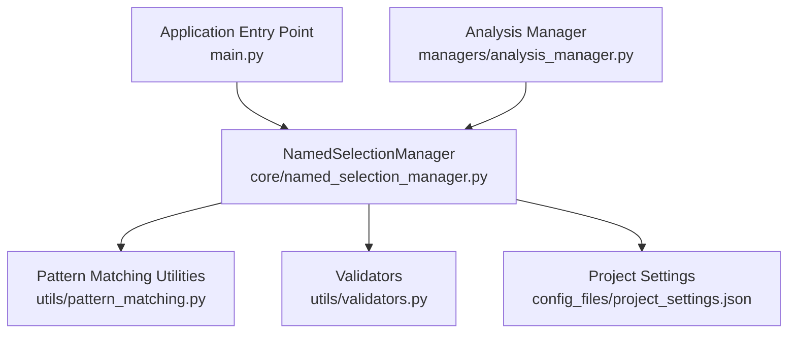
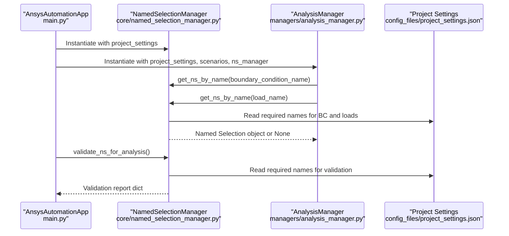
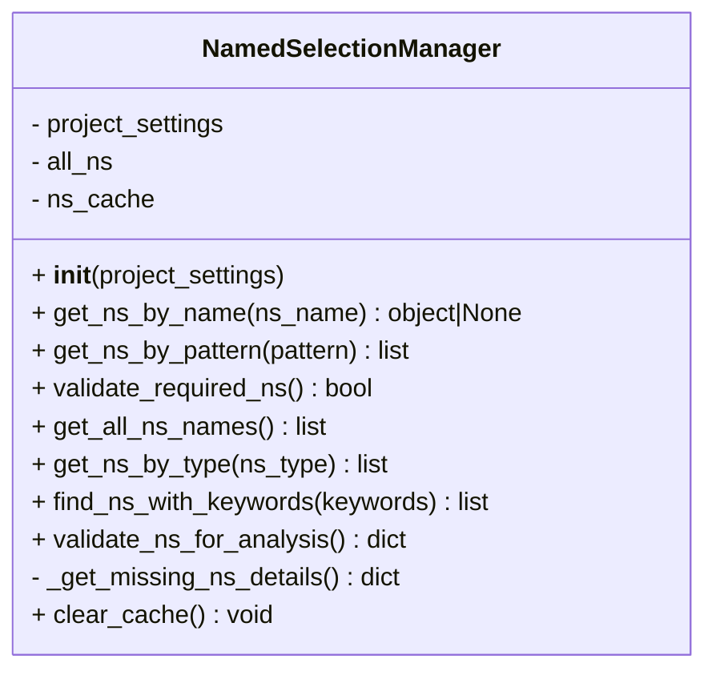
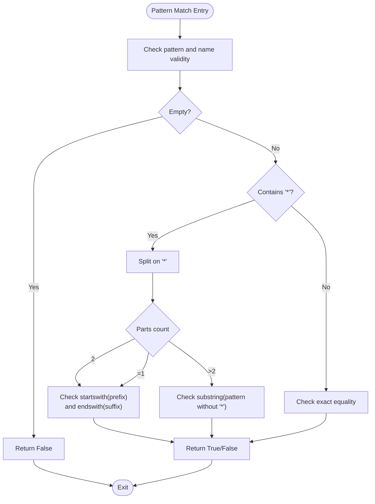
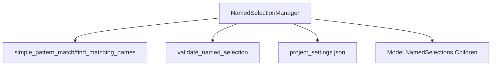

# NamedSelectionManager Class

<cite>
**Referenced Files in This Document**
- [named_selection_manager.py](file://core/named_selection_manager.py)
- [pattern_matching.py](file://utils/pattern_matching.py)
- [validators.py](file://utils/validators.py)
- [project_settings.json](file://config_files/project_settings.json)
- [analysis_manager.py](file://managers/analysis_manager.py)
- [main.py](file://main.py)
</cite>

## Table of Contents
1. [Introduction](#introduction)
2. [Project Structure](#project-structure)
3. [Core Components](#core-components)
4. [Architecture Overview](#architecture-overview)
5. [Detailed Component Analysis](#detailed-component-analysis)
6. [Dependency Analysis](#dependency-analysis)
7. [Performance Considerations](#performance-considerations)
8. [Troubleshooting Guide](#troubleshooting-guide)
9. [Conclusion](#conclusion)

## Introduction
This document provides comprehensive API documentation for the NamedSelectionManager class, which centralizes the management of ANSYS Named Selections. It explains how the class initializes a cache, accesses the model’s Named Selections collection, and provides efficient lookup and pattern-matching capabilities. It also documents validation routines for required Named Selections, type-based filtering, keyword-based searches, and a comprehensive validation report. Clear examples of wildcard pattern matching are included, along with return types and exception handling behavior.

## Project Structure
The NamedSelectionManager resides in the core module and collaborates with utilities for pattern matching and validation, and integrates with higher-level managers for analysis setup.

**Diagram sources**
- [named_selection_manager.py](file://core/named_selection_manager.py#L1-L190)
- [pattern_matching.py](file://utils/pattern_matching.py#L1-L71)
- [validators.py](file://utils/validators.py#L1-L161)
- [project_settings.json](file://config_files/project_settings.json#L1-L56)
- [analysis_manager.py](file://managers/analysis_manager.py#L1-L116)
- [main.py](file://main.py#L1-L270)

**Section sources**
- [named_selection_manager.py](file://core/named_selection_manager.py#L1-L190)
- [main.py](file://main.py#L120-L131)

## Core Components
- NamedSelectionManager: Central manager for Named Selections with caching, pattern matching, and validation.
- Pattern matching utilities: Provides wildcard pattern matching compatible with IronPython.
- Validators: Provides validation helpers used by the manager and elsewhere in the system.
- Project settings: Supplies required Named Selection names for boundary conditions and loads.

Key responsibilities:
- Initialize cache and model collection reference.
- Provide O(1) average-time lookups by name with caching.
- Provide wildcard pattern matching for selection discovery.
- Validate presence of required Named Selections against project settings.
- Aggregate counts and details for comprehensive validation reports.
- Offer type-based and keyword-based discovery.

**Section sources**
- [named_selection_manager.py](file://core/named_selection_manager.py#L12-L190)
- [pattern_matching.py](file://utils/pattern_matching.py#L1-L71)
- [validators.py](file://utils/validators.py#L52-L67)
- [project_settings.json](file://config_files/project_settings.json#L16-L32)

## Architecture Overview
The NamedSelectionManager is instantiated by the application entry point and injected into the AnalysisManager. It uses the project settings to validate required Named Selections and to discover selections by type or keywords.

**Diagram sources**
- [main.py](file://main.py#L120-L131)
- [analysis_manager.py](file://managers/analysis_manager.py#L28-L116)
- [named_selection_manager.py](file://core/named_selection_manager.py#L58-L190)
- [project_settings.json](file://config_files/project_settings.json#L16-L32)

## Detailed Component Analysis

### Class: NamedSelectionManager
The class encapsulates Named Selection operations with caching and pattern matching.

**Diagram sources**
- [named_selection_manager.py](file://core/named_selection_manager.py#L12-L190)

**Section sources**
- [named_selection_manager.py](file://core/named_selection_manager.py#L12-L190)

#### Method: __init__(project_settings)
- Initializes the manager with project settings.
- Captures the model’s Named Selections collection reference.
- Creates an empty cache dictionary for Named Selection objects keyed by name.

Behavior:
- Stores project_settings for later validation and discovery.
- Sets all_ns to the model’s Named Selections children collection.
- Initializes ns_cache as an empty dictionary.

Return type:
- None (initialization method).

**Section sources**
- [named_selection_manager.py](file://core/named_selection_manager.py#L12-L20)

#### Method: get_ns_by_name(ns_name) -> object | None
- Retrieves a Named Selection by exact name with caching.
- Returns None if ns_name is empty or not found.

Caching mechanism:
- First access: scans all_ns and caches the result under ns_name.
- Subsequent access: returns cached object in O(1) average time.

Edge cases:
- Empty ns_name returns None.
- Not found returns None.

Return type:
- Named Selection object or None.

**Section sources**
- [named_selection_manager.py](file://core/named_selection_manager.py#L17-L37)

#### Method: get_ns_by_pattern(pattern) -> list
- Finds Named Selections matching a wildcard pattern.
- Supports '*' as wildcard anywhere in the pattern.

Implementation:
- Uses simple_pattern_match for each name.
- Returns a list of matching Named Selection objects.

Examples:
- Pattern '*bolt*' matches names containing "bolt".
- Pattern '*remote*' matches names containing "remote".

Return type:
- List of Named Selection objects.

**Section sources**
- [named_selection_manager.py](file://core/named_selection_manager.py#L39-L56)
- [pattern_matching.py](file://utils/pattern_matching.py#L8-L31)

#### Method: validate_required_ns() -> bool
- Validates that required Named Selections exist for boundary conditions and loads.
- Reads required names from project settings and checks availability via get_ns_by_name.

Behavior:
- Builds a list of missing entries.
- Prints a warning message listing missing entries.
- Returns False if any are missing, True otherwise.

Return type:
- Boolean indicating whether all required Named Selections are present.

**Section sources**
- [named_selection_manager.py](file://core/named_selection_manager.py#L58-L84)
- [project_settings.json](file://config_files/project_settings.json#L16-L32)

#### Method: get_all_ns_names() -> list
- Returns a list of all Named Selection names in the model.

Return type:
- List of strings.

**Section sources**
- [named_selection_manager.py](file://core/named_selection_manager.py#L86-L93)

#### Method: get_ns_by_type(ns_type) -> list
- Returns Named Selections filtered by type using predefined patterns.
- Supported types:
  - load: patterns for forces, moments, pressure, bearing, temperature.
  - bc: patterns for fixed/support, displacement, frictionless, compression.
  - bolt: patterns for bolt-related names.
  - contact: patterns for contact-related names.
  - remote: patterns for remote-related names.

Behavior:
- Iterates over patterns for the given type.
- Aggregates matches from get_ns_by_pattern.
- Removes duplicates by converting to set and back to list.

Return type:
- List of Named Selection objects.

Example patterns:
- '*bolt*' and '*mbolt*' and '*gaika*' for bolt.
- '*remote*' for remote.
- '*contact*' and '*shov*' for contact.

**Section sources**
- [named_selection_manager.py](file://core/named_selection_manager.py#L95-L121)

#### Method: find_ns_with_keywords(keywords) -> list
- Returns Named Selections whose names contain any of the provided keywords.

Return type:
- List of Named Selection objects.

**Section sources**
- [named_selection_manager.py](file://core/named_selection_manager.py#L122-L136)

#### Method: validate_ns_for_analysis() -> dict
- Produces a comprehensive validation report including:
  - has_required_ns: Boolean from validate_required_ns.
  - total_ns_count: Integer count of all Named Selections.
  - load_ns: Count of load-type Named Selections.
  - bc_ns: Count of boundary condition-type Named Selections.
  - bolt_ns: Count of bolt-type Named Selections.
  - missing_ns: Structured details of missing entries.

Return type:
- Dictionary with validation metrics and missing details.

**Section sources**
- [named_selection_manager.py](file://core/named_selection_manager.py#L138-L155)
- [named_selection_manager.py](file://core/named_selection_manager.py#L156-L187)

#### Method: _get_missing_ns_details() -> dict
- Internal method returning structured details about missing Named Selections.
- Organized by categories:
  - boundary_conditions: List of {type, expected_name}.
  - loads: List of {type, expected_name}.

Return type:
- Dictionary with categorized missing entries.

**Section sources**
- [named_selection_manager.py](file://core/named_selection_manager.py#L156-L187)

#### Method: clear_cache() -> None
- Clears the internal cache of Named Selection objects.

Return type:
- None.

**Section sources**
- [named_selection_manager.py](file://core/named_selection_manager.py#L188-L190)

### Pattern Matching Implementation Details
The manager relies on a lightweight wildcard matcher that splits on '*' and checks prefix/suffix or substring containment.

**Diagram sources**
- [pattern_matching.py](file://utils/pattern_matching.py#L8-L31)

**Section sources**
- [pattern_matching.py](file://utils/pattern_matching.py#L8-L31)

### Validation Against Project Settings
Required Named Selections are defined in project settings for boundary conditions and loads. The manager reads these settings and validates their presence.

- Boundary conditions keys: fixed_support, displacement, remote_displacement, remote_force, frictionless_support, compression_only.
- Loads keys: force, moment, pressure, bearing, remote_force, bolt_pattern, temperature.

Validation behavior:
- For each required name, if present and not found, it is reported as missing.
- A warning message lists all missing entries.

**Section sources**
- [project_settings.json](file://config_files/project_settings.json#L16-L32)
- [named_selection_manager.py](file://core/named_selection_manager.py#L58-L84)

### Integration with Analysis Manager
The AnalysisManager uses NamedSelectionManager to locate Named Selections for applying boundary conditions and loads.

- Applies fixed support, displacement, remote displacement, and remote force using get_ns_by_name.
- Applies force, moment, and pressure loads similarly.

This demonstrates the manager’s role in bridging configuration-driven automation with the ANSYS model.

**Section sources**
- [analysis_manager.py](file://managers/analysis_manager.py#L28-L116)
- [main.py](file://main.py#L120-L131)

## Dependency Analysis
The NamedSelectionManager depends on:
- Pattern matching utilities for wildcard matching.
- Validators for reusable validation logic.
- Project settings for required Named Selection names.
- The ANSYS model’s Named Selections collection.

**Diagram sources**
- [named_selection_manager.py](file://core/named_selection_manager.py#L1-L190)
- [pattern_matching.py](file://utils/pattern_matching.py#L1-L71)
- [validators.py](file://utils/validators.py#L52-L67)
- [project_settings.json](file://config_files/project_settings.json#L1-L56)

**Section sources**
- [named_selection_manager.py](file://core/named_selection_manager.py#L1-L190)
- [pattern_matching.py](file://utils/pattern_matching.py#L1-L71)
- [validators.py](file://utils/validators.py#L52-L67)
- [project_settings.json](file://config_files/project_settings.json#L1-L56)

## Performance Considerations
- Caching:
  - get_ns_by_name uses an in-memory dictionary keyed by name to achieve O(1) average-time lookups after the first scan.
  - This significantly reduces repeated traversal of the model’s Named Selections collection.
- Memory:
  - The cache grows with the number of distinct Named Selection names encountered.
  - For large models with many Named Selections, consider periodic cache clearing via clear_cache to manage memory.
- Scanning:
  - get_ns_by_pattern iterates over all_ns for each pattern; for many patterns, consider batching or precomputing sets to minimize repeated scans.
- Duplicates:
  - get_ns_by_type removes duplicates by converting to a set; this adds overhead proportional to the number of matches.

Recommendations:
- Use get_ns_by_name for frequent lookups by known names.
- Use get_ns_by_pattern for discovery tasks; cache results externally if patterns are reused.
- Periodically call clear_cache during long-running sessions to prevent unbounded growth.

**Section sources**
- [named_selection_manager.py](file://core/named_selection_manager.py#L17-L37)
- [named_selection_manager.py](file://core/named_selection_manager.py#L95-L121)
- [named_selection_manager.py](file://core/named_selection_manager.py#L188-L190)

## Troubleshooting Guide
Common issues and resolutions:
- Missing Named Selections:
  - Use validate_required_ns or validate_ns_for_analysis to identify missing entries.
  - Review project settings for boundary_conditions and loads keys.
- Pattern matching not returning expected results:
  - Verify the pattern syntax and ensure '*' is used appropriately.
  - Confirm the actual Named Selection names in the model.
- Not found returns:
  - get_ns_by_name returns None when ns_name is empty or not found.
  - get_ns_by_pattern returns [] when pattern is empty or no matches.
- Warning messages:
  - validate_required_ns prints a warning listing missing entries; address these in the model or update project settings.

Validation report structure:
- has_required_ns: Boolean.
- total_ns_count: Integer.
- load_ns: Integer.
- bc_ns: Integer.
- bolt_ns: Integer.
- missing_ns: Dictionary with boundary_conditions and loads lists of {type, expected_name}.

**Section sources**
- [named_selection_manager.py](file://core/named_selection_manager.py#L58-L84)
- [named_selection_manager.py](file://core/named_selection_manager.py#L138-L187)
- [project_settings.json](file://config_files/project_settings.json#L16-L32)

## Conclusion
The NamedSelectionManager provides a robust foundation for managing ANSYS Named Selections with efficient caching, flexible pattern matching, and comprehensive validation against project settings. Its integration with higher-level managers enables automated setup of analyses while maintaining transparency through detailed validation reports and structured missing-Named Selection details.