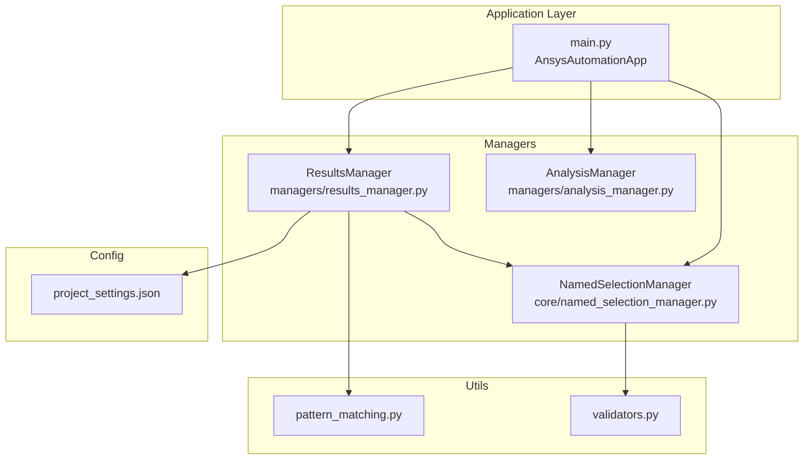
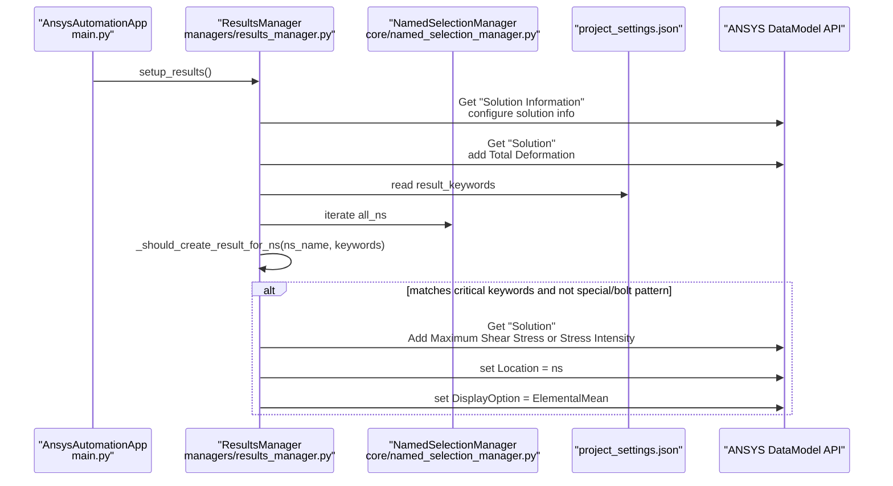
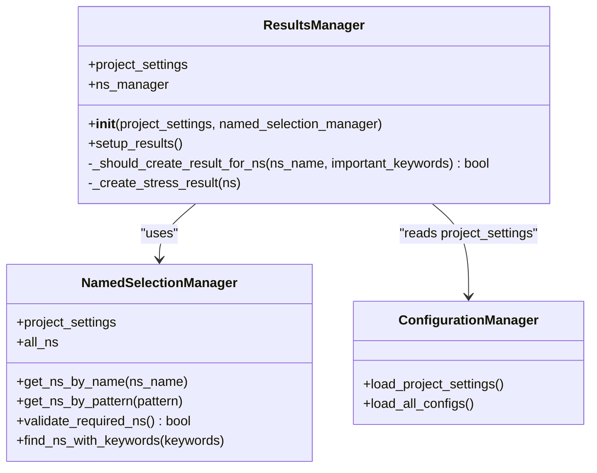
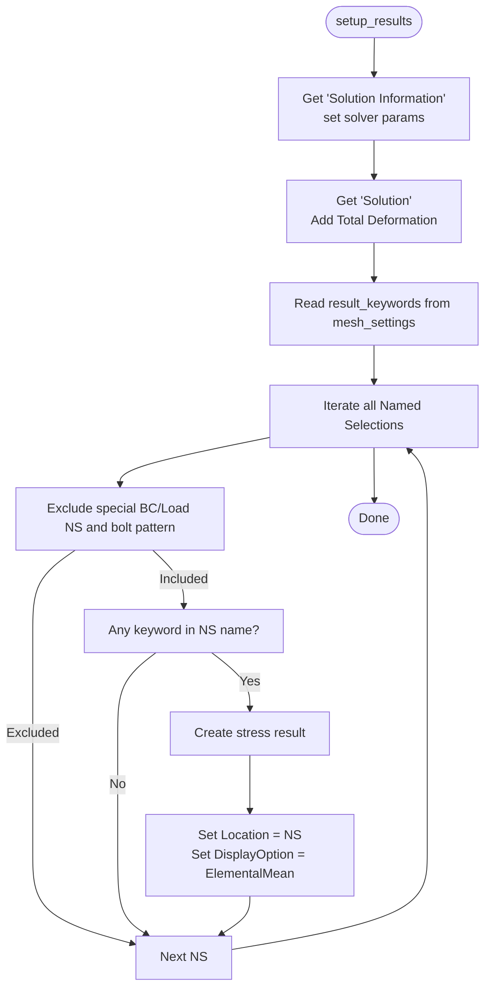
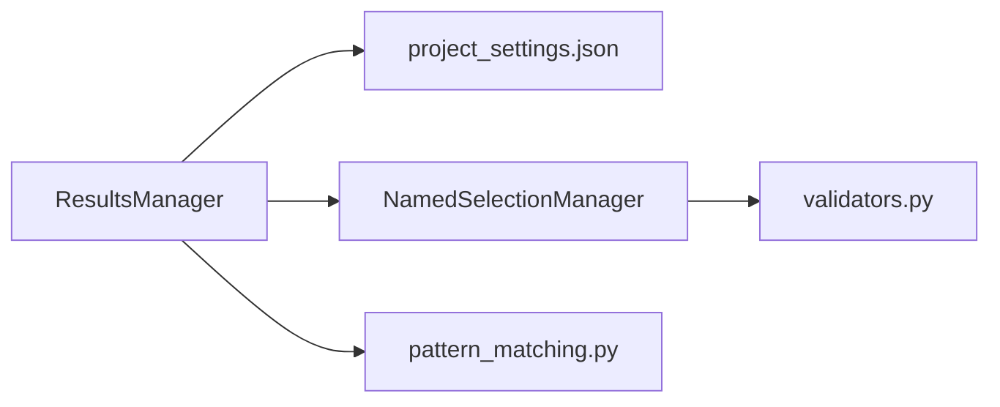

# ResultsManager Class

<cite>
**Referenced Files in This Document**
- [results_manager.py](file://managers/results_manager.py)
- [project_settings.json](file://config_files/project_settings.json)
- [named_selection_manager.py](file://core/named_selection_manager.py)
- [main.py](file://main.py)
- [analysis_manager.py](file://managers/analysis_manager.py)
- [pattern_matching.py](file://utils/pattern_matching.py)
- [validators.py](file://utils/validators.py)
</cite>

## Table of Contents
1. [Introduction](#introduction)
2. [Project Structure](#project-structure)
3. [Core Components](#core-components)
4. [Architecture Overview](#architecture-overview)
5. [Detailed Component Analysis](#detailed-component-analysis)
6. [Dependency Analysis](#dependency-analysis)
7. [Performance Considerations](#performance-considerations)
8. [Troubleshooting Guide](#troubleshooting-guide)
9. [Conclusion](#conclusion)
10. [Appendices](#appendices)

## Introduction
This document provides detailed API documentation for the ResultsManager class responsible for setting up result requests for critical components in ANSYS Automation. It explains the class’s responsibilities, constructor dependencies, the setup_results workflow, how result requests are mapped to ANSYS solution objects, and how it integrates with ANSYS solution branches and output controls. It also covers configuration examples from project_settings.json, error handling for missing Named Selections or invalid result types, and performance considerations for managing large result sets efficiently.

## Project Structure
ResultsManager is part of the managers package and collaborates with configuration settings, the Named Selection Manager, and the ANSYS DataModel API. The typical execution flow initializes configuration, validates model and settings, applies analysis setup, and finally runs result setup.

**Diagram sources**
- [main.py](file://main.py#L120-L131)
- [results_manager.py](file://managers/results_manager.py#L11-L20)
- [analysis_manager.py](file://managers/analysis_manager.py#L14-L26)
- [named_selection_manager.py](file://core/named_selection_manager.py#L12-L16)
- [project_settings.json](file://config_files/project_settings.json#L1-L56)
- [pattern_matching.py](file://utils/pattern_matching.py#L1-L71)
- [validators.py](file://utils/validators.py#L1-L161)

**Section sources**
- [main.py](file://main.py#L120-L131)
- [results_manager.py](file://managers/results_manager.py#L11-L20)

## Core Components
- ResultsManager: Orchestrates result setup for critical components identified via Named Selections. It configures solution-level settings and creates stress-related result requests linked to specific Named Selections.
- NamedSelectionManager: Provides access to all Named Selections and utilities to validate required selections and search by patterns or keywords.
- project_settings.json: Supplies configuration for result keywords, special patterns (e.g., bolt pattern), default results, and stress averaging options.

Key responsibilities:
- Initialize with project_settings and a NamedSelectionManager instance.
- Configure solution-level settings (e.g., Newton-Raphson residuals, element violation identification).
- Add total deformation output.
- Identify critical components by scanning Named Selections against configured keywords and patterns.
- Create stress results (shear stress or stress intensity) for critical Named Selections.
- Map result requests to ANSYS Solution objects and set Location and averaging options.

**Section sources**
- [results_manager.py](file://managers/results_manager.py#L11-L62)
- [named_selection_manager.py](file://core/named_selection_manager.py#L12-L16)
- [project_settings.json](file://config_files/project_settings.json#L33-L48)

## Architecture Overview
ResultsManager participates in the automated analysis pipeline invoked by AnsysAutomationApp. The flow integrates configuration loading, model validation, analysis setup, and result setup.

**Diagram sources**
- [main.py](file://main.py#L199-L202)
- [results_manager.py](file://managers/results_manager.py#L15-L62)
- [named_selection_manager.py](file://core/named_selection_manager.py#L12-L16)
- [project_settings.json](file://config_files/project_settings.json#L33-L48)

## Detailed Component Analysis

### ResultsManager Class
Responsibilities:
- Constructor dependencies:
  - project_settings: Dictionary containing configuration for result keywords, bolt patterns, default results, and stress averaging.
  - named_selection_manager: Instance of NamedSelectionManager used to enumerate and validate Named Selections.
- setup_results workflow:
  - Retrieves the Solution Information object and sets solver parameters (e.g., Newton-Raphson residuals and element violation identification).
  - Adds Total Deformation output to the Solution branch.
  - Reads result_keywords from mesh_settings to identify critical components.
  - Iterates over all Named Selections and decides whether to create stress results based on:
    - Excluding special-purpose Named Selections (e.g., boundary conditions, loads).
    - Excluding bolt-related patterns defined in project settings.
    - Checking if the Named Selection name contains any of the configured result_keywords.
  - Creates stress results:
    - For Named Selections containing a specific keyword, adds Maximum Shear Stress.
    - Otherwise, adds Stress Intensity.
  - Sets Location to the Named Selection and DisplayOption to ElementalMean.

Integration with ANSYS solution branches and output controls:
- Uses DataModel APIs to locate "Solution Information" and "Solution".
- Adds Total Deformation and stress result types to the Solution branch.
- Assigns Location to the Named Selection and sets averaging behavior.

Error handling:
- Missing Named Selections are handled upstream by NamedSelectionManager validation routines.
- Pattern matching and keyword filtering prevent unintended result creation for special-purpose Named Selections.

**Diagram sources**
- [results_manager.py](file://managers/results_manager.py#L11-L62)
- [named_selection_manager.py](file://core/named_selection_manager.py#L12-L16)
- [main.py](file://main.py#L94-L119)

**Section sources**
- [results_manager.py](file://managers/results_manager.py#L11-L62)
- [project_settings.json](file://config_files/project_settings.json#L33-L48)

### setup_results Workflow
High-level steps:
1. Configure solution info parameters.
2. Add Total Deformation to the Solution branch.
3. Load result_keywords from project settings.
4. Iterate Named Selections:
   - Exclude special-purpose and bolt patterns.
   - Include only those matching result_keywords.
5. Create stress results for each included Named Selection:
   - Maximum Shear Stress for specific keyword matches.
   - Stress Intensity otherwise.
6. Set Location and averaging option.

**Diagram sources**
- [results_manager.py](file://managers/results_manager.py#L15-L62)
- [project_settings.json](file://config_files/project_settings.json#L33-L48)

**Section sources**
- [results_manager.py](file://managers/results_manager.py#L15-L62)

### Mapping Result Requests to ANSYS Solution Objects
- Total Deformation is added to the Solution branch.
- Stress results (Maximum Shear Stress or Stress Intensity) are added to the Solution branch.
- Each result request is bound to a specific Named Selection via the Location property.
- Averaging behavior is controlled via DisplayOption.

Integration points:
- DataModel.GetObjectsByName is used to locate "Solution Information" and "Solution".
- ResultAveragingType.ElementalMean is applied for stress results.

**Section sources**
- [results_manager.py](file://managers/results_manager.py#L15-L62)

### Configuration Examples from project_settings.json
- result_keywords: List of substrings used to identify critical components (e.g., bolts, supports, pipes).
- bolt_pattern: Pattern used to exclude bolt-related Named Selections from result creation.
- default_results: Default result types to include (e.g., Total Deformation).
- stress_results: Mapping for stress result types based on Named Selection keywords.
- stress_averaging: Averaging option applied to stress results.

Example configuration references:
- result_keywords under mesh_settings.
- bolt_pattern under loads.
- default_results and stress_results under solution_settings.

**Section sources**
- [project_settings.json](file://config_files/project_settings.json#L33-L48)

### Integration with ANSYS Solution Branches and Output Controls
- ResultsManager manipulates the Solution branch to add Total Deformation and stress results.
- Output controls include solver parameters set on Solution Information and averaging options set on stress results.
- The AnalysisManager configures analysis settings and output controls (e.g., nodal forces, miscellaneous outputs) that complement result setup.

**Section sources**
- [results_manager.py](file://managers/results_manager.py#L15-L23)
- [analysis_manager.py](file://managers/analysis_manager.py#L14-L26)

### Error Handling for Missing Named Selections or Invalid Result Types
- Missing Named Selections are detected during validation using NamedSelectionManager utilities.
- Pattern matching and keyword filtering prevent unintended result creation for special-purpose Named Selections.
- Upstream validation ensures required Named Selections exist before attempting to create result requests.

**Section sources**
- [named_selection_manager.py](file://core/named_selection_manager.py#L58-L85)
- [validators.py](file://utils/validators.py#L52-L67)
- [pattern_matching.py](file://utils/pattern_matching.py#L1-L31)

## Dependency Analysis
- ResultsManager depends on:
  - project_settings for configuration (keywords, patterns, defaults).
  - NamedSelectionManager for enumerating and validating Named Selections.
  - ANSYS DataModel APIs for locating Solution Information and Solution objects.
  - Pattern matching utilities for keyword and wildcard checks.

**Diagram sources**
- [results_manager.py](file://managers/results_manager.py#L11-L20)
- [named_selection_manager.py](file://core/named_selection_manager.py#L12-L16)
- [pattern_matching.py](file://utils/pattern_matching.py#L1-L71)
- [validators.py](file://utils/validators.py#L1-L161)

**Section sources**
- [results_manager.py](file://managers/results_manager.py#L11-L20)
- [named_selection_manager.py](file://core/named_selection_manager.py#L12-L16)

## Performance Considerations
- Keyword filtering reduces unnecessary result creation for non-critical Named Selections.
- Caching in NamedSelectionManager minimizes repeated lookups when validating required Named Selections.
- Limiting result creation to critical components avoids bloating the result set and improves post-processing efficiency.
- Using appropriate averaging options (e.g., ElementalMean) balances accuracy and computational overhead.

Best practices:
- Keep result_keywords focused on critical regions to minimize result count.
- Use bolt_pattern to exclude repetitive bolt groups from result requests.
- Prefer Total Deformation plus targeted stress results for large models.
- Validate model structure and required Named Selections early to avoid wasted computation.

**Section sources**
- [named_selection_manager.py](file://core/named_selection_manager.py#L12-L16)
- [results_manager.py](file://managers/results_manager.py#L24-L51)

## Troubleshooting Guide
Common issues and resolutions:
- Missing Named Selections:
  - Use NamedSelectionManager.validate_required_ns to identify missing required selections and update project_settings.json accordingly.
- Unexpected result creation:
  - Verify result_keywords and bolt_pattern in project_settings.json.
  - Ensure special-purpose Named Selections (BC/Load) are excluded by design.
- Invalid result types:
  - Confirm that stress result types align with project_settings.json stress_results mapping.
- Post-processing performance:
  - Reduce result set size by refining result_keywords and excluding non-critical components.

**Section sources**
- [named_selection_manager.py](file://core/named_selection_manager.py#L58-L85)
- [validators.py](file://utils/validators.py#L52-L67)
- [project_settings.json](file://config_files/project_settings.json#L33-L48)

## Conclusion
ResultsManager centralizes result setup for critical components by leveraging configuration-driven keyword filtering and pattern exclusion. It integrates tightly with ANSYS DataModel to configure solution-level settings and attach result requests to Named Selections. Proper configuration and validation ensure efficient and accurate post-processing outcomes while avoiding unnecessary computational overhead.

## Appendices

### API Reference Summary
- Constructor
  - Parameters:
    - project_settings: Dictionary with configuration for result_keywords, bolt_pattern, default_results, and stress_averaging.
    - named_selection_manager: Instance of NamedSelectionManager.
- Methods
  - setup_results(): Configures solution info, adds Total Deformation, identifies critical Named Selections, and creates stress results.
  - _should_create_result_for_ns(ns_name, important_keywords): Decides whether to create a result for a given Named Selection.
  - _create_stress_result(ns): Creates stress result (Maximum Shear Stress or Stress Intensity) and binds it to the Named Selection.

**Section sources**
- [results_manager.py](file://managers/results_manager.py#L11-L62)
- [project_settings.json](file://config_files/project_settings.json#L33-L48)