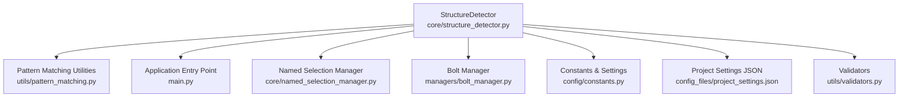
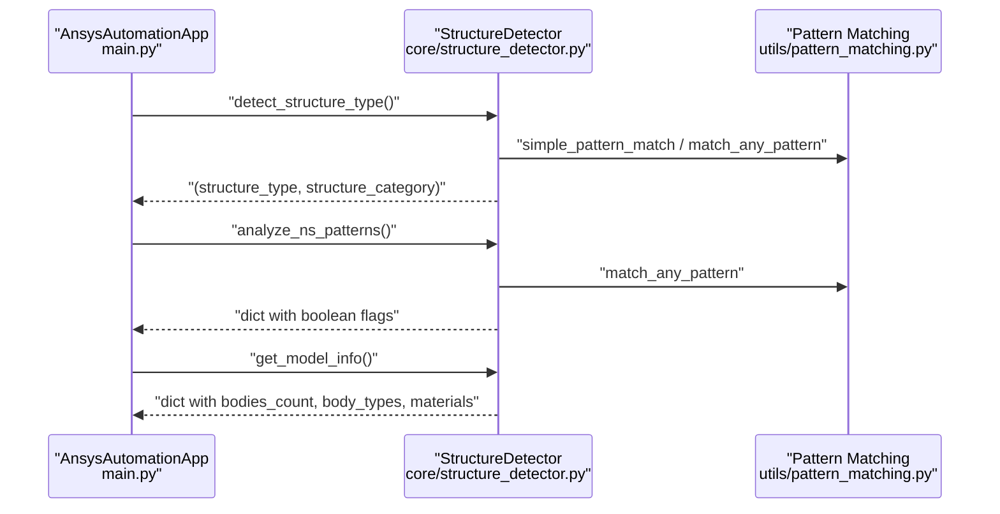
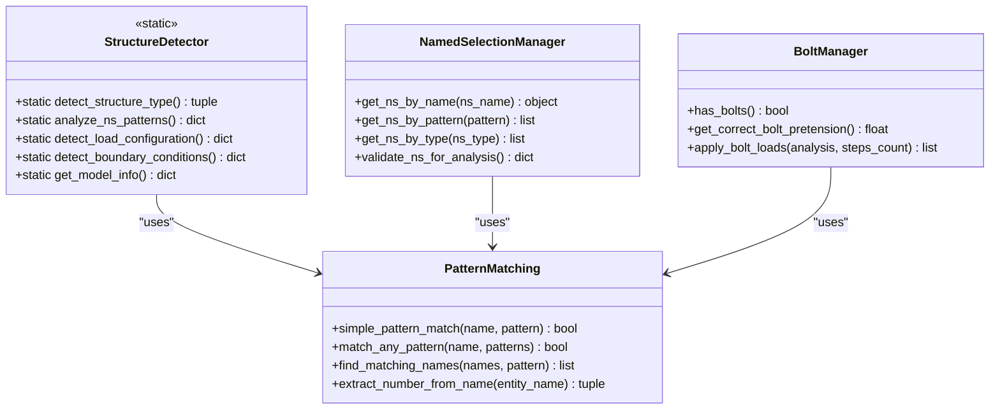
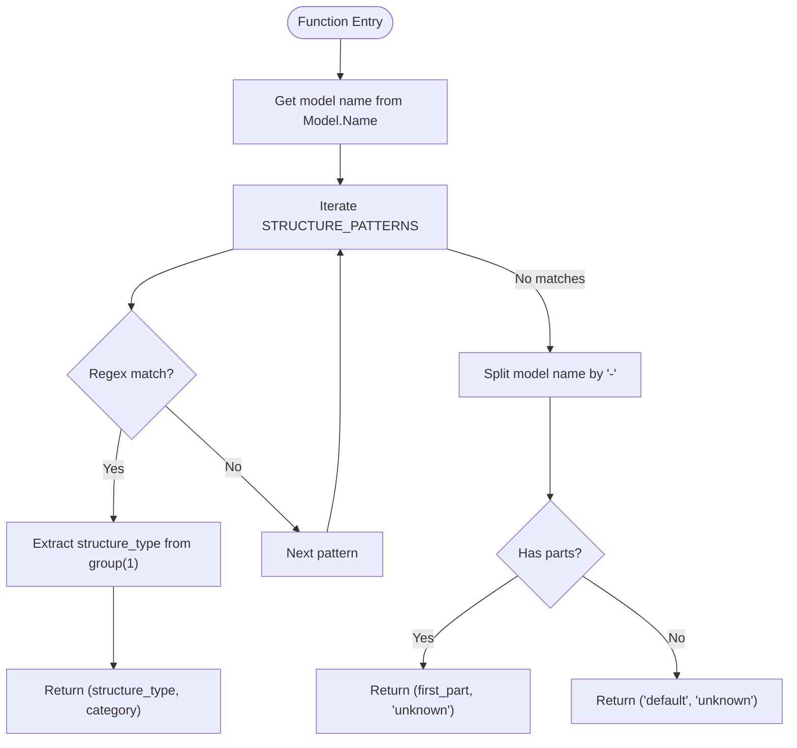
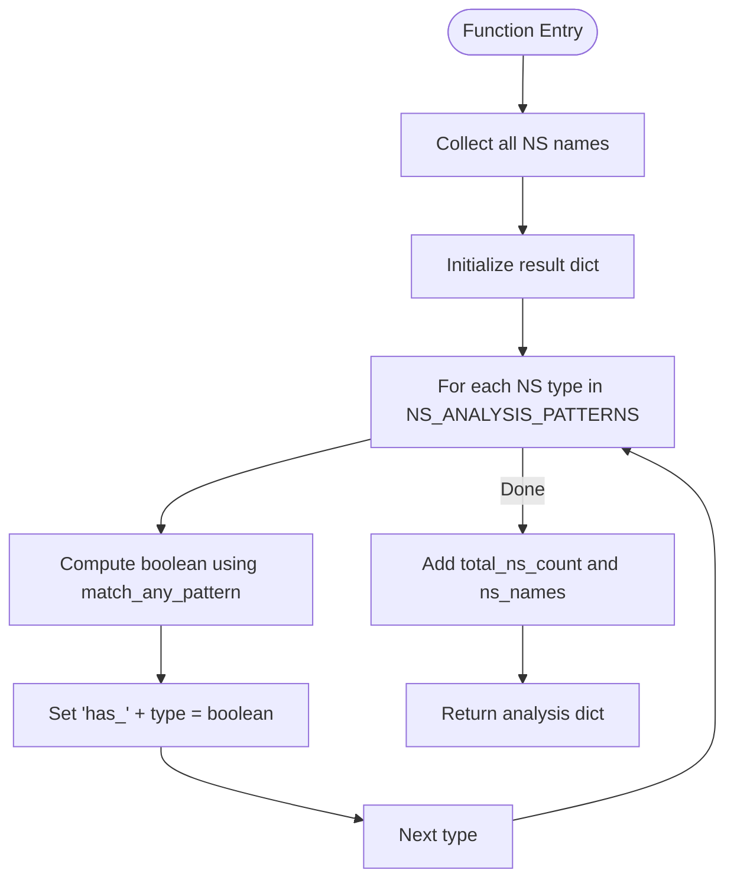
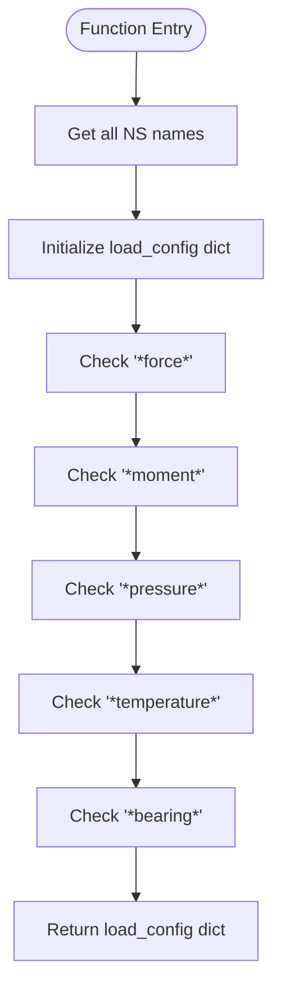
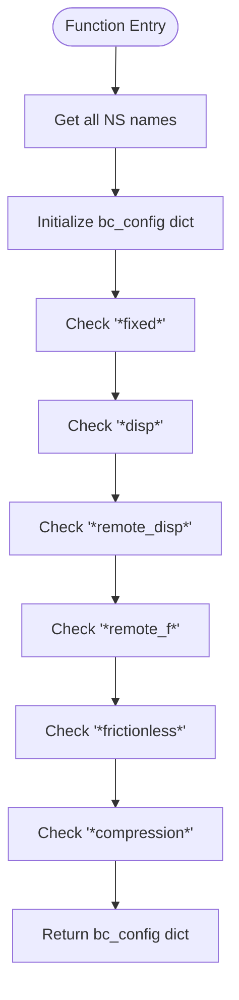
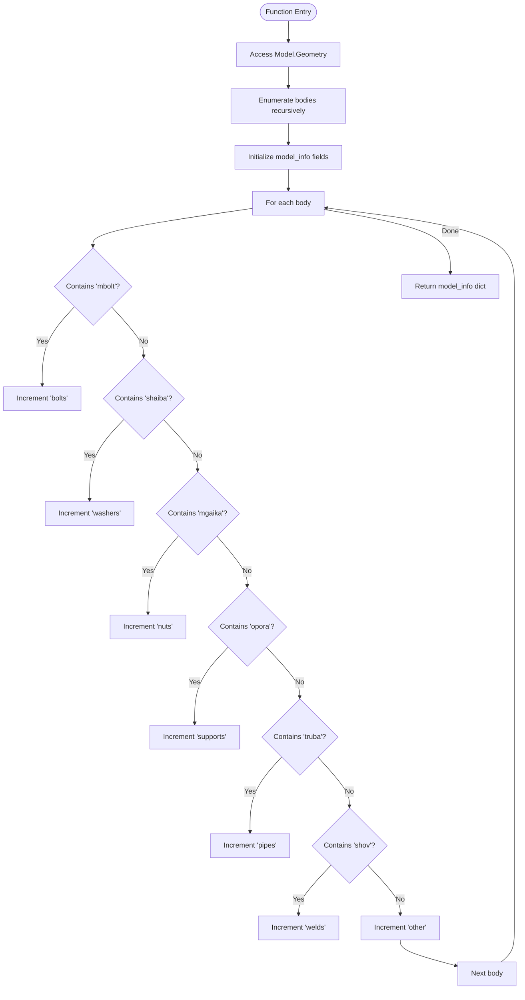
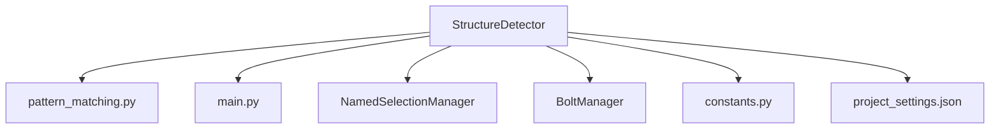

# StructureDetector Class

<cite>
**Referenced Files in This Document**
- [structure_detector.py](file://core/structure_detector.py)
- [pattern_matching.py](file://utils/pattern_matching.py)
- [main.py](file://main.py)
- [constants.py](file://config/constants.py)
- [project_settings.json](file://config_files/project_settings.json)
- [named_selection_manager.py](file://core/named_selection_manager.py)
- [bolt_manager.py](file://managers/bolt_manager.py)
- [validators.py](file://utils/validators.py)
</cite>

## Table of Contents
1. [Introduction](#introduction)
2. [Project Structure](#project-structure)
3. [Core Components](#core-components)
4. [Architecture Overview](#architecture-overview)
5. [Detailed Component Analysis](#detailed-component-analysis)
6. [Dependency Analysis](#dependency-analysis)
7. [Performance Considerations](#performance-considerations)
8. [Troubleshooting Guide](#troubleshooting-guide)
9. [Conclusion](#conclusion)
10. [Appendices](#appendices)

## Introduction
This document provides comprehensive API documentation for the StructureDetector class, focusing on its static methods that detect model characteristics from naming conventions. It explains:
- The static nature of the class and its role in structure type detection
- The STRUCTURE_PATTERNS dictionary and how it maps regex patterns to structure categories
- The algorithm used by detect_structure_type to match model names and return (structure_type, category)
- The analyze_ns_patterns method’s analysis of Named Selections using NS_ANALYSIS_PATTERNS for bolts, pressure, contact, remote, and supports
- The detect_load_configuration and detect_boundary_conditions methods and their return structures
- The get_model_info method’s comprehensive model inspection including body counts, types (bolts, washers, nuts, pipes, welds, supports, others), and materials
- Guidance on extending patterns for new structure types and troubleshooting detection failures

## Project Structure
StructureDetector resides in the core module and collaborates with utility functions for pattern matching and with the main application to integrate detection results into the automation workflow.

**Diagram sources**
- [structure_detector.py](file://core/structure_detector.py#L1-L158)
- [pattern_matching.py](file://utils/pattern_matching.py#L1-L71)
- [main.py](file://main.py#L60-L94)
- [named_selection_manager.py](file://core/named_selection_manager.py#L1-L190)
- [bolt_manager.py](file://managers/bolt_manager.py#L1-L68)
- [constants.py](file://config/constants.py#L1-L99)
- [project_settings.json](file://config_files/project_settings.json#L1-L56)
- [validators.py](file://utils/validators.py#L52-L91)

**Section sources**
- [structure_detector.py](file://core/structure_detector.py#L1-L158)
- [main.py](file://main.py#L60-L94)

## Core Components
- StructureDetector: Static class that encapsulates all detection logic for structure type, Named Selections analysis, load configuration, boundary conditions, and model information.
- Pattern Matching Utilities: Provides simple_pattern_match and match_any_pattern used by StructureDetector.
- Application Integration: The main application calls StructureDetector during initialization to set structure_type and structure_category, and to gather model_info and NS analysis.

Key responsibilities:
- Detect structure type from model name using regex patterns
- Analyze Named Selections for presence of bolts, pressure, contact, remote, and supports
- Detect load configuration and boundary conditions based on NS names
- Inspect model bodies and materials for comprehensive model information

**Section sources**
- [structure_detector.py](file://core/structure_detector.py#L1-L158)
- [pattern_matching.py](file://utils/pattern_matching.py#L1-L71)
- [main.py](file://main.py#L60-L94)

## Architecture Overview
StructureDetector participates in the application initialization phase, providing structure classification and model insights that drive downstream configuration loading and manager initialization.

**Diagram sources**
- [main.py](file://main.py#L64-L94)
- [structure_detector.py](file://core/structure_detector.py#L1-L158)
- [pattern_matching.py](file://utils/pattern_matching.py#L1-L71)

## Detailed Component Analysis

### Static Nature and Role
StructureDetector is a static class with all methods declared as @staticmethod. This design choice emphasizes pure functions that operate on global model state and shared utilities, avoiding instance state and simplifying integration into the automation pipeline.

- No constructor or instance variables
- Methods rely on global model accessors (Model.Name, Model.NamedSelections.Children, Model.Geometry)
- Uses utility functions for pattern matching

Benefits:
- Easy to call from anywhere in the application
- Stateless and deterministic given the same model state
- Minimal coupling to external state

**Section sources**
- [structure_detector.py](file://core/structure_detector.py#L1-L20)

### STRUCTURE_PATTERNS Dictionary
Purpose:
- Map regex patterns to structure categories (standard, custom, legacy, coded)
- Extract structure_type from model names using captured groups

Patterns and categories:
- Standard: Matches numeric prefixes with hyphenated segments ending with F-letter suffixes
- Custom: Matches prefixed identifiers with hyphenated segments ending with F-letter suffixes
- Legacy: Matches three-digit prefixes followed by underscore
- Coded: Matches uppercase alphabetic prefixes followed by underscore

Behavior:
- detect_structure_type iterates patterns in order and returns the first match with extracted structure_type and category
- Falls back to splitting the model name by hyphens and returning the first part with category "unknown" if no pattern matches

Return type:
- Tuple of (structure_type, structure_category)

Example expectations:
- "151-02-F2" -> ("151", "standard")
- "custom_001-01-F1" -> ("custom_001", "custom")
- "151_something" -> ("151", "legacy")
- "ABC_001" -> ("ABC", "coded")

**Section sources**
- [structure_detector.py](file://core/structure_detector.py#L12-L18)
- [structure_detector.py](file://core/structure_detector.py#L29-L51)

### detect_structure_type Algorithm
Algorithm steps:
1. Retrieve model name from global Model
2. Iterate over STRUCTURE_PATTERNS entries:
   - Compile regex and match against model name
   - On first match, capture group 1 as structure_type and return (structure_type, category)
3. If no match, split model name by "-" and return first part as structure_type with category "unknown"
4. If splitting fails, return ("default", "unknown")

Complexity:
- O(P) for pattern checks where P is number of patterns
- Regex matching is linear in model name length

Edge cases:
- Empty model name handled by fallback logic
- Patterns are ordered intentionally to prioritize specificity

**Section sources**
- [structure_detector.py](file://core/structure_detector.py#L29-L51)

### analyze_ns_patterns Analysis
Purpose:
- Analyze Named Selections to detect presence of bolts, pressure, contact, remote, and supports
- Provide total count and raw names for diagnostics

Workflow:
1. Collect all Named Selection names from Model.NamedSelections.Children
2. For each NS type, compute boolean flag using match_any_pattern against NS_ANALYSIS_PATTERNS
3. Add total_ns_count and ns_names to the result

Return structure (dictionary):
- Keys include "has_bolts", "has_pressure", "has_contact", "has_remote", "has_supports"
- Keys include "total_ns_count" and "ns_names"
- Values are booleans for flags and integers/arrays for counts and names

Integration:
- Called during application initialization to inform configuration loading and validation

**Section sources**
- [structure_detector.py](file://core/structure_detector.py#L53-L71)
- [pattern_matching.py](file://utils/pattern_matching.py#L47-L59)

### detect_load_configuration
Purpose:
- Detect load configuration based on Named Selections

Logic:
- Iterates over all Named Selection names
- Checks for presence of force, moment, pressure, temperature, and bearing loads using simple_pattern_match with wildcard patterns

Return structure (dictionary):
- Keys include "has_force_load", "has_moment_load", "has_pressure_load", "has_temperature_load", "has_bearing_load"
- Values are booleans indicating presence

Usage:
- Used by execution and analysis managers to configure load steps appropriately

**Section sources**
- [structure_detector.py](file://core/structure_detector.py#L73-L91)
- [pattern_matching.py](file://utils/pattern_matching.py#L8-L31)

### detect_boundary_conditions
Purpose:
- Detect boundary conditions based on Named Selections

Logic:
- Iterates over all Named Selection names
- Checks for presence of fixed support, displacement, remote displacement, remote force, frictionless, and compression-only supports using simple_pattern_match with wildcard patterns

Return structure (dictionary):
- Keys include "has_fixed_support", "has_displacement", "has_remote_displacement", "has_remote_force", "has_frictionless", "has_compression"
- Values are booleans indicating presence

Usage:
- Used by analysis managers to apply appropriate boundary conditions

**Section sources**
- [structure_detector.py](file://core/structure_detector.py#L93-L112)
- [pattern_matching.py](file://utils/pattern_matching.py#L8-L31)

### get_model_info Comprehensive Inspection
Purpose:
- Provide comprehensive model information for diagnostics and configuration decisions

Workflow:
1. Access Model.Geometry and enumerate bodies recursively
2. Build model_info with:
   - name
   - bodies_count
   - body_names
   - named_selections_count
   - material_count (if Materials exist)
3. Analyze body types by checking substrings in body names:
   - bolts (mbolt)
   - washers (shaiba)
   - nuts (mgaika)
   - supports (opora)
   - pipes (truba)
   - welds (shov)
   - others (default bucket)
4. Return model_info dictionary

Error handling:
- If geometry access fails, returns a dictionary with error message and name

Return structure (dictionary):
- Keys include "name", "bodies_count", "body_names", "named_selections_count", "material_count", "body_types"
- Values are strings, integers, lists, and nested dictionaries

**Section sources**
- [structure_detector.py](file://core/structure_detector.py#L114-L158)

### Integration with Application and Managers
- Application initialization:
  - Calls detect_structure_type, analyze_ns_patterns, and get_model_info early to set structure_type and structure_category and gather model_info
  - Uses structure_type to load structure-specific configuration
- Managers:
  - NamedSelectionManager uses similar pattern matching for validation and grouping
  - BoltManager uses pattern matching to detect and configure bolt-related Named Selections
  - ContactManager applies contact rules based on body names and patterns

**Section sources**
- [main.py](file://main.py#L64-L94)
- [named_selection_manager.py](file://core/named_selection_manager.py#L1-L190)
- [bolt_manager.py](file://managers/bolt_manager.py#L1-L68)

## Architecture Overview

**Diagram sources**
- [structure_detector.py](file://core/structure_detector.py#L1-L158)
- [pattern_matching.py](file://utils/pattern_matching.py#L1-L71)
- [named_selection_manager.py](file://core/named_selection_manager.py#L1-L190)
- [bolt_manager.py](file://managers/bolt_manager.py#L1-L68)

## Detailed Component Analysis

### detect_structure_type Flowchart

**Diagram sources**
- [structure_detector.py](file://core/structure_detector.py#L29-L51)

### analyze_ns_patterns Flowchart

**Diagram sources**
- [structure_detector.py](file://core/structure_detector.py#L53-L71)
- [pattern_matching.py](file://utils/pattern_matching.py#L47-L59)

### detect_load_configuration Flowchart

**Diagram sources**
- [structure_detector.py](file://core/structure_detector.py#L73-L91)
- [pattern_matching.py](file://utils/pattern_matching.py#L8-L31)

### detect_boundary_conditions Flowchart

**Diagram sources**
- [structure_detector.py](file://core/structure_detector.py#L93-L112)
- [pattern_matching.py](file://utils/pattern_matching.py#L8-L31)

### get_model_info Flowchart

**Diagram sources**
- [structure_detector.py](file://core/structure_detector.py#L114-L158)

## Dependency Analysis
- Internal dependencies:
  - StructureDetector depends on utils.pattern_matching for pattern matching helpers
  - StructureDetector relies on global Model accessors for names, geometry, and children collections
- External integrations:
  - Application initialization calls StructureDetector methods to bootstrap configuration
  - NamedSelectionManager and BoltManager reuse similar pattern matching for validation and configuration
- Configuration linkage:
  - Constants and project settings define default patterns and keywords used across the system

**Diagram sources**
- [structure_detector.py](file://core/structure_detector.py#L1-L158)
- [pattern_matching.py](file://utils/pattern_matching.py#L1-L71)
- [main.py](file://main.py#L60-L94)
- [named_selection_manager.py](file://core/named_selection_manager.py#L1-L190)
- [bolt_manager.py](file://managers/bolt_manager.py#L1-L68)
- [constants.py](file://config/constants.py#L1-L99)
- [project_settings.json](file://config_files/project_settings.json#L1-L56)

**Section sources**
- [structure_detector.py](file://core/structure_detector.py#L1-L158)
- [pattern_matching.py](file://utils/pattern_matching.py#L1-L71)
- [main.py](file://main.py#L60-L94)
- [named_selection_manager.py](file://core/named_selection_manager.py#L1-L190)
- [bolt_manager.py](file://managers/bolt_manager.py#L1-L68)
- [constants.py](file://config/constants.py#L1-L99)
- [project_settings.json](file://config_files/project_settings.json#L1-L56)

## Performance Considerations
- Pattern matching cost:
  - detect_structure_type performs O(P) regex checks with linear-time per pattern against model name length
  - analyze_ns_patterns performs O(N) checks across all Named Selections for each of the five NS types
  - detect_load_configuration and detect_boundary_conditions perform O(N) checks across all Named Selections
- Body enumeration cost:
  - get_model_info enumerates bodies recursively; complexity proportional to number of bodies
- Recommendations:
  - Keep pattern lists concise and ordered by specificity to minimize average checks
  - Cache repeated computations if called frequently in tight loops
  - Consider early exits when sufficient flags are determined

[No sources needed since this section provides general guidance]

## Troubleshooting Guide
Common issues and resolutions:
- No structure detected:
  - Verify model name follows one of the expected patterns or falls back to hyphen-splitting
  - Ensure Model.Name is accessible and not empty
- Missing Named Selections:
  - analyze_ns_patterns returns total_ns_count and ns_names; use these for diagnostics
  - Compare against expected patterns defined in NS_ANALYSIS_PATTERNS and project settings
- Incorrect load or BC detection:
  - Confirm NS names contain expected keywords; adjust patterns if needed
  - Use detect_load_configuration and detect_boundary_conditions to validate assumptions
- Model inspection errors:
  - get_model_info catches exceptions and returns an error field; inspect error message
  - Ensure Model.Geometry and Model.NamedSelections exist and are accessible

Extending patterns for new structure types:
- Add new regex to STRUCTURE_PATTERNS with a distinct category
- Ensure the pattern captures the structure identifier in group(1)
- Update fallback logic if necessary to handle edge cases

Extending NS analysis:
- Add new NS type under NS_ANALYSIS_PATTERNS with appropriate wildcard patterns
- Update callers to interpret new flags as needed

Validation utilities:
- Use validators to confirm model structure availability before detection

**Section sources**
- [structure_detector.py](file://core/structure_detector.py#L114-L158)
- [validators.py](file://utils/validators.py#L52-L91)

## Conclusion
StructureDetector provides a robust, static foundation for automated structure identification and model characterization. Its pattern-based detection integrates seamlessly with the application initialization, enabling structure-specific configuration loading and informed manager setup. By leveraging simple, maintainable regex and wildcard patterns, it offers extensible detection capabilities suitable for diverse modeling conventions while maintaining predictable performance and clear return structures.

[No sources needed since this section summarizes without analyzing specific files]

## Appendices

### Example Input Names and Expected Outputs
- Standard structure:
  - Input: "151-02-F2"
  - Output: (structure_type="151", category="standard")
- Custom structure:
  - Input: "custom_001-01-F1"
  - Output: (structure_type="custom_001", category="custom")
- Legacy structure:
  - Input: "151_something"
  - Output: (structure_type="151", category="legacy")
- Coded structure:
  - Input: "ABC_001"
  - Output: (structure_type="ABC", category="coded")
- Unknown structure:
  - Input: "anything_else"
  - Output: (structure_type="anything", category="unknown")

[No sources needed since this section provides illustrative examples]