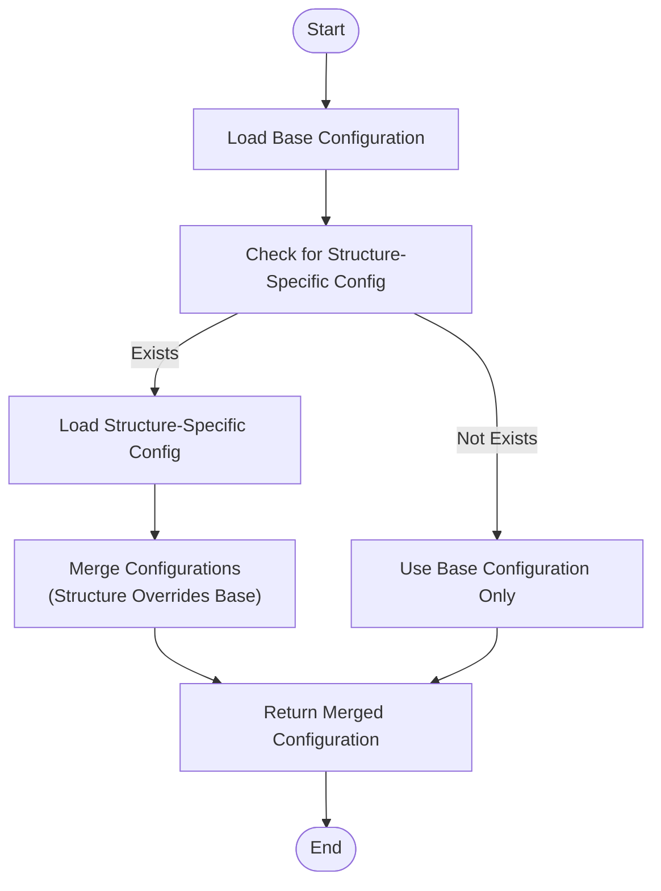
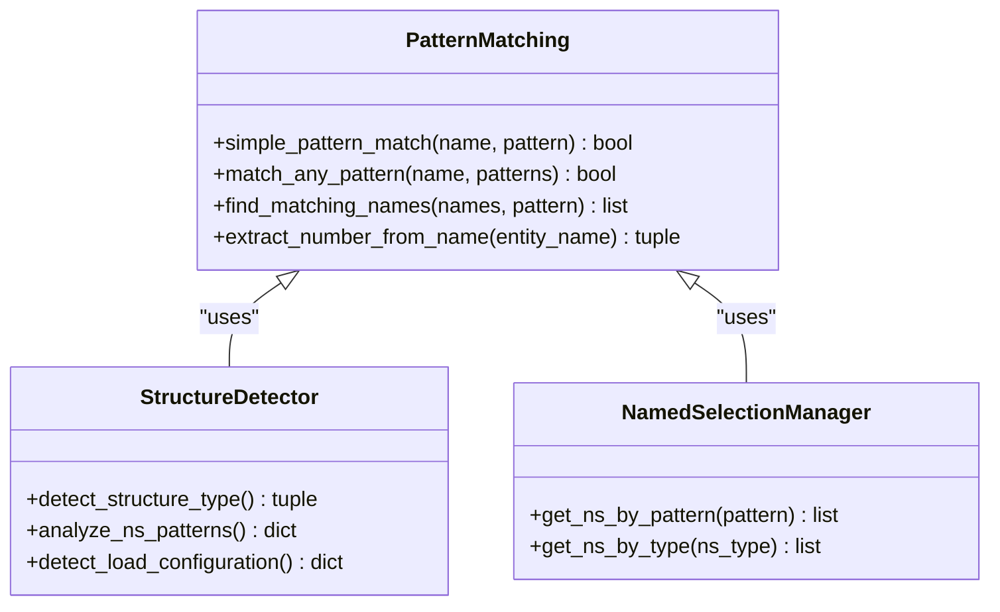
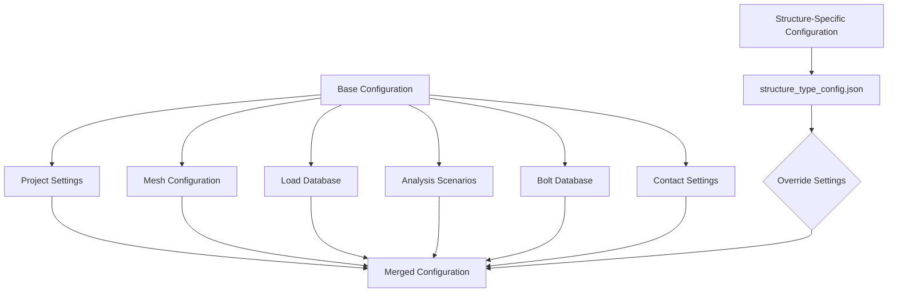
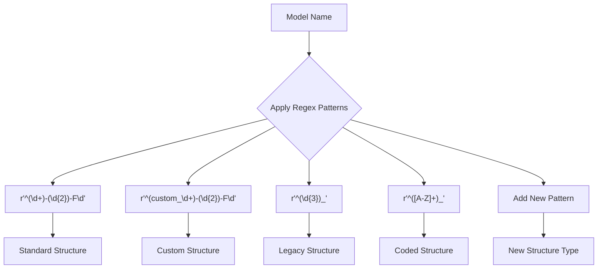
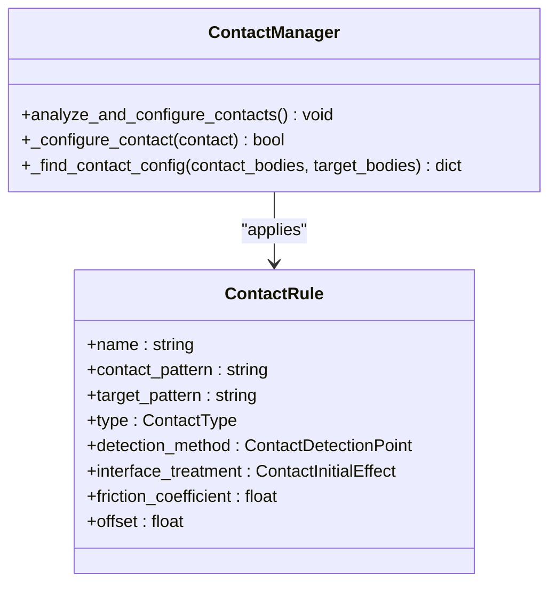
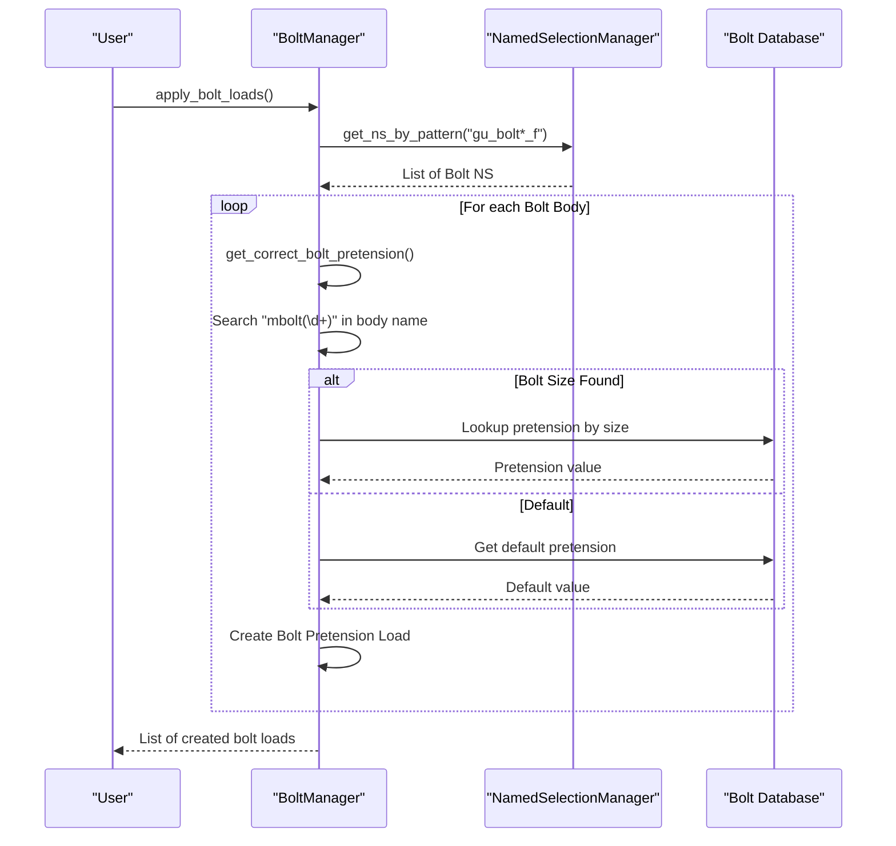
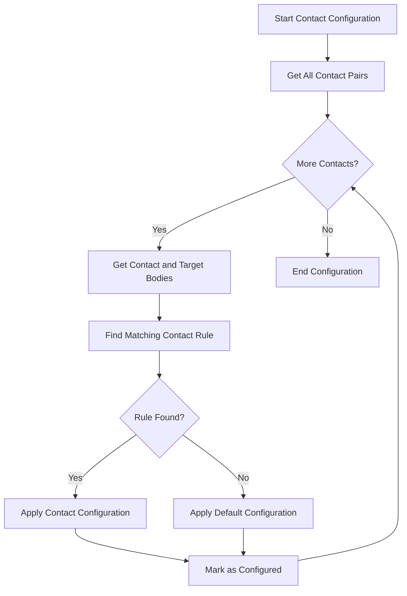
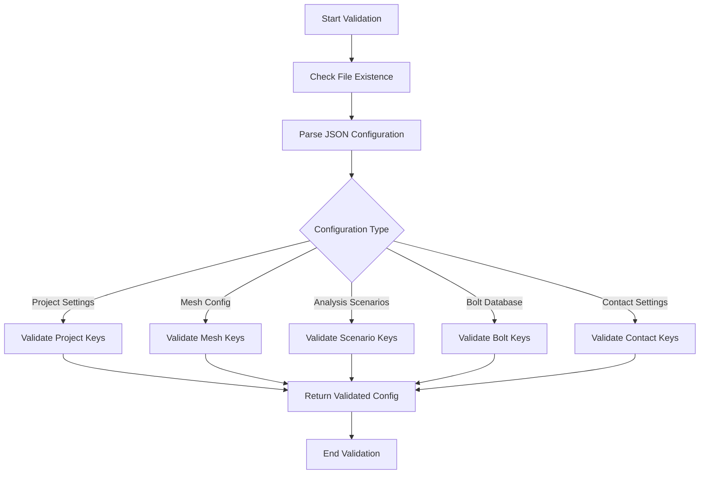

# Advanced Customization

<cite>
**Referenced Files in This Document**   
- [structure_detector.py](file://core/structure_detector.py)
- [pattern_matching.py](file://utils/pattern_matching.py)
- [config_manager.py](file://config/config_manager.py)
- [named_selection_manager.py](file://core/named_selection_manager.py)
- [bolt_manager.py](file://managers/bolt_manager.py)
- [contact_manager.py](file://managers/contact_manager.py)
- [analysis_manager.py](file://managers/analysis_manager.py)
- [project_settings.json](file://config_files/project_settings.json)
- [contact_settings.json](file://config_files/contact_settings.json)
- [bolt_database.json](file://config_files/bolt_database.json)
</cite>

## Table of Contents
1. [Introduction](#introduction)
2. [Structure Type Detection and Configuration](#structure-type-detection-and-configuration)
3. [Pattern Matching System](#pattern-matching-system)
4. [Custom Configuration Files](#custom-configuration-files)
5. [Extending Detection Patterns](#extending-detection-patterns)
6. [Manager Class Customization](#manager-class-customization)
7. [Testing and Validation](#testing-and-validation)
8. [Best Practices for Collaboration](#best-practices-for-collaboration)

## Introduction
This document provides comprehensive guidance on advanced customization capabilities within the AnsysAutomation system. It details how to extend the system for new structure types, modify detection patterns, and enhance manager functionality. The system supports flexible configuration through JSON files and extensible Python classes, enabling users to adapt the automation framework to specialized analysis requirements without modifying core code.

## Structure Type Detection and Configuration

The system uses a hierarchical configuration approach where structure-specific settings can override base configurations. The `ConfigurationManager` class handles loading and merging of configurations, with structure-specific files taking precedence over default settings.

**Diagram sources**
- [config_manager.py](file://config/config_manager.py#L119-L159)

**Section sources**
- [config_manager.py](file://config/config_manager.py#L119-L159)

## Pattern Matching System

The pattern matching system provides flexible string matching capabilities without requiring external dependencies. The `simple_pattern_match` function supports wildcard matching with the asterisk (*) character, enabling pattern-based detection of model components.

**Diagram sources**
- [pattern_matching.py](file://utils/pattern_matching.py#L8-L71)
- [structure_detector.py](file://core/structure_detector.py#L29-L115)
- [named_selection_manager.py](file://core/named_selection_manager.py#L39-L57)

**Section sources**
- [pattern_matching.py](file://utils/pattern_matching.py#L8-L71)
- [structure_detector.py](file://core/structure_detector.py#L6-L158)
- [named_selection_manager.py](file://core/named_selection_manager.py#L6-L190)

## Custom Configuration Files

Structure-specific configuration files allow overriding base settings for specialized analysis requirements. These files follow the naming convention `structure_{structure_type}_config.json` and are located in the configuration directory.

### Configuration Hierarchy
The system follows a specific hierarchy when loading configurations:
1. Load base configuration files
2. Check for structure-specific configuration
3. Merge configurations with structure-specific settings taking precedence

**Diagram sources**
- [config_manager.py](file://config/config_manager.py#L119-L159)
- [paths.py](file://config/paths.py#L32-L43)

**Section sources**
- [config_manager.py](file://config/config_manager.py#L119-L159)
- [paths.py](file://config/paths.py#L32-L43)

## Extending Detection Patterns

### Modifying Structure Detection
The `StructureDetector` class uses regex patterns to identify structure types from model names. New patterns can be added to the `STRUCTURE_PATTERNS` dictionary to recognize additional structure types.

**Diagram sources**
- [structure_detector.py](file://core/structure_detector.py#L13-L18)

**Section sources**
- [structure_detector.py](file://core/structure_detector.py#L13-L51)

### Customizing Contact Detection
Contact detection rules are defined in the `contact_settings.json` file and can be extended to handle new component types. Each rule specifies contact and target patterns, contact type, and associated properties.

**Diagram sources**
- [contact_manager.py](file://managers/contact_manager.py#L60-L75)
- [contact_settings.json](file://config_files/contact_settings.json#L2-L130)

**Section sources**
- [contact_manager.py](file://managers/contact_manager.py#L8-L96)
- [contact_settings.json](file://config_files/contact_settings.json#L2-L130)

## Manager Class Customization

### Bolt Manager Extension
The `BoltManager` class can be extended to support new bolt detection patterns and pretension calculation methods. The system automatically detects bolt bodies based on naming conventions and retrieves appropriate pretension values from the bolt database.

**Diagram sources**
- [bolt_manager.py](file://managers/bolt_manager.py#L17-L68)
- [named_selection_manager.py](file://core/named_selection_manager.py#L39-L57)

**Section sources**
- [bolt_manager.py](file://managers/bolt_manager.py#L9-L68)

### Contact Manager Enhancement
The `ContactManager` class can be customized to implement new contact configuration logic. The system evaluates contact pairs based on body naming patterns and applies appropriate settings from the contact rules.

**Diagram sources**
- [contact_manager.py](file://managers/contact_manager.py#L14-L37)
- [contact_settings.json](file://config_files/contact_settings.json#L2-L130)

**Section sources**
- [contact_manager.py](file://managers/contact_manager.py#L8-L96)

## Testing and Validation

### Configuration Validation
The system includes comprehensive validation mechanisms to ensure configuration integrity. The `ConfigurationManager` validates required keys in configuration files, while the `validators.py` module provides additional validation functions.

**Diagram sources**
- [config_manager.py](file://config/config_manager.py#L52-L72)
- [validators.py](file://utils/validators.py#L26-L49)

**Section sources**
- [config_manager.py](file://config/config_manager.py#L52-L72)
- [validators.py](file://utils/validators.py#L6-L161)

## Best Practices for Collaboration

### Version Control Strategy
When working with custom configurations, follow these version control best practices:
- Store configuration files in version control
- Use descriptive names for structure-specific configurations
- Document changes to detection patterns
- Maintain backward compatibility when possible

### Team Collaboration Guidelines
For effective collaboration across engineering teams:
- Establish naming conventions for new structure types
- Create shared documentation for custom configurations
- Implement peer review for pattern modifications
- Test changes in isolated environments before deployment
- Maintain a registry of structure types and their configurations

**Section sources**
- [config_manager.py](file://config/config_manager.py#L119-L159)
- [structure_detector.py](file://core/structure_detector.py#L13-L18)
- [contact_settings.json](file://config_files/contact_settings.json#L2-L130)
- [bolt_database.json](file://config_files/bolt_database.json#L1-L47)
- [project_settings.json](file://config_files/project_settings.json#L1-L56)