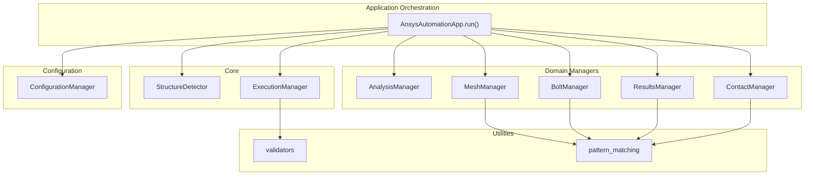
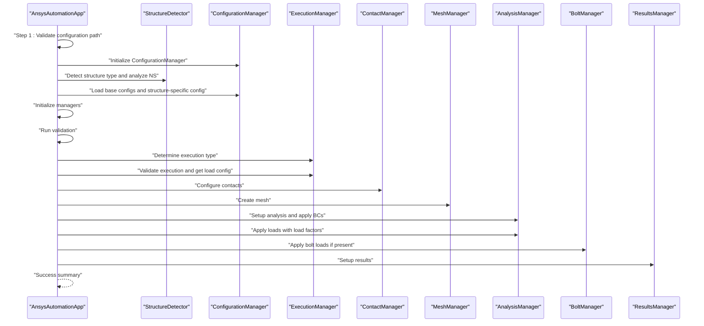
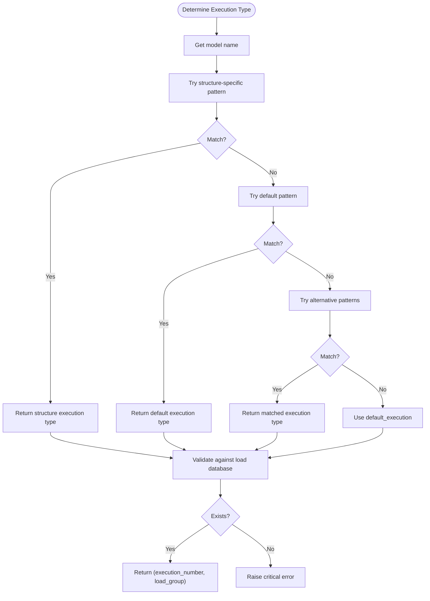
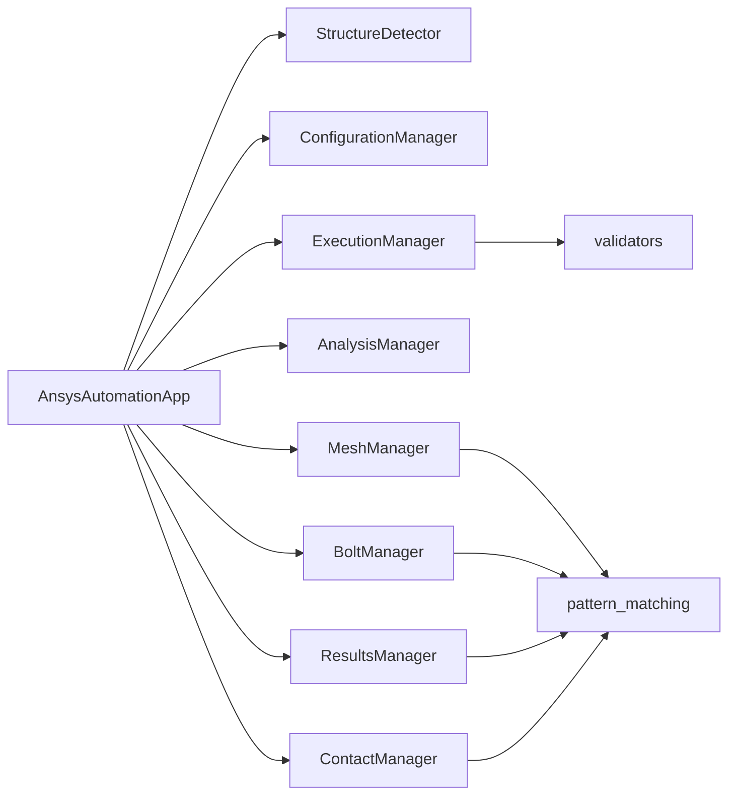
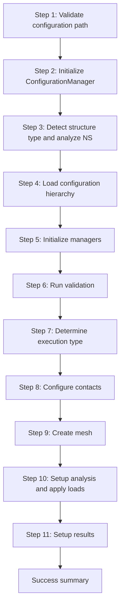

# Analysis Setup Workflow

<cite>
**Referenced Files in This Document**
- [main.py](file://main.py)
- [core/execution_manager.py](file://core/execution_manager.py)
- [core/structure_detector.py](file://core/structure_detector.py)
- [managers/analysis_manager.py](file://managers/analysis_manager.py)
- [managers/bolt_manager.py](file://managers/bolt_manager.py)
- [managers/contact_manager.py](file://managers/contact_manager.py)
- [managers/mesh_manager.py](file://managers/mesh_manager.py)
- [managers/results_manager.py](file://managers/results_manager.py)
- [config/config_manager.py](file://config/config_manager.py)
- [utils/validators.py](file://utils/validators.py)
- [utils/pattern_matching.py](file://utils/pattern_matching.py)
- [config_files/project_settings.json](file://config_files/project_settings.json)
- [config_files/analysis_scenarios.json](file://config_files/analysis_scenarios.json)
- [config_files/load_database.json](file://config_files/load_database.json)
</cite>

## Table of Contents
1. [Introduction](#introduction)
2. [Project Structure](#project-structure)
3. [Core Components](#core-components)
4. [Architecture Overview](#architecture-overview)
5. [Detailed Component Analysis](#detailed-component-analysis)
6. [Dependency Analysis](#dependency-analysis)
7. [Performance Considerations](#performance-considerations)
8. [Troubleshooting Guide](#troubleshooting-guide)
9. [Conclusion](#conclusion)
10. [Appendices](#appendices)

## Introduction
This document explains the complete analysis setup workflow orchestrated by AnsysAutomationApp. It details the 11-step process from application initialization through final setup completion, including configuration path validation, configuration manager initialization, structure type detection, configuration loading, manager initialization, validation, execution type determination, contact configuration, mesh creation, analysis parameter setup, load application, bolt load setup, and results configuration. It also provides a timeline diagram, practical examples for different execution types, error handling strategies, adaptability based on model characteristics, performance optimization opportunities, and guidance for monitoring progress via console output.

## Project Structure
The workflow spans several modules:
- Application orchestration: AnsysAutomationApp
- Core managers: ExecutionManager, StructureDetector
- Domain managers: AnalysisManager, BoltManager, ContactManager, MeshManager, ResultsManager
- Configuration: ConfigurationManager and JSON configuration files
- Utilities: validators and pattern matching

**Diagram sources**
- [main.py](file://main.py#L210-L248)
- [core/structure_detector.py](file://core/structure_detector.py#L1-L158)
- [core/execution_manager.py](file://core/execution_manager.py#L1-L154)
- [managers/analysis_manager.py](file://managers/analysis_manager.py#L1-L116)
- [managers/bolt_manager.py](file://managers/bolt_manager.py#L1-L68)
- [managers/contact_manager.py](file://managers/contact_manager.py#L1-L96)
- [managers/mesh_manager.py](file://managers/mesh_manager.py#L1-L104)
- [managers/results_manager.py](file://managers/results_manager.py#L1-L62)
- [config/config_manager.py](file://config/config_manager.py#L1-L209)
- [utils/validators.py](file://utils/validators.py#L1-L161)
- [utils/pattern_matching.py](file://utils/pattern_matching.py#L1-L71)

**Section sources**
- [main.py](file://main.py#L210-L248)
- [config/config_manager.py](file://config/config_manager.py#L1-L209)

## Core Components
- AnsysAutomationApp: Orchestrates the 11-step workflow, initializes managers, validates configuration, determines execution type, applies loads and contacts, creates mesh, sets up analysis, handles bolt loads, and configures results.
- StructureDetector: Determines structure type and category from model name and analyzes Named Selection patterns.
- ConfigurationManager: Loads and merges configuration files, validates structure-specific overrides, and validates the configuration hierarchy.
- ExecutionManager: Determines execution type from model name, validates against load database, and builds load configuration.
- AnalysisManager: Sets analysis parameters, applies boundary conditions, and applies loads with step-wise load factors.
- MeshManager: Applies mesh settings per Named Selection, skipping load/BC NS and bolt patterns.
- ContactManager: Automatically configures contact pairs and applies contact rules.
- BoltManager: Detects bolts, computes pretension, and applies bolt loads with step configuration.
- ResultsManager: Creates deformation and stress results for important Named Selections.

**Section sources**
- [main.py](file://main.py#L27-L209)
- [core/structure_detector.py](file://core/structure_detector.py#L1-L158)
- [config/config_manager.py](file://config/config_manager.py#L1-L209)
- [core/execution_manager.py](file://core/execution_manager.py#L1-L154)
- [managers/analysis_manager.py](file://managers/analysis_manager.py#L1-L116)
- [managers/mesh_manager.py](file://managers/mesh_manager.py#L1-L104)
- [managers/contact_manager.py](file://managers/contact_manager.py#L1-L96)
- [managers/bolt_manager.py](file://managers/bolt_manager.py#L1-L68)
- [managers/results_manager.py](file://managers/results_manager.py#L1-L62)

## Architecture Overview
The workflow is a linear pipeline executed by AnsysAutomationApp.run(). Each step prints progress to the console and either succeeds or raises exceptions. Warnings are printed for recoverable issues; critical errors halt execution.

**Diagram sources**
- [main.py](file://main.py#L51-L209)
- [core/structure_detector.py](file://core/structure_detector.py#L1-L158)
- [config/config_manager.py](file://config/config_manager.py#L1-L209)
- [core/execution_manager.py](file://core/execution_manager.py#L1-L154)
- [managers/contact_manager.py](file://managers/contact_manager.py#L1-L96)
- [managers/mesh_manager.py](file://managers/mesh_manager.py#L1-L104)
- [managers/analysis_manager.py](file://managers/analysis_manager.py#L1-L116)
- [managers/bolt_manager.py](file://managers/bolt_manager.py#L1-L68)
- [managers/results_manager.py](file://managers/results_manager.py#L1-L62)

## Detailed Component Analysis

### 1. Configuration Path Validation
- Purpose: Ensures configuration directory exists and is accessible.
- Implementation: Calls a path validator before proceeding.
- Console output: Prints step number and success message.
- Error handling: Non-recoverable; halts initialization if path is invalid.

**Section sources**
- [main.py](file://main.py#L51-L67)

### 2. Configuration Manager Initialization
- Purpose: Instantiate ConfigurationManager to manage configuration loading and merging.
- Implementation: Creates ConfigurationManager instance.
- Console output: Prints step number and success message.

**Section sources**
- [main.py](file://main.py#L63-L67)
- [config/config_manager.py](file://config/config_manager.py#L1-L40)

### 3. Structure Type Detection
- Purpose: Determine structure type and category from model name; analyze Named Selection patterns; gather model info.
- Implementation: Uses StructureDetector to parse model name and NS patterns; collects body counts and material info.
- Console output: Prints structure type, category, model name, bodies count, and Named Selections count.

**Section sources**
- [main.py](file://main.py#L68-L78)
- [core/structure_detector.py](file://core/structure_detector.py#L1-L158)

### 4. Configuration Loading
- Purpose: Load base configuration files and structure-specific overrides.
- Implementation: Loads project settings, mesh config, load database, analysis scenarios, bolt database, and contact settings; merges structure-specific config with base if present; selects structure-specific load database if provided.
- Console output: Indicates whether structure-specific or base configuration is used.

**Section sources**
- [main.py](file://main.py#L94-L121)
- [config/config_manager.py](file://config/config_manager.py#L73-L117)
- [config/config_manager.py](file://config/config_manager.py#L119-L160)

### 5. Manager Initialization
- Purpose: Initialize domain managers with loaded configurations.
- Implementation: Creates NamedSelectionManager, ExecutionManager, MeshManager, AnalysisManager, BoltManager, ContactManager, ResultsManager.
- Console output: Prints step number and success message.

**Section sources**
- [main.py](file://main.py#L122-L131)
- [managers/analysis_manager.py](file://managers/analysis_manager.py#L1-L27)
- [managers/bolt_manager.py](file://managers/bolt_manager.py#L1-L22)
- [managers/contact_manager.py](file://managers/contact_manager.py#L1-L37)
- [managers/mesh_manager.py](file://managers/mesh_manager.py#L1-L39)
- [managers/results_manager.py](file://managers/results_manager.py#L1-L31)

### 6. Validation
- Purpose: Validate Named Selections presence, model structure, and configuration hierarchy.
- Implementation: Checks required NS presence; validates configuration hierarchy; reports missing files as warnings.
- Console output: Prints validation outcomes; continues despite warnings.

**Section sources**
- [main.py](file://main.py#L132-L159)
- [utils/validators.py](file://utils/validators.py#L68-L92)
- [config/config_manager.py](file://config/config_manager.py#L181-L209)

### 7. Execution Type Determination
- Purpose: Determine execution type from model name using structured patterns and fallbacks; validate against load database; build load configuration.
- Implementation: ExecutionManager determines execution type via model name patterns; validates against load database; constructs load configuration including forces, moments, and load factors.
- Console output: Prints execution type, number, and load group.

**Diagram sources**
- [core/execution_manager.py](file://core/execution_manager.py#L16-L59)
- [core/execution_manager.py](file://core/execution_manager.py#L61-L107)
- [utils/validators.py](file://utils/validators.py#L133-L161)

**Section sources**
- [main.py](file://main.py#L160-L171)
- [core/execution_manager.py](file://core/execution_manager.py#L16-L107)
- [utils/validators.py](file://utils/validators.py#L133-L161)

### 8. Contact Configuration
- Purpose: Automatically configure contact pairs and apply contact rules based on body patterns.
- Implementation: Iterates connection groups, renames and configures contact regions according to contact settings rules.
- Console output: Prints number of configured contact pairs; logs warnings for partial failures.

**Section sources**
- [main.py](file://main.py#L172-L176)
- [managers/contact_manager.py](file://managers/contact_manager.py#L1-L96)
- [config_files/contact_settings.json](file://config_files/contact_settings.json#L1-L200)

### 9. Mesh Creation
- Purpose: Apply mesh settings per Named Selection while excluding load/BC and bolt-related NS.
- Implementation: Computes element size from extracted dimension and mesh coefficient; applies sizing and automatic method; generates mesh.
- Console output: Prints step number and success message; logs warnings per NS failure.

**Section sources**
- [main.py](file://main.py#L177-L181)
- [managers/mesh_manager.py](file://managers/mesh_manager.py#L1-L104)
- [utils/pattern_matching.py](file://utils/pattern_matching.py#L1-L71)

### 10. Analysis Parameter Setup
- Purpose: Configure analysis settings and apply boundary conditions.
- Implementation: Sets steps, large deflection, Newton-Raphson option, nodal forces, and miscellaneous options; applies fixed support, displacement, remote displacement, and remote force if configured.
- Console output: Prints step number and success message.

**Section sources**
- [main.py](file://main.py#L182-L198)
- [managers/analysis_manager.py](file://managers/analysis_manager.py#L1-L27)
- [managers/analysis_manager.py](file://managers/analysis_manager.py#L28-L59)
- [config_files/analysis_scenarios.json](file://config_files/analysis_scenarios.json#L1-L55)

### 11. Load Application and Bolt Load Setup
- Purpose: Apply loads with step-wise load factors and handle bolt loads.
- Implementation: Applies force, moment, and optional pressure loads; if bolts detected, applies bolt pretension at step 0 and locks at subsequent steps; adjusts time steps accordingly.
- Console output: Prints step number and success message; logs warnings for bolt load failures.

**Section sources**
- [main.py](file://main.py#L182-L198)
- [managers/analysis_manager.py](file://managers/analysis_manager.py#L60-L116)
- [managers/bolt_manager.py](file://managers/bolt_manager.py#L1-L68)

### Results Configuration
- Purpose: Configure results including total deformation and stress intensity/shear stress for important Named Selections.
- Implementation: Creates total deformation; iterates NS and creates stress results based on keywords and exclusions.
- Console output: Prints step number and success message.

**Section sources**
- [main.py](file://main.py#L199-L203)
- [managers/results_manager.py](file://managers/results_manager.py#L1-L62)

## Dependency Analysis
- Coupling: AnsysAutomationApp orchestrates all managers and depends on ConfigurationManager and StructureDetector. Managers depend on shared utilities and configuration.
- Cohesion: Each manager encapsulates a domain concern (mesh, contact, analysis, bolt, results).
- External dependencies: IronPython runtime for ANSYS automation APIs; JSON configuration files.

**Diagram sources**
- [main.py](file://main.py#L27-L131)
- [core/structure_detector.py](file://core/structure_detector.py#L1-L158)
- [config/config_manager.py](file://config/config_manager.py#L1-L209)
- [core/execution_manager.py](file://core/execution_manager.py#L1-L154)
- [managers/analysis_manager.py](file://managers/analysis_manager.py#L1-L116)
- [managers/bolt_manager.py](file://managers/bolt_manager.py#L1-L68)
- [managers/contact_manager.py](file://managers/contact_manager.py#L1-L96)
- [managers/mesh_manager.py](file://managers/mesh_manager.py#L1-L104)
- [managers/results_manager.py](file://managers/results_manager.py#L1-L62)
- [utils/validators.py](file://utils/validators.py#L1-L161)
- [utils/pattern_matching.py](file://utils/pattern_matching.py#L1-L71)

**Section sources**
- [main.py](file://main.py#L27-L131)
- [utils/validators.py](file://utils/validators.py#L1-L161)
- [utils/pattern_matching.py](file://utils/pattern_matching.py#L1-L71)

## Performance Considerations
- Mesh generation: Iterates all Named Selections; skip load/BC and bolt NS to reduce unnecessary mesh operations.
- Pattern matching: Uses simple wildcard matching and regex extraction; keep patterns concise to minimize overhead.
- Load application: Applies loads per component with discrete time steps; avoid excessive steps for quick checks.
- Contact configuration: Automatic connections and rule-based configuration; ensure contact rules are minimal and targeted.
- Logging: Excessive warnings can slow down console output; consider reducing verbosity in production runs.

[No sources needed since this section provides general guidance]

## Troubleshooting Guide
- Critical errors:
  - Execution type determination fails: Raised when model name does not match any pattern and default fallback is unavailable.
  - Configuration validation failures: Raised when required keys are missing or files are not found.
  - Model structure validation failures: Raised when Model, Geometry, or NamedSelections are not available.
- Warnings:
  - Missing configuration files: Reported as warnings during validation; workflow continues.
  - Mesh creation failures per NS: Logged as warnings; mesh generation continues.
  - Contact configuration errors: Logged as warnings; partially configured contacts may still be applied.
  - Bolt load application failures: Logged as warnings; bolt loads are skipped for problematic NS.
- Console monitoring:
  - Each step prints a header indicating the operation.
  - Success summaries print structure type, execution type, and load group.
  - Critical errors print a formatted error block and halt execution.

**Section sources**
- [core/execution_manager.py](file://core/execution_manager.py#L16-L59)
- [utils/validators.py](file://utils/validators.py#L133-L161)
- [config/config_manager.py](file://config/config_manager.py#L181-L209)
- [managers/mesh_manager.py](file://managers/mesh_manager.py#L31-L39)
- [managers/contact_manager.py](file://managers/contact_manager.py#L38-L40)
- [managers/bolt_manager.py](file://managers/bolt_manager.py#L62-L68)
- [main.py](file://main.py#L234-L248)

## Conclusion
The analysis setup workflow is a robust, configurable pipeline that adapts to model characteristics and configuration settings. It balances automation with safety by reporting warnings and raising critical errors only when essential prerequisites are missing. By following the 11-step process and leveraging the provided managers, users can reliably set up structural analyses with contacts, mesh, loads, and results.

[No sources needed since this section summarizes without analyzing specific files]

## Appendices

### Practical Examples: Execution Types and Adaptations
- Static structural execution:
  - Model name pattern: Matches a static structural execution type; applies standard sequence with multiple load factors and bolt pretension if present.
  - Configuration: Uses project settings, analysis scenarios, and load database entries for the determined execution number and load group.
- Thermal execution:
  - Model name pattern: Matches a thermal execution type; load database entries define temperature loads or pressure loads depending on configuration.
  - Configuration: Analysis scenarios adjust steps and load factors; results manager creates appropriate stress results for thermal cases.
- Quick check execution:
  - Model name pattern: Matches a quick check execution type; fewer steps and load factors are applied for rapid assessment.
- Pretension-only execution:
  - Model name pattern: Matches a pretension-only execution type; analysis runs with only bolt pretension step.

**Section sources**
- [core/execution_manager.py](file://core/execution_manager.py#L16-L107)
- [config_files/analysis_scenarios.json](file://config_files/analysis_scenarios.json#L1-L55)
- [config_files/load_database.json](file://config_files/load_database.json#L1-L200)
- [config_files/project_settings.json](file://config_files/project_settings.json#L1-L56)

### Timeline Diagram: End-to-End Workflow

**Diagram sources**
- [main.py](file://main.py#L51-L209)