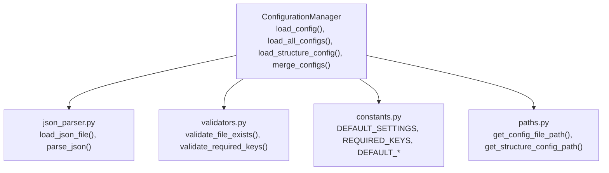
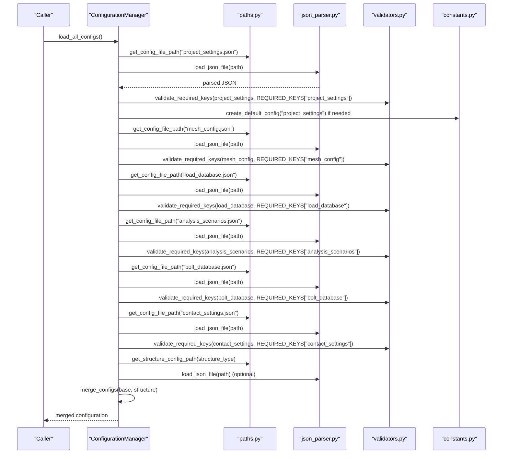
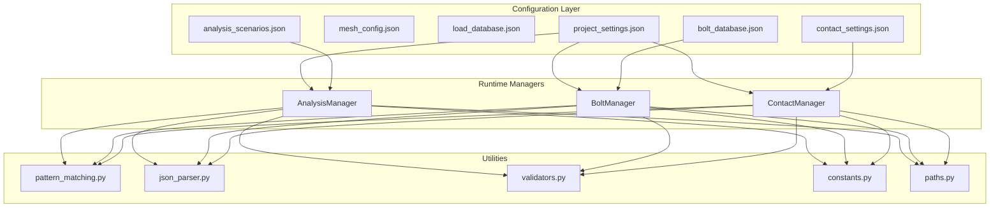
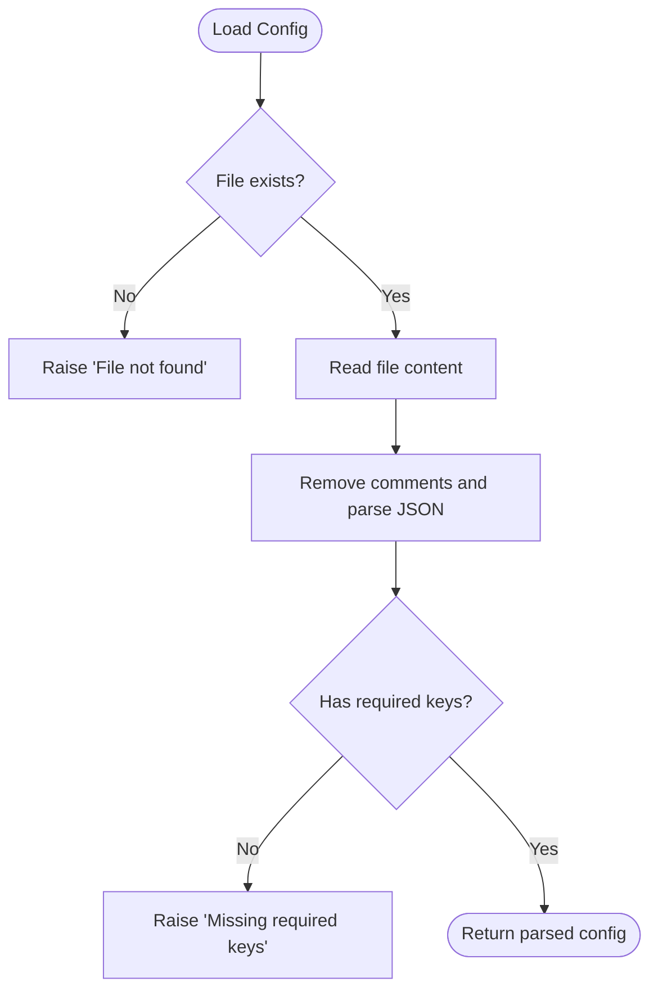
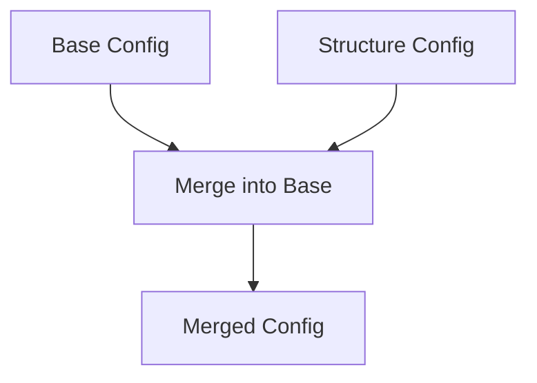

# Configuration File Reference

<cite>
**Referenced Files in This Document**
- [project_settings.json](file://config_files/project_settings.json)
- [mesh_config.json](file://config_files/mesh_config.json)
- [load_database.json](file://config_files/load_database.json)
- [analysis_scenarios.json](file://config_files/analysis_scenarios.json)
- [bolt_database.json](file://config_files/bolt_database.json)
- [contact_settings.json](file://config_files/contact_settings.json)
- [config_manager.py](file://config/config_manager.py)
- [constants.py](file://config/constants.py)
- [paths.py](file://config/paths.py)
- [json_parser.py](file://utils/json_parser.py)
- [validators.py](file://utils/validators.py)
- [pattern_matching.py](file://utils/pattern_matching.py)
- [analysis_manager.py](file://managers/analysis_manager.py)
- [bolt_manager.py](file://managers/bolt_manager.py)
- [contact_manager.py](file://managers/contact_manager.py)
</cite>

## Table of Contents
1. [Introduction](#introduction)
2. [Project Structure](#project-structure)
3. [Core Components](#core-components)
4. [Architecture Overview](#architecture-overview)
5. [Detailed Component Analysis](#detailed-component-analysis)
6. [Dependency Analysis](#dependency-analysis)
7. [Performance Considerations](#performance-considerations)
8. [Troubleshooting Guide](#troubleshooting-guide)
9. [Conclusion](#conclusion)
10. [Appendices](#appendices)

## Introduction
This document provides a comprehensive reference for all configuration files used in the AnsysAutomation system. It covers the schema, purpose, and usage of each JSON configuration file, including:
- project_settings.json (global parameters and defaults)
- mesh_config.json (mesh sizing rules and methods)
- load_database.json (load factors and boundary conditions)
- analysis_scenarios.json (analysis sequence definitions)
- bolt_database.json (bolt diameter and pretension values)
- contact_settings.json (contact rule configurations)

It also explains how structure-specific configuration files extend and override base settings, documents the file loading mechanism and error handling for malformed JSON or missing required fields, and provides guidance on creating new configuration entries while maintaining backward compatibility. Security considerations for configuration files containing proprietary engineering data are addressed.

## Project Structure
Configuration files are stored under the config_files directory and are loaded by the ConfigurationManager, which orchestrates validation, merging, and default creation. The system uses a strict hierarchy:
- Base configuration files are mandatory and define global defaults.
- Optional structure-specific configuration files can override base settings.

**Diagram sources**
- [config_manager.py](file://config/config_manager.py#L26-L118)
- [json_parser.py](file://utils/json_parser.py#L142-L170)
- [validators.py](file://utils/validators.py#L9-L24)
- [constants.py](file://config/constants.py#L35-L42)
- [paths.py](file://config/paths.py#L20-L44)

**Section sources**
- [paths.py](file://config/paths.py#L10-L44)
- [config_manager.py](file://config/config_manager.py#L26-L118)

## Core Components
- Configuration Manager: Loads, validates, merges, and creates defaults for configuration files.
- JSON Parser: Loads and parses JSON with comment removal and IronPython compatibility.
- Validators: Enforces presence of required keys and validates structures.
- Constants: Provides default values and required key sets.
- Managers: Consume configuration to set up analysis, bolt loads, and contact pairs.

**Section sources**
- [config_manager.py](file://config/config_manager.py#L26-L118)
- [json_parser.py](file://utils/json_parser.py#L142-L170)
- [validators.py](file://utils/validators.py#L26-L51)
- [constants.py](file://config/constants.py#L35-L42)

## Architecture Overview
The configuration loading and merging flow is as follows:
- ConfigurationManager resolves file paths and loads each base configuration.
- Each file is validated against required keys.
- Optional structure-specific configuration is loaded and merged into the base configuration (structure-specific values take precedence).
- Defaults are created for missing configuration types.

**Diagram sources**
- [config_manager.py](file://config/config_manager.py#L73-L118)
- [paths.py](file://config/paths.py#L20-L44)
- [json_parser.py](file://utils/json_parser.py#L142-L170)
- [validators.py](file://utils/validators.py#L26-L51)
- [constants.py](file://config/constants.py#L161-L180)

## Detailed Component Analysis

### project_settings.json
Purpose: Defines global project metadata, execution patterns, boundary condition and load named selection keys, mesh defaults, solution settings, and units.

Schema overview:
- project: name, version, description
- execution: name_pattern, default_execution, validation: require_bolt_ns, min_bolts_count
- boundary_conditions: fixed_support, displacement, remote_displacement, remote_force, frictionless_support, compression_only
- loads: force, moment, pressure, bearing, remote_force, bolt_pattern, temperature
- mesh_settings: default_element_order, result_keywords, exclude_patterns, sweep_algorithm
- solution_settings: newton_raphson_residuals, identify_element_violations, default_results, stress_results: shov, default, stress_averaging
- units: force, moment, pressure, length, time

Usage:
- Used by AnalysisManager to configure boundary conditions and load named selections.
- Used by BoltManager to detect bolt patterns and by ContactManager to match contact rules.

Example reference:
- See [project_settings.json](file://config_files/project_settings.json#L1-L56)

Default behavior:
- If keys are missing, defaults are provided by constants.

Validation:
- Required keys enforced by validators.

**Section sources**
- [project_settings.json](file://config_files/project_settings.json#L1-L56)
- [analysis_manager.py](file://managers/analysis_manager.py#L28-L60)
- [bolt_manager.py](file://managers/bolt_manager.py#L17-L22)
- [contact_manager.py](file://managers/contact_manager.py#L60-L76)
- [validators.py](file://utils/validators.py#L26-L51)
- [constants.py](file://config/constants.py#L35-L42)

### mesh_config.json
Purpose: Defines mesh sizing rules and element order per structural category.

Schema overview:
- mesh_settings: object keyed by structural category (e.g., mbolt, mgaika, shaiba, kruk, opora, opora_niz, opora_verh, truba, shponka, osnovanie, podoporka, shov, shov_truba, flanec, korpus, rebro)
  - meshCoef: numeric coefficient
  - meshMethod: Sweep, MultiZone, HexDominant, ProgramControlled
  - elementOrder: Linear, Quadratic, ProgramControlled

Usage:
- Consumed by mesh managers to set mesh controls per body category.

Example reference:
- See [mesh_config.json](file://config_files/mesh_config.json#L1-L85)

Validation:
- Mesh settings are validated to ensure required keys exist for each category.

**Section sources**
- [mesh_config.json](file://config_files/mesh_config.json#L1-L85)
- [validators.py](file://utils/validators.py#L93-L110)
- [constants.py](file://config/constants.py#L84-L90)

### load_database.json
Purpose: Stores nominal forces and moments for different execution types and load groups.

Schema overview:
- Top-level keys are execution numbers (e.g., "151", "131/132", "2045")
  - Second-level keys are load group identifiers (e.g., "02", "05", "07")
    - Third-level keys are load identifiers (e.g., "F1", "F2", "F3")
      - nominal_forces: fx, fy, fz
      - nominal_moments: mx, my, mz

Usage:
- Used by AnalysisManager to compute time steps and load factors for each scenario.

Example reference:
- See [load_database.json](file://config_files/load_database.json#L1-L414)

Validation:
- Execution type parsing and existence checks are performed by validators.

**Section sources**
- [load_database.json](file://config_files/load_database.json#L1-L414)
- [analysis_manager.py](file://managers/analysis_manager.py#L60-L116)
- [validators.py](file://utils/validators.py#L133-L161)

### analysis_scenarios.json
Purpose: Defines analysis sequences with step counts, load factors, and solver settings.

Schema overview:
- Keys are scenario names (e.g., standard_sequence, quick_check, detailed_analysis, pretension_only)
  - name: display name
  - description: human-readable description
  - steps: integer count
  - load_factors: array of numeric factors
  - analysis_settings: large_deflection, newton_raphson, nodal_forces, general_miscellaneous, contact_miscellaneous

Usage:
- Used by AnalysisManager to configure analysis steps and solver options.

Example reference:
- See [analysis_scenarios.json](file://config_files/analysis_scenarios.json#L1-L55)

Defaults:
- Default scenario template is provided by constants.

**Section sources**
- [analysis_scenarios.json](file://config_files/analysis_scenarios.json#L1-L55)
- [analysis_manager.py](file://managers/analysis_manager.py#L14-L27)
- [constants.py](file://config/constants.py#L45-L57)

### bolt_database.json
Purpose: Maps bolt sizes to diameters and pretension forces.

Schema overview:
- Keys are bolt sizes (e.g., "5", "6", "8", ..., "36")
  - diameter: numeric
  - pretension: numeric force value
- default: fallback diameter and pretension

Usage:
- Used by BoltManager to select appropriate pretension based on detected bolt bodies.

Example reference:
- See [bolt_database.json](file://config_files/bolt_database.json#L1-L47)

Defaults:
- Default diameter and pretension are provided by constants.

**Section sources**
- [bolt_database.json](file://config_files/bolt_database.json#L1-L47)
- [bolt_manager.py](file://managers/bolt_manager.py#L23-L41)
- [constants.py](file://config/constants.py#L60-L62)

### contact_settings.json
Purpose: Defines contact rule configurations for automatic contact pair setup.

Schema overview:
- contact_rules: array of rule objects
  - name: rule identifier
  - contact_pattern: wildcard pattern for contacting bodies
  - target_pattern: wildcard pattern for target bodies
  - type: Bonded or Frictional
  - detection_method: ProgramControlled or NodalProjectedNormalFromContact
  - interface_treatment: AdjustToTouch or AddOffsetNoRamping
  - offset: numeric mm (optional for frictional)
  - friction_coefficient: numeric (Frictional only)
  - behavior: ProgramControlled
  - trim_contact: boolean
- advanced_settings: formulation, normal_stiffness, update_stiffness, stabilization

Usage:
- Used by ContactManager to match and apply contact configurations to generated contact pairs.

Example reference:
- See [contact_settings.json](file://config_files/contact_settings.json#L1-L130)

Validation:
- Contact rules are validated to ensure required keys exist.

**Section sources**
- [contact_settings.json](file://config_files/contact_settings.json#L1-L130)
- [contact_manager.py](file://managers/contact_manager.py#L60-L96)
- [validators.py](file://utils/validators.py#L111-L132)

## Dependency Analysis
Configuration dependencies and relationships:
- ConfigurationManager depends on paths.py for file resolution, json_parser.py for loading, validators.py for validation, and constants.py for defaults.
- Managers depend on configuration dictionaries to drive automation logic.
- Pattern matching utilities enable flexible body and named selection matching.

**Diagram sources**
- [analysis_manager.py](file://managers/analysis_manager.py#L14-L27)
- [bolt_manager.py](file://managers/bolt_manager.py#L17-L41)
- [contact_manager.py](file://managers/contact_manager.py#L60-L96)
- [pattern_matching.py](file://utils/pattern_matching.py#L8-L31)
- [json_parser.py](file://utils/json_parser.py#L142-L170)
- [validators.py](file://utils/validators.py#L26-L51)
- [constants.py](file://config/constants.py#L35-L42)
- [paths.py](file://config/paths.py#L20-L44)

**Section sources**
- [config_manager.py](file://config/config_manager.py#L26-L118)
- [analysis_manager.py](file://managers/analysis_manager.py#L14-L27)
- [bolt_manager.py](file://managers/bolt_manager.py#L17-L41)
- [contact_manager.py](file://managers/contact_manager.py#L60-L96)

## Performance Considerations
- JSON parsing removes comments and whitespace to minimize overhead; ensure configuration files remain compact and avoid unnecessary nesting.
- Pattern matching is linear in the number of patterns; keep contact rule arrays and named selection lists reasonable in size.
- Merging configurations is recursive; avoid deeply nested overrides to reduce merge cost.
- Validation occurs once per file load; cache results where feasible in higher-level orchestration.

[No sources needed since this section provides general guidance]

## Troubleshooting Guide
Common issues and resolutions:
- Missing required keys: ConfigurationManager raises exceptions with explicit missing keys. Ensure all required keys are present per file type.
- File not found: validate_file_exists triggers an exception if a configuration file is missing. Verify paths and file names.
- Malformed JSON: load_json_file strips comments and whitespace; ensure valid JSON syntax. Comments are supported via // and /* */.
- Invalid mesh settings: validate_mesh_settings enforces required keys per category.
- Invalid contact rules: validate_contact_settings ensures each rule has required keys.
- Execution type errors: validate_execution_type checks existence in load_database and parses execution identifiers correctly.

Error handling flow:

**Diagram sources**
- [json_parser.py](file://utils/json_parser.py#L142-L170)
- [validators.py](file://utils/validators.py#L9-L24)
- [validators.py](file://utils/validators.py#L26-L51)

**Section sources**
- [config_manager.py](file://config/config_manager.py#L26-L51)
- [validators.py](file://utils/validators.py#L26-L51)
- [json_parser.py](file://utils/json_parser.py#L142-L170)

## Conclusion
The AnsysAutomation configuration system provides a robust, hierarchical, and extensible framework for managing engineering simulation setups. Base configuration files define global defaults, while structure-specific files can override them. The system enforces validation, supports defaults, and offers clear error reporting. By following the guidelines in this document, teams can safely extend configurations, maintain backward compatibility, and operate securely with proprietary data.

[No sources needed since this section summarizes without analyzing specific files]

## Appendices

### How structure-specific configuration files extend and override base settings
Structure-specific configuration files are optional and follow the naming convention structure_{structure_type}_config.json. They are loaded and merged into the base configuration with structure-specific values taking precedence over base values. The merge is recursive for dictionary keys.

**Diagram sources**
- [config_manager.py](file://config/config_manager.py#L138-L159)
- [paths.py](file://config/paths.py#L32-L43)

**Section sources**
- [config_manager.py](file://config/config_manager.py#L119-L159)
- [paths.py](file://config/paths.py#L32-L43)

### File loading mechanism and error handling
- File resolution: get_config_file_path and get_structure_config_path resolve absolute paths.
- Loading: load_json_file reads content, removes comments, and parses JSON.
- Validation: validate_file_exists and validate_required_keys enforce presence and structure.
- Defaults: create_default_config provides fallbacks for missing configuration types.
- Structure override: merge_configs recursively applies structure-specific overrides.

**Section sources**
- [paths.py](file://config/paths.py#L20-L44)
- [json_parser.py](file://utils/json_parser.py#L142-L170)
- [validators.py](file://utils/validators.py#L9-L24)
- [validators.py](file://utils/validators.py#L26-L51)
- [config_manager.py](file://config/config_manager.py#L161-L179)
- [config_manager.py](file://config/config_manager.py#L138-L159)

### Creating new configuration entries and maintaining backward compatibility
Guidelines:
- Add new keys to the appropriate configuration file with clear semantics.
- Define defaults in constants.py to ensure backward compatibility.
- Extend REQUIRED_KEYS with new required keys for validation.
- Keep structure-specific overrides minimal and focused.
- Test with both base and structure-specific configurations to ensure merges behave as expected.

**Section sources**
- [constants.py](file://config/constants.py#L35-L42)
- [constants.py](file://config/constants.py#L161-L180)
- [config_manager.py](file://config/config_manager.py#L161-L179)

### Security considerations for configuration files containing proprietary engineering data
- Restrict file system permissions to authorized users only.
- Store configuration files on secure, encrypted storage.
- Avoid embedding secrets or sensitive credentials in configuration files.
- Use access control and audit logs for configuration file access.
- Regularly review and rotate access to configuration repositories.

[No sources needed since this section provides general guidance]