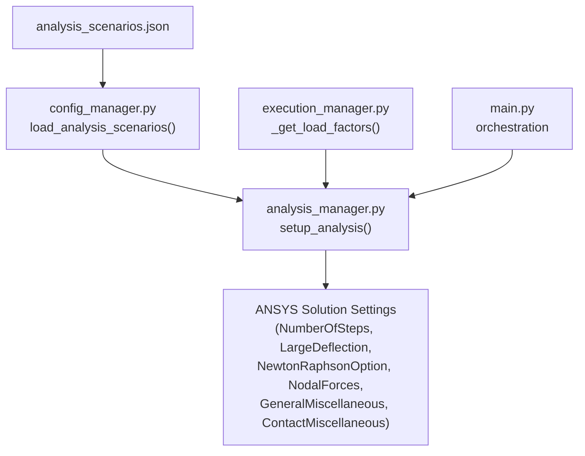
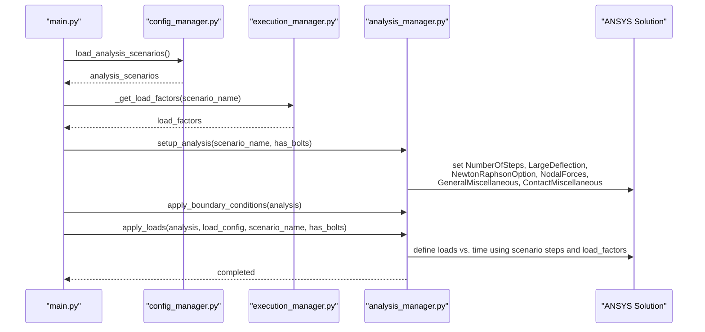
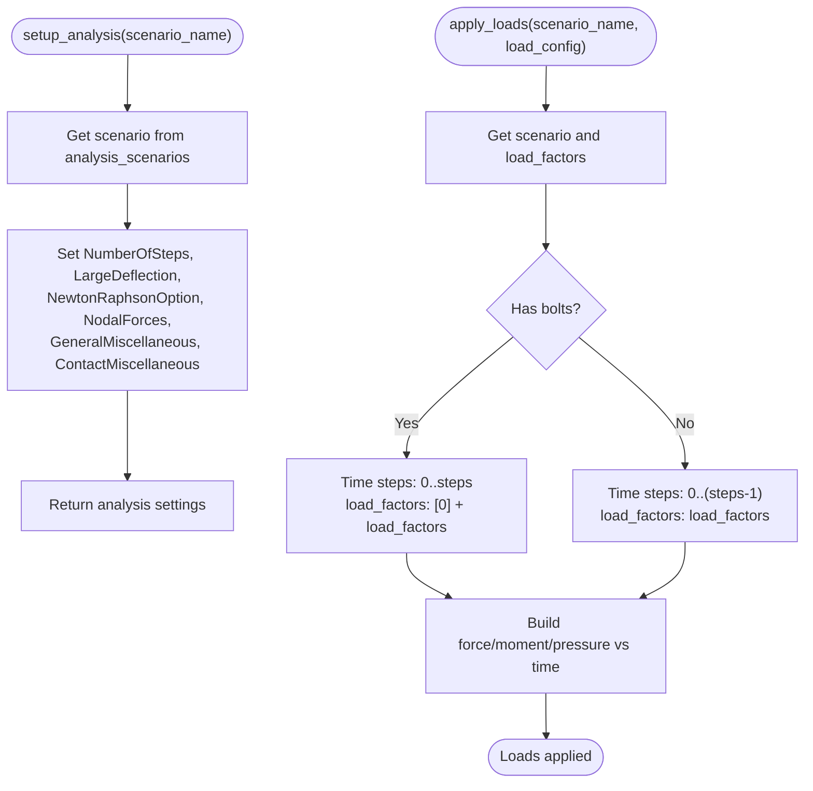
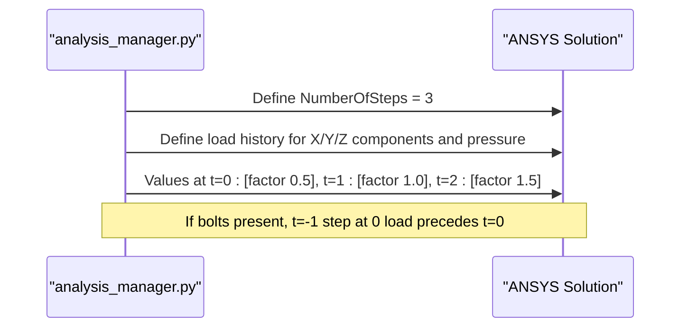
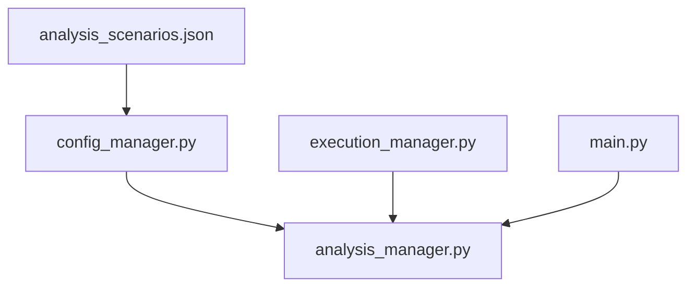

# analysis_scenarios.json

<cite>
**Referenced Files in This Document**
- [analysis_scenarios.json](file://config_files/analysis_scenarios.json)
- [analysis_manager.py](file://managers/analysis_manager.py)
- [execution_manager.py](file://core/execution_manager.py)
- [config_manager.py](file://config/config_manager.py)
- [constants.py](file://config/constants.py)
- [main.py](file://main.py)
</cite>

## Table of Contents
1. [Introduction](#introduction)
2. [Project Structure](#project-structure)
3. [Core Components](#core-components)
4. [Architecture Overview](#architecture-overview)
5. [Detailed Component Analysis](#detailed-component-analysis)
6. [Dependency Analysis](#dependency-analysis)
7. [Performance Considerations](#performance-considerations)
8. [Troubleshooting Guide](#troubleshooting-guide)
9. [Conclusion](#conclusion)
10. [Appendices](#appendices)

## Introduction
This document explains the preconfigured analysis sequences defined in analysis_scenarios.json and how they are applied to ANSYS solutions via analysis_manager.py. It details each scenario (standard_sequence, quick_check, detailed_analysis, pretension_only) with their names, descriptions, number of steps, load_factors, and analysis_settings. It also clarifies how large_deflection, Newton-Raphson solver type, nodal_forces output, and miscellaneous settings influence solution accuracy and performance. Use cases for each scenario are provided, along with guidance on creating custom scenarios tailored to specialized engineering validations.

## Project Structure
The analysis scenarios are defined centrally in a configuration file and consumed by the analysis manager during automation. The configuration file is validated and loaded by the configuration manager, while the analysis manager applies the settings to the ANSYS solution component.

**Diagram sources**
- [analysis_scenarios.json](file://config_files/analysis_scenarios.json#L1-L55)
- [config_manager.py](file://config/config_manager.py#L83-L101)
- [analysis_manager.py](file://managers/analysis_manager.py#L14-L26)
- [execution_manager.py](file://core/execution_manager.py#L108-L128)
- [main.py](file://main.py#L169-L199)

**Section sources**
- [analysis_scenarios.json](file://config_files/analysis_scenarios.json#L1-L55)
- [config_manager.py](file://config/config_manager.py#L83-L101)

## Core Components
- Analysis scenarios configuration: Defines four named sequences with steps, load_factors, and analysis_settings.
- Analysis manager: Applies scenario-defined settings to the ANSYS solution and constructs step-wise load histories.
- Execution manager: Supplies load factors for a given scenario name.
- Configuration manager: Loads and validates analysis_scenarios.json.
- Main orchestration: Calls analysis_manager to set up and apply analysis settings.

Key responsibilities:
- analysis_scenarios.json: Centralized scenario definitions.
- analysis_manager.setup_analysis(): Sets global solver and output flags.
- analysis_manager.apply_loads(): Builds time-dependent load profiles using scenario steps and load_factors.
- execution_manager._get_load_factors(): Provides load factors aligned with scenario names.

**Section sources**
- [analysis_scenarios.json](file://config_files/analysis_scenarios.json#L1-L55)
- [analysis_manager.py](file://managers/analysis_manager.py#L14-L26)
- [execution_manager.py](file://core/execution_manager.py#L108-L128)
- [config_manager.py](file://config/config_manager.py#L83-L101)
- [main.py](file://main.py#L169-L199)

## Architecture Overview
The system applies analysis scenarios to ANSYS by:
1. Loading analysis_scenarios.json via config_manager.
2. Selecting a scenario by name.
3. Applying scenario settings to the ANSYS solution via analysis_manager.
4. Building load histories per step using load_factors from execution_manager.
5. Optionally applying bolt-specific steps and loads.

**Diagram sources**
- [config_manager.py](file://config/config_manager.py#L83-L101)
- [execution_manager.py](file://core/execution_manager.py#L108-L128)
- [analysis_manager.py](file://managers/analysis_manager.py#L14-L26)
- [analysis_manager.py](file://managers/analysis_manager.py#L60-L116)
- [main.py](file://main.py#L169-L199)

## Detailed Component Analysis

### Scenario: standard_sequence
- Name: Standard sequence
- Description: Three steps: pretension + nominal load + design earthquake
- Steps: 3
- Load factors: [0.5, 1.0, 1.5]
- Analysis settings:
  - Large deflection: enabled
  - Newton-Raphson option: unsymmetric
  - Nodal forces: yes
  - General miscellaneous: true
  - Contact miscellaneous: true

Use cases:
- Certification validation requiring realistic nonlinear response under combined loads.
- Quality assurance checks before final approval.

Accuracy and performance impact:
- Large deflection enabled: captures geometric nonlinearities for accurate deformation and stress distribution.
- Unsymmetric Newton-Raphson: robust for nonlinear problems; may increase iterations.
- Nodal forces enabled: improves post-processing of reaction forces and internal force diagnostics.
- Miscellaneous toggles: enable solver and contact reporting for detailed convergence and contact behavior.

**Section sources**
- [analysis_scenarios.json](file://config_files/analysis_scenarios.json#L1-L15)
- [analysis_manager.py](file://managers/analysis_manager.py#L14-L26)

### Scenario: quick_check
- Name: Quick check
- Description: Two steps: pretension + emergency mode
- Steps: 2
- Load factors: [0, 1.5]
- Analysis settings:
  - Large deflection: enabled
  - Newton-Raphson option: program-controlled
  - Nodal forces: no
  - General miscellaneous: false
  - Contact miscellaneous: false

Use cases:
- Rapid feasibility screening during early design iteration.
- Emergency load verification without heavy post-processing.

Accuracy and performance impact:
- Program-controlled solver may adapt automatically; trade-off between robustness and speed.
- Nodal forces disabled: reduces output overhead for fast turnaround.
- Miscellaneous toggles disabled: simplifies solver logs and reduces computational overhead.

**Section sources**
- [analysis_scenarios.json](file://config_files/analysis_scenarios.json#L16-L28)
- [analysis_manager.py](file://managers/analysis_manager.py#L14-L26)

### Scenario: detailed_analysis
- Name: Detailed analysis
- Description: Six steps with intermediate points for fine-grained monitoring
- Steps: 6
- Load factors: [0, 0.2, 0.5, 0.8, 1.0, 1.5]
- Analysis settings:
  - Large deflection: enabled
  - Newton-Raphson option: unsymmetric
  - Nodal forces: yes
  - General miscellaneous: true
  - Contact miscellaneous: true

Use cases:
- Fatigue and progressive damage assessment.
- Validation of nonlinear buckling and instability regions.

Accuracy and performance impact:
- More steps and smaller increments improve detection of local instabilities and stress localization.
- Unsymmetric solver and nodal forces enhance accuracy for complex contact and large deformation regimes.

**Section sources**
- [analysis_scenarios.json](file://config_files/analysis_scenarios.json#L29-L41)
- [analysis_manager.py](file://managers/analysis_manager.py#L14-L26)

### Scenario: pretension_only
- Name: Pretension only
- Description: Single step for bolt pretension
- Steps: 1
- Load factors: [0]
- Analysis settings:
  - Large deflection: disabled
  - Newton-Raphson option: program-controlled
  - Nodal forces: no
  - General miscellaneous: false
  - Contact miscellaneous: false

Use cases:
- Isolated bolt preload verification.
- Pre-analysis to establish initial contact conditions.

Accuracy and performance impact:
- Disabled large deflection and output toggles reduce computational cost for pure preload studies.

**Section sources**
- [analysis_scenarios.json](file://config_files/analysis_scenarios.json#L42-L55)
- [analysis_manager.py](file://managers/analysis_manager.py#L14-L26)

### How analysis_manager Applies Settings to ANSYS
- Global settings: setup_analysis sets NumberOfSteps and solver/output flags on the ANSYS solution object.
- Load history: apply_loads builds time-dependent load profiles using scenario steps and load_factors. For models with bolts, an extra step is inserted to represent initial pretension before the first load increment.

**Diagram sources**
- [analysis_manager.py](file://managers/analysis_manager.py#L14-L26)
- [analysis_manager.py](file://managers/analysis_manager.py#L60-L116)

**Section sources**
- [analysis_manager.py](file://managers/analysis_manager.py#L14-L26)
- [analysis_manager.py](file://managers/analysis_manager.py#L60-L116)

### Example: load_factors [0.5, 1.0, 1.5] Applied Across Three Steps
- Steps: 3
- Load factors: [0.5, 1.0, 1.5]
- Behavior: analysis_manager constructs three load increments, each scaled by the respective factor. If bolts are present, an initial step at zero load precedes the first increment.

**Diagram sources**
- [analysis_manager.py](file://managers/analysis_manager.py#L60-L116)

**Section sources**
- [analysis_manager.py](file://managers/analysis_manager.py#L60-L116)

## Dependency Analysis
- analysis_scenarios.json is loaded by config_manager and passed to analysis_manager.
- execution_manager supplies load_factors aligned with scenario names.
- main orchestrates the full pipeline and invokes analysis_manager.

**Diagram sources**
- [analysis_scenarios.json](file://config_files/analysis_scenarios.json#L1-L55)
- [config_manager.py](file://config/config_manager.py#L83-L101)
- [analysis_manager.py](file://managers/analysis_manager.py#L14-L26)
- [execution_manager.py](file://core/execution_manager.py#L108-L128)
- [main.py](file://main.py#L169-L199)

**Section sources**
- [config_manager.py](file://config/config_manager.py#L83-L101)
- [execution_manager.py](file://core/execution_manager.py#L108-L128)
- [analysis_manager.py](file://managers/analysis_manager.py#L14-L26)
- [main.py](file://main.py#L169-L199)

## Performance Considerations
- Large deflection enabled: Improves accuracy for significant deformations but increases computational cost and iteration counts.
- Newton-Raphson option:
  - Unsymmetric: Robust for nonlinear problems; may increase iterations.
  - Program-controlled: Adapts solver behavior automatically; balance between robustness and speed.
- Nodal forces enabled: Adds output overhead; beneficial for diagnostics but unnecessary for quick checks.
- Miscellaneous toggles:
  - General/miscellaneous: Enable detailed solver and contact reporting; useful for debugging but adds overhead.
  - Contact miscellaneous: Enhances contact behavior logging; helpful for complex contact simulations.

[No sources needed since this section provides general guidance]

## Troubleshooting Guide
- Unexpected solver behavior:
  - Verify Newton-Raphson option selection in the scenario’s analysis_settings.
  - Confirm that setup_analysis is being invoked with the intended scenario name.
- Excessive computation time:
  - Reduce steps or disable nodal_forces and miscellaneous toggles for quick checks.
  - Consider switching to program-controlled solver for adaptive behavior.
- Incorrect load increments:
  - Ensure load_factors align with scenario steps and that apply_loads receives the correct scenario name.
  - For bolted assemblies, confirm that an initial zero-load step is included.

**Section sources**
- [analysis_scenarios.json](file://config_files/analysis_scenarios.json#L1-L55)
- [analysis_manager.py](file://managers/analysis_manager.py#L14-L26)
- [analysis_manager.py](file://managers/analysis_manager.py#L60-L116)

## Conclusion
analysis_scenarios.json centralizes engineering validation sequences with distinct trade-offs between accuracy and performance. The analysis manager translates these scenarios into ANSYS settings and load histories, enabling repeatable automation across certification, rapid checks, detailed assessments, and specialized pretension studies. Adjusting solver options and output controls allows tailoring accuracy to specific validation goals.

[No sources needed since this section summarizes without analyzing specific files]

## Appendices

### Creating Custom Scenarios
Guidance for designing new scenarios:
- Define steps and load_factors to target specific validation objectives (e.g., incremental fatigue, buckling, or thermal cycling).
- Align solver and output settings with problem characteristics:
  - Enable large deflection for geometrically nonlinear problems.
  - Choose unsymmetric Newton-Raphson for robustness; program-controlled for adaptivity.
  - Enable nodal_forces and miscellaneous toggles for detailed diagnostics.
- Validate with config_manager to ensure required keys are present.
- Integrate with execution_manager by adding load_factors mapping for the new scenario name.

**Section sources**
- [analysis_scenarios.json](file://config_files/analysis_scenarios.json#L1-L55)
- [config_manager.py](file://config/config_manager.py#L83-L101)
- [execution_manager.py](file://core/execution_manager.py#L108-L128)
- [constants.py](file://config/constants.py#L35-L57)