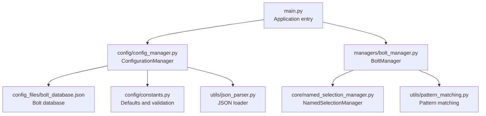
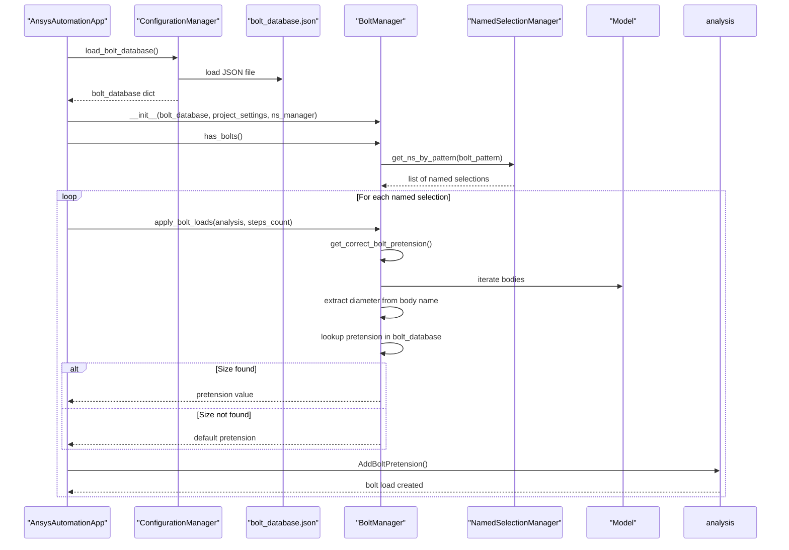
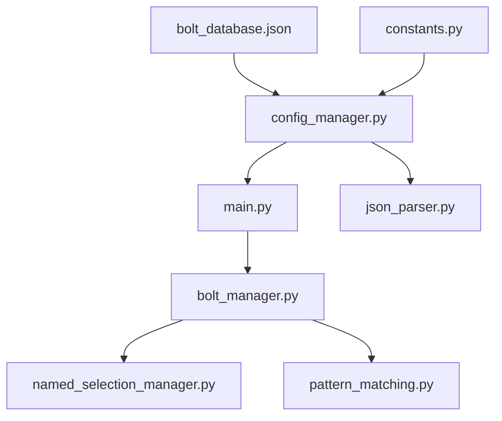

# bolt_database.json

<cite>
**Referenced Files in This Document**
- [bolt_database.json](file://config_files/bolt_database.json)
- [bolt_manager.py](file://managers/bolt_manager.py)
- [config_manager.py](file://config/config_manager.py)
- [constants.py](file://config/constants.py)
- [main.py](file://main.py)
- [named_selection_manager.py](file://core/named_selection_manager.py)
- [json_parser.py](file://utils/json_parser.py)
- [pattern_matching.py](file://utils/pattern_matching.py)
</cite>

## Table of Contents
1. [Introduction](#introduction)
2. [Project Structure](#project-structure)
3. [Core Components](#core-components)
4. [Architecture Overview](#architecture-overview)
5. [Detailed Component Analysis](#detailed-component-analysis)
6. [Dependency Analysis](#dependency-analysis)
7. [Performance Considerations](#performance-considerations)
8. [Troubleshooting Guide](#troubleshooting-guide)
9. [Conclusion](#conclusion)
10. [Appendices](#appendices)

## Introduction
This document provides a comprehensive reference for bolt_database.json, a configuration file that defines bolt diameter and pretension force values used by the automated bolt load application. It explains the database structure, how bolt_manager.py extracts bolt sizes from model body names using named selection patterns, and how pretension values are looked up and applied. It also presents the complete diameter-to-pretension mapping, discusses the engineering basis for these values, and outlines best practices for updating the database with new standards or materials.

## Project Structure
The bolt database is part of the configuration hierarchy and is loaded during application initialization. The following diagram shows how the bolt database integrates into the system.

**Diagram sources**
- [main.py](file://main.py#L94-L131)
- [config_manager.py](file://config/config_manager.py#L93-L101)
- [bolt_database.json](file://config_files/bolt_database.json#L1-L47)
- [constants.py](file://config/constants.py#L35-L42)
- [bolt_manager.py](file://managers/bolt_manager.py#L1-L68)
- [named_selection_manager.py](file://core/named_selection_manager.py#L39-L56)
- [pattern_matching.py](file://utils/pattern_matching.py#L8-L31)
- [json_parser.py](file://utils/json_parser.py#L142-L170)

**Section sources**
- [main.py](file://main.py#L94-L131)
- [config_manager.py](file://config/config_manager.py#L93-L101)
- [bolt_database.json](file://config_files/bolt_database.json#L1-L47)

## Core Components
- Bolt database structure: Each numeric key corresponds to a bolt nominal size (diameter in millimeters). Each entry contains diameter and pretension fields. A special default entry provides fallback values when an unrecognized size is encountered.
- BoltManager: Extracts bolt size from model body names, validates against the database, and applies pretension loads to named selections.
- Configuration loader: Loads bolt_database.json and validates required keys.
- Pattern matching utilities: Provide simple wildcard matching and number extraction used by bolt identification.

Key responsibilities:
- bolt_database.json: Stores diameter-to-pretension mappings and a default fallback.
- bolt_manager.py: Parses body names, looks up pretension values, and creates bolt loads.
- config_manager.py: Loads and validates the bolt database.
- json_parser.py: Loads and parses JSON with comment removal and IronPython compatibility.
- pattern_matching.py: Provides pattern matching and number extraction utilities.

**Section sources**
- [bolt_database.json](file://config_files/bolt_database.json#L1-L47)
- [bolt_manager.py](file://managers/bolt_manager.py#L1-L68)
- [config_manager.py](file://config/config_manager.py#L93-L101)
- [json_parser.py](file://utils/json_parser.py#L142-L170)
- [pattern_matching.py](file://utils/pattern_matching.py#L8-L31)

## Architecture Overview
The bolt load application follows a configuration-driven pipeline:
1. Application initializes and loads bolt_database.json via ConfigurationManager.
2. BoltManager scans model bodies for bolt identifiers and named selections.
3. For each named selection, BoltManager determines the appropriate pretension value from the database and applies a bolt pretension load.

**Diagram sources**
- [main.py](file://main.py#L94-L131)
- [config_manager.py](file://config/config_manager.py#L93-L101)
- [bolt_database.json](file://config_files/bolt_database.json#L1-L47)
- [bolt_manager.py](file://managers/bolt_manager.py#L23-L68)
- [named_selection_manager.py](file://core/named_selection_manager.py#L39-L56)

## Detailed Component Analysis

### Bolt Database Structure and Defaults
- Structure: Numeric keys represent bolt nominal diameters (millimeters). Each entry includes diameter and pretension fields. A default entry provides fallback diameter and pretension values.
- Validation: The configuration validator requires the presence of a default entry in bolt_database.json.
- Defaults: The constants module defines default diameter and pretension values used when creating default configurations.

Complete mapping (diameter to pretension):
- Diameter 5 mm → Pretension value
- Diameter 6 mm → Pretension value
- Diameter 8 mm → Pretension value
- Diameter 10 mm → Pretension value
- Diameter 12 mm → Pretension value
- Diameter 16 mm → Pretension value
- Diameter 20 mm → Pretension value
- Diameter 24 mm → Pretension value
- Diameter 30 mm → Pretension value
- Diameter 36 mm → Pretension value
- Default diameter → Default pretension

Notes:
- The database is organized as a JSON object with numeric keys for standard metric bolt sizes.
- The default entry ensures robustness when encountering unexpected bolt sizes.

**Section sources**
- [bolt_database.json](file://config_files/bolt_database.json#L1-L47)
- [constants.py](file://config/constants.py#L35-L42)
- [constants.py](file://config/constants.py#L60-L62)

### Bolt Size Extraction and Lookup
- Body name parsing: BoltManager identifies bodies containing a bolt identifier and extracts the numeric diameter using a regular expression.
- Database lookup: The extracted diameter is used as a key to retrieve the corresponding pretension value from the bolt database.
- Fallback: If the size is not found, the default pretension value is used.

Example lookup process:
- Input: Body name with a bolt identifier (e.g., a body name containing a numeric diameter).
- Steps:
  1. Extract diameter from the body name.
  2. Check if the diameter exists in the bolt database.
  3. If yes, use the stored pretension value.
  4. If no, use the default pretension value.

Example application of pretension loads:
- For each named selection matching the bolt pattern, create a bolt pretension load with the determined pretension value.
- Configure the load’s step values according to the analysis scenario.

Robustness considerations:
- The default entry guarantees that the system does not fail when encountering an unknown bolt size.
- The bolt pattern and named selection matching ensure only relevant named selections receive bolt loads.

**Section sources**
- [bolt_manager.py](file://managers/bolt_manager.py#L23-L68)
- [named_selection_manager.py](file://core/named_selection_manager.py#L39-L56)
- [pattern_matching.py](file://utils/pattern_matching.py#L8-L31)

### Configuration Loading and Validation
- Loader: ConfigurationManager.load_bolt_database reads bolt_database.json using a JSON parser that supports comments and IronPython environments.
- Validator: The configuration manager validates that bolt_database.json contains the required default entry.
- Defaults: If a default configuration is needed, the constants module provides default diameter and pretension values.

**Section sources**
- [config_manager.py](file://config/config_manager.py#L93-L101)
- [config_manager.py](file://config/config_manager.py#L161-L180)
- [json_parser.py](file://utils/json_parser.py#L142-L170)
- [constants.py](file://config/constants.py#L35-L42)
- [constants.py](file://config/constants.py#L60-L62)

### Engineering Basis for Pretension Values
- Pretension values are derived from standard bolt specifications and material properties. They represent the axial force applied during tightening to achieve the desired clamping pressure.
- The values increase with bolt diameter, reflecting higher tensile forces required for larger fasteners.
- Material and grade assumptions are embedded in the database; updates should align with applicable standards and materials used in the project.

[No sources needed since this section provides general guidance]

### Updating the Database with New Standards or Materials
- Add new sizes: Extend the bolt database with entries for additional standard diameters.
- Modify existing values: Adjust pretension values to reflect updated standards or materials.
- Default maintenance: Ensure the default entry remains representative of typical small-bolt applications.
- Validation: After changes, verify that the configuration still passes validation checks.

[No sources needed since this section provides general guidance]

## Dependency Analysis
The following diagram shows the dependencies among components involved in bolt load application.

**Diagram sources**
- [bolt_database.json](file://config_files/bolt_database.json#L1-L47)
- [config_manager.py](file://config/config_manager.py#L93-L101)
- [main.py](file://main.py#L94-L131)
- [bolt_manager.py](file://managers/bolt_manager.py#L1-L68)
- [named_selection_manager.py](file://core/named_selection_manager.py#L39-L56)
- [pattern_matching.py](file://utils/pattern_matching.py#L8-L31)
- [json_parser.py](file://utils/json_parser.py#L142-L170)
- [constants.py](file://config/constants.py#L35-L42)

**Section sources**
- [main.py](file://main.py#L94-L131)
- [config_manager.py](file://config/config_manager.py#L93-L101)
- [bolt_manager.py](file://managers/bolt_manager.py#L1-L68)

## Performance Considerations
- Database lookup: O(1) average-time dictionary access for bolt sizes and default fallback.
- Body scanning: Linear scan over model bodies; regex extraction is efficient for simple patterns.
- Named selection filtering: Pattern matching over named selections is bounded by the number of named selections.
- Recommendations:
  - Keep the bolt database compact and aligned with standard sizes.
  - Ensure body names consistently encode bolt sizes to minimize false positives.

[No sources needed since this section provides general guidance]

## Troubleshooting Guide
Common issues and resolutions:
- Missing default entry: The configuration validator requires a default entry in bolt_database.json. Ensure it exists and contains diameter and pretension fields.
- Unknown bolt size: If a body name contains an unrecognized diameter, the system falls back to the default pretension value. Verify body naming conventions and update the database accordingly.
- Incorrect named selection pattern: If bolt loads are not applied, check the bolt pattern used to identify named selections and ensure it matches the model’s naming scheme.
- JSON parsing errors: The loader removes comments and handles IronPython environments. Confirm the file is valid JSON and located at the expected path.

**Section sources**
- [config_manager.py](file://config/config_manager.py#L52-L72)
- [bolt_manager.py](file://managers/bolt_manager.py#L23-L68)
- [named_selection_manager.py](file://core/named_selection_manager.py#L39-L56)
- [json_parser.py](file://utils/json_parser.py#L142-L170)

## Conclusion
The bolt_database.json file centralizes bolt pretension specifications for automated bolt load application. Its structure enables straightforward lookups keyed by bolt diameter, while the default entry ensures robust operation when encountering unknown sizes. Together with BoltManager, NamedSelectionManager, and the configuration loader, it forms a reliable pipeline for applying bolt pretension loads across named selections.

[No sources needed since this section summarizes without analyzing specific files]

## Appendices

### Appendix A: Diameter-to-Pretension Mapping
- Diameter 5 mm → Pretension value
- Diameter 6 mm → Pretension value
- Diameter 8 mm → Pretension value
- Diameter 10 mm → Pretension value
- Diameter 12 mm → Pretension value
- Diameter 16 mm → Pretension value
- Diameter 20 mm → Pretension value
- Diameter 24 mm → Pretension value
- Diameter 30 mm → Pretension value
- Diameter 36 mm → Pretension value
- Default diameter → Default pretension

**Section sources**
- [bolt_database.json](file://config_files/bolt_database.json#L1-L47)
- [constants.py](file://config/constants.py#L60-L62)

### Appendix B: Example Lookup and Application Workflow
- Body name parsing: Extract diameter from a body name containing a bolt identifier.
- Database lookup: Retrieve pretension value for the extracted diameter.
- Fallback: Use default pretension if the diameter is not found.
- Load application: Create bolt pretension loads for each matching named selection and configure step values.

**Section sources**
- [bolt_manager.py](file://managers/bolt_manager.py#L23-L68)
- [named_selection_manager.py](file://core/named_selection_manager.py#L39-L56)