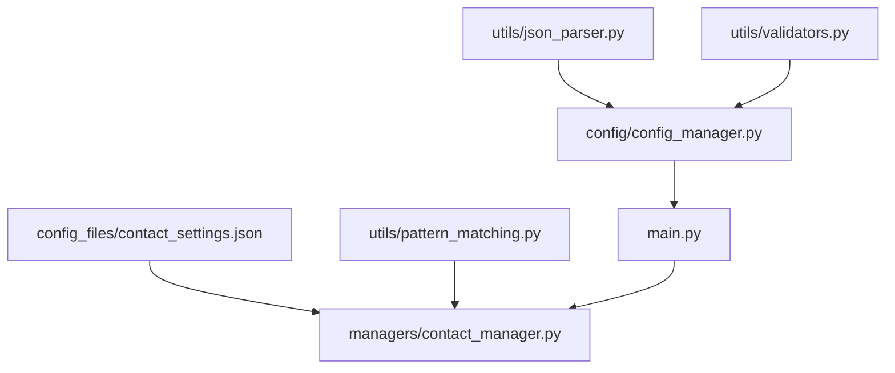
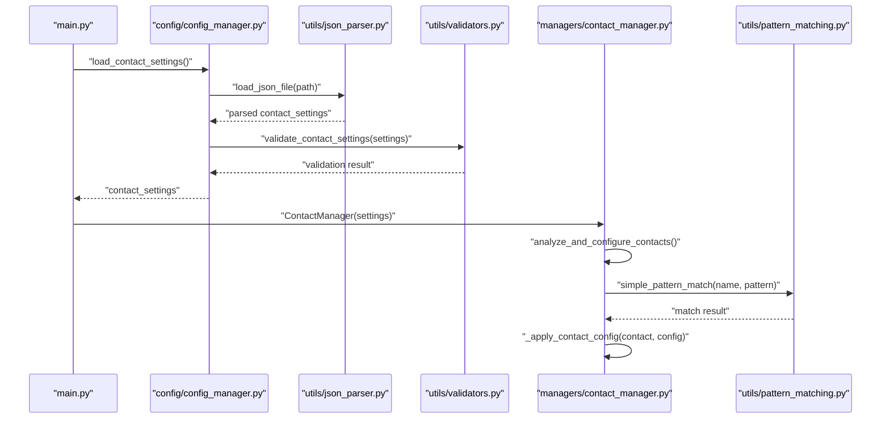
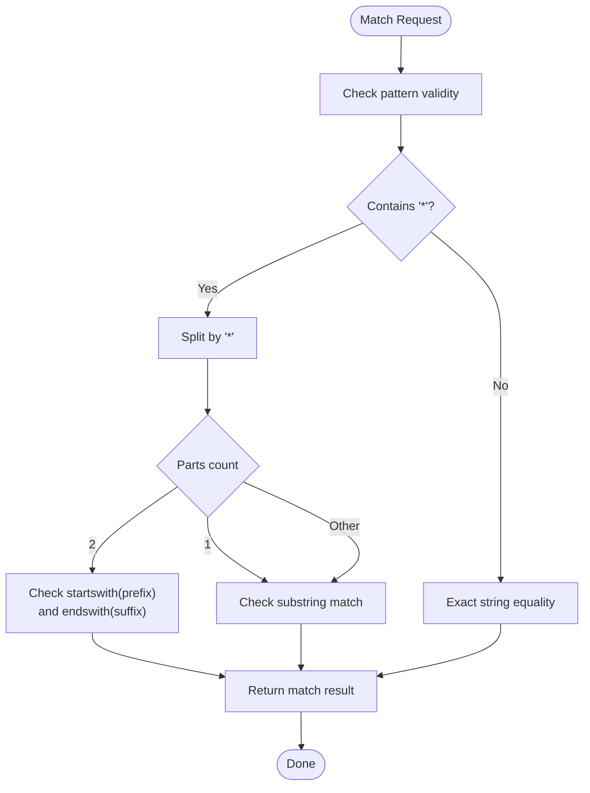
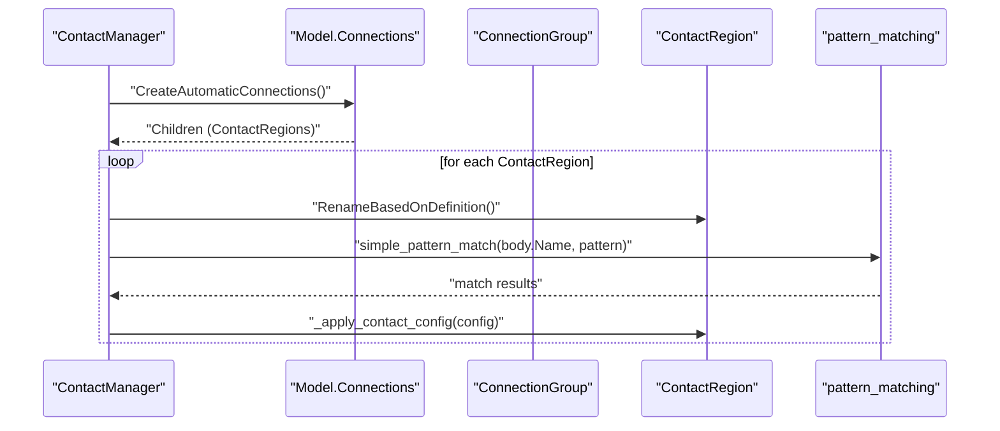
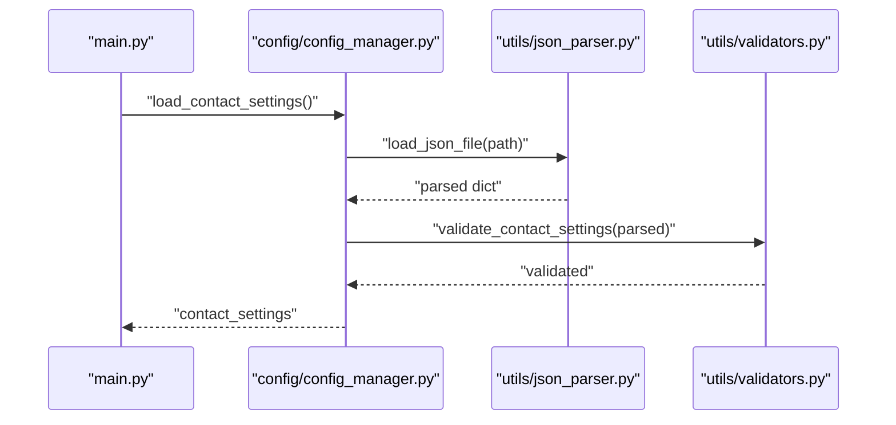
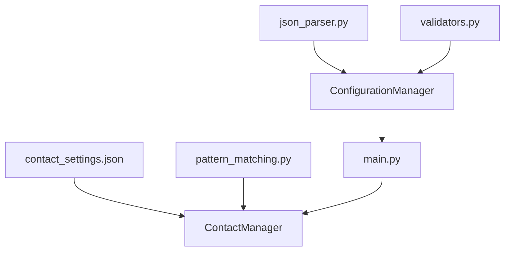

# contact_settings.json

<cite>
**Referenced Files in This Document**
- [contact_settings.json](file://config_files/contact_settings.json)
- [contact_manager.py](file://managers/contact_manager.py)
- [pattern_matching.py](file://utils/pattern_matching.py)
- [json_parser.py](file://utils/json_parser.py)
- [config_manager.py](file://config/config_manager.py)
- [validators.py](file://utils/validators.py)
- [main.py](file://main.py)
</cite>

## Table of Contents
1. [Introduction](#introduction)
2. [Project Structure](#project-structure)
3. [Core Components](#core-components)
4. [Architecture Overview](#architecture-overview)
5. [Detailed Component Analysis](#detailed-component-analysis)
6. [Dependency Analysis](#dependency-analysis)
7. [Performance Considerations](#performance-considerations)
8. [Troubleshooting Guide](#troubleshooting-guide)
9. [Conclusion](#conclusion)
10. [Appendices](#appendices)

## Introduction
This document provides comprehensive documentation for the contact pair creation rules defined in contact_settings.json. It explains how the system uses named selection patterns to automatically detect and configure contacts, details each field in the contact_rules array, describes special cases such as weld_contact and default_frictional, and outlines the advanced_settings that control global contact behavior. It also covers integration with contact_manager.py for rule-based contact generation and best practices for defining non-interfering rule priorities.

## Project Structure
The contact system spans configuration files, utilities for JSON parsing and pattern matching, and a manager that applies rules to generated contacts. The following diagram shows the primary components involved in contact rule processing.

**Diagram sources**
- [contact_settings.json](file://config_files/contact_settings.json#L1-L130)
- [contact_manager.py](file://managers/contact_manager.py#L1-L96)
- [pattern_matching.py](file://utils/pattern_matching.py#L1-L71)
- [json_parser.py](file://utils/json_parser.py#L1-L170)
- [config_manager.py](file://config/config_manager.py#L1-L209)
- [validators.py](file://utils/validators.py#L1-L161)
- [main.py](file://main.py#L1-L270)

**Section sources**
- [contact_settings.json](file://config_files/contact_settings.json#L1-L130)
- [contact_manager.py](file://managers/contact_manager.py#L1-L96)
- [pattern_matching.py](file://utils/pattern_matching.py#L1-L71)
- [json_parser.py](file://utils/json_parser.py#L1-L170)
- [config_manager.py](file://config/config_manager.py#L1-L209)
- [validators.py](file://utils/validators.py#L1-L161)
- [main.py](file://main.py#L1-L270)

## Core Components
- contact_rules: An array of rule objects that define how to configure contacts based on body name patterns. Each rule includes:
  - name: Human-readable identifier for the rule.
  - contact_pattern: Wildcard pattern matched against contact bodies.
  - target_pattern: Wildcard pattern matched against target bodies.
  - type: Contact type (e.g., Bonded, Frictional).
  - detection_method: Detection method for contact points.
  - interface_treatment: Initial effect applied to the contact interface.
  - offset: Optional user offset for frictional contacts.
  - friction_coefficient: Friction coefficient for frictional contacts.
  - behavior: Behavior setting for the contact.
  - trim_contact: Flag indicating whether to trim contact.
- advanced_settings: Global contact behavior controls:
  - formulation: Contact formulation (e.g., AugmentedLagrange).
  - normal_stiffness: Normal stiffness control.
  - update_stiffness: Stiffness update schedule.
  - stabilization: Stabilization option.

**Section sources**
- [contact_settings.json](file://config_files/contact_settings.json#L1-L130)

## Architecture Overview
The contact configuration pipeline integrates configuration loading, validation, and rule application:

**Diagram sources**
- [main.py](file://main.py#L94-L131)
- [config_manager.py](file://config/config_manager.py#L98-L101)
- [json_parser.py](file://utils/json_parser.py#L142-L170)
- [validators.py](file://utils/validators.py#L111-L131)
- [contact_manager.py](file://managers/contact_manager.py#L14-L96)
- [pattern_matching.py](file://utils/pattern_matching.py#L8-L31)

## Detailed Component Analysis

### contact_rules Array
Each rule object specifies:
- Pattern matching: contact_pattern and target_pattern use wildcard patterns to match body names. The manager checks if any contact body matches contact_pattern and any target body matches target_pattern.
- Contact type and friction: type determines whether the contact is Bonded or Frictional. For Frictional contacts, friction_coefficient is applied.
- Detection and interface treatment: detection_method and interface_treatment control how contact points are detected and how the interface is initially treated.
- Additional fields: offset, behavior, and trim_contact are applied conditionally based on type and presence.

Special cases:
- weld_contact: Matches shov* to any target using a wildcard target_pattern, resulting in bonded contacts suitable for welding.
- default_frictional: Applies to any pair of bodies using wildcard patterns, providing a baseline frictional contact with a default coefficient.

Example: bolt_to_washer_contact
- contact_pattern: mbolt*
- target_pattern: shaiba*
- type: Frictional
- friction_coefficient: 0.3
- This rule creates frictional contacts between bolts and washers.

Best practices for rule priorities:
- Place more specific rules before general ones to avoid unintended matches.
- Use distinct prefixes for different component families to minimize overlap.
- Reserve wildcard-based rules for fallback or default behavior.

**Section sources**
- [contact_settings.json](file://config_files/contact_settings.json#L1-L130)
- [contact_manager.py](file://managers/contact_manager.py#L60-L96)
- [pattern_matching.py](file://utils/pattern_matching.py#L8-L31)

### Pattern Matching Engine
The pattern matching utility supports wildcard matching without external libraries, enabling compatibility with IronPython environments. It:
- Splits patterns by '*' and checks prefix/suffix conditions.
- Handles exact matches when no wildcard is present.
- Provides helpers to match any pattern and to extract numbers from names.

**Diagram sources**
- [pattern_matching.py](file://utils/pattern_matching.py#L8-L31)

**Section sources**
- [pattern_matching.py](file://utils/pattern_matching.py#L8-L31)

### Advanced Settings
Global contact behavior is controlled under advanced_settings:
- formulation: AugmentedLagrange is used for robust constraint handling.
- normal_stiffness: ProgramControlled indicates stiffness is managed by the program.
- update_stiffness: EachIteration updates stiffness at each iteration for stability.
- stabilization: None disables additional stabilization.

These settings influence solver behavior and convergence characteristics.

**Section sources**
- [contact_settings.json](file://config_files/contact_settings.json#L124-L129)

### Integration with contact_manager.py
The ContactManager orchestrates automatic contact configuration:
- Loads pre-existing automatic contacts and applies tolerance settings.
- Iterates through contact regions, renames them based on definition, and attempts to apply a matching rule.
- Uses pattern matching to select the appropriate rule from contact_rules.
- Applies contact type, friction coefficient, detection method, and interface treatment.

**Diagram sources**
- [contact_manager.py](file://managers/contact_manager.py#L14-L96)
- [pattern_matching.py](file://utils/pattern_matching.py#L8-L31)

**Section sources**
- [contact_manager.py](file://managers/contact_manager.py#L14-L96)

### Configuration Loading and Validation
Configuration loading and validation flow:
- ConfigurationManager.load_contact_settings() reads and parses contact_settings.json.
- JSON parsing removes comments and whitespace, then converts to native Python structures.
- Validators ensure required keys exist and report missing fields.
- The parsed settings are injected into ContactManager for runtime application.

**Diagram sources**
- [main.py](file://main.py#L94-L131)
- [config_manager.py](file://config/config_manager.py#L98-L101)
- [json_parser.py](file://utils/json_parser.py#L142-L170)
- [validators.py](file://utils/validators.py#L111-L131)

**Section sources**
- [config_manager.py](file://config/config_manager.py#L98-L101)
- [json_parser.py](file://utils/json_parser.py#L142-L170)
- [validators.py](file://utils/validators.py#L111-L131)
- [main.py](file://main.py#L94-L131)

## Dependency Analysis
The following diagram shows how components depend on each other in the contact configuration pipeline.

**Diagram sources**
- [contact_settings.json](file://config_files/contact_settings.json#L1-L130)
- [contact_manager.py](file://managers/contact_manager.py#L1-L96)
- [pattern_matching.py](file://utils/pattern_matching.py#L1-L71)
- [json_parser.py](file://utils/json_parser.py#L1-L170)
- [config_manager.py](file://config/config_manager.py#L1-L209)
- [validators.py](file://utils/validators.py#L1-L161)
- [main.py](file://main.py#L1-L270)

**Section sources**
- [contact_manager.py](file://managers/contact_manager.py#L1-L96)
- [pattern_matching.py](file://utils/pattern_matching.py#L1-L71)
- [json_parser.py](file://utils/json_parser.py#L1-L170)
- [config_manager.py](file://config/config_manager.py#L1-L209)
- [validators.py](file://utils/validators.py#L1-L161)
- [main.py](file://main.py#L1-L270)

## Performance Considerations
- Rule evaluation order: Place more specific rules earlier to reduce unnecessary pattern checks.
- Pattern granularity: Use distinctive prefixes to minimize cross-matches and reduce false positives.
- Automatic contact generation: Limit the number of automatic contacts by refining named selections to reduce downstream processing overhead.
- Solver settings: Choose formulation and stiffness update policies that balance accuracy and convergence speed.

[No sources needed since this section provides general guidance]

## Troubleshooting Guide
Common issues and resolutions:
- Missing required keys in a rule: Ensure each rule includes contact_pattern, target_pattern, type, and detection_method. Validators will raise errors if keys are missing.
- No contacts configured: Verify that automatic contacts were generated and that the ContactManager successfully matched at least one rule.
- Unexpected contact types: Confirm that the rule’s type and friction_coefficient align with intended behavior; adjust rule specificity if conflicts arise.
- Pattern mismatches: Review wildcard patterns and ensure they match actual body names. Use helpers to debug matching outcomes.

**Section sources**
- [validators.py](file://utils/validators.py#L111-L131)
- [contact_manager.py](file://managers/contact_manager.py#L39-L72)

## Conclusion
The contact_settings.json file defines a flexible, rule-based system for configuring contacts using named selection patterns. By combining wildcard matching with targeted rules, the system can automatically create appropriate contact pairs (e.g., bolt-to-washer) while allowing global behavior to be tuned via advanced_settings. Proper rule prioritization and validation help ensure reliable and predictable contact generation.

[No sources needed since this section summarizes without analyzing specific files]

## Appendices

### Field Reference for contact_rules
- name: Unique identifier for the rule.
- contact_pattern: Wildcard pattern for contact bodies.
- target_pattern: Wildcard pattern for target bodies.
- type: Contact type (Bonded or Frictional).
- detection_method: Contact detection method.
- interface_treatment: Initial effect for the contact interface.
- offset: Optional user offset for frictional contacts.
- friction_coefficient: Friction coefficient for frictional contacts.
- behavior: Behavior setting for the contact.
- trim_contact: Flag to trim contact.

**Section sources**
- [contact_settings.json](file://config_files/contact_settings.json#L1-L130)

### Example: bolt_to_washer_contact
- contact_pattern: mbolt*
- target_pattern: shaiba*
- type: Frictional
- friction_coefficient: 0.3
- This rule creates frictional contacts between bolts and washers.

**Section sources**
- [contact_settings.json](file://config_files/contact_settings.json#L16-L26)
- [contact_manager.py](file://managers/contact_manager.py#L60-L96)