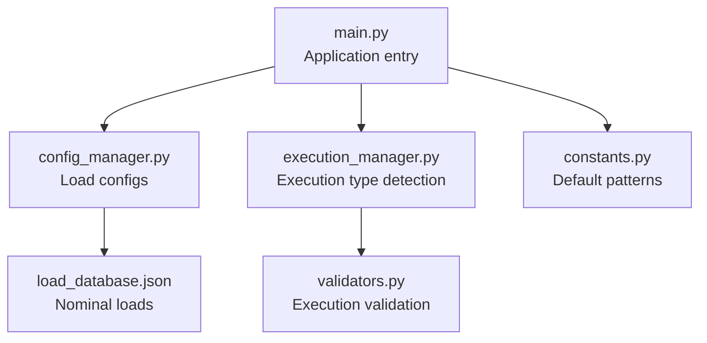
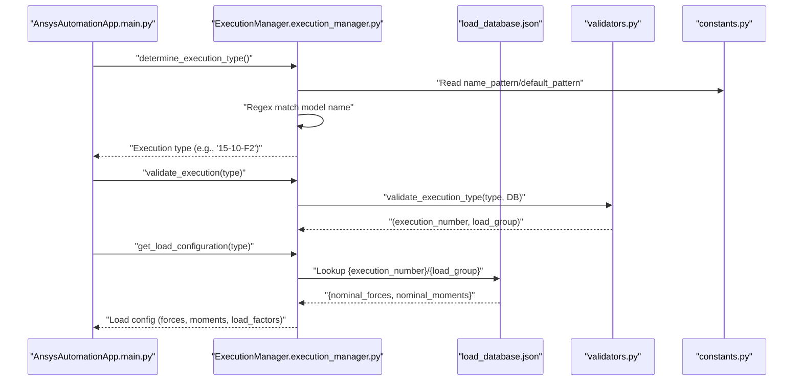
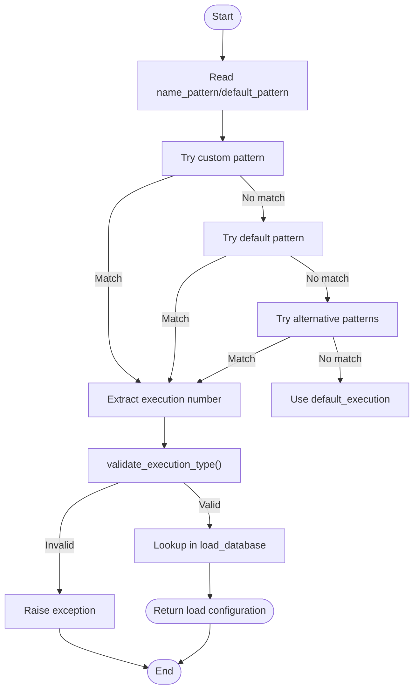
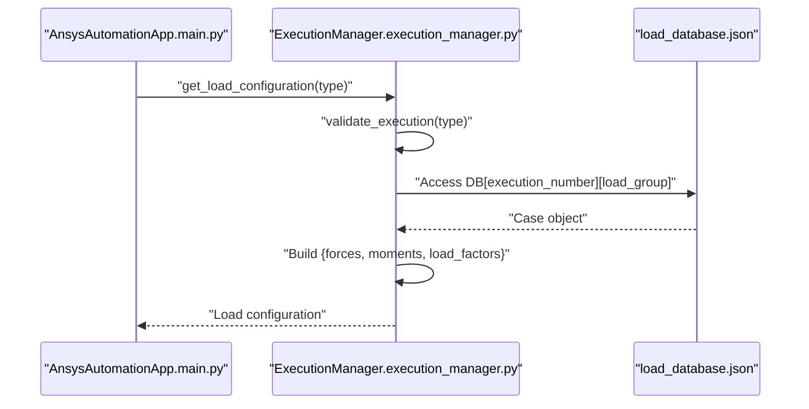
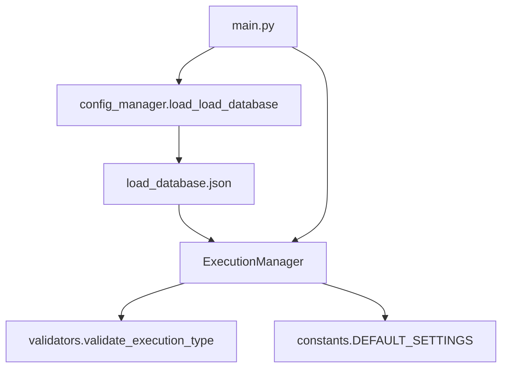

# load_database.json

<cite>
**Referenced Files in This Document**
- [load_database.json](file://config_files/load_database.json)
- [execution_manager.py](file://core/execution_manager.py)
- [validators.py](file://utils/validators.py)
- [constants.py](file://config/constants.py)
- [config_manager.py](file://config/config_manager.py)
- [main.py](file://main.py)
</cite>

## Table of Contents
1. [Introduction](#introduction)
2. [Project Structure](#project-structure)
3. [Core Components](#core-components)
4. [Architecture Overview](#architecture-overview)
5. [Detailed Component Analysis](#detailed-component-analysis)
6. [Dependency Analysis](#dependency-analysis)
7. [Performance Considerations](#performance-considerations)
8. [Troubleshooting Guide](#troubleshooting-guide)
9. [Conclusion](#conclusion)
10. [Appendices](#appendices)

## Introduction
This document explains the load_database.json configuration file used in the ANSYS automation workflow to store nominal force and moment values for different execution scenarios. It describes the hierarchical structure by structure type, variant, and load case, details the force and moment objects, and shows how execution_manager.py determines the appropriate load configuration from a model name using regex matching. It also provides guidance on extending the database with new structure types, variants, and load cases while maintaining backward compatibility and explains the significance of zero-value loads.

## Project Structure
The load database is a JSON file consumed by the execution manager to select the correct load configuration based on the model name. The configuration is loaded during application initialization and merged with structure-specific overrides when applicable.

**Diagram sources**
- [main.py](file://main.py#L94-L121)
- [config_manager.py](file://config/config_manager.py#L83-L117)
- [load_database.json](file://config_files/load_database.json#L1-L414)
- [execution_manager.py](file://core/execution_manager.py#L16-L59)
- [validators.py](file://utils/validators.py#L133-L161)
- [constants.py](file://config/constants.py#L13-L16)

**Section sources**
- [main.py](file://main.py#L94-L121)
- [config_manager.py](file://config/config_manager.py#L83-L117)

## Core Components
- Hierarchical structure in load_database.json:
  - Structure type (e.g., "151", "131/132", "2045")
  - Variant (e.g., "02", "05", "07" for "151"; "00", "02", ..., "25" for "131/132")
  - Load case (e.g., "F1", "F2", "F3")
- Nominal load objects:
  - "nominal_forces": { "fx", "fy", "fz" }
  - "nominal_moments": { "mx", "my", "mz" } (defaults to zeros if absent)
- Execution type extraction and validation:
  - Regex-based detection from model name
  - Validation against load database keys
  - Retrieval of forces and moments for the selected execution

**Section sources**
- [load_database.json](file://config_files/load_database.json#L1-L414)
- [execution_manager.py](file://core/execution_manager.py#L76-L106)
- [validators.py](file://utils/validators.py#L133-L161)

## Architecture Overview
The system resolves the execution type from the model name and retrieves the corresponding load configuration from the database. The flow integrates with the broader application initialization and analysis setup pipeline.

**Diagram sources**
- [main.py](file://main.py#L160-L204)
- [execution_manager.py](file://core/execution_manager.py#L16-L59)
- [execution_manager.py](file://core/execution_manager.py#L61-L106)
- [validators.py](file://utils/validators.py#L133-L161)
- [constants.py](file://config/constants.py#L13-L16)
- [load_database.json](file://config_files/load_database.json#L1-L414)

## Detailed Component Analysis

### load_database.json Structure and Semantics
- Top-level keys represent structure types:
  - "151"
  - "131/132"
  - "2045"
- Under each structure type:
  - Keys are variants (two-digit codes)
  - Under each variant:
    - Keys are load cases "F1", "F2", "F3"
    - Each load case contains:
      - "nominal_forces": { "fx", "fy", "fz" }
      - "nominal_moments": { "mx", "my", "mz" } (optional; defaults to zeros)
- Zero-value loads:
  - Many entries under "131/132" have zero forces/moments for certain load cases, indicating no nominal load for those cases.

Example retrieval for model named "15-10-F2":
- Structure type: "15" -> "151"
- Variant: "10" -> "05"
- Load case: "F2"
- Forces: fx=300, fy=750, fz=1500
- Moments: mx=0, my=45000, mz=0

These values are taken from the "151/05/F2" configuration in the database.

**Section sources**
- [load_database.json](file://config_files/load_database.json#L1-L414)

### Execution Type Detection and Validation
- Pattern precedence:
  - Custom name pattern from project settings
  - Default pattern (fallback)
  - Alternative patterns (including structure-specific forms)
- Extraction:
  - The first capturing group becomes the execution number
  - The third segment (uppercase) becomes the load group
- Validation:
  - Ensures the execution number exists in the database
  - Ensures the load group exists under that execution number

**Diagram sources**
- [execution_manager.py](file://core/execution_manager.py#L16-L59)
- [validators.py](file://utils/validators.py#L133-L161)
- [constants.py](file://config/constants.py#L13-L16)

**Section sources**
- [execution_manager.py](file://core/execution_manager.py#L16-L59)
- [validators.py](file://utils/validators.py#L133-L161)
- [constants.py](file://config/constants.py#L13-L16)

### Load Configuration Retrieval
- The execution manager validates the execution type and builds a load configuration containing:
  - execution_number
  - load_group
  - forces (from "nominal_forces")
  - moments (from "nominal_moments", defaulting to zeros if absent)
  - load_factors (scenario-dependent)
  - optional pressure if present in the load case

**Diagram sources**
- [execution_manager.py](file://core/execution_manager.py#L76-L106)
- [load_database.json](file://config_files/load_database.json#L1-L414)

**Section sources**
- [execution_manager.py](file://core/execution_manager.py#L76-L106)

### Example: Model Name "15-10-F2"
- Execution type extracted from the model name using regex
- Execution number: "15" mapped to "151"
- Load group: "F2"
- Variant: "10" mapped to "05"
- Retrieved forces and moments:
  - fx=300, fy=750, fz=1500
  - mx=0, my=45000, mz=0
- These values are taken from the "151/05/F2" configuration in the database.

**Section sources**
- [load_database.json](file://config_files/load_database.json#L18-L30)
- [execution_manager.py](file://core/execution_manager.py#L76-L106)

### Adding New Structure Types, Variants, and Load Cases
- New structure type:
  - Add a new top-level key with variant sub-keys and load-case sub-keys
  - Ensure "nominal_forces" and "nominal_moments" are defined consistently
- New variant:
  - Add a new variant key under an existing structure type
  - Populate "F1", "F2", "F3" with appropriate values
- New load case:
  - Add "F1"/"F2"/"F3" under an existing variant
  - Define "nominal_forces" and optionally "nominal_moments"
- Backward compatibility:
  - Keep the same hierarchical structure and key names
  - Maintain consistent units and naming conventions
  - Avoid changing the execution type extraction logic unless necessary

**Section sources**
- [load_database.json](file://config_files/load_database.json#L1-L414)
- [execution_manager.py](file://core/execution_manager.py#L76-L106)

### Significance of Zero-Value Loads
- Zero-force/moments entries indicate no nominal load for that load case
- They allow the system to skip applying certain loads or to represent unloaded conditions
- Useful for baseline analyses or for cases where external loads are not applicable

**Section sources**
- [load_database.json](file://config_files/load_database.json#L48-L59)
- [execution_manager.py](file://core/execution_manager.py#L94-L106)

## Dependency Analysis
The load database is consumed by the execution manager, which relies on validators to ensure correctness. The application initializes configuration and merges structure-specific overrides before determining the execution type.

**Diagram sources**
- [load_database.json](file://config_files/load_database.json#L1-L414)
- [execution_manager.py](file://core/execution_manager.py#L61-L106)
- [validators.py](file://utils/validators.py#L133-L161)
- [constants.py](file://config/constants.py#L13-L16)
- [config_manager.py](file://config/config_manager.py#L83-L117)
- [main.py](file://main.py#L94-L121)

**Section sources**
- [main.py](file://main.py#L94-L121)
- [config_manager.py](file://config/config_manager.py#L83-L117)
- [execution_manager.py](file://core/execution_manager.py#L61-L106)
- [validators.py](file://utils/validators.py#L133-L161)

## Performance Considerations
- JSON parsing and lookup are O(1) dictionary access operations
- Regex matching is linear in the length of the model name
- The system avoids heavy computation; performance primarily depends on file I/O and regex evaluation

[No sources needed since this section provides general guidance]

## Troubleshooting Guide
- Execution type not found:
  - Ensure the model name matches the configured patterns
  - Verify the execution number and load group exist in the database
- Invalid load group:
  - Confirm the load case exists under the specified structure type and variant
- Missing moments:
  - The system defaults to zeros if "nominal_moments" is absent
- Structure-specific overrides:
  - If a structure-specific load database is provided, ensure it follows the same schema

**Section sources**
- [execution_manager.py](file://core/execution_manager.py#L61-L106)
- [validators.py](file://utils/validators.py#L133-L161)
- [config_manager.py](file://config/config_manager.py#L109-L117)

## Conclusion
The load_database.json file organizes nominal loads by structure type, variant, and load case, enabling automated selection of forces and moments based on the model name. The execution manager uses regex-based detection and validation to ensure correctness, while the application integrates this configuration into the broader analysis setup. Extending the database requires maintaining the established schema and patterns to preserve backward compatibility.

[No sources needed since this section summarizes without analyzing specific files]

## Appendices
- Units and conventions:
  - Forces and moments are defined in the database; units are consistent with project settings
- Scenario load factors:
  - The execution manager provides load factors for different analysis scenarios

**Section sources**
- [constants.py](file://config/constants.py#L92-L99)
- [execution_manager.py](file://core/execution_manager.py#L108-L128)