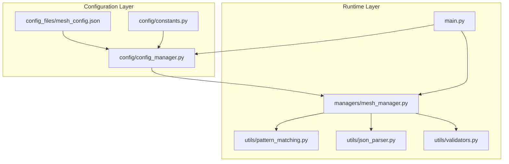
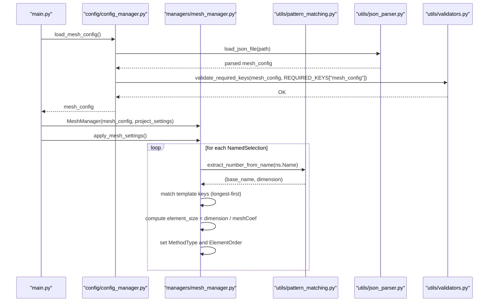
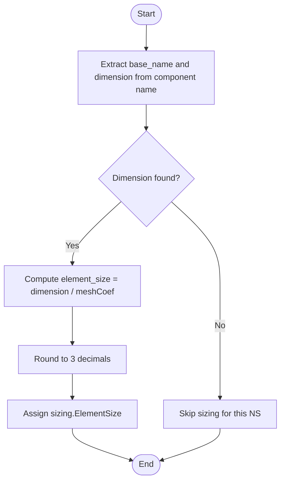
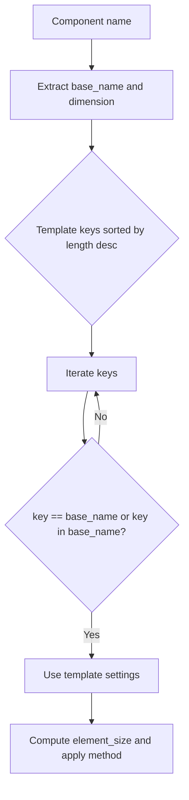
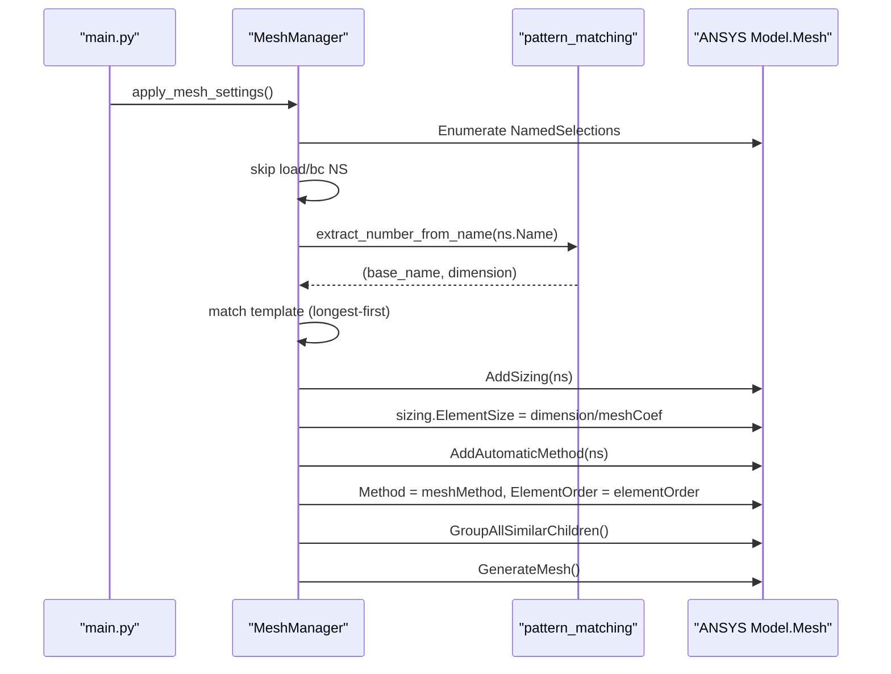
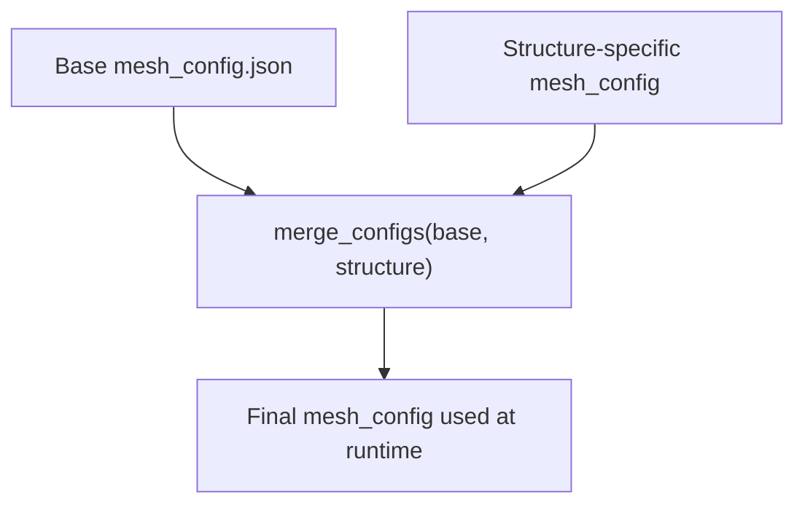
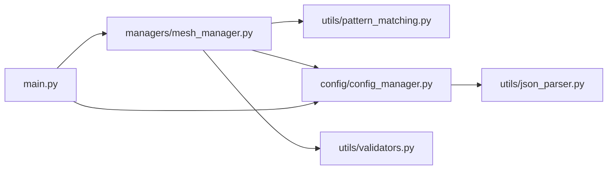

# mesh_config.json

<cite>
**Referenced Files in This Document**
- [mesh_config.json](file://config_files/mesh_config.json)
- [mesh_manager.py](file://managers/mesh_manager.py)
- [pattern_matching.py](file://utils/pattern_matching.py)
- [json_parser.py](file://utils/json_parser.py)
- [config_manager.py](file://config/config_manager.py)
- [constants.py](file://config/constants.py)
- [validators.py](file://utils/validators.py)
- [main.py](file://main.py)
</cite>

## Table of Contents
1. [Introduction](#introduction)
2. [Project Structure](#project-structure)
3. [Core Components](#core-components)
4. [Architecture Overview](#architecture-overview)
5. [Detailed Component Analysis](#detailed-component-analysis)
6. [Dependency Analysis](#dependency-analysis)
7. [Performance Considerations](#performance-considerations)
8. [Troubleshooting Guide](#troubleshooting-guide)
9. [Conclusion](#conclusion)
10. [Appendices](#appendices)

## Introduction
This document explains the mesh_config.json configuration file that defines meshing parameters for different component types in ANSYS models. It describes the structure, how meshCoef scales with geometric dimensions, the significance of meshMethod and elementOrder choices, and how the system integrates with mesh_manager.py to apply these settings. It also covers structure-specific overrides via the configuration hierarchy and best practices for selecting mesh parameters based on component function and analysis type.

## Project Structure
The mesh configuration is part of a layered architecture:
- Configuration files define base settings and defaults.
- A configuration manager loads and validates configuration files, including structure-specific overrides.
- The mesh manager applies settings to named selections in the ANSYS model.

**Diagram sources**
- [mesh_config.json](file://config_files/mesh_config.json#L1-L85)
- [config_manager.py](file://config/config_manager.py#L73-L118)
- [constants.py](file://config/constants.py#L36-L42)
- [mesh_manager.py](file://managers/mesh_manager.py#L1-L104)
- [pattern_matching.py](file://utils/pattern_matching.py#L32-L46)
- [json_parser.py](file://utils/json_parser.py#L142-L170)
- [validators.py](file://utils/validators.py#L93-L110)
- [main.py](file://main.py#L94-L121)

**Section sources**
- [mesh_config.json](file://config_files/mesh_config.json#L1-L85)
- [config_manager.py](file://config/config_manager.py#L73-L118)
- [main.py](file://main.py#L94-L121)

## Core Components
- mesh_config.json: Defines mesh settings per component template. Each key under mesh_settings is a template name (e.g., mbolt, opora, shov) with:
  - meshCoef: Size multiplier used to compute element size from geometric dimensions.
  - meshMethod: Mesh generation method (Sweep, MultiZone, HexDominant).
  - elementOrder: Element order (Linear, Quadratic, ProgramControlled).
- mesh_manager.py: Applies mesh settings to named selections by pattern-matching component names and computing element sizes.
- pattern_matching.py: Provides utilities to extract numeric dimensions from component names and simple wildcard matching.
- config_manager.py: Loads, validates, and merges configuration files, including structure-specific overrides.
- constants.py: Declares required keys and default values for configuration validation.
- validators.py: Validates mesh settings structure and required keys.
- main.py: Orchestrates configuration loading and mesh application during automated analysis setup.

**Section sources**
- [mesh_config.json](file://config_files/mesh_config.json#L1-L85)
- [mesh_manager.py](file://managers/mesh_manager.py#L1-L104)
- [pattern_matching.py](file://utils/pattern_matching.py#L32-L46)
- [config_manager.py](file://config/config_manager.py#L73-L118)
- [constants.py](file://config/constants.py#L36-L42)
- [validators.py](file://utils/validators.py#L93-L110)
- [main.py](file://main.py#L94-L121)

## Architecture Overview
The mesh configuration is loaded and validated, then applied to named selections in the model. The system supports structure-specific overrides that take precedence over base settings.

**Diagram sources**
- [main.py](file://main.py#L94-L121)
- [config_manager.py](file://config/config_manager.py#L73-L118)
- [json_parser.py](file://utils/json_parser.py#L142-L170)
- [validators.py](file://utils/validators.py#L26-L51)
- [mesh_manager.py](file://managers/mesh_manager.py#L1-L104)
- [pattern_matching.py](file://utils/pattern_matching.py#L32-L46)

## Detailed Component Analysis

### mesh_config.json Structure and Semantics
- Top-level key mesh_settings contains component templates keyed by base names (e.g., mbolt, opora, shov).
- Each template defines:
  - meshCoef: Controls element size scaling relative to the extracted dimension from the component name.
  - meshMethod: Selects the automatic mesh method (Sweep, MultiZone, HexDominant).
  - elementOrder: Sets element order (Linear, Quadratic, ProgramControlled).
- Template matching is longest-first to ensure specificity (e.g., a template like opora_niz takes precedence over opora).

Key observations:
- Templates are matched against the base name portion of component names (before the last numeric segment).
- The numeric segment is extracted to compute element size via element_size = dimension / meshCoef.

Example entries:
- mbolt: meshCoef=6.7, meshMethod=Sweep, elementOrder=ProgramControlled.
- opora_niz: meshCoef=3.0, meshMethod=MultiZone, elementOrder=Quadratic.
- shov: meshCoef=1.0, meshMethod=HexDominant, elementOrder=ProgramControlled.

**Section sources**
- [mesh_config.json](file://config_files/mesh_config.json#L1-L85)
- [mesh_manager.py](file://managers/mesh_manager.py#L12-L20)
- [pattern_matching.py](file://utils/pattern_matching.py#L32-L46)

### Element Size Scaling with meshCoef
The mesh manager computes element size from the numeric dimension extracted from the component name:
- Extract base_name and dimension from the component name.
- Compute element_size = round(dimension / meshCoef, 3).
- Assign the computed element size to the sizing for the named selection.

This ensures that larger components receive coarser meshes (smaller meshCoef) while smaller components receive finer meshes (larger meshCoef), balancing accuracy and computational cost.

**Diagram sources**
- [mesh_manager.py](file://managers/mesh_manager.py#L75-L98)
- [pattern_matching.py](file://utils/pattern_matching.py#L32-L46)

**Section sources**
- [mesh_manager.py](file://managers/mesh_manager.py#L75-L98)
- [pattern_matching.py](file://utils/pattern_matching.py#L32-L46)

### Mesh Methods and Their Significance
- Sweep: Suitable for elongated or cylindrical components where structured hexahedral or prism layers are beneficial. Axisymmetric algorithm is selected for sweep-based methods.
- MultiZone: Effective for complex geometries requiring multiple mesh regions or transitions; surface mesh method is tuned accordingly.
- HexDominant: Preferred for thick or solid-like components where hexahedral dominance improves accuracy and reduces computational cost.

These choices align with typical ANSYS meshing strategies for different shapes and loading conditions.

**Section sources**
- [mesh_manager.py](file://managers/mesh_manager.py#L93-L103)

### Template Matching and Longest-First Resolution
- The mesh manager sorts template keys by length in descending order to resolve conflicts.
- For a component name, the base_name is extracted and matched against templates; the first matching template wins.
- This enables specific variants (e.g., opora_niz) to override general ones (e.g., opora).

**Diagram sources**
- [mesh_manager.py](file://managers/mesh_manager.py#L12-L20)
- [mesh_manager.py](file://managers/mesh_manager.py#L58-L74)
- [pattern_matching.py](file://utils/pattern_matching.py#L32-L46)

**Section sources**
- [mesh_manager.py](file://managers/mesh_manager.py#L12-L20)
- [mesh_manager.py](file://managers/mesh_manager.py#L58-L74)

### Example: Component 'mbolt_M12_L50'
- The base_name is mbolt (template key).
- The dimension extracted from the name is used to compute element_size = dimension / meshCoef.
- The template mbolt specifies meshCoef=6.7, meshMethod=Sweep, elementOrder=ProgramControlled.
- The mesh manager applies these settings to the named selection associated with this component.

**Section sources**
- [mesh_config.json](file://config_files/mesh_config.json#L4-L8)
- [mesh_manager.py](file://managers/mesh_manager.py#L75-L98)

### Integration with mesh_manager.py
- The mesh manager is instantiated with mesh_config and project_settings.
- apply_mesh_settings iterates all named selections, skips special-purpose selections (loads/boundary conditions), matches templates, computes element sizes, and sets mesh methods and element orders.
- Automatic methods are configured per template, and grouping and generation finalize the mesh.

**Diagram sources**
- [main.py](file://main.py#L177-L180)
- [mesh_manager.py](file://managers/mesh_manager.py#L20-L39)
- [mesh_manager.py](file://managers/mesh_manager.py#L75-L104)
- [pattern_matching.py](file://utils/pattern_matching.py#L32-L46)

**Section sources**
- [main.py](file://main.py#L177-L180)
- [mesh_manager.py](file://managers/mesh_manager.py#L20-L39)
- [mesh_manager.py](file://managers/mesh_manager.py#L75-L104)

### Structure-Specific Overrides
- Structure-specific configuration files can override base settings.
- The configuration manager loads structure-specific files and merges them into base configurations, with structure-specific values taking priority.
- This allows tailoring mesh settings per structure type while maintaining a shared base.

**Diagram sources**
- [config_manager.py](file://config/config_manager.py#L138-L159)
- [config_manager.py](file://config/config_manager.py#L98-L118)

**Section sources**
- [config_manager.py](file://config/config_manager.py#L98-L118)
- [config_manager.py](file://config/config_manager.py#L138-L159)

### Best Practices for Mesh Parameter Selection
- Choose meshMethod based on geometry:
  - Sweep for long, slender, or axisymmetric parts.
  - MultiZone for complex or mixed-geometry regions.
  - HexDominant for solid-like or thick-walled components.
- Select elementOrder based on analysis type:
  - Linear for coarse studies or when computational cost is a constraint.
  - Quadratic for higher accuracy in stress gradients and curved boundaries.
  - ProgramControlled to leverage solver defaults when appropriate.
- Adjust meshCoef to balance accuracy and cost:
  - Larger meshCoef for finer meshes on small features.
  - Smaller meshCoef for coarser meshes on large features.
- Prefer specific templates for critical components (e.g., opora_niz vs opora) to capture local behavior accurately.

[No sources needed since this section provides general guidance]

## Dependency Analysis
- mesh_manager.py depends on:
  - pattern_matching.py for extracting base_name and dimension.
  - constants.py and validators.py indirectly via configuration loading and validation.
- config_manager.py loads and merges mesh_config.json, validating required keys and structure.
- main.py orchestrates loading and application of mesh settings.

**Diagram sources**
- [mesh_manager.py](file://managers/mesh_manager.py#L1-L104)
- [pattern_matching.py](file://utils/pattern_matching.py#L32-L46)
- [config_manager.py](file://config/config_manager.py#L73-L118)
- [json_parser.py](file://utils/json_parser.py#L142-L170)
- [main.py](file://main.py#L94-L121)

**Section sources**
- [mesh_manager.py](file://managers/mesh_manager.py#L1-L104)
- [config_manager.py](file://config/config_manager.py#L73-L118)
- [main.py](file://main.py#L94-L121)

## Performance Considerations
- Template sorting by length ensures efficient and predictable matching.
- Skipping load/boundary-condition named selections avoids unnecessary mesh operations.
- Using rounded element sizes reduces floating-point noise and improves mesh stability.
- MultiZone and HexDominant can reduce element count compared to purely tetrahedral meshes for complex geometries.

[No sources needed since this section provides general guidance]

## Troubleshooting Guide
Common issues and resolutions:
- Missing required keys in mesh_config.json:
  - Ensure mesh_settings is present and each template includes meshCoef, meshMethod, and elementOrder.
- Invalid mesh settings structure:
  - Use validators to confirm required keys and correct types.
- Template not applied:
  - Verify the base_name extraction and that a matching template exists.
  - Confirm the component name contains a numeric dimension suitable for meshCoef scaling.
- Special named selections ignored:
  - Load/boundary-condition patterns are intentionally skipped; ensure your component names do not match these patterns.
- Structure-specific overrides not taking effect:
  - Confirm the structure-specific configuration file exists and is loadable.
  - Ensure the merge operation prioritizes structure-specific values.

**Section sources**
- [validators.py](file://utils/validators.py#L26-L51)
- [validators.py](file://utils/validators.py#L93-L110)
- [mesh_manager.py](file://managers/mesh_manager.py#L41-L57)
- [config_manager.py](file://config/config_manager.py#L138-L159)

## Conclusion
mesh_config.json centralizes mesh parameterization for ANSYS automation by associating component templates with method and order choices and scaling element sizes via meshCoef. The mesh manager applies these settings by pattern-matching component names, extracting dimensions, and configuring automatic mesh methods. Structure-specific overrides enable tailored behavior per project type. Following best practices for method selection, element order, and meshCoef tuning yields robust and efficient meshes aligned with component function and analysis goals.

[No sources needed since this section summarizes without analyzing specific files]

## Appendices

### Appendix A: Configuration Loading and Validation Flow
- Configuration files are located and loaded by the configuration manager.
- Required keys are validated, and structure-specific overrides are merged.
- The mesh manager receives the final configuration and applies it to named selections.

**Section sources**
- [config_manager.py](file://config/config_manager.py#L73-L118)
- [json_parser.py](file://utils/json_parser.py#L142-L170)
- [validators.py](file://utils/validators.py#L26-L51)
- [constants.py](file://config/constants.py#L36-L42)