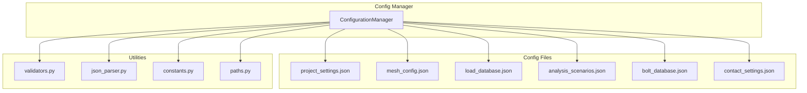
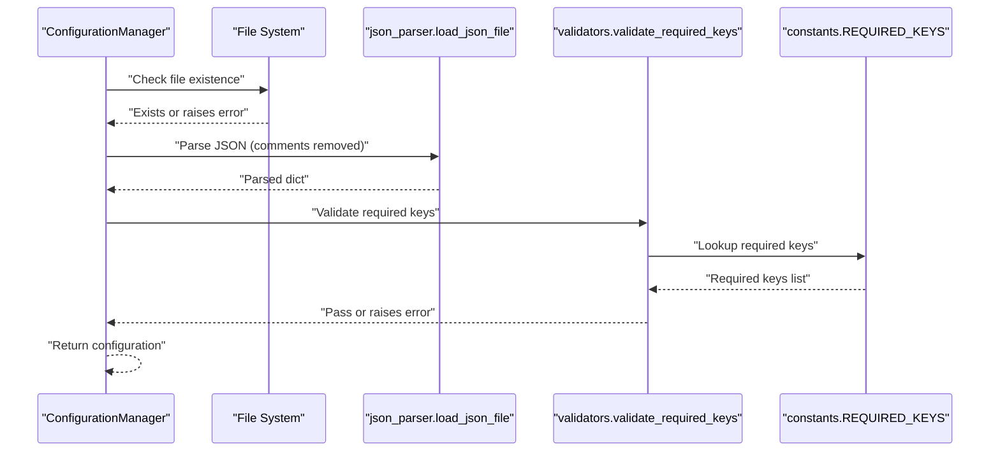
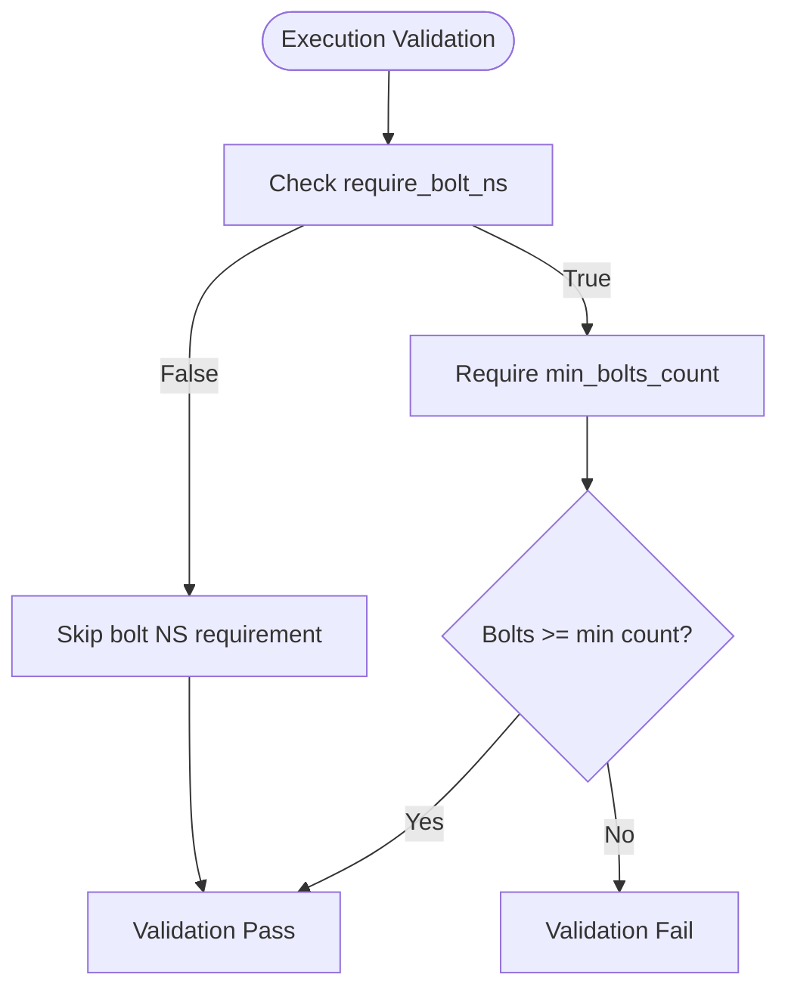
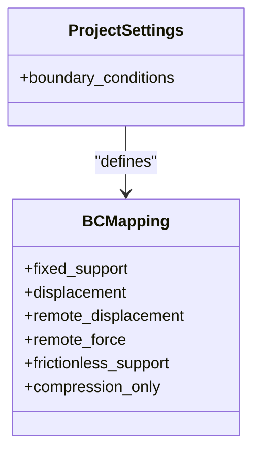
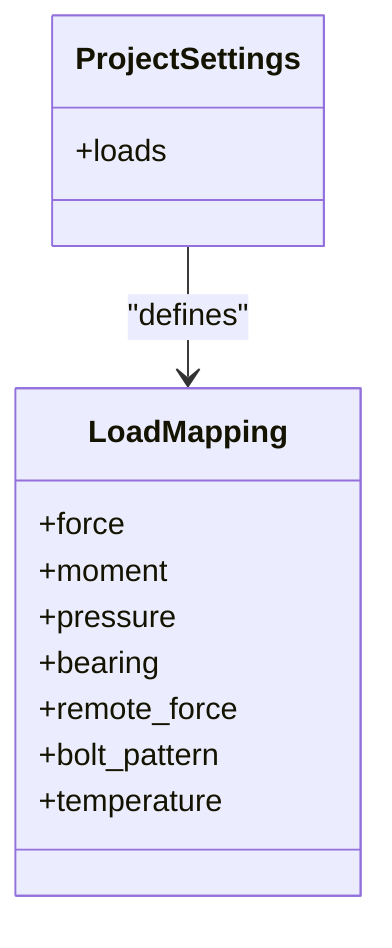
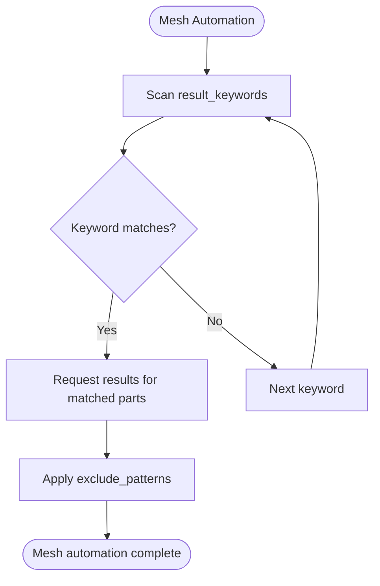
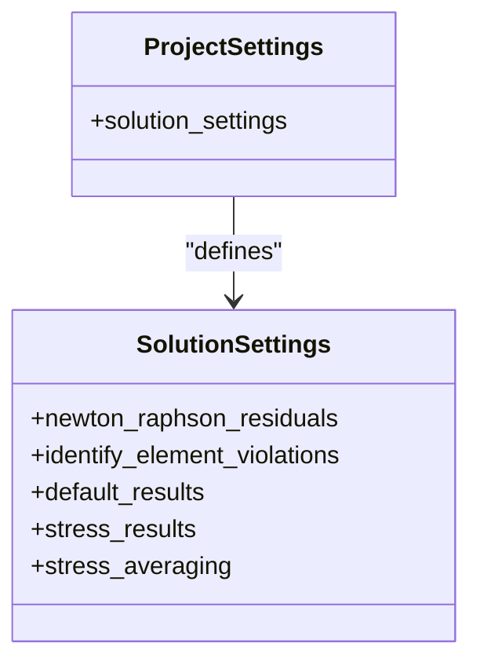
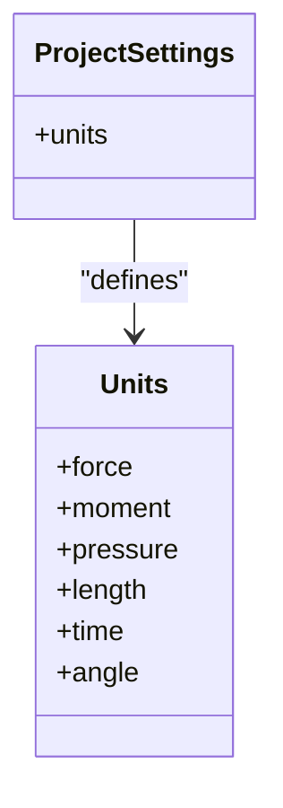
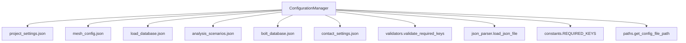

# project_settings.json

<cite>
**Referenced Files in This Document**
- [project_settings.json](file://config_files/project_settings.json)
- [config_manager.py](file://config/config_manager.py)
- [validators.py](file://utils/validators.py)
- [constants.py](file://config/constants.py)
- [paths.py](file://config/paths.py)
- [json_parser.py](file://utils/json_parser.py)
- [mesh_config.json](file://config_files/mesh_config.json)
- [load_database.json](file://config_files/load_database.json)
- [analysis_scenarios.json](file://config_files/analysis_scenarios.json)
- [bolt_database.json](file://config_files/bolt_database.json)
- [contact_settings.json](file://config_files/contact_settings.json)
</cite>

## Table of Contents
1. [Introduction](#introduction)
2. [Project Structure](#project-structure)
3. [Core Components](#core-components)
4. [Architecture Overview](#architecture-overview)
5. [Detailed Component Analysis](#detailed-component-analysis)
6. [Dependency Analysis](#dependency-analysis)
7. [Performance Considerations](#performance-considerations)
8. [Troubleshooting Guide](#troubleshooting-guide)
9. [Conclusion](#conclusion)
10. [Appendices](#appendices)

## Introduction
This document provides comprehensive reference documentation for project_settings.json, the primary configuration file for global parameters in the AnsysAutomation system. It explains each configuration section, how the configuration is loaded and validated, and how key arrays like result_keywords and exclude_patterns drive automation. It also covers unit definitions, execution settings, boundary condition mappings, load type definitions, mesh defaults, solution settings, and guidance for extending boundary conditions and loads for custom ANSYS setups.

## Project Structure
The project organizes configuration files under a dedicated folder and loads them through a centralized configuration manager. The project_settings.json file defines global project metadata, execution behavior, boundary condition mappings, load definitions, mesh defaults, solution settings, and units. Supporting configuration files define mesh settings per part category, load databases, analysis scenarios, bolt properties, and contact settings.

**Diagram sources**
- [config_manager.py](file://config/config_manager.py#L1-L209)
- [project_settings.json](file://config_files/project_settings.json#L1-L56)
- [mesh_config.json](file://config_files/mesh_config.json#L1-L85)
- [load_database.json](file://config_files/load_database.json#L1-L414)
- [analysis_scenarios.json](file://config_files/analysis_scenarios.json#L1-L55)
- [bolt_database.json](file://config_files/bolt_database.json#L1-L47)
- [contact_settings.json](file://config_files/contact_settings.json#L1-L130)
- [validators.py](file://utils/validators.py#L1-L161)
- [json_parser.py](file://utils/json_parser.py#L1-L170)
- [constants.py](file://config/constants.py#L1-L99)
- [paths.py](file://config/paths.py#L1-L73)

**Section sources**
- [config_manager.py](file://config/config_manager.py#L1-L209)
- [paths.py](file://config/paths.py#L1-L73)

## Core Components
This section describes each major section of project_settings.json and its role in the automation pipeline.

- Project metadata
  - name: Human-readable project name.
  - version: Version string for the project configuration.
  - description: Short description of the project’s purpose.
  - Purpose: Provides identity and context for the entire automation workflow.

- Execution settings
  - name_pattern: Regular expression used to identify model executions by name.
  - default_execution: Default execution identifier used when none is specified.
  - validation.require_bolt_ns: Boolean flag requiring the presence of a specific named selection for bolts.
  - validation.min_bolts_count: Minimum number of bolts required for validation.
  - Purpose: Establishes how models are identified and validated during execution.

- Boundary condition mappings
  - Keys represent internal boundary condition types; values are the corresponding named selection names used in the ANSYS model.
  - Includes fixed_support, displacement, remote_displacement, remote_force, frictionless_support, compression_only.
  - Purpose: Decouples internal automation logic from specific ANSYS named selection naming conventions.

- Loads
  - Keys represent internal load types; values are the corresponding named selection names used in the ANSYS model.
  - Includes force, moment, pressure, bearing, remote_force, bolt_pattern, temperature.
  - bolt_pattern supports wildcard patterns to match multiple bolt-related named selections.
  - Purpose: Standardizes load application across different models and scenarios.

- Mesh defaults
  - default_element_order: Default element order for mesh generation.
  - result_keywords: Array of keywords used to automatically request results for specific parts or assemblies.
  - exclude_patterns: Array of patterns used to exclude certain named selections from being configured.
  - sweep_algorithm: Default sweep algorithm for mesh generation.
  - Purpose: Provides sensible defaults and automation triggers for meshing and result requests.

- Solution settings
  - newton_raphson_residuals: Residual threshold for Newton-Raphson convergence.
  - identify_element_violations: Threshold for identifying element violations.
  - default_results: Array of default result types to request.
  - stress_results: Mapping of keywords to specific stress result types; includes a default fallback.
  - stress_averaging: Averaging method for stress results.
  - Purpose: Controls solver convergence behavior and result types.

- Units
  - force, moment, pressure, length, time, angle: Unit definitions used throughout the automation.
  - Purpose: Ensures consistent unit handling across all calculations and result interpretation.

**Section sources**
- [project_settings.json](file://config_files/project_settings.json#L1-L56)
- [constants.py](file://config/constants.py#L1-L99)

## Architecture Overview
The configuration loading and validation pipeline ensures that project_settings.json is present, readable, and structurally sound before being used by the automation system.

**Diagram sources**
- [config_manager.py](file://config/config_manager.py#L26-L83)
- [validators.py](file://utils/validators.py#L26-L50)
- [constants.py](file://config/constants.py#L35-L42)
- [json_parser.py](file://utils/json_parser.py#L142-L170)

## Detailed Component Analysis

### Project Metadata
- Fields: name, version, description.
- Behavior: Used for logging, reporting, and project identification.
- Validation: Not enforced by the project_settings validator; included for completeness.

**Section sources**
- [project_settings.json](file://config_files/project_settings.json#L3-L7)

### Execution Settings
- name_pattern: Regular expression used to identify model executions by name.
- default_execution: Default execution identifier used when none is specified.
- validation.require_bolt_ns: Boolean flag requiring the presence of a specific named selection for bolts.
- validation.min_bolts_count: Minimum number of bolts required for validation.
- Purpose: Establishes how models are identified and validated during execution.

**Diagram sources**
- [project_settings.json](file://config_files/project_settings.json#L8-L15)

**Section sources**
- [project_settings.json](file://config_files/project_settings.json#L8-L15)

### Boundary Condition Mappings
- Keys: fixed_support, displacement, remote_displacement, remote_force, frictionless_support, compression_only.
- Values: Named selection names used in the ANSYS model.
- Purpose: Decouple internal automation logic from specific ANSYS naming conventions.

**Diagram sources**
- [project_settings.json](file://config_files/project_settings.json#L16-L23)

**Section sources**
- [project_settings.json](file://config_files/project_settings.json#L16-L23)

### Load Type Definitions
- Keys: force, moment, pressure, bearing, remote_force, bolt_pattern, temperature.
- Values: Named selection names or wildcard patterns for bolt-related loads.
- bolt_pattern supports wildcards to match multiple bolt-related named selections.

**Diagram sources**
- [project_settings.json](file://config_files/project_settings.json#L24-L32)

**Section sources**
- [project_settings.json](file://config_files/project_settings.json#L24-L32)

### Mesh Defaults
- default_element_order: Default element order for mesh generation.
- result_keywords: Array of keywords used to automatically request results for specific parts or assemblies.
- exclude_patterns: Array of patterns used to exclude certain named selections from being configured.
- sweep_algorithm: Default sweep algorithm for mesh generation.
- Integration: Mesh settings per part category are defined in mesh_config.json; project_settings.json provides defaults and global automation triggers.

**Diagram sources**
- [project_settings.json](file://config_files/project_settings.json#L33-L38)
- [mesh_config.json](file://config_files/mesh_config.json#L1-L85)

**Section sources**
- [project_settings.json](file://config_files/project_settings.json#L33-L38)
- [mesh_config.json](file://config_files/mesh_config.json#L1-L85)

### Solution Settings
- newton_raphson_residuals: Residual threshold for Newton-Raphson convergence.
- identify_element_violations: Threshold for identifying element violations.
- default_results: Array of default result types to request.
- stress_results: Mapping of keywords to specific stress result types; includes a default fallback.
- stress_averaging: Averaging method for stress results.

**Diagram sources**
- [project_settings.json](file://config_files/project_settings.json#L39-L48)

**Section sources**
- [project_settings.json](file://config_files/project_settings.json#L39-L48)

### Units
- force, moment, pressure, length, time, angle: Unit definitions used throughout the automation.
- Purpose: Ensures consistent unit handling across all calculations and result interpretation.

**Diagram sources**
- [project_settings.json](file://config_files/project_settings.json#L49-L55)
- [constants.py](file://config/constants.py#L92-L99)

**Section sources**
- [project_settings.json](file://config_files/project_settings.json#L49-L55)
- [constants.py](file://config/constants.py#L92-L99)

## Dependency Analysis
The configuration manager orchestrates loading and validation of project_settings.json and integrates with supporting configuration files.

**Diagram sources**
- [config_manager.py](file://config/config_manager.py#L1-L209)
- [validators.py](file://utils/validators.py#L26-L50)
- [json_parser.py](file://utils/json_parser.py#L142-L170)
- [constants.py](file://config/constants.py#L35-L42)
- [paths.py](file://config/paths.py#L20-L44)

**Section sources**
- [config_manager.py](file://config/config_manager.py#L1-L209)
- [paths.py](file://config/paths.py#L20-L44)

## Performance Considerations
- result_keywords and exclude_patterns enable targeted automation for result requests and named selection configuration, reducing unnecessary processing.
- Using wildcard patterns in bolt_pattern minimizes manual configuration overhead while maintaining specificity.
- Default element order and sweep algorithm choices impact mesh generation speed and quality; tune these based on model complexity.

[No sources needed since this section provides general guidance]

## Troubleshooting Guide
Common issues and resolutions when working with project_settings.json:

- Missing required keys
  - Symptom: Validation errors indicating missing keys.
  - Resolution: Ensure all required keys are present as defined in the validation rules.

- File not found
  - Symptom: Exceptions indicating the configuration file was not found.
  - Resolution: Verify the configuration path and file existence.

- Malformed JSON or comments
  - Symptom: Parsing errors when loading the configuration.
  - Resolution: Remove unsupported comment syntax or ensure valid JSON formatting.

- Execution validation failures
  - Symptom: Errors related to bolt named selection requirements or minimum bolt counts.
  - Resolution: Configure the required named selections and meet the minimum bolt count.

- Unsupported or incorrect values
  - Symptom: Errors related to invalid values in boundary conditions, loads, or solution settings.
  - Resolution: Align values with supported options and ensure correct data types.

**Section sources**
- [validators.py](file://utils/validators.py#L26-L50)
- [json_parser.py](file://utils/json_parser.py#L142-L170)
- [project_settings.json](file://config_files/project_settings.json#L8-L15)

## Conclusion
project_settings.json centralizes global automation parameters for the AnsysAutomation system. It defines how models are identified and validated, maps internal boundary condition and load types to ANSYS named selections, sets mesh defaults and automation triggers, controls solution settings, and establishes unit definitions. The configuration manager enforces structural validation and integrates with supporting configuration files to provide a robust, extensible automation framework.

[No sources needed since this section summarizes without analyzing specific files]

## Appendices

### Validation Rules Enforced by config_manager.py
- Required keys for project_settings.json are defined centrally and enforced during loading.
- The configuration manager checks for file existence and validates structure before returning the configuration.

**Section sources**
- [config_manager.py](file://config/config_manager.py#L52-L83)
- [constants.py](file://config/constants.py#L35-L42)

### Extending Boundary Conditions and Loads for Custom ANSYS Setups
- Add new boundary condition keys and corresponding named selection values in the boundary_conditions section.
- Add new load type keys and corresponding named selection values or wildcard patterns in the loads section.
- Ensure that any new keys align with downstream automation logic and that named selections exist in the ANSYS model.

**Section sources**
- [project_settings.json](file://config_files/project_settings.json#L16-L32)

### Example Configurations by Project Type
- Typical configuration sections and their roles are illustrated in the project_settings.json file. Use these sections as templates for new projects, adjusting values to match the target ANSYS model and automation requirements.

**Section sources**
- [project_settings.json](file://config_files/project_settings.json#L1-L56)