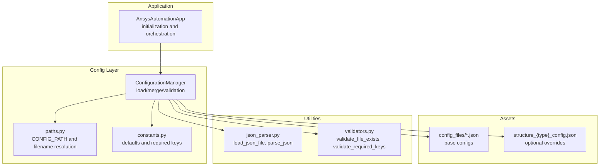
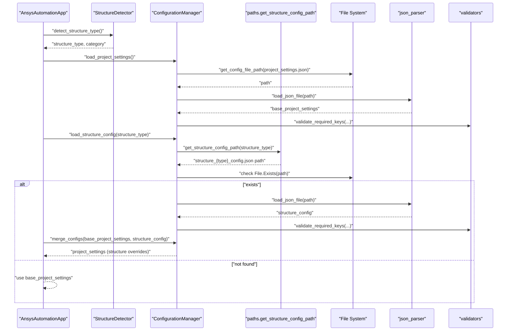
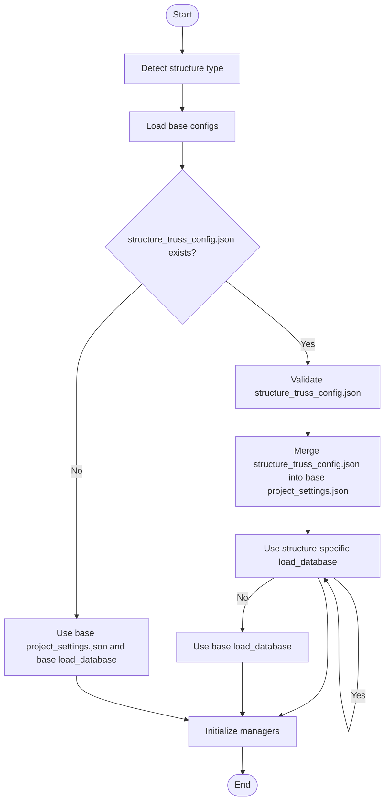
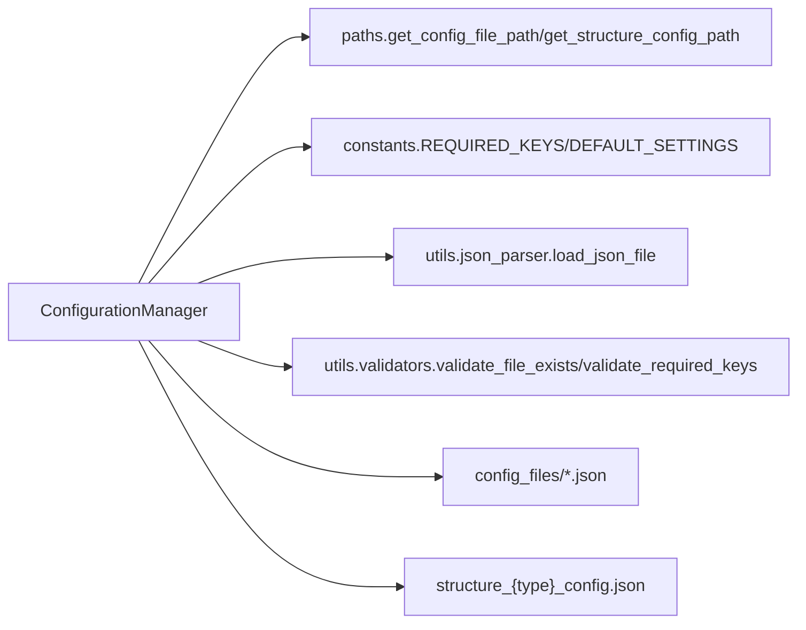

# Configuration Hierarchy

<cite>
**Referenced Files in This Document**
- [main.py](file://main.py)
- [config/config_manager.py](file://config/config_manager.py)
- [config/paths.py](file://config/paths.py)
- [config/constants.py](file://config/constants.py)
- [config_files/project_settings.json](file://config_files/project_settings.json)
- [config_files/mesh_config.json](file://config_files/mesh_config.json)
- [config_files/analysis_scenarios.json](file://config_files/analysis_scenarios.json)
- [config_files/bolt_database.json](file://config_files/bolt_database.json)
- [config_files/contact_settings.json](file://config_files/contact_settings.json)
- [utils/json_parser.py](file://utils/json_parser.py)
- [utils/validators.py](file://utils/validators.py)
</cite>

## Table of Contents
1. [Introduction](#introduction)
2. [Project Structure](#project-structure)
3. [Core Components](#core-components)
4. [Architecture Overview](#architecture-overview)
5. [Detailed Component Analysis](#detailed-component-analysis)
6. [Dependency Analysis](#dependency-analysis)
7. [Performance Considerations](#performance-considerations)
8. [Troubleshooting Guide](#troubleshooting-guide)
9. [Conclusion](#conclusion)
10. [Appendices](#appendices)

## Introduction
This document explains the configuration hierarchy system centered around ConfigurationManager. It describes how base configurations are loaded from config_files, how optional structure-specific overrides are located via get_structure_config_path(), and how precedence is determined so that structure-specific settings override base settings. It also illustrates the end-to-end flow from AnsysAutomationApp initialization through structure detection to configuration loading, and provides a practical example for a truss structure type. Finally, it covers fallback behavior when structure-specific files are missing and how default configurations from constants.py are applied, along with best practices for organizing structure-specific configuration files and maintaining backward compatibility.

## Project Structure
The configuration system spans several modules:
- Configuration manager: central logic for loading, validating, merging, and defaulting configurations
- Paths module: resolves base configuration directory and structure-specific filenames
- Constants: provides default values and required keys for validation
- JSON files: base configuration assets under config_files
- Utilities: JSON parsing and validation helpers

**Diagram sources**
- [main.py](file://main.py#L51-L121)
- [config/config_manager.py](file://config/config_manager.py#L26-L180)
- [config/paths.py](file://config/paths.py#L10-L44)
- [config/constants.py](file://config/constants.py#L6-L99)
- [utils/json_parser.py](file://utils/json_parser.py#L142-L170)
- [utils/validators.py](file://utils/validators.py#L9-L24)

**Section sources**
- [main.py](file://main.py#L51-L121)
- [config/config_manager.py](file://config/config_manager.py#L26-L180)
- [config/paths.py](file://config/paths.py#L10-L44)
- [config/constants.py](file://config/constants.py#L6-L99)

## Core Components
- ConfigurationManager: Loads base configs, validates structure, loads optional structure-specific config, merges them, and provides defaults when needed.
- Paths module: Defines CONFIG_PATH and exposes get_config_file_path() and get_structure_config_path().
- Constants: Supplies DEFAULT_SETTINGS and REQUIRED_KEYS used for validation and fallback defaults.
- JSON files: Base configuration assets (project_settings.json, mesh_config.json, analysis_scenarios.json, bolt_database.json, contact_settings.json).
- Utilities: JSON parsing and validation helpers used by ConfigurationManager.

Key responsibilities:
- Base configuration loading: project_settings, mesh_config, load_database, analysis_scenarios, bolt_database, contact_settings
- Structure-specific override loading: structure_{type}_config.json
- Precedence: structure-specific overrides take priority over base settings
- Validation: required keys enforced per file type
- Defaults: fallback values from constants when structure-specific files are absent

**Section sources**
- [config/config_manager.py](file://config/config_manager.py#L26-L180)
- [config/paths.py](file://config/paths.py#L10-L44)
- [config/constants.py](file://config/constants.py#L6-L99)
- [utils/json_parser.py](file://utils/json_parser.py#L142-L170)
- [utils/validators.py](file://utils/validators.py#L9-L24)

## Architecture Overview
The configuration hierarchy follows a layered approach:
- Base configurations are loaded from config_files using get_config_file_path()
- Structure-specific overrides are optionally loaded using get_structure_config_path()
- Precedence is structure-specific over base for overlapping keys
- Validation ensures required keys exist for each file type
- Defaults are applied when structure-specific files are missing

**Diagram sources**
- [main.py](file://main.py#L69-L121)
- [config/config_manager.py](file://config/config_manager.py#L73-L137)
- [config/paths.py](file://config/paths.py#L20-L44)
- [utils/json_parser.py](file://utils/json_parser.py#L142-L170)
- [utils/validators.py](file://utils/validators.py#L26-L49)

## Detailed Component Analysis

### ConfigurationManager
Responsibilities:
- Load individual base configs via get_config_file_path()
- Validate each config against REQUIRED_KEYS for its type
- Load optional structure-specific config via get_structure_config_path()
- Merge structure-specific overrides into base configs with recursive dictionary merge
- Provide defaults when structure-specific files are missing
- Validate that required base files exist and optionally report presence of structure-specific config

Precedence model:
- For overlapping keys, structure-specific values override base values
- For nested dicts, merge is recursive
- Non-dict values replace base values

Defaulting:
- create_default_config() returns defaults from constants.py for supported types

Validation:
- _validate_config_structure() checks required keys per file type
- validate_config_hierarchy() enumerates required base files and checks structure-specific presence

**Section sources**
- [config/config_manager.py](file://config/config_manager.py#L26-L180)
- [config/constants.py](file://config/constants.py#L6-L99)

### Paths Module
Responsibilities:
- Define CONFIG_PATH (base directory for configuration files)
- Provide get_config_file_path() to resolve base config filenames
- Provide get_structure_config_path() to resolve structure-specific filenames as structure_{type}_config.json
- Validate CONFIG_PATH existence

Filename resolution:
- Base files: project_settings.json, mesh_config.json, load_database.json, analysis_scenarios.json, bolt_database.json, contact_settings.json
- Structure-specific files: structure_{structure_type}_config.json

**Section sources**
- [config/paths.py](file://config/paths.py#L10-L44)

### JSON Parsing and Validation
Responsibilities:
- load_json_file(): reads file, strips comments, removes whitespace, parses into Python objects
- validate_file_exists(): raises if file not found
- validate_required_keys(): enforces required keys per file type

Integration:
- ConfigurationManager uses these utilities to load and validate configs

**Section sources**
- [utils/json_parser.py](file://utils/json_parser.py#L142-L170)
- [utils/validators.py](file://utils/validators.py#L9-L24)
- [utils/validators.py](file://utils/validators.py#L26-L49)

### Practical Example: Truss Structure Type
Suppose the model name yields structure_type "truss". The flow is:

1. AnsysAutomationApp initializes and validates CONFIG_PATH
2. Detects structure type and collects model info
3. Loads base configs:
   - project_settings.json
   - mesh_config.json
   - load_database.json
   - analysis_scenarios.json
   - bolt_database.json
   - contact_settings.json
4. Attempts to load structure_truss_config.json via get_structure_config_path("truss")
5. If present:
   - Validates structure_truss_config.json against required keys
   - Merges structure_truss_config.json into base project_settings.json (structure overrides)
   - If structure_truss_config.json contains a load_database key, uses it; otherwise uses base load_database
6. If absent:
   - Uses base project_settings.json and base load_database.json
7. Initializes managers with merged settings

**Diagram sources**
- [main.py](file://main.py#L94-L121)
- [config/config_manager.py](file://config/config_manager.py#L119-L159)
- [config/paths.py](file://config/paths.py#L32-L44)

**Section sources**
- [main.py](file://main.py#L69-L121)
- [config/config_manager.py](file://config/config_manager.py#L119-L159)
- [config/paths.py](file://config/paths.py#L32-L44)

### Fallback Behavior and Defaults
Fallback mechanisms:
- If structure-specific config file is missing, the system falls back to base project_settings.json and base load_database.json
- Defaults for unsupported config types are provided by create_default_config(), which draws from DEFAULT_SETTINGS, DEFAULT_ANALYSIS_SCENARIO, DEFAULT_CONTACT_SETTINGS, DEFAULT_BOLT_DIAMETER, DEFAULT_BOLT_PRETENSION
- validate_config_hierarchy() reports missing base files and whether structure-specific config is present

**Section sources**
- [config/config_manager.py](file://config/config_manager.py#L161-L180)
- [config/config_manager.py](file://config/config_manager.py#L181-L209)
- [config/constants.py](file://config/constants.py#L6-L99)

### Best Practices for Structure-Specific Configurations
- Naming convention: structure_{type}_config.json
- Place structure-specific files alongside base configs under CONFIG_PATH
- Keep structure-specific files minimal; only include overrides
- Validate structure-specific files against the same required keys as base files
- Maintain backward compatibility by avoiding breaking changes to base keys; introduce new keys instead
- Use recursive merge semantics to preserve nested structures while overriding only targeted keys
- Provide defaults via create_default_config() for new config types to ensure graceful fallback

**Section sources**
- [config/paths.py](file://config/paths.py#L32-L44)
- [config/config_manager.py](file://config/config_manager.py#L161-L180)
- [config/constants.py](file://config/constants.py#L6-L99)

## Dependency Analysis
ConfigurationManager depends on:
- paths.get_config_file_path() and get_structure_config_path() for resolving file locations
- constants.DEFAULT_SETTINGS and REQUIRED_KEYS for defaults and validation
- utils.json_parser.load_json_file() and utils.validators.validate_file_exists/validate_required_keys() for robust loading and validation

**Diagram sources**
- [config/config_manager.py](file://config/config_manager.py#L26-L180)
- [config/paths.py](file://config/paths.py#L20-L44)
- [config/constants.py](file://config/constants.py#L6-L99)
- [utils/json_parser.py](file://utils/json_parser.py#L142-L170)
- [utils/validators.py](file://utils/validators.py#L9-L24)

**Section sources**
- [config/config_manager.py](file://config/config_manager.py#L26-L180)
- [config/paths.py](file://config/paths.py#L20-L44)
- [config/constants.py](file://config/constants.py#L6-L99)
- [utils/json_parser.py](file://utils/json_parser.py#L142-L170)
- [utils/validators.py](file://utils/validators.py#L9-L24)

## Performance Considerations
- File I/O: Each base config and optional structure-specific config triggers disk access; cache results at runtime if reused across managers
- JSON parsing: Comments are stripped and whitespace removed before parsing; keep config files compact
- Validation overhead: validate_required_keys() iterates required keys; keep lists concise and centralized
- Merge complexity: merge_configs() performs recursive dictionary merge; avoid excessively deep nested structures in overrides

[No sources needed since this section provides general guidance]

## Troubleshooting Guide
Common issues and resolutions:
- Missing base configuration files: validate_config_hierarchy() reports missing files; ensure CONFIG_PATH contains all base JSON files
- Structure-specific file not found: ConfigurationManager.load_structure_config() returns None; verify filename structure_{type}_config.json and CONFIG_PATH
- Invalid structure-specific file: validate_required_keys() raises errors; confirm required keys for the file type
- JSON parsing errors: load_json_file() raises exceptions for missing files or malformed content; remove comments and ensure valid JSON
- Unexpected defaults: if structure-specific file is missing, defaults from constants.py apply; add structure-specific config to override

**Section sources**
- [config/config_manager.py](file://config/config_manager.py#L181-L209)
- [utils/validators.py](file://utils/validators.py#L26-L49)
- [utils/json_parser.py](file://utils/json_parser.py#L142-L170)

## Conclusion
The configuration hierarchy cleanly separates base settings from optional structure-specific overrides. ConfigurationManager orchestrates loading, validation, and merging with clear precedence rules. The system gracefully falls back to defaults when structure-specific files are absent, and provides robust validation and error reporting. Following the naming and placement conventions ensures maintainable, backward-compatible configurations across versions.

[No sources needed since this section summarizes without analyzing specific files]

## Appendices

### Configuration Files Overview
- project_settings.json: project metadata, execution patterns, boundary conditions, loads, mesh settings, solution settings, units
- mesh_config.json: per-body mesh settings keyed by body patterns
- analysis_scenarios.json: standard sequences and detailed analysis setups
- bolt_database.json: bolt sizes and pretension defaults
- contact_settings.json: contact rules and advanced settings

**Section sources**
- [config_files/project_settings.json](file://config_files/project_settings.json#L1-L56)
- [config_files/mesh_config.json](file://config_files/mesh_config.json#L1-L85)
- [config_files/analysis_scenarios.json](file://config_files/analysis_scenarios.json#L1-L55)
- [config_files/bolt_database.json](file://config_files/bolt_database.json#L1-L47)
- [config_files/contact_settings.json](file://config_files/contact_settings.json#L1-L130)