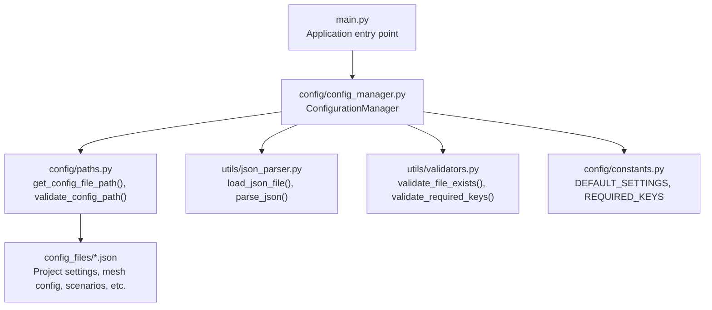
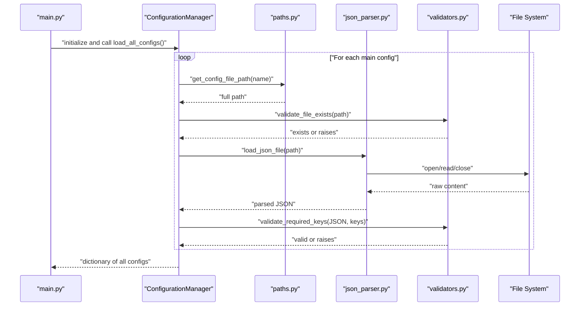
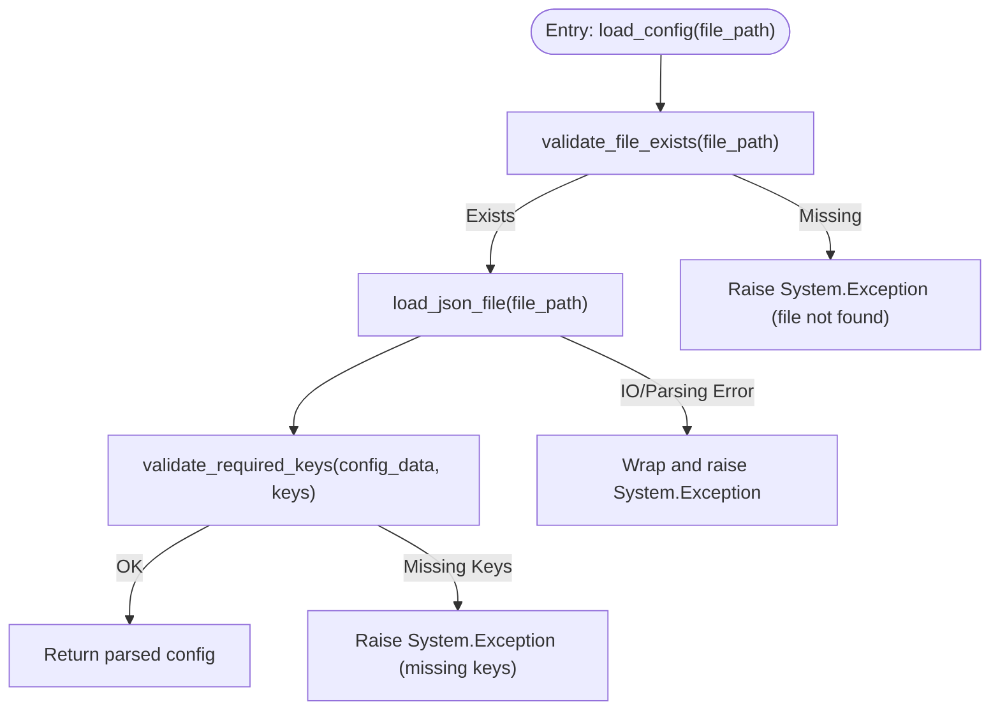
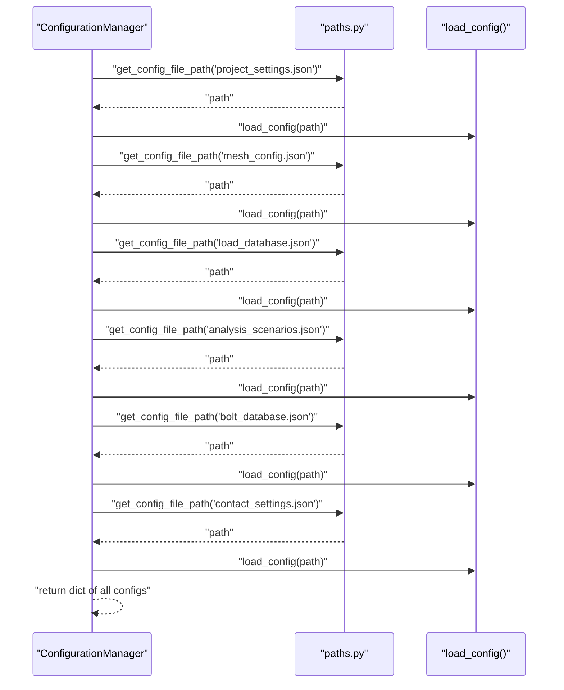
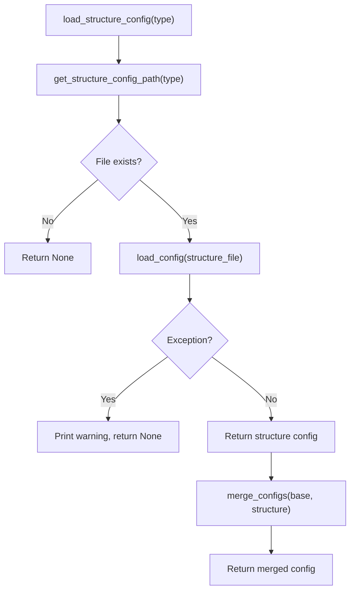
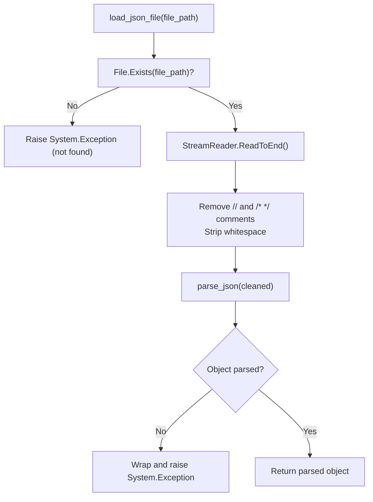
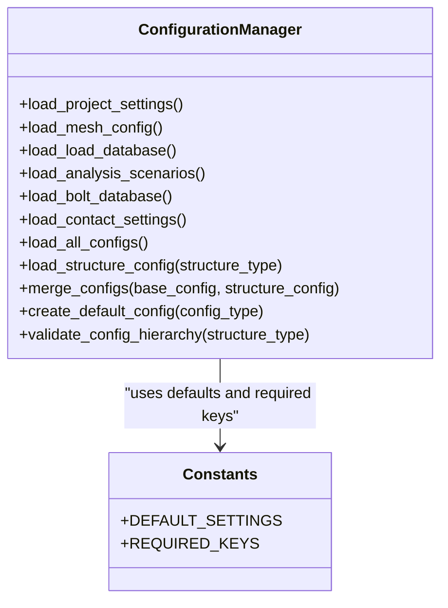
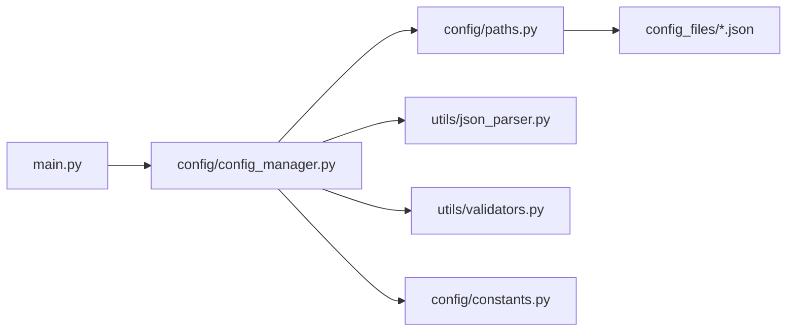

# Configuration Loading Mechanism

<cite>
**Referenced Files in This Document**
- [config_manager.py](file://config/config_manager.py)
- [paths.py](file://config/paths.py)
- [json_parser.py](file://utils/json_parser.py)
- [validators.py](file://utils/validators.py)
- [constants.py](file://config/constants.py)
- [main.py](file://main.py)
- [project_settings.json](file://config_files/project_settings.json)
- [mesh_config.json](file://config_files/mesh_config.json)
- [analysis_scenarios.json](file://config_files/analysis_scenarios.json)
</cite>

## Table of Contents
1. [Introduction](#introduction)
2. [Project Structure](#project-structure)
3. [Core Components](#core-components)
4. [Architecture Overview](#architecture-overview)
5. [Detailed Component Analysis](#detailed-component-analysis)
6. [Dependency Analysis](#dependency-analysis)
7. [Performance Considerations](#performance-considerations)
8. [Troubleshooting Guide](#troubleshooting-guide)
9. [Conclusion](#conclusion)

## Introduction
This document explains the configuration loading mechanism implemented in the ConfigurationManager class. It covers how JSON configuration files are discovered, loaded from disk, validated, and integrated into the application. The process includes:
- Resolving configuration file paths via get_config_file_path()
- Loading and parsing JSON content using load_json_file() from utils.json_parser
- Validating file existence via validate_file_exists()
- Validating required keys per configuration type
- Orchestrating the loading of six main configuration files through load_all_configs()
- Handling errors by wrapping them in System.Exception with contextual messages
- Supporting structure-specific configuration merging and fallback defaults

## Project Structure
The configuration loading pipeline spans several modules:
- config/config_manager.py: Central orchestrator for loading and validating configurations
- config/paths.py: Path resolution utilities and configuration directory validation
- utils/json_parser.py: Low-level JSON loader with comment removal and parsing helpers
- utils/validators.py: Validation utilities for file existence and required keys
- config/constants.py: Defaults and required keys for validation
- main.py: Application entry point that initializes and uses ConfigurationManager

**Diagram sources**
- [main.py](file://main.py#L51-L121)
- [config_manager.py](file://config/config_manager.py#L26-L118)
- [paths.py](file://config/paths.py#L20-L44)
- [json_parser.py](file://utils/json_parser.py#L142-L170)
- [validators.py](file://utils/validators.py#L9-L24)
- [constants.py](file://config/constants.py#L36-L42)

**Section sources**
- [main.py](file://main.py#L51-L121)
- [config_manager.py](file://config/config_manager.py#L26-L118)
- [paths.py](file://config/paths.py#L20-L44)
- [json_parser.py](file://utils/json_parser.py#L142-L170)
- [validators.py](file://utils/validators.py#L9-L24)
- [constants.py](file://config/constants.py#L36-L42)

## Core Components
- ConfigurationManager: Provides methods to load individual configuration files, orchestrate loading of all main configs, validate structure, and merge structure-specific overrides.
- Paths utilities: Resolve absolute paths for configuration files and validate the configuration directory.
- JSON parser: Reads and parses JSON files, removing comments and handling various JSON constructs.
- Validators: Enforce file presence and required keys for each configuration type.
- Constants: Define default values and required keys for validation.

Key responsibilities:
- load_config(): Validates existence, parses JSON, validates required keys, and wraps errors in System.Exception with contextual messages.
- load_project_settings(), load_mesh_config(), load_load_database(), load_analysis_scenarios(), load_bolt_database(), load_contact_settings(): Dedicated loaders that resolve file paths and delegate to load_config().
- load_all_configs(): Aggregates all six main configuration files into a single dictionary.
- load_structure_config(): Optionally loads structure-specific configuration and merges it into base configurations.
- merge_configs(): Recursively merges structure-specific overrides into base configuration with structure-specific values taking precedence.
- validate_config_hierarchy(): Reports missing required configuration files and whether structure-specific config exists.

**Section sources**
- [config_manager.py](file://config/config_manager.py#L26-L118)
- [paths.py](file://config/paths.py#L20-L44)
- [json_parser.py](file://utils/json_parser.py#L142-L170)
- [validators.py](file://utils/validators.py#L9-L24)
- [constants.py](file://config/constants.py#L36-L42)

## Architecture Overview
The configuration loading architecture follows a layered design:
- Application layer (main.py) initializes ConfigurationManager and triggers configuration loading.
- Configuration layer (config_manager.py) orchestrates loading and validation.
- Utilities layer (paths.py, json_parser.py, validators.py) provides path resolution, JSON parsing, and validation.
- Data layer (config_files/*.json) stores the actual configuration files.

**Diagram sources**
- [main.py](file://main.py#L94-L121)
- [config_manager.py](file://config/config_manager.py#L103-L118)
- [paths.py](file://config/paths.py#L20-L31)
- [json_parser.py](file://utils/json_parser.py#L142-L170)
- [validators.py](file://utils/validators.py#L9-L24)

## Detailed Component Analysis

### ConfigurationManager.load_config()
- Purpose: Unified entry point to load a single configuration file with validation and error wrapping.
- Steps:
  1. Validate file existence using validate_file_exists().
  2. Load and parse JSON via load_json_file().
  3. Validate required keys based on filename using _validate_config_structure().
  4. Wrap any exceptions in System.Exception with a contextual message including the file path.
- Error handling: Exceptions raised during parsing or validation are caught and re-raised as System.Exception with a descriptive message.

**Diagram sources**
- [config_manager.py](file://config/config_manager.py#L26-L51)
- [validators.py](file://utils/validators.py#L9-L24)
- [json_parser.py](file://utils/json_parser.py#L142-L170)

**Section sources**
- [config_manager.py](file://config/config_manager.py#L26-L51)
- [validators.py](file://utils/validators.py#L9-L24)
- [json_parser.py](file://utils/json_parser.py#L142-L170)

### Dedicated Loaders and load_all_configs()
- Dedicated loaders:
  - load_project_settings()
  - load_mesh_config()
  - load_load_database()
  - load_analysis_scenarios()
  - load_bolt_database()
  - load_contact_settings()
- Each uses get_config_file_path() to resolve the absolute path and delegates to load_config().
- load_all_configs() returns a dictionary containing all six main configurations.

**Diagram sources**
- [config_manager.py](file://config/config_manager.py#L73-L118)
- [paths.py](file://config/paths.py#L20-L31)

**Section sources**
- [config_manager.py](file://config/config_manager.py#L73-L118)
- [paths.py](file://config/paths.py#L20-L31)

### Structure-Specific Configuration and Merging
- load_structure_config(structure_type): Resolves structure-specific config path via get_structure_config_path(), checks existence, and loads it if present. On failure, prints a warning and returns None.
- merge_configs(base_config, structure_config): Recursively merges structure-specific overrides into base configuration, with structure-specific values overriding base values.
- main.py integrates structure-specific config by merging it into project_settings and conditionally replacing load_database if provided.

**Diagram sources**
- [config_manager.py](file://config/config_manager.py#L119-L136)
- [config_manager.py](file://config/config_manager.py#L138-L159)
- [paths.py](file://config/paths.py#L32-L43)
- [main.py](file://main.py#L94-L121)

**Section sources**
- [config_manager.py](file://config/config_manager.py#L119-L159)
- [paths.py](file://config/paths.py#L32-L43)
- [main.py](file://main.py#L94-L121)

### JSON Parsing and Validation Internals
- load_json_file(file_path):
  - Checks file existence and raises System.Exception if missing.
  - Reads entire file content.
  - Removes inline comments (// ...) and block comments (/* */).
  - Strips whitespace and attempts to parse into a Python object using parse_json().
  - Wraps parsing errors in System.Exception with the file path.
- parse_json() and helpers:
  - Handles objects, arrays, strings, booleans, null, and numeric types.
  - Uses internal splitting helpers to handle nested structures safely.

**Diagram sources**
- [json_parser.py](file://utils/json_parser.py#L142-L170)

**Section sources**
- [json_parser.py](file://utils/json_parser.py#L142-L170)

### Required Keys and Defaults
- Required keys per configuration type are defined in constants and enforced by validate_required_keys().
- Default configurations are provided for fallbacks via create_default_config().

**Diagram sources**
- [config_manager.py](file://config/config_manager.py#L161-L179)
- [constants.py](file://config/constants.py#L36-L42)

**Section sources**
- [constants.py](file://config/constants.py#L36-L42)
- [config_manager.py](file://config/config_manager.py#L161-L179)

## Dependency Analysis
- ConfigurationManager depends on:
  - paths.py for path resolution and validation
  - utils.json_parser.py for JSON loading and parsing
  - utils.validators.py for file existence and required key validation
  - config.constants.py for defaults and required keys
- main.py depends on ConfigurationManager and paths to initialize and load configurations.

**Diagram sources**
- [main.py](file://main.py#L51-L121)
- [config_manager.py](file://config/config_manager.py#L26-L118)
- [paths.py](file://config/paths.py#L20-L44)
- [json_parser.py](file://utils/json_parser.py#L142-L170)
- [validators.py](file://utils/validators.py#L9-L24)
- [constants.py](file://config/constants.py#L36-L42)

**Section sources**
- [main.py](file://main.py#L51-L121)
- [config_manager.py](file://config/config_manager.py#L26-L118)
- [paths.py](file://config/paths.py#L20-L44)
- [json_parser.py](file://utils/json_parser.py#L142-L170)
- [validators.py](file://utils/validators.py#L9-L24)
- [constants.py](file://config/constants.py#L36-L42)

## Performance Considerations
- JSON parsing removes comments and whitespace to minimize overhead; ensure configuration files remain reasonably sized.
- validate_file_exists() and File.Exists() checks are O(1) per file; loading six files is linear in the number of files.
- merge_configs() performs recursive dictionary merges; complexity scales with the total number of keys and nesting depth.
- Consider caching parsed configurations if repeated access is frequent within a session.

## Troubleshooting Guide
Common issues and resolutions:
- Incorrect path:
  - Symptom: System.Exception indicating configuration path does not exist.
  - Resolution: Verify CONFIG_PATH in paths.py and ensure the directory exists. Use validate_config_path() to confirm.
  - Section sources
    - [paths.py](file://config/paths.py#L45-L58)
- Missing configuration files:
  - Symptom: System.Exception stating file not found or missing required keys.
  - Resolution: Ensure all six main configuration files exist under the configured path. Use validate_config_hierarchy() to identify missing files.
  - Section sources
    - [validators.py](file://utils/validators.py#L9-L24)
    - [config_manager.py](file://config/config_manager.py#L181-L209)
- Malformed JSON:
  - Symptom: System.Exception during parsing with file path context.
  - Resolution: Validate JSON syntax and remove unsupported comments; note that only // and /* */ are removed by the parser.
  - Section sources
    - [json_parser.py](file://utils/json_parser.py#L142-L170)
- Permission errors:
  - Symptom: System.Exception when opening or reading files.
  - Resolution: Ensure the process has read permissions for the configuration directory and files.
- Encoding problems:
  - Symptom: Unexpected characters or parsing failures.
  - Resolution: Save configuration files in UTF-8 encoding without BOM and avoid non-standard encodings.

Example error handling patterns:
- load_config() wraps exceptions with contextual messages including the file path.
- load_json_file() raises System.Exception for missing files and parsing errors.
- validate_file_exists() raises System.Exception if a file is absent.
- validate_required_keys() raises System.Exception listing missing keys with context.

**Section sources**
- [config_manager.py](file://config/config_manager.py#L26-L51)
- [json_parser.py](file://utils/json_parser.py#L142-L170)
- [validators.py](file://utils/validators.py#L9-L24)
- [config_manager.py](file://config/config_manager.py#L181-L209)

## Conclusion
The configuration loading mechanism is robust and modular:
- It resolves paths consistently, validates file presence, and enforces required keys per configuration type.
- It parses JSON with comment support and wraps errors in System.Exception for clear diagnostics.
- It supports structure-specific overrides and merges them into base configurations.
- It provides a unified entry point (load_all_configs()) and dedicated loaders for each configuration type.
- The design enables easy troubleshooting and extension for new configuration types.