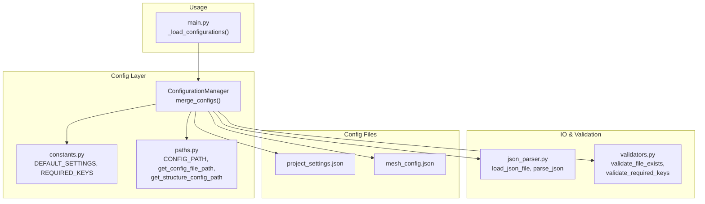
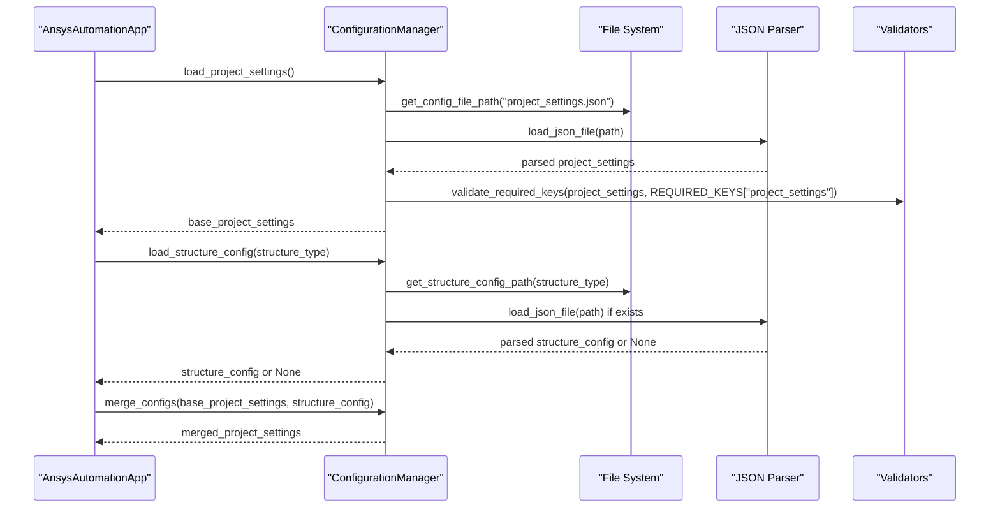
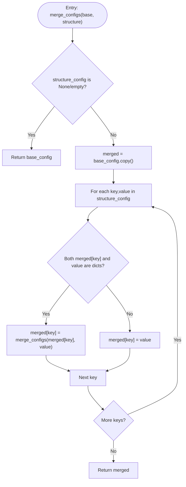
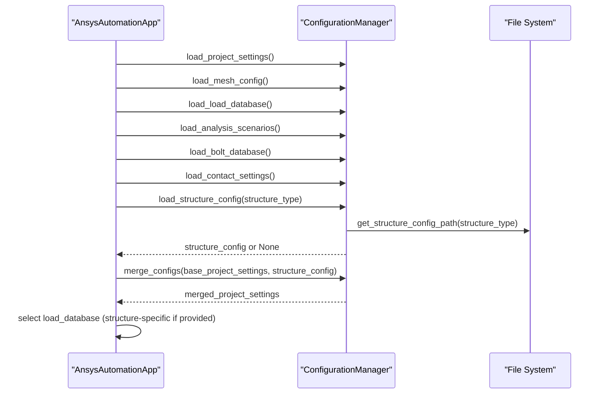
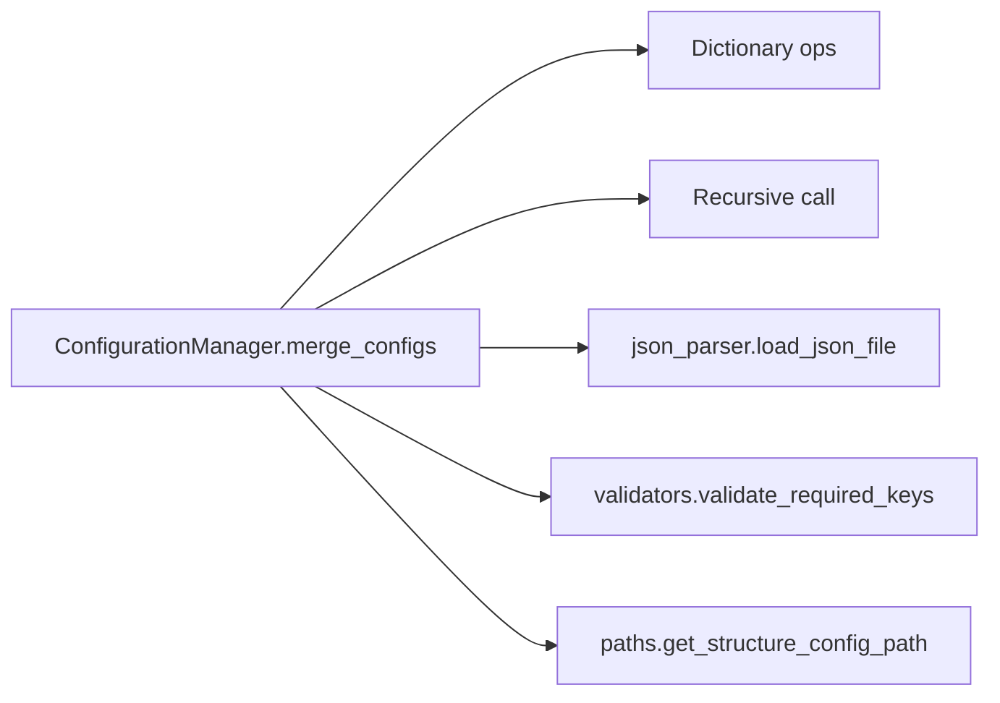

# Configuration Merging Logic

<cite>
**Referenced Files in This Document**
- [config_manager.py](file://config/config_manager.py)
- [constants.py](file://config/constants.py)
- [paths.py](file://config/paths.py)
- [json_parser.py](file://utils/json_parser.py)
- [validators.py](file://utils/validators.py)
- [mesh_config.json](file://config_files/mesh_config.json)
- [project_settings.json](file://config_files/project_settings.json)
- [main.py](file://main.py)
</cite>

## Table of Contents
1. [Introduction](#introduction)
2. [Project Structure](#project-structure)
3. [Core Components](#core-components)
4. [Architecture Overview](#architecture-overview)
5. [Detailed Component Analysis](#detailed-component-analysis)
6. [Dependency Analysis](#dependency-analysis)
7. [Performance Considerations](#performance-considerations)
8. [Troubleshooting Guide](#troubleshooting-guide)
9. [Conclusion](#conclusion)

## Introduction
This document explains the configuration merging logic implemented in the ConfigurationManager class, focusing on the merge_configs() method. It details the recursive merging algorithm that preserves base configuration while allowing structure-specific settings to override at any level. It also covers merge priority rules, edge cases, performance characteristics, debugging tips, validation techniques, and extension points for custom merge strategies.

## Project Structure
The configuration system is organized around a central manager that loads base configuration files, optionally loads structure-specific configurations, and merges them with priority given to structure-specific values. Supporting utilities handle JSON parsing, validation, and path resolution.

**Diagram sources**
- [config_manager.py](file://config/config_manager.py#L138-L159)
- [paths.py](file://config/paths.py#L10-L44)
- [json_parser.py](file://utils/json_parser.py#L142-L170)
- [validators.py](file://utils/validators.py#L9-L24)
- [constants.py](file://config/constants.py#L6-L42)
- [project_settings.json](file://config_files/project_settings.json#L1-L56)
- [mesh_config.json](file://config_files/mesh_config.json#L1-L85)
- [main.py](file://main.py#L94-L121)

**Section sources**
- [config_manager.py](file://config/config_manager.py#L138-L159)
- [paths.py](file://config/paths.py#L10-L44)
- [json_parser.py](file://utils/json_parser.py#L142-L170)
- [validators.py](file://utils/validators.py#L9-L24)
- [constants.py](file://config/constants.py#L6-L42)
- [project_settings.json](file://config_files/project_settings.json#L1-L56)
- [mesh_config.json](file://config_files/mesh_config.json#L1-L85)
- [main.py](file://main.py#L94-L121)

## Core Components
- ConfigurationManager: Central orchestrator for loading, validating, and merging configurations. The merge_configs() method performs recursive dictionary merging with structure-specific values taking priority.
- JSON Parser: Loads and parses JSON files, removing comments and handling primitive types.
- Validators: Enforce file existence and required keys for each configuration type.
- Paths: Resolves base configuration path and structure-specific configuration filenames.
- Constants: Provides default settings and required keys for validation.

Key responsibilities:
- Load base configurations and structure-specific configurations.
- Validate configuration structure and required keys.
- Merge base and structure-specific configurations with priority rules.
- Provide default configurations for missing types.

**Section sources**
- [config_manager.py](file://config/config_manager.py#L138-L159)
- [json_parser.py](file://utils/json_parser.py#L142-L170)
- [validators.py](file://utils/validators.py#L9-L24)
- [paths.py](file://config/paths.py#L10-L44)
- [constants.py](file://config/constants.py#L6-L42)

## Architecture Overview
The configuration hierarchy is loaded and merged in the application initialization flow. Base configurations are loaded first, then structure-specific configuration is optionally loaded. The merge operation applies structure-specific overrides to the base configuration.

**Diagram sources**
- [main.py](file://main.py#L94-L121)
- [config_manager.py](file://config/config_manager.py#L73-L101)
- [config_manager.py](file://config/config_manager.py#L119-L137)
- [config_manager.py](file://config/config_manager.py#L138-L159)
- [paths.py](file://config/paths.py#L20-L44)
- [json_parser.py](file://utils/json_parser.py#L142-L170)
- [validators.py](file://utils/validators.py#L26-L50)
- [constants.py](file://config/constants.py#L36-L42)

## Detailed Component Analysis

### merge_configs() Algorithm
The merge_configs() method implements a recursive dictionary merge with the following behavior:
- If structure_config is empty or None, return base_config unchanged.
- Create a shallow copy of base_config to avoid mutating the original.
- Iterate over each key-value pair in structure_config:
  - If both base_config[key] and structure_config[key] are dictionaries, recursively merge them.
  - Otherwise, replace base_config[key] with structure_config[key].
- Return the merged configuration.

Priority rules:
- Structure-specific values take precedence over base values at every level.
- Nested dictionaries are merged recursively; non-dictionary values overwrite base values.

Edge cases handled by the current implementation:
- Type mismatch between base and structure values: The method replaces the base value with the structure value regardless of type. This is a strict override policy.
- Non-existent keys in base_config: Keys present only in structure_config are added to the merged result.
- Empty structure_config: Returns base_config unchanged.

**Diagram sources**
- [config_manager.py](file://config/config_manager.py#L138-L159)

**Section sources**
- [config_manager.py](file://config/config_manager.py#L138-L159)

### Example: Mesh Settings Override Behavior
Concrete example demonstrating how structure-specific mesh settings override base settings:
- Base configuration defines a default element order and result keywords.
- Structure-specific configuration provides per-type mesh settings under a mesh_settings subtree.
- During merging, structure-specific mesh settings replace base mesh settings at the appropriate keys, while other base keys remain unchanged.

Illustration of override behavior:
- Base mesh settings include a default element order and result keywords.
- Structure-specific mesh settings define per-type overrides (e.g., element order and coefficients for specific types).
- After merging, structure-specific values take precedence for overlapping keys, while non-overlapping keys retain base values.

This behavior ensures that only targeted parameters change while preserving inherited settings.

**Section sources**
- [config_manager.py](file://config/config_manager.py#L138-L159)
- [project_settings.json](file://config_files/project_settings.json#L33-L39)
- [mesh_config.json](file://config_files/mesh_config.json#L1-L85)

### Priority and Inheritance Rules
- Priority: Structure-specific configuration takes precedence over base configuration at every level.
- Inheritance: Keys not present in structure-specific configuration remain unchanged from base configuration.
- Recursion: Nested dictionaries are merged recursively; leaf values are replaced by structure-specific values.

These rules ensure predictable overrides and preserve base defaults for unspecified keys.

**Section sources**
- [config_manager.py](file://config/config_manager.py#L138-L159)

### Type Mismatch Handling
Current behavior:
- When a key exists in both base and structure configurations but with different types, the structure value replaces the base value regardless of type.
- This is a strict override policy that simplifies merging but can lead to runtime errors if downstream code expects a specific type.

Recommended mitigation:
- Normalize types before merging or add explicit type coercion.
- Validate merged configuration before use to catch type mismatches early.

**Section sources**
- [config_manager.py](file://config/config_manager.py#L138-L159)

### Integration with Configuration Loading
The application initializes configuration by:
- Loading base configurations (project settings, mesh config, load database, analysis scenarios, bolt database, contact settings).
- Optionally loading structure-specific configuration based on detected structure type.
- Merging structure-specific overrides into base project settings.
- Using structure-specific load database if provided; otherwise falling back to base load database.

**Diagram sources**
- [main.py](file://main.py#L94-L121)
- [config_manager.py](file://config/config_manager.py#L73-L101)
- [config_manager.py](file://config/config_manager.py#L119-L137)
- [config_manager.py](file://config/config_manager.py#L138-L159)

**Section sources**
- [main.py](file://main.py#L94-L121)
- [config_manager.py](file://config/config_manager.py#L73-L101)
- [config_manager.py](file://config/config_manager.py#L119-L137)
- [config_manager.py](file://config/config_manager.py#L138-L159)

## Dependency Analysis
The merge_configs() method depends on:
- Dictionary operations (copy, iteration, type checks).
- Recursive calls to itself for nested merges.
- External utilities for file loading and validation (used during configuration loading, not during merging).

**Diagram sources**
- [config_manager.py](file://config/config_manager.py#L138-L159)
- [json_parser.py](file://utils/json_parser.py#L142-L170)
- [validators.py](file://utils/validators.py#L26-L50)
- [paths.py](file://config/paths.py#L32-L44)

**Section sources**
- [config_manager.py](file://config/config_manager.py#L138-L159)
- [json_parser.py](file://utils/json_parser.py#L142-L170)
- [validators.py](file://utils/validators.py#L26-L50)
- [paths.py](file://config/paths.py#L32-L44)

## Performance Considerations
- Time complexity: O(N) where N is the total number of keys across all nested dictionaries. Each key is visited once; recursive calls traverse nested structures.
- Space complexity: O(N) for the merged dictionary plus recursion stack depth proportional to nesting levels. In the worst case, deep nesting increases stack usage.
- Memory usage patterns:
  - A shallow copy of base_config is created to avoid mutating the original.
  - Merging is in-place-like for dictionary values; new dictionary instances are created for nested merges.
- Recommendations for large configurations:
  - Keep configuration structures reasonably flat to reduce recursion depth.
  - Consider iterative merging to avoid deep recursion in extremely nested structures.
  - Validate configuration sizes and nesting levels to prevent excessive memory usage.

[No sources needed since this section provides general guidance]

## Troubleshooting Guide
Common issues and debugging techniques:
- Unexpected overrides:
  - Verify structure-specific configuration keys align with base configuration structure.
  - Confirm that only intended keys are being overridden by structure-specific values.
- Type mismatches:
  - Inspect merged configuration for keys that changed types between base and structure configurations.
  - Add pre-merge type normalization or post-merge validation to detect mismatches.
- Missing structure-specific configuration:
  - Ensure the structure-specific file exists at the expected path derived from the structure type.
  - Check configuration path validity and file permissions.
- Validation failures:
  - Use the validation utilities to confirm required keys exist in each configuration type.
  - Review error messages indicating missing keys for project settings, mesh config, analysis scenarios, bolt database, and contact settings.

Validation techniques:
- Use the configuration loader’s built-in validation to catch missing keys and invalid structures.
- After merging, validate that critical keys exist and have expected types for downstream consumers.

**Section sources**
- [config_manager.py](file://config/config_manager.py#L52-L72)
- [validators.py](file://utils/validators.py#L26-L50)
- [paths.py](file://config/paths.py#L20-L44)

## Conclusion
The merge_configs() method provides a robust, recursive merging mechanism that prioritizes structure-specific configuration over base configuration at every level. Its simplicity enables predictable overrides while preserving inheritance for unspecified keys. For large configurations, careful structuring and validation are recommended to maintain performance and reliability. Extensibility points exist for custom merge strategies, including type-aware merging and conflict detection, which can be introduced to address advanced use cases.