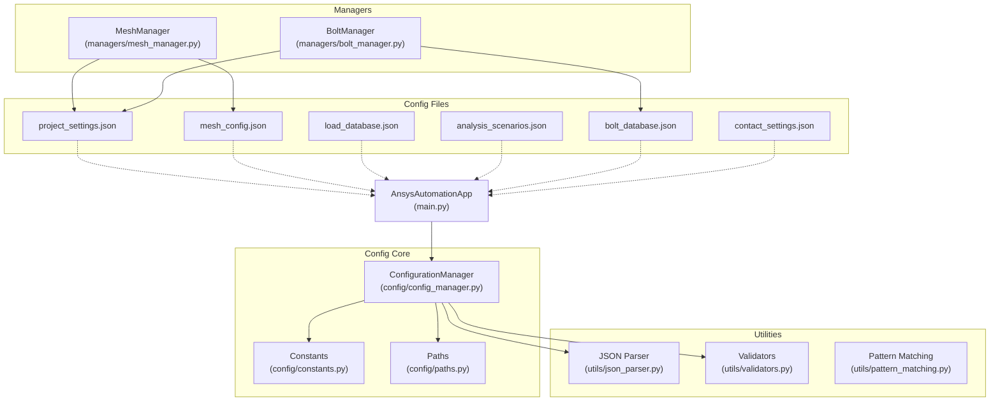
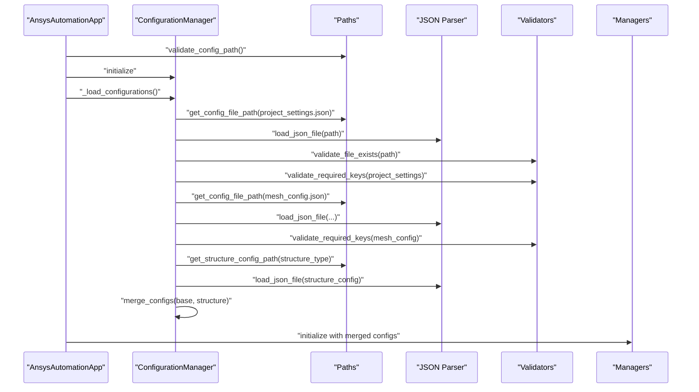
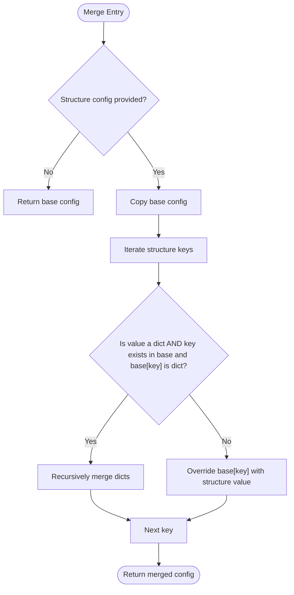
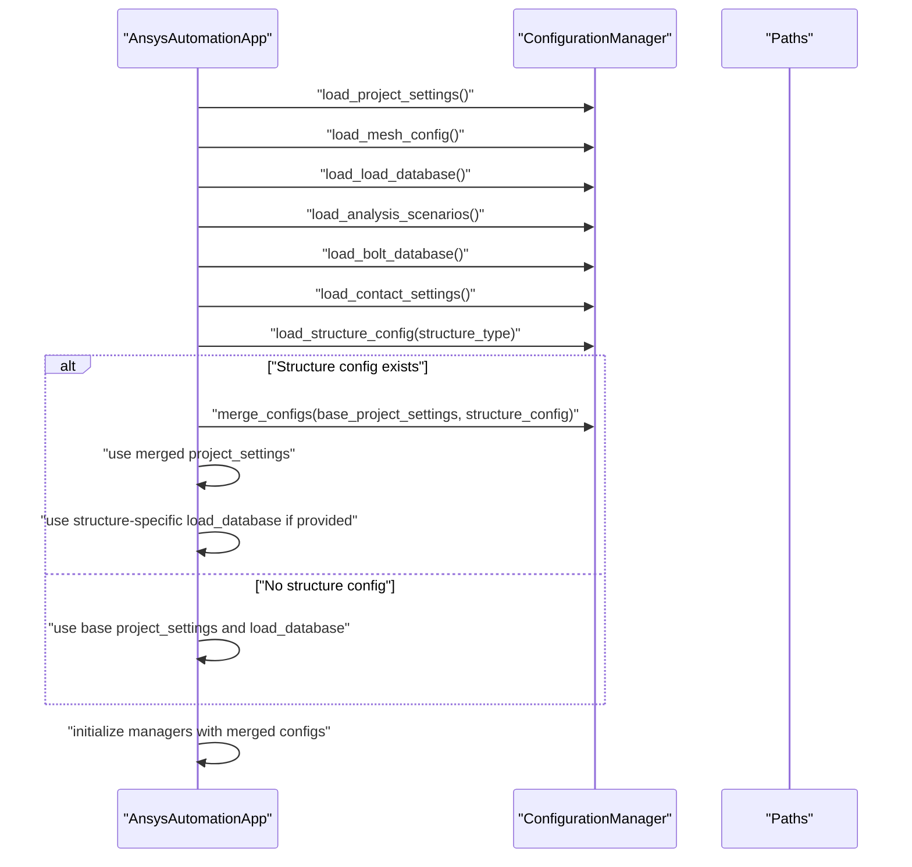
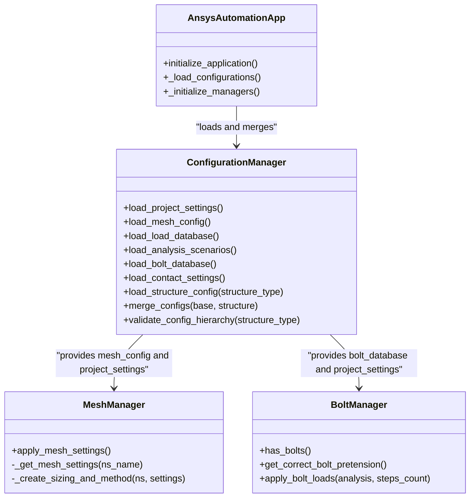
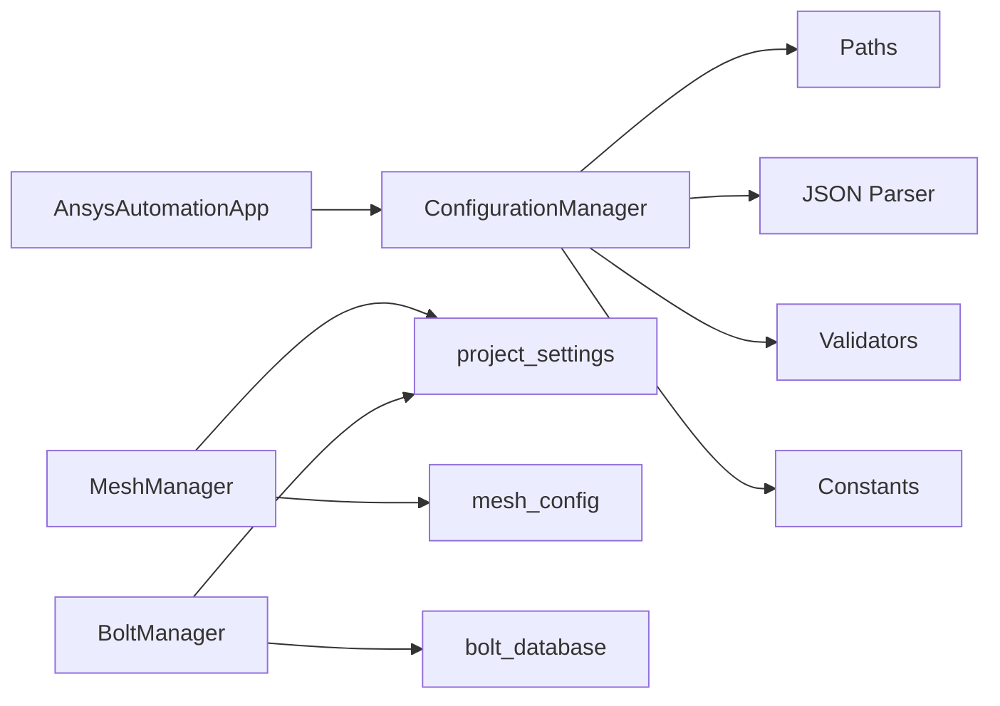

# Configuration System

<cite>
**Referenced Files in This Document**
- [config_manager.py](file://config/config_manager.py)
- [constants.py](file://config/constants.py)
- [paths.py](file://config/paths.py)
- [main.py](file://main.py)
- [json_parser.py](file://utils/json_parser.py)
- [validators.py](file://utils/validators.py)
- [pattern_matching.py](file://utils/pattern_matching.py)
- [mesh_manager.py](file://managers/mesh_manager.py)
- [bolt_manager.py](file://managers/bolt_manager.py)
- [project_settings.json](file://config_files/project_settings.json)
- [mesh_config.json](file://config_files/mesh_config.json)
- [load_database.json](file://config_files/load_database.json)
- [analysis_scenarios.json](file://config_files/analysis_scenarios.json)
- [bolt_database.json](file://config_files/bolt_database.json)
- [contact_settings.json](file://config_files/contact_settings.json)
</cite>

## Table of Contents
1. [Introduction](#introduction)
2. [Project Structure](#project-structure)
3. [Core Components](#core-components)
4. [Architecture Overview](#architecture-overview)
5. [Detailed Component Analysis](#detailed-component-analysis)
6. [Dependency Analysis](#dependency-analysis)
7. [Performance Considerations](#performance-considerations)
8. [Troubleshooting Guide](#troubleshooting-guide)
9. [Conclusion](#conclusion)
10. [Appendices](#appendices)

## Introduction
This document explains the configuration management system that powers the automation workflow. It focuses on the hierarchical configuration model, the loading sequence, validation mechanisms, and how configuration data flows to managers. The system implements a priority-based hierarchy where structure-specific configurations override base settings. It also documents all configuration file types, their roles, and best practices for creating and maintaining custom configurations while preserving backward compatibility.

## Project Structure
The configuration system spans several modules:
- Configuration core: configuration manager, constants, and path resolution
- Utilities: JSON parsing and validation helpers
- Managers: mesh and bolt managers that consume configuration
- Configuration files: base and structure-specific JSON files

**Diagram sources**
- [config_manager.py](file://config/config_manager.py#L1-L209)
- [constants.py](file://config/constants.py#L1-L99)
- [paths.py](file://config/paths.py#L1-L73)
- [main.py](file://main.py#L1-L270)
- [json_parser.py](file://utils/json_parser.py#L1-L170)
- [validators.py](file://utils/validators.py#L1-L161)
- [pattern_matching.py](file://utils/pattern_matching.py#L1-L71)
- [mesh_manager.py](file://managers/mesh_manager.py#L1-L104)
- [bolt_manager.py](file://managers/bolt_manager.py#L1-L68)
- [project_settings.json](file://config_files/project_settings.json#L1-L56)
- [mesh_config.json](file://config_files/mesh_config.json#L1-L85)
- [load_database.json](file://config_files/load_database.json#L1-L414)
- [analysis_scenarios.json](file://config_files/analysis_scenarios.json#L1-L55)
- [bolt_database.json](file://config_files/bolt_database.json#L1-L47)
- [contact_settings.json](file://config_files/contact_settings.json#L1-L130)

**Section sources**
- [config_manager.py](file://config/config_manager.py#L1-L209)
- [paths.py](file://config/paths.py#L1-L73)
- [main.py](file://main.py#L1-L270)

## Core Components
- ConfigurationManager: central orchestrator for loading, validating, merging, and defaulting configuration data. It exposes loaders for each configuration file type and provides a recursive merge operation where structure-specific values override base settings.
- Paths module: resolves absolute paths for base configuration files and structure-specific files using a configurable base path.
- Constants module: defines default settings and required keys for validation.
- JSON parser and validators: handle file existence checks, comment removal, JSON parsing, and required-key validation.
- Managers: consume configuration to drive automation actions (meshing, bolt pretension, etc.).

Key responsibilities:
- Priority-based hierarchy: structure-specific configuration overrides base settings.
- Validation: required keys per file type and file existence checks.
- Backward compatibility: defaults for missing keys and optional structure-specific files.

**Section sources**
- [config_manager.py](file://config/config_manager.py#L1-L209)
- [constants.py](file://config/constants.py#L1-L99)
- [paths.py](file://config/paths.py#L1-L73)
- [json_parser.py](file://utils/json_parser.py#L1-L170)
- [validators.py](file://utils/validators.py#L1-L161)

## Architecture Overview
The configuration system follows a layered design:
- Application layer initializes configuration, detects structure type, loads base and structure-specific configs, merges them, and passes merged data to managers.
- Configuration layer encapsulates loading, validation, and merging logic.
- Utility layer provides JSON parsing and validation helpers.
- Managers consume configuration to perform automation tasks.

**Diagram sources**
- [main.py](file://main.py#L51-L131)
- [config_manager.py](file://config/config_manager.py#L26-L160)
- [paths.py](file://config/paths.py#L20-L43)
- [json_parser.py](file://utils/json_parser.py#L142-L170)
- [validators.py](file://utils/validators.py#L9-L24)

## Detailed Component Analysis

### Configuration Manager
The ConfigurationManager class implements:
- File loading with existence checks and validation
- Per-file-type validation using required keys
- Structure-specific configuration loading and merging
- Default configuration creation for missing keys
- Hierarchical validation of required base files and optional structure-specific files

Priority-based merge logic:
- Recursively merges structure-specific dictionaries into base dictionaries
- Non-dictionary values in structure-specific take precedence over base
- Ensures backward compatibility by falling back to base settings when structure-specific keys are absent

**Diagram sources**
- [config_manager.py](file://config/config_manager.py#L138-L159)

**Section sources**
- [config_manager.py](file://config/config_manager.py#L26-L160)
- [constants.py](file://config/constants.py#L36-L42)

### Configuration Loading Sequence in AnsysAutomationApp
The application orchestrates configuration loading and merging:
- Validates configuration path
- Initializes ConfigurationManager
- Detects structure type and category
- Loads base configurations (project_settings, mesh_config, load_database, analysis_scenarios, bolt_database, contact_settings)
- Attempts to load structure-specific configuration if present
- Merges base and structure-specific configurations with structure priority
- Initializes managers with merged configuration

**Diagram sources**
- [main.py](file://main.py#L94-L131)
- [config_manager.py](file://config/config_manager.py#L138-L159)

**Section sources**
- [main.py](file://main.py#L51-L131)
- [config_manager.py](file://config/config_manager.py#L138-L159)

### Configuration File Types and Roles
- project_settings.json: project metadata, execution patterns, boundary conditions, loads, mesh defaults, solution settings, units. Used broadly by managers for naming and defaults.
- mesh_config.json: per-entity mesh settings keyed by base names (e.g., mbolt, opora). Drives MeshManager behavior.
- load_database.json: execution groups and load factors for different execution types. Consumed by ExecutionManager and BoltManager.
- analysis_scenarios.json: predefined analysis sequences with steps and settings. Used by AnalysisManager.
- bolt_database.json: bolt sizes and pretension values. Used by BoltManager.
- contact_settings.json: contact rules and advanced settings. Used by ContactManager.

**Section sources**
- [project_settings.json](file://config_files/project_settings.json#L1-L56)
- [mesh_config.json](file://config_files/mesh_config.json#L1-L85)
- [load_database.json](file://config_files/load_database.json#L1-L414)
- [analysis_scenarios.json](file://config_files/analysis_scenarios.json#L1-L55)
- [bolt_database.json](file://config_files/bolt_database.json#L1-L47)
- [contact_settings.json](file://config_files/contact_settings.json#L1-L130)

### Data Flow to Managers
- MeshManager consumes mesh_config and project_settings to compute element sizes and mesh methods per Named Selection.
- BoltManager consumes bolt_database and project_settings to determine bolt pretension and apply loads.
- ContactManager consumes contact_settings to configure contact pairs.
- ExecutionManager consumes project_settings and load_database to select execution type and load groups.
- AnalysisManager consumes project_settings, analysis_scenarios, and NamedSelectionManager to set up analyses.

**Diagram sources**
- [config_manager.py](file://config/config_manager.py#L73-L160)
- [mesh_manager.py](file://managers/mesh_manager.py#L1-L104)
- [bolt_manager.py](file://managers/bolt_manager.py#L1-L68)
- [main.py](file://main.py#L94-L131)

**Section sources**
- [mesh_manager.py](file://managers/mesh_manager.py#L1-L104)
- [bolt_manager.py](file://managers/bolt_manager.py#L1-L68)
- [main.py](file://main.py#L122-L131)

### Validation Process
- File existence validation: ensures base configuration files exist before loading.
- Required-key validation: verifies presence of required keys per file type.
- JSON parsing: removes comments and whitespace, parses JSON safely.
- Hierarchical validation: checks for missing base files and reports optional structure-specific presence.

Validation error handling:
- Throws exceptions with descriptive messages when files are missing or required keys are absent.
- Application catches exceptions and continues with warnings when appropriate.

**Section sources**
- [config_manager.py](file://config/config_manager.py#L26-L72)
- [validators.py](file://utils/validators.py#L9-L24)
- [validators.py](file://utils/validators.py#L26-L50)
- [json_parser.py](file://utils/json_parser.py#L142-L170)
- [main.py](file://main.py#L132-L159)

### Creating Custom Structure-Specific Configurations
Structure-specific configuration files follow the naming convention derived from the structure type. The loader attempts to load a file named structure_{type}_config.json in the configured base path. If present, it is merged into the base project settings with structure priority.

Best practices:
- Keep structure-specific files minimal; only include overrides.
- Use the same top-level keys as base files to ensure proper merging.
- Validate structure-specific files independently before deployment.
- Maintain backward compatibility by avoiding removal of keys required by base managers.

**Section sources**
- [paths.py](file://config/paths.py#L32-L43)
- [config_manager.py](file://config/config_manager.py#L119-L137)
- [config_manager.py](file://config/config_manager.py#L138-L159)

### Merging Logic with Sample JSON Data
The merge operation prioritizes structure-specific values:
- For dictionary keys, recursively merges nested dictionaries.
- For non-dictionary keys, structure-specific values override base values.
- Keys absent in structure-specific are preserved from base.

Example mapping:
- Base project_settings contains keys like project, execution, boundary_conditions, loads, mesh_settings.
- Structure-specific project_settings can override any subset of these keys; non-overridden keys remain from base.

**Section sources**
- [config_manager.py](file://config/config_manager.py#L138-L159)

## Dependency Analysis
Configuration dependencies:
- ConfigurationManager depends on Paths for file resolution, JSON parser for loading, and Validators for validation.
- Managers depend on configuration data provided by ConfigurationManager.
- Application depends on ConfigurationManager for configuration orchestration.

**Diagram sources**
- [config_manager.py](file://config/config_manager.py#L1-L209)
- [paths.py](file://config/paths.py#L1-L73)
- [json_parser.py](file://utils/json_parser.py#L1-L170)
- [validators.py](file://utils/validators.py#L1-L161)
- [constants.py](file://config/constants.py#L1-L99)
- [main.py](file://main.py#L1-L270)
- [mesh_manager.py](file://managers/mesh_manager.py#L1-L104)
- [bolt_manager.py](file://managers/bolt_manager.py#L1-L68)

**Section sources**
- [config_manager.py](file://config/config_manager.py#L1-L209)
- [main.py](file://main.py#L1-L270)

## Performance Considerations
- Minimize repeated file reads by caching loaded configurations within a single run.
- Keep structure-specific configurations small to reduce merge overhead.
- Avoid deep nesting in configuration dictionaries to simplify recursive merges.
- Validate early to fail fast and avoid expensive downstream operations.

## Troubleshooting Guide
Common issues and resolutions:
- Missing configuration path: ensure the base path exists and is accessible.
- Missing configuration files: add the required base files or structure-specific files as needed.
- Invalid required keys: confirm that each file contains all required keys for its type.
- JSON parsing errors: remove comments or fix malformed JSON; ensure encoding compatibility.
- Structure-specific overrides not taking effect: verify the structure type and file naming convention.

**Section sources**
- [paths.py](file://config/paths.py#L45-L58)
- [config_manager.py](file://config/config_manager.py#L26-L72)
- [validators.py](file://utils/validators.py#L26-L50)
- [json_parser.py](file://utils/json_parser.py#L142-L170)
- [main.py](file://main.py#L132-L159)

## Conclusion
The configuration system provides a robust, hierarchical, and extensible foundation for automation workflows. By separating base and structure-specific configurations, it enables customization without sacrificing stability. The explicit validation and merging logic ensure predictable behavior, while the manager-driven consumption keeps configuration tightly coupled to automation logic. Following the best practices outlined here will help maintain backward compatibility and ease future enhancements.

## Appendices

### Best Practices for Configuration Organization
- Keep base configurations generic and reusable across structures.
- Use structure-specific files only for targeted overrides.
- Version control configuration files and document changes.
- Provide defaults for new keys to preserve backward compatibility.
- Validate configuration files before deployment and during CI.

### Backward Compatibility Guidelines
- Do not remove required keys from base files.
- Add new keys with sensible defaults.
- Maintain consistent naming and structure for new entries.
- Test structure-specific overrides with representative models.