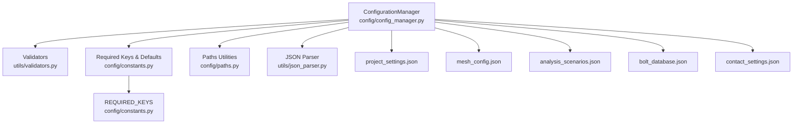
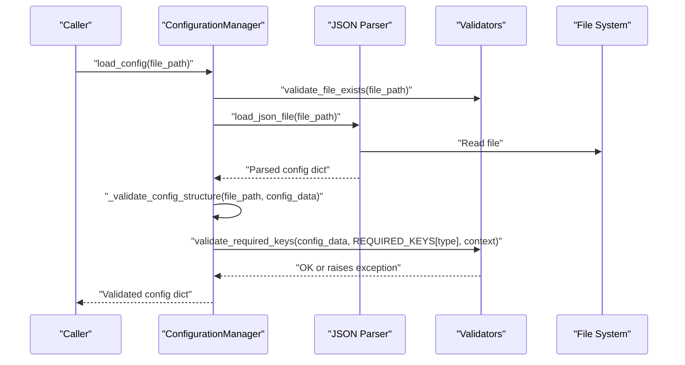
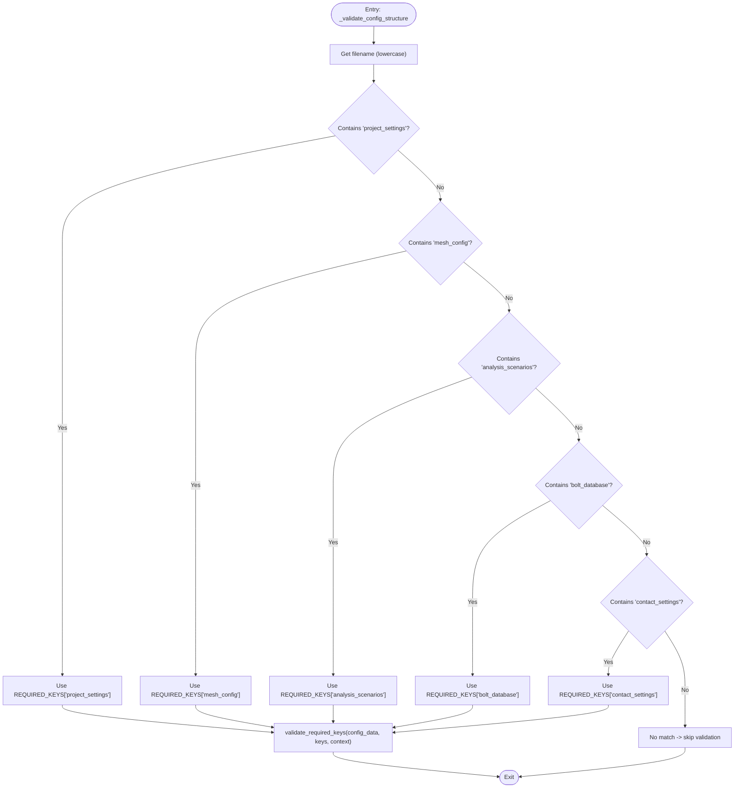
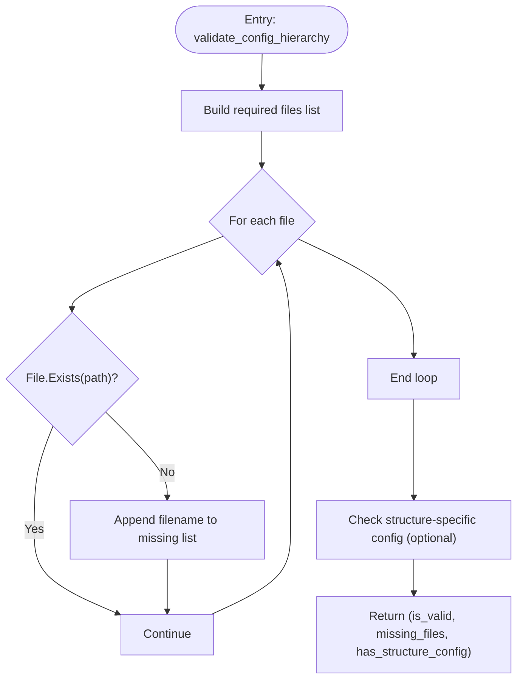
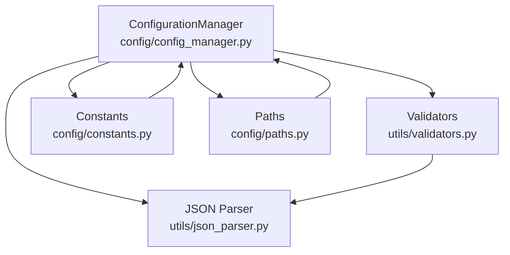

# Configuration Validation Process

<cite>
**Referenced Files in This Document**
- [config_manager.py](file://config/config_manager.py)
- [constants.py](file://config/constants.py)
- [validators.py](file://utils/validators.py)
- [paths.py](file://config/paths.py)
- [json_parser.py](file://utils/json_parser.py)
- [project_settings.json](file://config_files/project_settings.json)
- [mesh_config.json](file://config_files/mesh_config.json)
- [analysis_scenarios.json](file://config_files/analysis_scenarios.json)
- [bolt_database.json](file://config_files/bolt_database.json)
- [contact_settings.json](file://config_files/contact_settings.json)
</cite>

## Table of Contents
1. [Introduction](#introduction)
2. [Project Structure](#project-structure)
3. [Core Components](#core-components)
4. [Architecture Overview](#architecture-overview)
5. [Detailed Component Analysis](#detailed-component-analysis)
6. [Dependency Analysis](#dependency-analysis)
7. [Performance Considerations](#performance-considerations)
8. [Troubleshooting Guide](#troubleshooting-guide)
9. [Conclusion](#conclusion)
10. [Appendices](#appendices)

## Introduction
This document explains the configuration validation process implemented in the project’s configuration management subsystem. It focuses on:
- How _validate_config_structure() determines configuration type using filename patterns and applies the appropriate validation rules from REQUIRED_KEYS.
- The validation workflow that checks for mandatory top-level keys in each configuration file type (for example, "project" and "execution" in project_settings.json).
- The role of validate_required_keys() from validators.py in producing specific error messages for missing keys.
- The system-level validation performed by validate_config_hierarchy() that ensures all required configuration files exist before processing.
- Practical examples of validation error messages and their troubleshooting implications.
- Guidance on extending validation rules for custom configuration types and best practices for maintaining validation integrity.

## Project Structure
The configuration validation spans several modules:
- config/config_manager.py: Orchestrates loading and validation of configuration files, including filename-based structure validation and system-level hierarchy checks.
- config/constants.py: Defines default settings and REQUIRED_KEYS that drive validation rules.
- utils/validators.py: Provides reusable validation utilities, including file existence checks and required-key validation with contextual error messages.
- config/paths.py: Centralizes configuration file paths and helpers for building structure-specific configuration paths.
- utils/json_parser.py: Loads and parses JSON files with comment removal and IronPython compatibility.
- Example configuration files under config_files/: representative samples used during validation.

**Diagram sources**
- [config_manager.py](file://config/config_manager.py#L1-L209)
- [validators.py](file://utils/validators.py#L1-L161)
- [constants.py](file://config/constants.py#L1-L99)
- [paths.py](file://config/paths.py#L1-L73)
- [json_parser.py](file://utils/json_parser.py#L1-L170)

**Section sources**
- [config_manager.py](file://config/config_manager.py#L1-L209)
- [constants.py](file://config/constants.py#L1-L99)
- [validators.py](file://utils/validators.py#L1-L161)
- [paths.py](file://config/paths.py#L1-L73)
- [json_parser.py](file://utils/json_parser.py#L1-L170)

## Core Components
- ConfigurationManager: Central class responsible for loading configuration files, validating structure, merging structure-specific configurations, and checking the presence of required configuration files.
- validate_required_keys(): Validates that a configuration dictionary contains all required top-level keys and raises a descriptive exception if any are missing.
- REQUIRED_KEYS: A mapping of configuration types to lists of required top-level keys.
- validate_config_hierarchy(): Checks whether all required configuration files exist and reports missing files.

Key responsibilities:
- Filename-based routing in _validate_config_structure() to apply the correct validation rules.
- Existence checks via validate_file_exists() and load_json_file().
- System-level validation via validate_config_hierarchy() to ensure a complete configuration set.

**Section sources**
- [config_manager.py](file://config/config_manager.py#L1-L209)
- [validators.py](file://utils/validators.py#L1-L161)
- [constants.py](file://config/constants.py#L1-L99)

## Architecture Overview
The validation pipeline integrates file loading, structure validation, and system-level checks:

**Diagram sources**
- [config_manager.py](file://config/config_manager.py#L26-L73)
- [validators.py](file://utils/validators.py#L9-L51)
- [json_parser.py](file://utils/json_parser.py#L142-L170)

## Detailed Component Analysis

### _validate_config_structure() Workflow
Behavior:
- Extracts the lowercase filename and routes validation to validate_required_keys() based on substring matches against the filename.
- Applies the appropriate REQUIRED_KEYS entry for the detected configuration type.
- Uses a contextual suffix appended to error messages to clarify which configuration file reported the issue.

Validation rules applied:
- project_settings.json: Requires top-level keys defined by REQUIRED_KEYS["project_settings"].
- mesh_config.json: Requires top-level keys defined by REQUIRED_KEYS["mesh_config"].
- analysis_scenarios.json: Requires top-level keys defined by REQUIRED_KEYS["analysis_scenarios"].
- bolt_database.json: Requires top-level keys defined by REQUIRED_KEYS["bolt_database"].
- contact_settings.json: Requires top-level keys defined by REQUIRED_KEYS["contact_settings"].

Error reporting:
- validate_required_keys() constructs a message listing missing keys and appends a context string indicating the configuration type.

**Diagram sources**
- [config_manager.py](file://config/config_manager.py#L52-L73)
- [validators.py](file://utils/validators.py#L26-L51)
- [constants.py](file://config/constants.py#L35-L42)

**Section sources**
- [config_manager.py](file://config/config_manager.py#L52-L73)
- [validators.py](file://utils/validators.py#L26-L51)
- [constants.py](file://config/constants.py#L35-L42)

### validate_required_keys() Behavior
Behavior:
- Iterates over the required_keys list and collects missing keys from the provided config_dict.
- If any missing keys are found, raises an exception with a message that includes the list of missing keys and the context string.
- Returns True if all keys are present.

Error message characteristics:
- The message includes a human-readable list of missing keys and the context string (for example, indicating the configuration type).
- This makes troubleshooting straightforward by immediately identifying which keys are missing and where the failure occurred.

Example error message patterns:
- Missing required keys in project settings: lists the missing top-level keys from REQUIRED_KEYS["project_settings"].
- Missing required keys in mesh config: lists the missing top-level keys from REQUIRED_KEYS["mesh_config"].
- Missing required keys in analysis scenarios: lists the missing top-level keys from REQUIRED_KEYS["analysis_scenarios"].
- Missing required keys in bolt database: lists the missing top-level keys from REQUIRED_KEYS["bolt_database"].
- Missing required keys in contact settings: lists the missing top-level keys from REQUIRED_KEYS["contact_settings"].

**Section sources**
- [validators.py](file://utils/validators.py#L26-L51)
- [constants.py](file://config/constants.py#L35-L42)

### validate_config_hierarchy() System-Level Validation
Behavior:
- Builds a list of required configuration file paths using get_config_file_path() for each main configuration file.
- Iterates through the list and checks existence using File.Exists().
- Collects missing filenames and returns a tuple indicating validity, the list of missing files, and whether a structure-specific configuration file exists.

Outcome:
- Enables callers to detect missing configuration files before attempting to process them.
- Allows graceful handling when a structure-specific configuration is optional.

**Diagram sources**
- [config_manager.py](file://config/config_manager.py#L181-L209)
- [paths.py](file://config/paths.py#L20-L43)

**Section sources**
- [config_manager.py](file://config/config_manager.py#L181-L209)
- [paths.py](file://config/paths.py#L20-L43)

### Configuration Type Detection and Required Keys
Configuration types and their required top-level keys:
- project_settings.json: Requires keys defined by REQUIRED_KEYS["project_settings"].
- mesh_config.json: Requires keys defined by REQUIRED_KEYS["mesh_config"].
- analysis_scenarios.json: Requires keys defined by REQUIRED_KEYS["analysis_scenarios"].
- bolt_database.json: Requires keys defined by REQUIRED_KEYS["bolt_database"].
- contact_settings.json: Requires keys defined by REQUIRED_KEYS["contact_settings"].

These mappings are maintained in constants.py and are used by _validate_config_structure() to route validation to validate_required_keys().

**Section sources**
- [constants.py](file://config/constants.py#L35-L42)
- [config_manager.py](file://config/config_manager.py#L52-L73)

### Example Configuration Files and Their Validation Targets
- project_settings.json: Top-level keys include "project", "execution", "boundary_conditions", "loads", and others as defined in the file. Validation ensures these keys are present.
- mesh_config.json: Top-level key "mesh_settings" is validated by REQUIRED_KEYS["mesh_config"].
- analysis_scenarios.json: Top-level key "standard_sequence" is validated by REQUIRED_KEYS["analysis_scenarios"].
- bolt_database.json: Top-level key "default" is validated by REQUIRED_KEYS["bolt_database"].
- contact_settings.json: Top-level key "contact_rules" is validated by REQUIRED_KEYS["contact_settings"].

These examples demonstrate how REQUIRED_KEYS drives validation for each configuration type.

**Section sources**
- [project_settings.json](file://config_files/project_settings.json#L1-L56)
- [mesh_config.json](file://config_files/mesh_config.json#L1-L85)
- [analysis_scenarios.json](file://config_files/analysis_scenarios.json#L1-L55)
- [bolt_database.json](file://config_files/bolt_database.json#L1-L47)
- [contact_settings.json](file://config_files/contact_settings.json#L1-L130)
- [constants.py](file://config/constants.py#L35-L42)

## Dependency Analysis
Inter-module dependencies relevant to validation:
- ConfigurationManager depends on:
  - utils.validators for validate_file_exists() and validate_required_keys().
  - config.constants for REQUIRED_KEYS and DEFAULT_SETTINGS.
  - config.paths for constructing file paths and structure-specific paths.
  - utils.json_parser for loading and parsing configuration files.

**Diagram sources**
- [config_manager.py](file://config/config_manager.py#L1-L209)
- [validators.py](file://utils/validators.py#L1-L161)
- [constants.py](file://config/constants.py#L1-L99)
- [paths.py](file://config/paths.py#L1-L73)
- [json_parser.py](file://utils/json_parser.py#L1-L170)

**Section sources**
- [config_manager.py](file://config/config_manager.py#L1-L209)
- [validators.py](file://utils/validators.py#L1-L161)
- [constants.py](file://config/constants.py#L1-L99)
- [paths.py](file://config/paths.py#L1-L73)
- [json_parser.py](file://utils/json_parser.py#L1-L170)

## Performance Considerations
- Filename-based routing in _validate_config_structure() is O(1) string matching and O(n) key checks for validate_required_keys(), where n is the number of required keys for the matched type.
- validate_config_hierarchy() iterates over a small, fixed set of required files, making it efficient for typical use cases.
- JSON parsing removes comments and whitespace before parsing, which simplifies validation but adds minimal overhead compared to IO operations.

[No sources needed since this section provides general guidance]

## Troubleshooting Guide
Common validation errors and their implications:
- Missing required keys in a configuration file:
  - Symptom: An exception is raised listing the missing top-level keys and the configuration type context.
  - Action: Add the missing keys to the configuration file as defined in REQUIRED_KEYS for that type.
- Configuration file not found:
  - Symptom: An exception indicating the file was not found.
  - Action: Verify the configuration path and ensure the file exists at the expected location.
- Missing required configuration files:
  - Symptom: validate_config_hierarchy() returns a non-empty list of missing files.
  - Action: Create the missing configuration files or adjust the workflow to handle optional files.

Practical steps:
- Inspect the error message to identify which keys are missing and which configuration file reported the issue.
- Compare the configuration file against the corresponding entries in REQUIRED_KEYS.
- Use validate_config_hierarchy() to confirm that all required files are present before proceeding.

**Section sources**
- [validators.py](file://utils/validators.py#L9-L51)
- [config_manager.py](file://config/config_manager.py#L181-L209)
- [paths.py](file://config/paths.py#L20-L43)

## Conclusion
The configuration validation process combines filename-based routing, targeted key validation, and system-level existence checks to ensure robust configuration management. _validate_config_structure() leverages REQUIRED_KEYS to enforce the correct validation rules for each configuration type, while validate_required_keys() provides clear, contextual error messages. validate_config_hierarchy() complements this by verifying the presence of all required configuration files. Together, these mechanisms support reliable automation workflows and simplify troubleshooting when configuration issues arise.

[No sources needed since this section summarizes without analyzing specific files]

## Appendices

### Extending Validation Rules for Custom Configuration Types
Steps to add a new configuration type:
1. Define the new configuration type and its required top-level keys in REQUIRED_KEYS.
2. Add a filename pattern match in _validate_config_structure() to route validation to validate_required_keys() for the new type.
3. Optionally, update validate_config_hierarchy() to include the new file among required files if applicable.
4. Provide a representative configuration file under config_files/ to serve as a reference and aid testing.

Best practices:
- Keep REQUIRED_KEYS centralized and consistent with the configuration file’s intended structure.
- Use descriptive context strings in validate_required_keys() to improve error clarity.
- Maintain backward compatibility by avoiding removal of keys required by existing configurations.
- Document new configuration types and their required keys for team members.

**Section sources**
- [constants.py](file://config/constants.py#L35-L42)
- [config_manager.py](file://config/config_manager.py#L52-L73)
- [config_manager.py](file://config/config_manager.py#L181-L209)