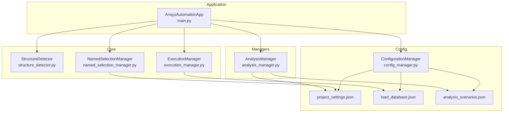
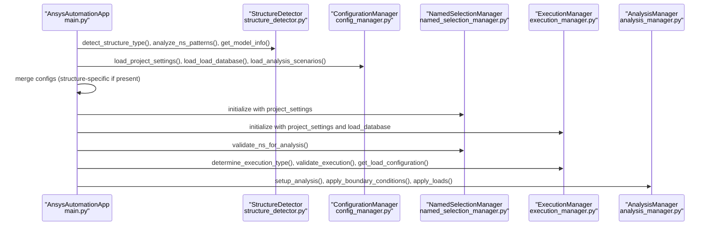
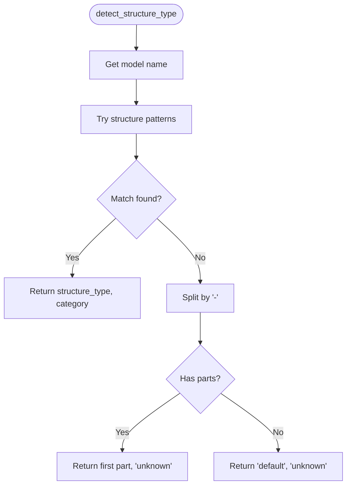
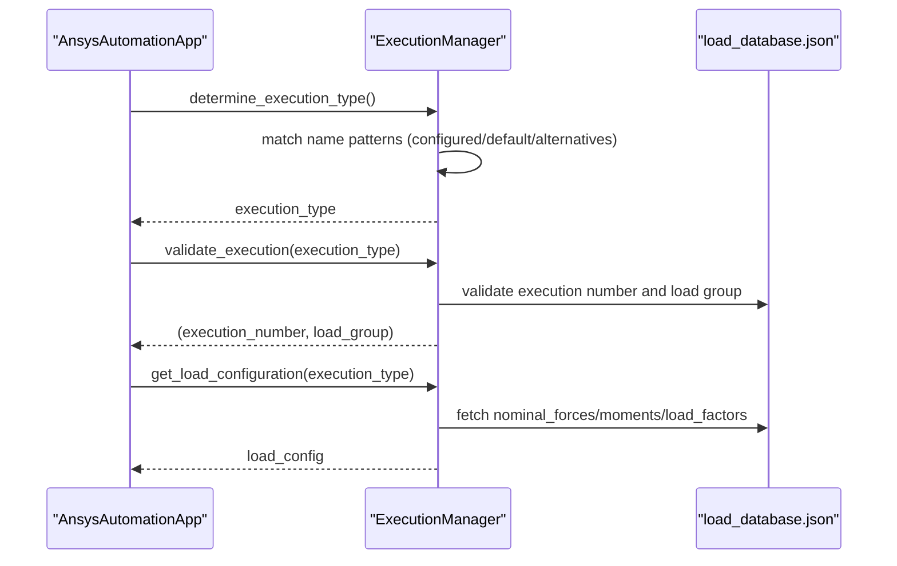
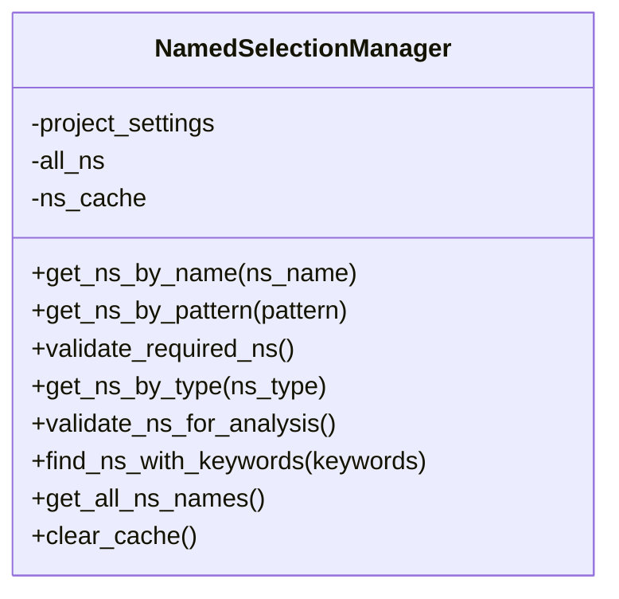
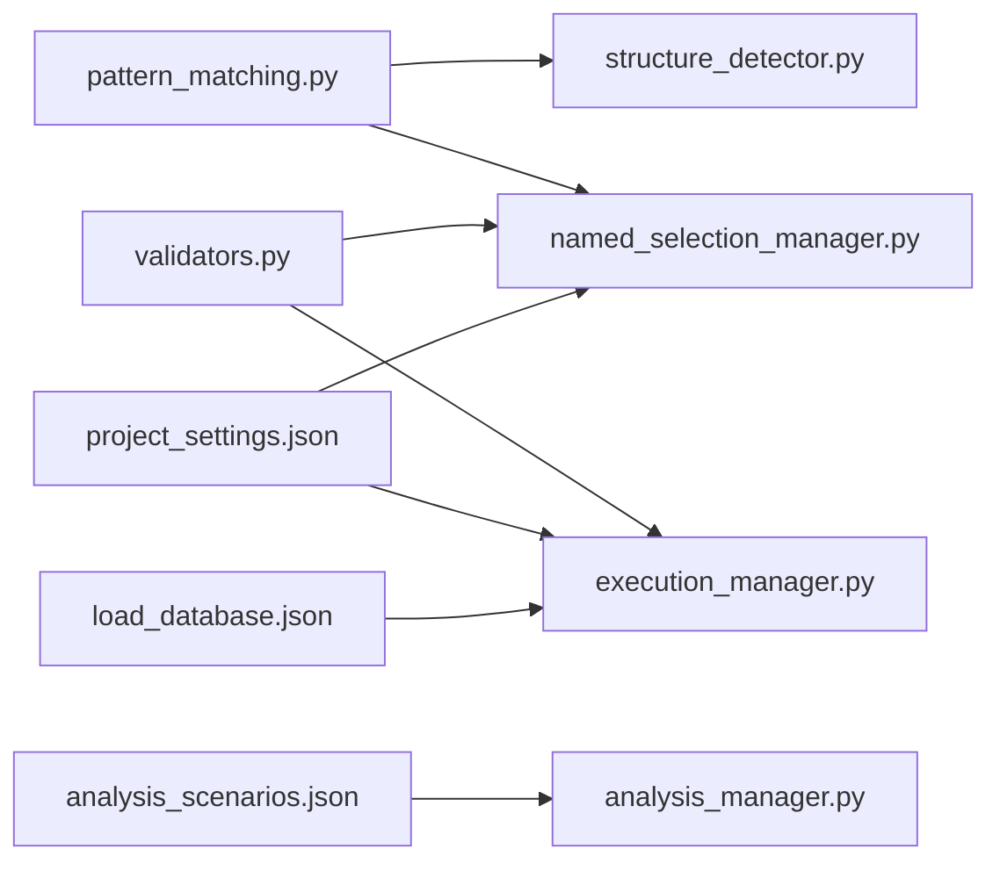

# Core Functionality

<cite>
**Referenced Files in This Document**
- [main.py](file://main.py)
- [structure_detector.py](file://core/structure_detector.py)
- [execution_manager.py](file://core/execution_manager.py)
- [named_selection_manager.py](file://core/named_selection_manager.py)
- [pattern_matching.py](file://utils/pattern_matching.py)
- [validators.py](file://utils/validators.py)
- [config_manager.py](file://config/config_manager.py)
- [project_settings.json](file://config_files/project_settings.json)
- [load_database.json](file://config_files/load_database.json)
- [analysis_scenarios.json](file://config_files/analysis_scenarios.json)
- [analysis_manager.py](file://managers/analysis_manager.py)
</cite>

## Table of Contents
1. [Introduction](#introduction)
2. [Project Structure](#project-structure)
3. [Core Components](#core-components)
4. [Architecture Overview](#architecture-overview)
5. [Detailed Component Analysis](#detailed-component-analysis)
6. [Dependency Analysis](#dependency-analysis)
7. [Performance Considerations](#performance-considerations)
8. [Troubleshooting Guide](#troubleshooting-guide)
9. [Conclusion](#conclusion)

## Introduction
This document explains the core functionality components responsible for:
- Structure detection: identifying structure types and categories from model naming conventions and named selection patterns
- Execution type determination: interpreting model names to select appropriate load configurations from the load database
- Named selection management: caching and validating named selections used throughout the analysis setup

It also documents how these components integrate into the main application workflow, how structure information influences configuration loading and manager behavior, and provides troubleshooting guidance for common issues such as ambiguous structure detection and missing named selections.

## Project Structure
The core functionality spans three primary modules:
- StructureDetector: analyzes model naming conventions and named selection patterns to determine structure type and category, and to infer load/boundary condition configurations
- ExecutionManager: determines execution type from model names and retrieves load configurations from the load database
- NamedSelectionManager: caches and validates named selections, enabling efficient lookups and robust validation

These components are orchestrated by the main application workflow, which initializes configuration, detects structure, validates named selections, and executes the analysis setup.

**Diagram sources**
- [main.py](file://main.py#L1-L270)
- [structure_detector.py](file://core/structure_detector.py#L1-L158)
- [execution_manager.py](file://core/execution_manager.py#L1-L154)
- [named_selection_manager.py](file://core/named_selection_manager.py#L1-L190)
- [config_manager.py](file://config/config_manager.py#L1-L209)
- [project_settings.json](file://config_files/project_settings.json#L1-L56)
- [load_database.json](file://config_files/load_database.json#L1-L414)
- [analysis_scenarios.json](file://config_files/analysis_scenarios.json#L1-L55)
- [analysis_manager.py](file://managers/analysis_manager.py#L1-L116)

**Section sources**
- [main.py](file://main.py#L1-L270)

## Core Components
This section provides an in-depth overview of each core component and how they collaborate.

- StructureDetector
  - Determines structure type and category from model name patterns
  - Analyzes named selection patterns to infer presence of bolts, pressure, contact, remote, supports, and other features
  - Detects load and boundary condition configurations based on named selection names
  - Gathers model metadata (bodies count, body types, named selections count)

- ExecutionManager
  - Interprets model names to determine execution type using configured patterns and fallbacks
  - Validates execution type against the load database and returns execution number and load group
  - Retrieves load configuration (forces, moments, load factors) for the selected execution

- NamedSelectionManager
  - Caches named selection objects for fast repeated lookups
  - Validates required named selections against project settings
  - Provides convenience methods to find named selections by type, pattern, or keywords
  - Offers comprehensive validation results for analysis readiness

**Section sources**
- [structure_detector.py](file://core/structure_detector.py#L1-L158)
- [execution_manager.py](file://core/execution_manager.py#L1-L154)
- [named_selection_manager.py](file://core/named_selection_manager.py#L1-L190)

## Architecture Overview
The main application orchestrates the workflow:
1. Initialize application and configuration
2. Detect structure type and analyze named selection patterns
3. Load configuration hierarchy and initialize managers
4. Validate named selections and model structure
5. Determine execution type and load configuration
6. Configure contacts, mesh, and analysis
7. Apply boundary conditions and loads
8. Setup results

**Diagram sources**
- [main.py](file://main.py#L1-L270)
- [structure_detector.py](file://core/structure_detector.py#L1-L158)
- [config_manager.py](file://config/config_manager.py#L1-L209)
- [named_selection_manager.py](file://core/named_selection_manager.py#L1-L190)
- [execution_manager.py](file://core/execution_manager.py#L1-L154)
- [analysis_manager.py](file://managers/analysis_manager.py#L1-L116)

## Detailed Component Analysis

### StructureDetector Analysis
StructureDetector focuses on extracting structure type and category from model names and inferring configuration from named selection patterns.

- detect_structure_type()
  - Uses predefined regex patterns to match structure naming conventions
  - Returns structure type and category; falls back to splitting the model name if no pattern matches
  - Example usage path: [detect_structure_type()](file://core/structure_detector.py#L30-L51)

- analyze_ns_patterns()
  - Scans all named selections and checks for presence of predefined categories (bolts, pressure, contact, remote, supports)
  - Returns boolean flags indicating presence and total count
  - Example usage path: [analyze_ns_patterns()](file://core/structure_detector.py#L54-L71)

- detect_load_configuration()
  - Identifies presence of various load types (force, moment, pressure, temperature, bearing) based on named selection names
  - Example usage path: [detect_load_configuration()](file://core/structure_detector.py#L74-L91)

- detect_boundary_conditions()
  - Identifies boundary condition types (fixed support, displacement, remote displacement/force, frictionless, compression) based on named selection names
  - Example usage path: [detect_boundary_conditions()](file://core/structure_detector.py#L94-L112)

- get_model_info()
  - Gathers model metadata including bodies count, body names, named selections count, material count, and body type counts
  - Example usage path: [get_model_info()](file://core/structure_detector.py#L115-L158)

**Diagram sources**
- [structure_detector.py](file://core/structure_detector.py#L30-L51)

**Section sources**
- [structure_detector.py](file://core/structure_detector.py#L1-L158)
- [pattern_matching.py](file://utils/pattern_matching.py#L1-L71)

### ExecutionManager Analysis
ExecutionManager interprets model names to determine execution type and retrieves load configurations from the load database.

- determine_execution_type()
  - Applies configured name pattern, default pattern, and alternative patterns to extract execution type
  - Raises an exception if execution type cannot be determined
  - Example usage path: [determine_execution_type()](file://core/execution_manager.py#L16-L59)

- validate_execution()
  - Validates execution type against the load database and returns execution number and load group
  - Example usage path: [validate_execution()](file://core/execution_manager.py#L61-L74)

- get_load_configuration()
  - Builds load configuration from validated execution number and load group
  - Includes forces, moments, and load factors; optionally adds pressure if specified
  - Example usage path: [get_load_configuration()](file://core/execution_manager.py#L76-L106)

- get_available_executions() and get_available_load_groups()
  - Expose available executions and load groups for introspection
  - Example usage paths: [get_available_executions()](file://core/execution_manager.py#L129-L136), [get_available_load_groups()](file://core/execution_manager.py#L138-L154)

**Diagram sources**
- [execution_manager.py](file://core/execution_manager.py#L1-L154)
- [load_database.json](file://config_files/load_database.json#L1-L414)

**Section sources**
- [execution_manager.py](file://core/execution_manager.py#L1-L154)
- [validators.py](file://utils/validators.py#L133-L161)
- [project_settings.json](file://config_files/project_settings.json#L1-L56)
- [load_database.json](file://config_files/load_database.json#L1-L414)

### NamedSelectionManager Analysis
NamedSelectionManager centralizes named selection operations with caching and validation.

- get_ns_by_name()
  - Returns a named selection by exact name with caching to avoid repeated lookups
  - Example usage path: [get_ns_by_name()](file://core/named_selection_manager.py#L17-L37)

- get_ns_by_pattern()
  - Finds named selections matching wildcard patterns using simple pattern matching
  - Example usage path: [get_ns_by_pattern()](file://core/named_selection_manager.py#L39-L56)

- validate_required_ns()
  - Checks required named selections against project settings and reports missing ones
  - Example usage path: [validate_required_ns()](file://core/named_selection_manager.py#L58-L84)

- get_ns_by_type()
  - Groups named selections by type (load, bc, bolt, contact, remote) using predefined patterns
  - Example usage path: [get_ns_by_type()](file://core/named_selection_manager.py#L95-L121)

- validate_ns_for_analysis()
  - Comprehensive validation returning counts and missing details
  - Example usage path: [validate_ns_for_analysis()](file://core/named_selection_manager.py#L138-L154)

- clear_cache()
  - Clears the internal cache to free memory or refresh state
  - Example usage path: [clear_cache()](file://core/named_selection_manager.py#L188-L190)

**Diagram sources**
- [named_selection_manager.py](file://core/named_selection_manager.py#L1-L190)

**Section sources**
- [named_selection_manager.py](file://core/named_selection_manager.py#L1-L190)
- [pattern_matching.py](file://utils/pattern_matching.py#L1-L71)
- [validators.py](file://utils/validators.py#L52-L67)

## Dependency Analysis
The core components depend on shared utilities and configuration files.

- Pattern matching utilities
  - simple_pattern_match(): wildcard matching for IronPython compatibility
  - match_any_pattern(): checks if a name matches any pattern in a list
  - find_matching_names(): returns all matching names for a pattern
  - Example usage paths: [simple_pattern_match](file://utils/pattern_matching.py#L8-L30), [match_any_pattern](file://utils/pattern_matching.py#L47-L58), [find_matching_names](file://utils/pattern_matching.py#L60-L70)

- Validation utilities
  - validate_execution_type(): parses execution type and validates against load database
  - validate_named_selection(): checks existence of a named selection
  - Example usage paths: [validate_execution_type](file://utils/validators.py#L133-L161), [validate_named_selection](file://utils/validators.py#L52-L67)

- Configuration dependencies
  - project_settings.json defines execution patterns, boundary conditions, and loads
  - load_database.json defines load configurations indexed by execution number and load group
  - analysis_scenarios.json defines analysis sequences and load factors

**Diagram sources**
- [pattern_matching.py](file://utils/pattern_matching.py#L1-L71)
- [validators.py](file://utils/validators.py#L1-L161)
- [structure_detector.py](file://core/structure_detector.py#L1-L158)
- [named_selection_manager.py](file://core/named_selection_manager.py#L1-L190)
- [execution_manager.py](file://core/execution_manager.py#L1-L154)
- [project_settings.json](file://config_files/project_settings.json#L1-L56)
- [load_database.json](file://config_files/load_database.json#L1-L414)
- [analysis_scenarios.json](file://config_files/analysis_scenarios.json#L1-L55)
- [analysis_manager.py](file://managers/analysis_manager.py#L1-L116)

**Section sources**
- [pattern_matching.py](file://utils/pattern_matching.py#L1-L71)
- [validators.py](file://utils/validators.py#L1-L161)
- [project_settings.json](file://config_files/project_settings.json#L1-L56)
- [load_database.json](file://config_files/load_database.json#L1-L414)
- [analysis_scenarios.json](file://config_files/analysis_scenarios.json#L1-L55)

## Performance Considerations
- StructureDetector
  - Regex pattern matching is linear in model name length; the number of patterns is small, so overhead is minimal
  - Body type counting iterates over bodies; for large models, consider batching or early exits if only a subset is needed
  - get_model_info() performs multiple property accesses; cache results at higher levels if reused frequently

- ExecutionManager
  - determine_execution_type() applies a small set of patterns; complexity is low
  - validate_execution() performs dictionary lookups; O(1) average-case for load database access
  - get_load_configuration() constructs a small dictionary; negligible cost

- NamedSelectionManager
  - Caching reduces repeated lookups; ensure cache is cleared when model changes
  - Pattern matching is O(N) over named selections; for very large sets, consider pre-filtering by substrings or indexing by prefixes
  - validate_required_ns() iterates over required entries and all named selections; keep required lists concise

[No sources needed since this section provides general guidance]

## Troubleshooting Guide
Common issues and resolutions:

- Ambiguous structure detection
  - Cause: Model name does not match any structure pattern
  - Resolution: Ensure model name follows one of the supported patterns or adjust project settings name pattern
  - Evidence: [detect_structure_type() fallback behavior](file://core/structure_detector.py#L46-L51)

- Missing named selections
  - Cause: Required named selections are not present in the model
  - Resolution: Create the named selections with names matching project settings; use validation to identify missing ones
  - Evidence: [validate_required_ns() and missing details](file://core/named_selection_manager.py#L58-L84), [validate_ns_for_analysis()](file://core/named_selection_manager.py#L138-L154)

- Invalid execution type
  - Cause: Model name cannot be parsed into a valid execution type or execution number/load group not found in load database
  - Resolution: Verify model name conforms to configured patterns; confirm load database contains the expected execution number and load group
  - Evidence: [determine_execution_type() exceptions](file://core/execution_manager.py#L55-L59), [validate_execution_type() validation](file://utils/validators.py#L133-L161)

- Large models with many named selections
  - Symptom: Slower validation and lookup times
  - Resolution: Use caching (already built-in), reduce required named selection lists, or pre-filter by keywords
  - Evidence: [get_ns_by_name() caching](file://core/named_selection_manager.py#L17-L37), [get_ns_by_type() pattern scanning](file://core/named_selection_manager.py#L95-L121)

- Load configuration not applied
  - Cause: Expected named selection for a load or boundary condition is missing
  - Resolution: Create the named selection with the exact name expected by project settings
  - Evidence: [AnalysisManager applying loads and boundary conditions](file://managers/analysis_manager.py#L28-L116), [project_settings.json load/bc mappings](file://config_files/project_settings.json#L16-L32)

**Section sources**
- [structure_detector.py](file://core/structure_detector.py#L30-L51)
- [named_selection_manager.py](file://core/named_selection_manager.py#L58-L84)
- [execution_manager.py](file://core/execution_manager.py#L55-L59)
- [validators.py](file://utils/validators.py#L133-L161)
- [analysis_manager.py](file://managers/analysis_manager.py#L28-L116)
- [project_settings.json](file://config_files/project_settings.json#L16-L32)

## Conclusion
StructureDetector, ExecutionManager, and NamedSelectionManager form the backbone of automated analysis setup. StructureDetector decodes model naming conventions and named selection patterns to inform configuration choices. ExecutionManager translates model names into validated load configurations from the load database. NamedSelectionManager ensures robust, cached access to named selections and validates their presence against project settings. Together, they integrate seamlessly with the main application workflow to initialize configuration, validate the model, and execute the analysis setup reliably.

[No sources needed since this section summarizes without analyzing specific files]