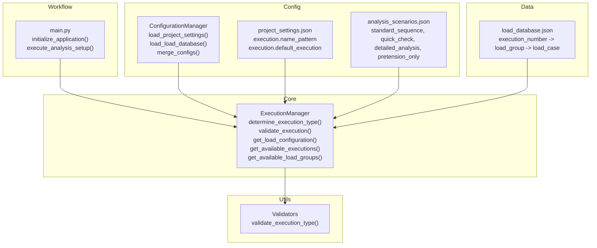
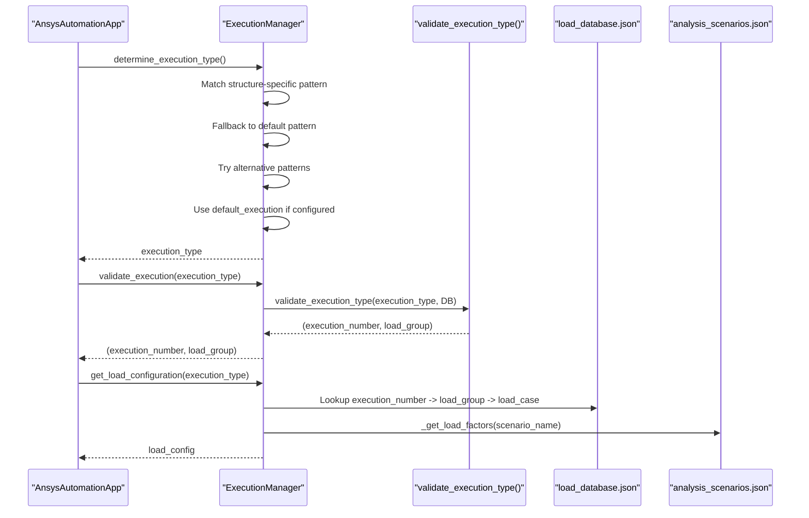
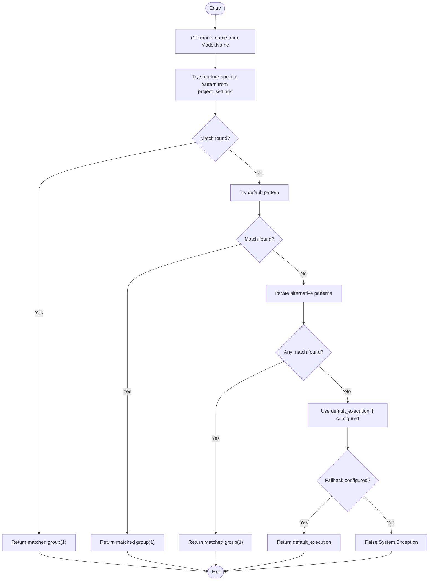
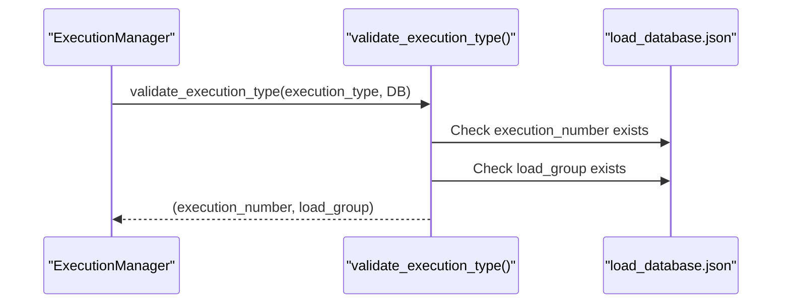
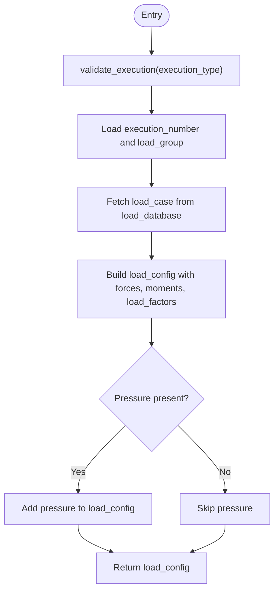
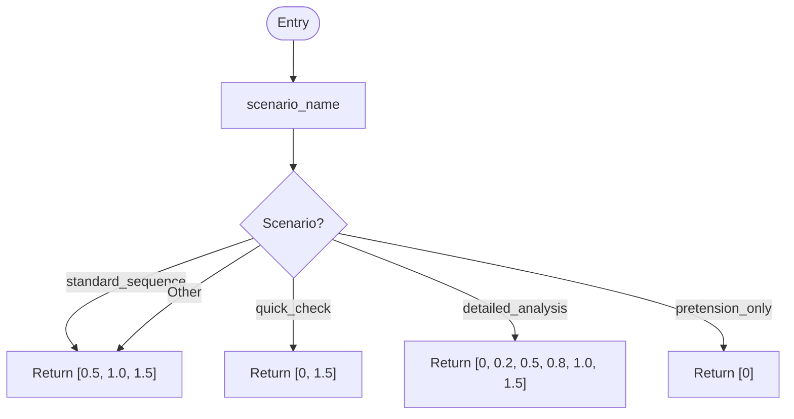
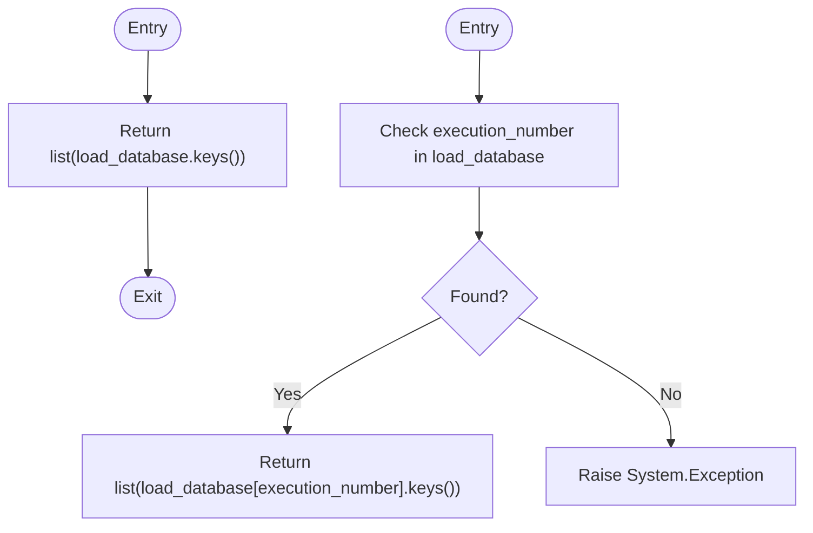
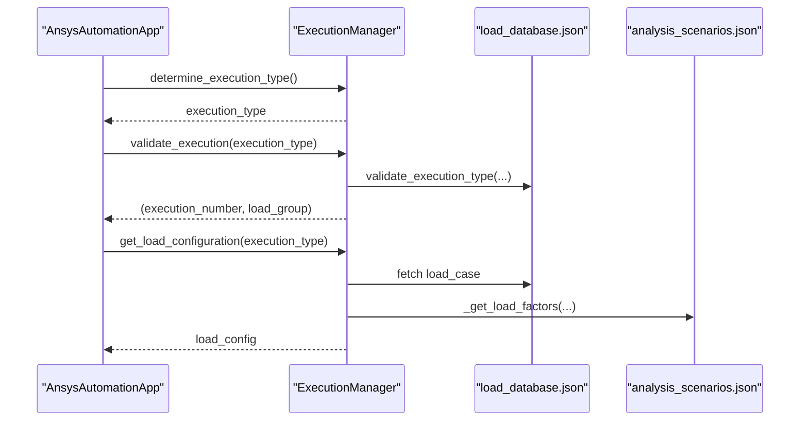
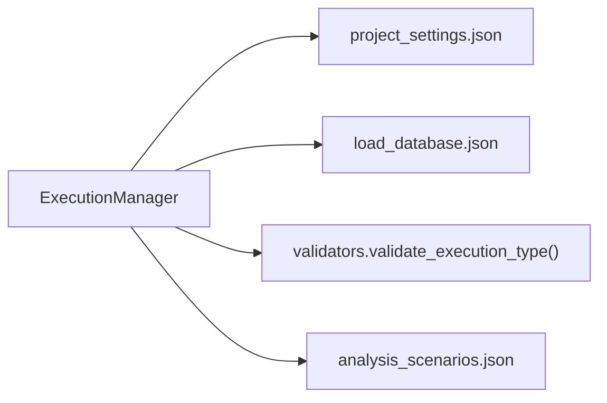

# Execution Type Determination

<cite>
**Referenced Files in This Document**
- [execution_manager.py](file://core/execution_manager.py)
- [validators.py](file://utils/validators.py)
- [project_settings.json](file://config_files/project_settings.json)
- [load_database.json](file://config_files/load_database.json)
- [analysis_scenarios.json](file://config_files/analysis_scenarios.json)
- [main.py](file://main.py)
- [config_manager.py](file://config/config/config_manager.py)
- [constants.py](file://config/constants.py)
</cite>

## Table of Contents
1. [Introduction](#introduction)
2. [Project Structure](#project-structure)
3. [Core Components](#core-components)
4. [Architecture Overview](#architecture-overview)
5. [Detailed Component Analysis](#detailed-component-analysis)
6. [Dependency Analysis](#dependency-analysis)
7. [Performance Considerations](#performance-considerations)
8. [Troubleshooting Guide](#troubleshooting-guide)
9. [Conclusion](#conclusion)

## Introduction
This document explains the execution type determination feature centered on the ExecutionManager class. It covers how the system extracts execution identifiers from model names using configurable regex patterns, validates executions against the load database, retrieves load configurations, and integrates with the main workflow. It also documents scenario-based load sequences and provides troubleshooting guidance for common issues such as pattern mismatches and missing load data.

## Project Structure
The execution type determination feature spans several modules:
- Core logic resides in the ExecutionManager class.
- Validation logic is delegated to external validators.
- Configuration is loaded via ConfigurationManager and merged with structure-specific settings.
- Load database and analysis scenarios are JSON-backed resources.

**Diagram sources**
- [execution_manager.py](file://core/execution_manager.py#L1-L154)
- [validators.py](file://utils/validators.py#L133-L161)
- [config_manager.py](file://config/config/config_manager.py#L94-L117)
- [project_settings.json](file://config_files/project_settings.json#L8-L15)
- [analysis_scenarios.json](file://config_files/analysis_scenarios.json#L1-L55)
- [load_database.json](file://config_files/load_database.json#L1-L414)
- [main.py](file://main.py#L160-L205)

**Section sources**
- [execution_manager.py](file://core/execution_manager.py#L1-L154)
- [main.py](file://main.py#L160-L205)

## Core Components
- ExecutionManager: Orchestrates execution type extraction, validation, and load configuration retrieval.
- Validators: Provides centralized validation for execution types against the load database.
- ConfigurationManager: Loads and merges configuration files, including structure-specific overrides.
- project_settings.json: Contains execution-related regex patterns and defaults.
- load_database.json: Stores execution numbers, load groups, and load cases with nominal forces and moments.
- analysis_scenarios.json: Defines scenario-based load sequences used by the system.

Key responsibilities:
- determine_execution_type(): Extracts execution identifiers from the model name using structure-specific, default, and alternative patterns.
- validate_execution(): Validates that the extracted execution type exists in the load database.
- get_load_configuration(): Builds a load configuration dictionary including forces, moments, optional pressure, and load factors.
- _get_load_factors(): Supplies scenario-based load sequences.
- Discovery helpers: get_available_executions(), get_available_load_groups().

**Section sources**
- [execution_manager.py](file://core/execution_manager.py#L16-L154)
- [validators.py](file://utils/validators.py#L133-L161)
- [project_settings.json](file://config_files/project_settings.json#L8-L15)
- [load_database.json](file://config_files/load_database.json#L1-L414)
- [analysis_scenarios.json](file://config_files/analysis_scenarios.json#L1-L55)

## Architecture Overview
The ExecutionManager integrates with the main workflow as follows:
- The application initializes configuration and managers.
- ExecutionManager determines the execution type from the model name.
- The execution is validated against the load database.
- The load configuration is assembled and passed to the analysis manager for setup.

**Diagram sources**
- [main.py](file://main.py#L160-L205)
- [execution_manager.py](file://core/execution_manager.py#L16-L154)
- [validators.py](file://utils/validators.py#L133-L161)
- [load_database.json](file://config_files/load_database.json#L1-L414)
- [analysis_scenarios.json](file://config_files/analysis_scenarios.json#L1-L55)

## Detailed Component Analysis

### ExecutionManager: determine_execution_type()
The method extracts execution identifiers from the model name using a layered approach:
- Structure-specific pattern: Reads the pattern from project_settings under execution.name_pattern.
- Default pattern: Falls back to a built-in default if not configured.
- Alternative patterns: Iterates through a set of alternative regex patterns to match diverse naming conventions.
- Default execution: If all attempts fail, returns the configured default_execution.

Behavioral flow:

**Diagram sources**
- [execution_manager.py](file://core/execution_manager.py#L16-L59)
- [project_settings.json](file://config_files/project_settings.json#L8-L15)

Implementation highlights:
- Uses Python’s re module for regex matching.
- Returns the first capturing group from the first successful pattern.
- Raises an exception if no pattern matches and no default is configured.

**Section sources**
- [execution_manager.py](file://core/execution_manager.py#L16-L59)
- [project_settings.json](file://config_files/project_settings.json#L8-L15)

### ExecutionManager: validate_execution()
This method delegates validation to an external validator:
- Splits the execution type into execution_number and load_group.
- Ensures the execution_number exists in the load database.
- Ensures the load_group exists for the given execution_number.
- Returns a tuple of execution_number and load_group.

**Diagram sources**
- [execution_manager.py](file://core/execution_manager.py#L61-L74)
- [validators.py](file://utils/validators.py#L133-L161)
- [load_database.json](file://config_files/load_database.json#L1-L414)

**Section sources**
- [execution_manager.py](file://core/execution_manager.py#L61-L74)
- [validators.py](file://utils/validators.py#L133-L161)

### ExecutionManager: get_load_configuration()
This method builds the load configuration for a validated execution:
- Validates the execution type.
- Retrieves execution_number and load_group.
- Fetches the load case from the load database.
- Assembles a configuration dictionary containing:
  - execution_number
  - load_group
  - forces (from load case)
  - moments (defaults to zero if not present)
  - load_factors (scenario-based)
  - pressure (if present in load case)

**Diagram sources**
- [execution_manager.py](file://core/execution_manager.py#L76-L106)
- [load_database.json](file://config_files/load_database.json#L1-L414)

**Section sources**
- [execution_manager.py](file://core/execution_manager.py#L76-L106)
- [load_database.json](file://config_files/load_database.json#L1-L414)

### ExecutionManager: _get_load_factors()
Provides scenario-based load sequences:
- Standard sequence: [0.5, 1.0, 1.5]
- Quick check: [0, 1.5]
- Detailed analysis: [0, 0.2, 0.5, 0.8, 1.0, 1.5]
- Pretension only: [0]

These sequences are used by the analysis manager during setup.

**Diagram sources**
- [execution_manager.py](file://core/execution_manager.py#L108-L128)
- [analysis_scenarios.json](file://config_files/analysis_scenarios.json#L1-L55)

**Section sources**
- [execution_manager.py](file://core/execution_manager.py#L108-L128)
- [analysis_scenarios.json](file://config_files/analysis_scenarios.json#L1-L55)

### Discovery Helpers: get_available_executions() and get_available_load_groups()
- get_available_executions(): Returns all execution numbers present in the load database.
- get_available_load_groups(execution_number): Returns all load groups for a given execution number; raises an exception if the execution number is not found.

**Diagram sources**
- [execution_manager.py](file://core/execution_manager.py#L129-L154)
- [load_database.json](file://config_files/load_database.json#L1-L414)

**Section sources**
- [execution_manager.py](file://core/execution_manager.py#L129-L154)
- [load_database.json](file://config_files/load_database.json#L1-L414)

### Integration with Main Workflow
The main workflow orchestrates execution type determination and load configuration:
- Initializes configuration and managers.
- Determines execution type, validates it, and retrieves load configuration.
- Passes the configuration to the analysis manager for boundary conditions and loads.

**Diagram sources**
- [main.py](file://main.py#L160-L205)
- [execution_manager.py](file://core/execution_manager.py#L16-L154)
- [load_database.json](file://config_files/load_database.json#L1-L414)
- [analysis_scenarios.json](file://config_files/analysis_scenarios.json#L1-L55)

**Section sources**
- [main.py](file://main.py#L160-L205)

## Dependency Analysis
- ExecutionManager depends on:
  - project_settings.json for execution name patterns and defaults.
  - load_database.json for execution metadata and load cases.
  - validators.validate_execution_type() for validation logic.
  - analysis_scenarios.json indirectly via _get_load_factors().

**Diagram sources**
- [execution_manager.py](file://core/execution_manager.py#L16-L154)
- [project_settings.json](file://config_files/project_settings.json#L8-L15)
- [load_database.json](file://config_files/load_database.json#L1-L414)
- [validators.py](file://utils/validators.py#L133-L161)
- [analysis_scenarios.json](file://config_files/analysis_scenarios.json#L1-L55)

**Section sources**
- [execution_manager.py](file://core/execution_manager.py#L16-L154)
- [validators.py](file://utils/validators.py#L133-L161)

## Performance Considerations
- Regex matching is linear in the length of the model name and bounded by a small number of patterns; negligible overhead.
- Validation and load configuration retrieval are dictionary lookups with O(1) average-case complexity.
- Discovery helpers iterate over keys once; acceptable for typical database sizes.
- Consider caching validated execution tuples if repeated lookups occur frequently.

## Troubleshooting Guide
Common issues and resolutions:
- Pattern mismatch:
  - Symptom: determine_execution_type() raises an exception.
  - Causes:
    - Model name does not match structure-specific pattern.
    - No default pattern configured.
    - No alternative patterns matched.
  - Resolution:
    - Adjust project_settings.execution.name_pattern to match the model naming convention.
    - Ensure a default_execution is configured in project_settings.
    - Add or refine alternative patterns in the code if needed.

- Invalid execution:
  - Symptom: validate_execution() raises an exception.
  - Causes:
    - execution_number not present in load_database.
    - load_group not present for execution_number.
  - Resolution:
    - Verify the execution_number and load_group exist in load_database.
    - Correct the model name to match a valid execution type.

- Missing load data:
  - Symptom: get_load_configuration() lacks pressure or moments.
  - Causes:
    - Load case does not define pressure.
    - Moments not specified in load case.
  - Resolution:
    - Add pressure to the load case if applicable.
    - Provide default moments in the load case.

- Scenario load factors:
  - Symptom: Unexpected load factors during analysis setup.
  - Causes:
    - Scenario name differs from expected values.
  - Resolution:
    - Confirm scenario name passed to _get_load_factors() matches one of the predefined scenarios.

Concrete examples from code:
- Pattern matching:
  - Structure-specific pattern: See project_settings.execution.name_pattern.
  - Alternative patterns: See determine_execution_type() alternatives.
- Load configuration retrieval:
  - Execution number and load group resolution: See validate_execution().
  - Load case assembly: See get_load_configuration().

**Section sources**
- [execution_manager.py](file://core/execution_manager.py#L16-L154)
- [validators.py](file://utils/validators.py#L133-L161)
- [project_settings.json](file://config_files/project_settings.json#L8-L15)
- [load_database.json](file://config_files/load_database.json#L1-L414)

## Conclusion
The ExecutionManager provides a robust mechanism to determine execution types from model names, validate them against the load database, and assemble load configurations with scenario-aware load factors. Its integration with the main workflow ensures automated and consistent analysis setup. Proper configuration of patterns and load databases, along with awareness of scenario load factors, minimizes errors and streamlines automation.