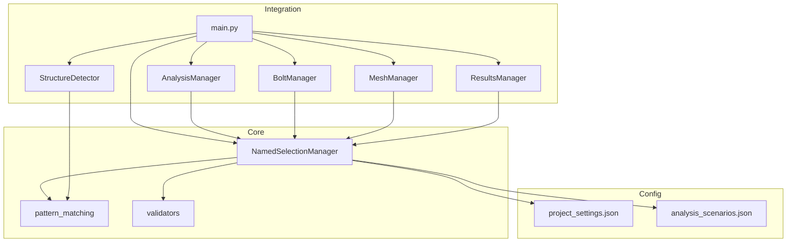
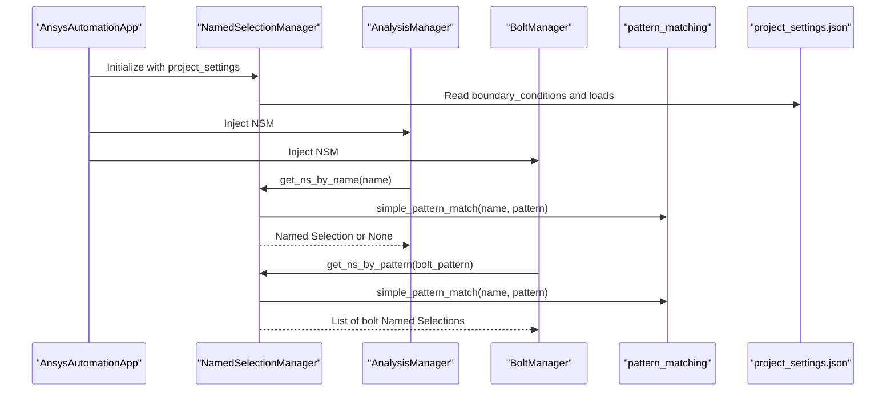
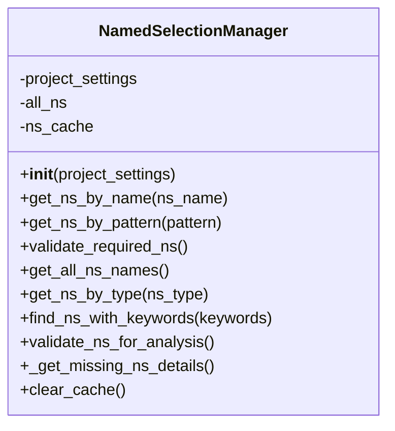
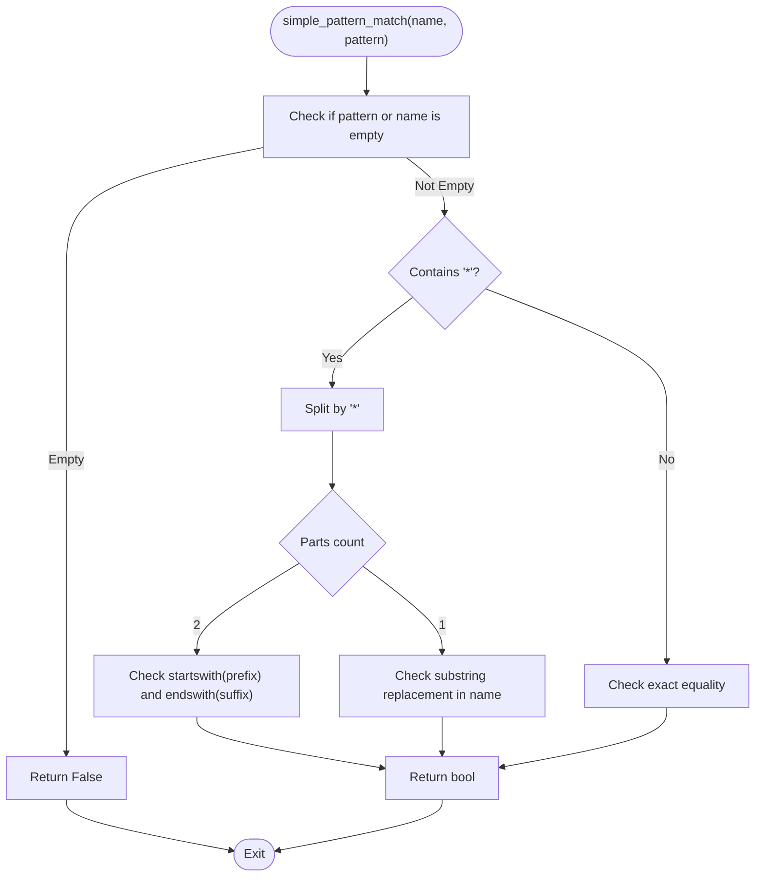
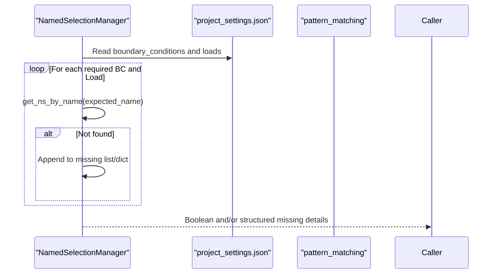
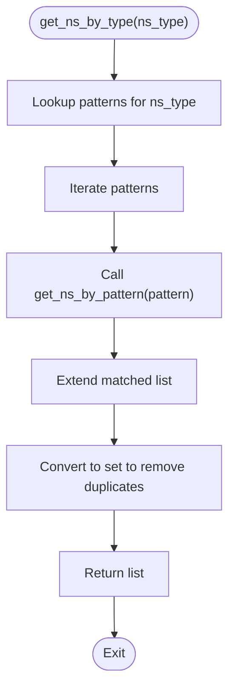
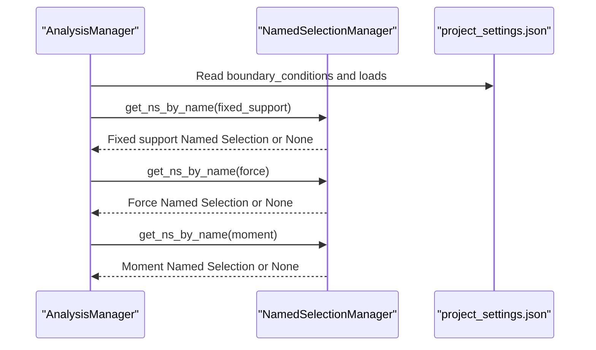
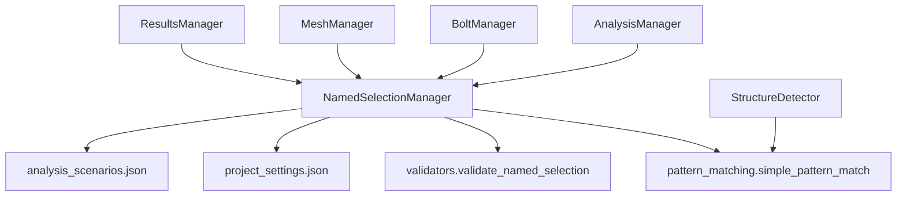

# Named Selection Management

<cite>
**Referenced Files in This Document**
- [named_selection_manager.py](file://core/named_selection_manager.py)
- [pattern_matching.py](file://utils/pattern_matching.py)
- [validators.py](file://utils/validators.py)
- [project_settings.json](file://config_files/project_settings.json)
- [analysis_scenarios.json](file://config_files/analysis_scenarios.json)
- [main.py](file://main.py)
- [analysis_manager.py](file://managers/analysis_manager.py)
- [bolt_manager.py](file://managers/bolt_manager.py)
- [structure_detector.py](file://core/structure_detector.py)
- [mesh_manager.py](file://managers/mesh_manager.py)
- [results_manager.py](file://managers/results_manager.py)
</cite>

## Table of Contents
1. [Introduction](#introduction)
2. [Project Structure](#project-structure)
3. [Core Components](#core-components)
4. [Architecture Overview](#architecture-overview)
5. [Detailed Component Analysis](#detailed-component-analysis)
6. [Dependency Analysis](#dependency-analysis)
7. [Performance Considerations](#performance-considerations)
8. [Troubleshooting Guide](#troubleshooting-guide)
9. [Conclusion](#conclusion)
10. [Appendices](#appendices)

## Introduction
This document explains the Named Selection Management feature centered around the NamedSelectionManager class. It covers initialization with all Named Selections, caching via ns_cache to optimize repeated lookups, pattern-based matching with simple_pattern_match, validation of required selections, categorization of Named Selections by type, and comprehensive validation reporting. It also describes how the manager integrates with other managers and configuration files, and provides practical examples and troubleshooting guidance.

## Project Structure
The Named Selection Management feature spans several modules:
- Core manager: NamedSelectionManager
- Utilities: pattern matching and validators
- Configuration: project_settings.json and analysis_scenarios.json
- Integration: main.py orchestrates initialization and validation
- Consumers: AnalysisManager, BoltManager, MeshManager, ResultsManager, and StructureDetector

**Diagram sources**
- [named_selection_manager.py](file://core/named_selection_manager.py#L1-L190)
- [pattern_matching.py](file://utils/pattern_matching.py#L1-L71)
- [validators.py](file://utils/validators.py#L1-L161)
- [project_settings.json](file://config_files/project_settings.json#L1-L56)
- [analysis_scenarios.json](file://config_files/analysis_scenarios.json#L1-L55)
- [main.py](file://main.py#L110-L141)
- [analysis_manager.py](file://managers/analysis_manager.py#L1-L116)
- [bolt_manager.py](file://managers/bolt_manager.py#L1-L68)
- [structure_detector.py](file://core/structure_detector.py#L1-L84)
- [mesh_manager.py](file://managers/mesh_manager.py#L44-L84)
- [results_manager.py](file://managers/results_manager.py#L38-L62)

**Section sources**
- [main.py](file://main.py#L110-L141)
- [named_selection_manager.py](file://core/named_selection_manager.py#L1-L190)

## Core Components
- NamedSelectionManager: Central manager for Named Selection operations, including caching, pattern matching, type categorization, and validation.
- Pattern Matching Utilities: Provides simple_pattern_match and related helpers for wildcard matching.
- Validators: Provides validate_named_selection and other validation utilities used by the manager.
- Configuration: project_settings.json defines required Named Selections and type patterns; analysis_scenarios.json defines analysis sequences.

Key responsibilities:
- Initialize with all Named Selections and build an internal cache.
- Retrieve Named Selections by exact name with caching.
- Match Named Selections by wildcard patterns.
- Categorize Named Selections by type (load, boundary conditions, bolt, contact, remote).
- Validate presence of required Named Selections and produce structured reports.
- Clear cache for memory management.

**Section sources**
- [named_selection_manager.py](file://core/named_selection_manager.py#L1-L190)
- [pattern_matching.py](file://utils/pattern_matching.py#L1-L71)
- [validators.py](file://utils/validators.py#L52-L91)
- [project_settings.json](file://config_files/project_settings.json#L16-L32)

## Architecture Overview
The NamedSelectionManager is instantiated during application initialization and injected into downstream managers. It relies on project_settings.json to define required Named Selections and type patterns. Consumers use the manager to resolve Named Selections efficiently and to validate their presence.

**Diagram sources**
- [main.py](file://main.py#L114-L141)
- [named_selection_manager.py](file://core/named_selection_manager.py#L1-L190)
- [pattern_matching.py](file://utils/pattern_matching.py#L1-L31)
- [project_settings.json](file://config_files/project_settings.json#L16-L32)
- [analysis_manager.py](file://managers/analysis_manager.py#L28-L60)
- [bolt_manager.py](file://managers/bolt_manager.py#L17-L33)

## Detailed Component Analysis

### NamedSelectionManager Class
The manager encapsulates all Named Selection operations and maintains an internal cache for performance.

**Diagram sources**
- [named_selection_manager.py](file://core/named_selection_manager.py#L1-L190)

Implementation highlights:
- Initialization: Loads all Named Selections from the model and prepares an empty cache.
- Caching: get_ns_by_name caches lookups by name to avoid repeated traversal of all Named Selections.
- Pattern Matching: get_ns_by_pattern uses simple_pattern_match to support wildcard matching.
- Type Categorization: get_ns_by_type applies predefined patterns to classify Named Selections.
- Validation: validate_required_ns checks required selections from project_settings and prints warnings; validate_ns_for_analysis aggregates counts and missing details; _get_missing_ns_details returns structured missing details.
- Memory Management: clear_cache clears the cache.

**Section sources**
- [named_selection_manager.py](file://core/named_selection_manager.py#L1-L190)

### Pattern Matching Utilities
The manager uses simple_pattern_match for wildcard matching:
- Supports "*" as a wildcard.
- Handles prefix/suffix matching and substring matching.
- Used by get_ns_by_pattern and other consumers.

**Diagram sources**
- [pattern_matching.py](file://utils/pattern_matching.py#L1-L31)

**Section sources**
- [pattern_matching.py](file://utils/pattern_matching.py#L1-L31)

### Validation Workflows
- validate_required_ns: Iterates over required Named Selections defined in project_settings and reports missing ones with a warning.
- validate_ns_for_analysis: Aggregates counts for loads, boundary conditions, and bolts, and returns missing details via _get_missing_ns_details.
- _get_missing_ns_details: Builds a structured dictionary of missing boundary conditions and loads with type and expected name.

**Diagram sources**
- [named_selection_manager.py](file://core/named_selection_manager.py#L58-L121)
- [project_settings.json](file://config_files/project_settings.json#L16-L32)

**Section sources**
- [named_selection_manager.py](file://core/named_selection_manager.py#L58-L121)
- [project_settings.json](file://config_files/project_settings.json#L16-L32)

### Type Categorization and Pattern Matching
- get_ns_by_type uses predefined patterns to categorize Named Selections:
  - load: "*force*", "*moment*", "*pressure*", "*bearing*", "*temperature*"
  - bc: "*fixed*", "*disp*", "*support*", "*frictionless*", "*compression*"
  - bolt: "*bolt*", "*mbolt*", "*gaika*"
  - contact: "*contact*", "*shov*"
  - remote: "*remote*"
- Duplicates are removed by converting the combined list to a set.

**Diagram sources**
- [named_selection_manager.py](file://core/named_selection_manager.py#L95-L121)

**Section sources**
- [named_selection_manager.py](file://core/named_selection_manager.py#L95-L121)

### Integration with Consumers
- AnalysisManager: Uses get_ns_by_name to apply boundary conditions and loads by retrieving required Named Selections from project_settings.
- BoltManager: Uses get_ns_by_pattern with the bolt pattern from project_settings["loads"]["bolt_pattern"] to discover bolt-related Named Selections.
- MeshManager and ResultsManager: Use simple_pattern_match to determine special treatment for bolt-related Named Selections and to filter important results.

**Diagram sources**
- [analysis_manager.py](file://managers/analysis_manager.py#L28-L60)
- [project_settings.json](file://config_files/project_settings.json#L16-L32)
- [named_selection_manager.py](file://core/named_selection_manager.py#L17-L37)

**Section sources**
- [analysis_manager.py](file://managers/analysis_manager.py#L28-L60)
- [bolt_manager.py](file://managers/bolt_manager.py#L17-L33)
- [mesh_manager.py](file://managers/mesh_manager.py#L44-L84)
- [results_manager.py](file://managers/results_manager.py#L38-L62)

## Dependency Analysis
- NamedSelectionManager depends on:
  - pattern_matching.simple_pattern_match for wildcard matching
  - validators.validate_named_selection for existence checks
  - project_settings.json for required Named Selections and type patterns
  - analysis_scenarios.json indirectly via AnalysisManager for scenario-driven load factors
- Consumers depend on NamedSelectionManager:
  - AnalysisManager for applying boundary conditions and loads
  - BoltManager for detecting and applying bolt pretension
  - MeshManager and ResultsManager for filtering and special handling
- StructureDetector uses pattern matching to analyze model patterns and Named Selections.

**Diagram sources**
- [named_selection_manager.py](file://core/named_selection_manager.py#L1-L190)
- [pattern_matching.py](file://utils/pattern_matching.py#L1-L71)
- [validators.py](file://utils/validators.py#L52-L91)
- [project_settings.json](file://config_files/project_settings.json#L16-L32)
- [analysis_scenarios.json](file://config_files/analysis_scenarios.json#L1-L55)
- [analysis_manager.py](file://managers/analysis_manager.py#L1-L116)
- [bolt_manager.py](file://managers/bolt_manager.py#L1-L68)
- [mesh_manager.py](file://managers/mesh_manager.py#L44-L84)
- [results_manager.py](file://managers/results_manager.py#L38-L62)
- [structure_detector.py](file://core/structure_detector.py#L1-L84)

**Section sources**
- [named_selection_manager.py](file://core/named_selection_manager.py#L1-L190)
- [pattern_matching.py](file://utils/pattern_matching.py#L1-L71)
- [validators.py](file://utils/validators.py#L52-L91)
- [project_settings.json](file://config_files/project_settings.json#L16-L32)
- [analysis_scenarios.json](file://config_files/analysis_scenarios.json#L1-L55)
- [analysis_manager.py](file://managers/analysis_manager.py#L1-L116)
- [bolt_manager.py](file://managers/bolt_manager.py#L1-L68)
- [mesh_manager.py](file://managers/mesh_manager.py#L44-L84)
- [results_manager.py](file://managers/results_manager.py#L38-L62)
- [structure_detector.py](file://core/structure_detector.py#L1-L84)

## Performance Considerations
- Caching Benefits:
  - get_ns_by_name caches Named Selections by name, avoiding repeated iteration over all Named Selections.
  - This reduces O(n) lookup cost to O(1) for subsequent accesses when the cache is warm.
- Pattern Matching Efficiency:
  - simple_pattern_match performs linear-time checks per pattern and is efficient for typical model sizes.
  - get_ns_by_type aggregates results across multiple patterns; deduplication via set conversion ensures minimal overhead.
- Memory Management:
  - clear_cache frees memory used by the cache when needed (e.g., after large operations or when switching models).

Practical tips:
- Reuse the same NamedSelectionManager instance across the application lifecycle to maximize cache hits.
- Invalidate or rebuild the cache when the model changes (e.g., after adding/removing Named Selections).

**Section sources**
- [named_selection_manager.py](file://core/named_selection_manager.py#L17-L37)
- [named_selection_manager.py](file://core/named_selection_manager.py#L188-L190)
- [pattern_matching.py](file://utils/pattern_matching.py#L1-L31)

## Troubleshooting Guide
Common issues and resolutions:
- Incorrect Naming Conventions:
  - Symptom: get_ns_by_name returns None for expected names.
  - Resolution: Verify the exact name matches the model. Use get_all_ns_names to inspect available names. Adjust project_settings.json accordingly.
- Missing Required Named Selections:
  - Symptom: validate_required_ns returns False and prints a warning listing missing entries.
  - Resolution: Create the missing Named Selections in the model or update project_settings.json to reflect the correct names.
- Pattern Matching Not Returning Expected Results:
  - Symptom: get_ns_by_pattern does not match desired Named Selections.
  - Resolution: Confirm the pattern syntax and ensure it aligns with the actual names. Use find_ns_with_keywords to explore potential matches.
- Duplicate Matches and Type Categorization:
  - Symptom: get_ns_by_type returns fewer items than expected due to deduplication.
  - Resolution: Understand that duplicates are removed intentionally; verify the underlying names and adjust patterns if needed.
- Bolt Detection Issues:
  - Symptom: BoltManager.has_bolts returns False despite having bolt-related Named Selections.
  - Resolution: Ensure the bolt pattern in project_settings.json["loads"]["bolt_pattern"] matches the actual names. Use get_ns_by_pattern to confirm matches.
- Validation Reporting:
  - Symptom: validate_ns_for_analysis shows zero counts for certain categories.
  - Resolution: Inspect the type patterns and ensure the names contain the expected substrings. Use get_ns_by_type to debug matches.

Operational checks:
- Use get_all_ns_names to enumerate all Named Selections and compare with project_settings.json expectations.
- Use find_ns_with_keywords to quickly locate candidates by keywords.
- Use _get_missing_ns_details for structured reporting of missing entries.

**Section sources**
- [named_selection_manager.py](file://core/named_selection_manager.py#L58-L121)
- [named_selection_manager.py](file://core/named_selection_manager.py#L86-L94)
- [named_selection_manager.py](file://core/named_selection_manager.py#L122-L136)
- [named_selection_manager.py](file://core/named_selection_manager.py#L156-L187)
- [project_settings.json](file://config_files/project_settings.json#L16-L32)
- [bolt_manager.py](file://managers/bolt_manager.py#L17-L33)

## Conclusion
The NamedSelectionManager provides a robust foundation for managing Named Selections in ANSYS automation workflows. Its caching mechanism accelerates repeated lookups, while pattern-based matching and type categorization simplify consumer logic. The integration with project_settings.json ensures validations align with project requirements, and structured reporting aids troubleshooting. By following the guidance here, teams can reliably configure and validate Named Selections across boundary conditions, loads, bolts, contacts, and remotes.

## Appendices

### Practical Examples from Code
- Retrieving a Named Selection by exact name:
  - See [get_ns_by_name](file://core/named_selection_manager.py#L17-L37)
- Finding Named Selections by wildcard pattern:
  - See [get_ns_by_pattern](file://core/named_selection_manager.py#L39-L57)
- Validating required Named Selections:
  - See [validate_required_ns](file://core/named_selection_manager.py#L58-L84)
- Categorizing Named Selections by type:
  - See [get_ns_by_type](file://core/named_selection_manager.py#L95-L121)
- Comprehensive validation and reporting:
  - See [validate_ns_for_analysis](file://core/named_selection_manager.py#L138-L155) and [_get_missing_ns_details](file://core/named_selection_manager.py#L156-L187)
- Clearing the cache:
  - See [clear_cache](file://core/named_selection_manager.py#L188-L190)

### Configuration References
- Required Named Selections and type patterns:
  - See [project_settings.json](file://config_files/project_settings.json#L16-L32)
- Analysis scenarios influencing load factors:
  - See [analysis_scenarios.json](file://config_files/analysis_scenarios.json#L1-L55)