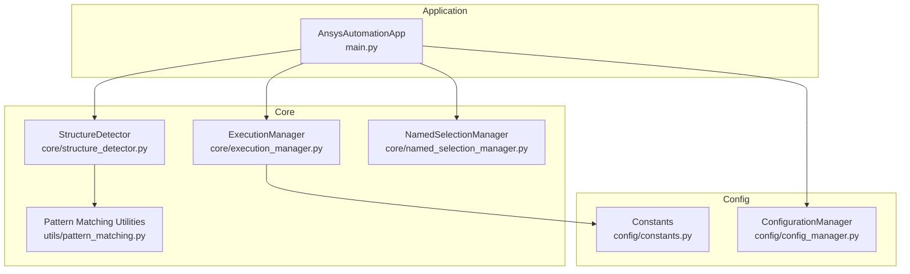
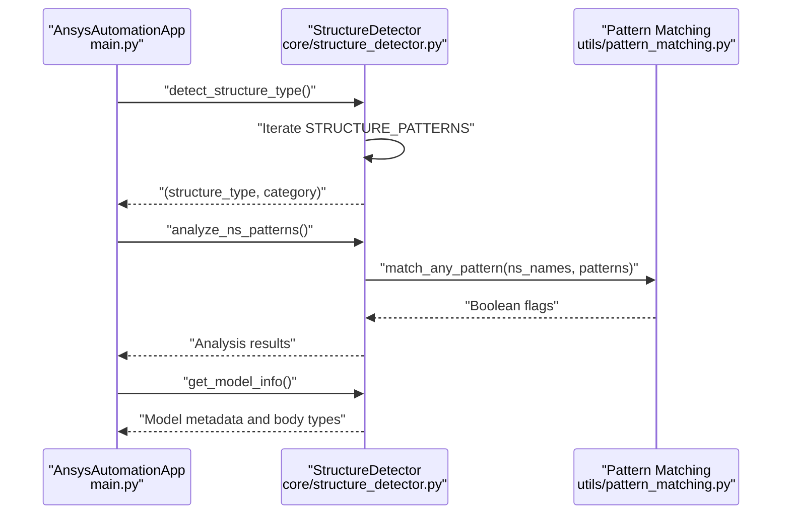
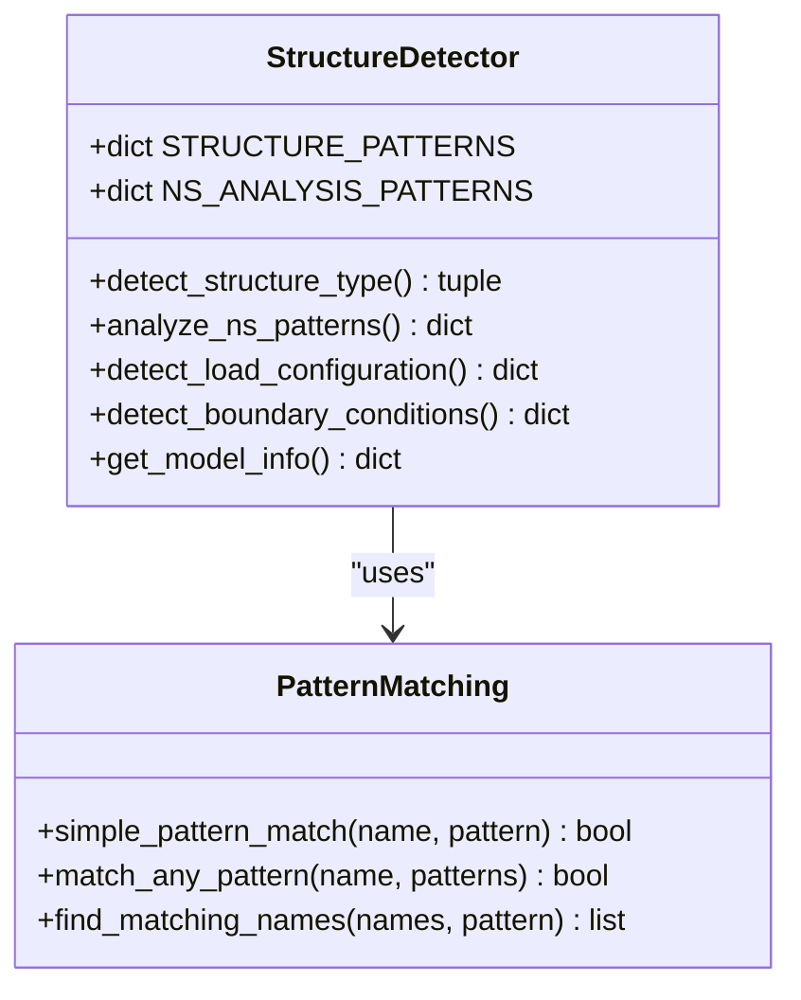
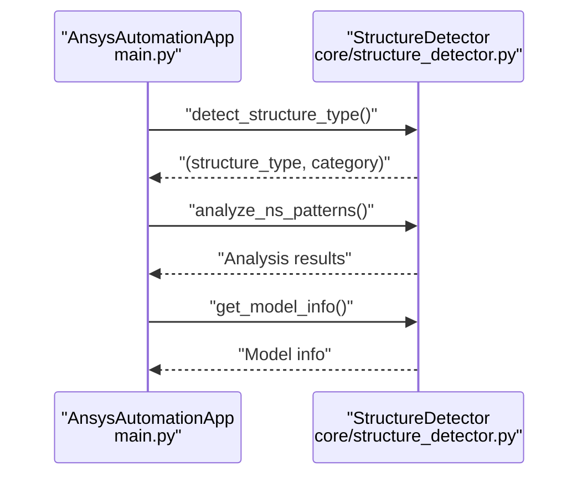
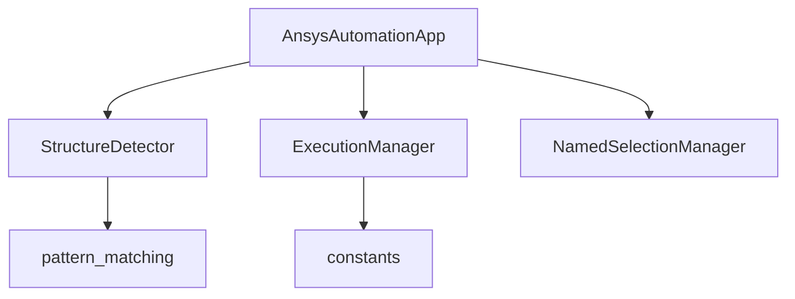

# Structure Detection

<cite>
**Referenced Files in This Document**
- [structure_detector.py](file://core/structure_detector.py)
- [pattern_matching.py](file://utils/pattern_matching.py)
- [main.py](file://main.py)
- [constants.py](file://config/constants.py)
- [config_manager.py](file://config/config_manager.py)
- [execution_manager.py](file://core/execution_manager.py)
- [named_selection_manager.py](file://core/named_selection_manager.py)
</cite>

## Table of Contents
1. [Introduction](#introduction)
2. [Project Structure](#project-structure)
3. [Core Components](#core-components)
4. [Architecture Overview](#architecture-overview)
5. [Detailed Component Analysis](#detailed-component-analysis)
6. [Dependency Analysis](#dependency-analysis)
7. [Performance Considerations](#performance-considerations)
8. [Troubleshooting Guide](#troubleshooting-guide)
9. [Conclusion](#conclusion)

## Introduction
This document explains the structure detection feature centered on the StructureDetector class. It details how detect_structure_type() uses regex patterns to extract structure type and category from the ANSYS model name, how analyze_ns_patterns() leverages wildcard patterns to identify critical Named Selections for bolts, pressure, contact, and supports, and how detect_load_configuration() and detect_boundary_conditions() scan Named Selections for load and boundary condition indicators. It also documents the integration of get_model_info() for gathering body counts and types based on naming conventions, and provides troubleshooting guidance for ambiguous model names or missing patterns.

## Project Structure
The structure detection feature spans several modules:
- core/structure_detector.py defines the StructureDetector class and its detection methods.
- utils/pattern_matching.py provides simple wildcard matching utilities used by StructureDetector.
- main.py orchestrates initialization and invokes StructureDetector methods early in the workflow.
- config/constants.py defines default settings and patterns used elsewhere in the system.
- core/execution_manager.py demonstrates complementary pattern matching for execution type determination.
- core/named_selection_manager.py offers higher-level Named Selection operations and validation.

**Diagram sources**
- [structure_detector.py](file://core/structure_detector.py#L1-L158)
- [pattern_matching.py](file://utils/pattern_matching.py#L1-L71)
- [main.py](file://main.py#L1-L270)
- [constants.py](file://config/constants.py#L1-L99)
- [execution_manager.py](file://core/execution_manager.py#L1-L154)
- [named_selection_manager.py](file://core/named_selection_manager.py#L1-L190)
- [config_manager.py](file://config/config_manager.py#L1-L209)

**Section sources**
- [structure_detector.py](file://core/structure_detector.py#L1-L158)
- [pattern_matching.py](file://utils/pattern_matching.py#L1-L71)
- [main.py](file://main.py#L1-L270)
- [constants.py](file://config/constants.py#L1-L99)
- [execution_manager.py](file://core/execution_manager.py#L1-L154)
- [named_selection_manager.py](file://core/named_selection_manager.py#L1-L190)
- [config_manager.py](file://config/config_manager.py#L1-L209)

## Core Components
- StructureDetector: Provides methods to detect structure type from model name, analyze Named Selection patterns, detect load configuration, detect boundary conditions, and gather model information.
- Pattern Matching Utilities: Implements simple wildcard matching compatible with IronPython environments.
- AnsysAutomationApp: Initializes the application, detects structure type and analyzes Named Selections, and loads configuration hierarchies.

Key responsibilities:
- detect_structure_type(): Applies regex patterns to model name to infer structure type and category, with a fallback mechanism.
- analyze_ns_patterns(): Scans Named Selections using wildcard patterns to flag presence of bolts, pressure, contact, remote, and supports.
- detect_load_configuration(): Identifies load types by scanning Named Selection names for indicators.
- detect_boundary_conditions(): Identifies boundary condition types by scanning Named Selection names for indicators.
- get_model_info(): Gathers model metadata including body counts and categorizes bodies by naming conventions.

**Section sources**
- [structure_detector.py](file://core/structure_detector.py#L1-L158)
- [pattern_matching.py](file://utils/pattern_matching.py#L1-L71)
- [main.py](file://main.py#L60-L80)

## Architecture Overview
The structure detection workflow integrates with the application initialization sequence. StructureDetector is invoked during application startup to:
- Determine structure type and category from the model name.
- Analyze Named Selection patterns to pre-validate critical selections.
- Gather model information to inform downstream managers.

**Diagram sources**
- [main.py](file://main.py#L60-L80)
- [structure_detector.py](file://core/structure_detector.py#L1-L158)
- [pattern_matching.py](file://utils/pattern_matching.py#L1-L71)

## Detailed Component Analysis

### StructureDetector Class
StructureDetector encapsulates all structure detection logic. It defines:
- STRUCTURE_PATTERNS: Regex patterns to extract structure type and categorize the model.
- NS_ANALYSIS_PATTERNS: Wildcard patterns for detecting critical Named Selections.

Methods:
- detect_structure_type(): Matches model name against STRUCTURE_PATTERNS and falls back to splitting by hyphens if no pattern matches.
- analyze_ns_patterns(): Iterates NS_ANALYSIS_PATTERNS and checks each Named Selection name against wildcard patterns.
- detect_load_configuration(): Scans Named Selection names for load indicators (force, moment, pressure, temperature, bearing).
- detect_boundary_conditions(): Scans Named Selection names for boundary condition indicators (fixed, displacement, remote, frictionless, compression).
- get_model_info(): Collects model metadata and classifies bodies by naming conventions.

**Diagram sources**
- [structure_detector.py](file://core/structure_detector.py#L1-L158)
- [pattern_matching.py](file://utils/pattern_matching.py#L1-L71)

**Section sources**
- [structure_detector.py](file://core/structure_detector.py#L1-L158)
- [pattern_matching.py](file://utils/pattern_matching.py#L1-L71)

### detect_structure_type() Method
Behavior:
- Reads the model name and iterates over STRUCTURE_PATTERNS.
- Uses regex matching to extract the structure type and return the associated category.
- Falls back to splitting the model name by hyphens and returning the first part with category "unknown".
- Returns a default fallback if parsing fails.

Concrete examples from patterns:
- Standard format: "151-02-F2" matches the first pattern and extracts "151" as structure type with category "standard".
- Custom format: "custom_001-01-F1" matches the second pattern and extracts "custom_001" as structure type with category "custom".
- Legacy format: "151_something" matches the third pattern and extracts "151" as structure type with category "legacy".
- Coded format: "ABC_001" matches the fourth pattern and extracts "ABC" as structure type with category "coded".

Fallback mechanism:
- If no regex matches, splits the model name by "-" and returns the first segment with category "unknown".
- If splitting fails, returns "default" with category "unknown".

**Section sources**
- [structure_detector.py](file://core/structure_detector.py#L12-L27)
- [structure_detector.py](file://core/structure_detector.py#L29-L51)

### analyze_ns_patterns() Method
Behavior:
- Retrieves all Named Selection names from the model.
- For each NS type in NS_ANALYSIS_PATTERNS, checks if any Named Selection name matches using wildcard patterns.
- Produces a dictionary with flags like has_bolts, has_pressure, has_contact, has_remote, has_supports.
- Also records total count and raw names for diagnostics.

Wildcard matching:
- Uses match_any_pattern() to evaluate each pattern against each Named Selection name.

**Section sources**
- [structure_detector.py](file://core/structure_detector.py#L53-L71)
- [pattern_matching.py](file://utils/pattern_matching.py#L47-L59)

### detect_load_configuration() Method
Behavior:
- Scans Named Selection names for load indicators:
  - Force loads
  - Moment loads
  - Pressure loads
  - Temperature loads
  - Bearing loads
- Returns a dictionary with boolean flags indicating presence of each load type.

Implementation details:
- Uses simple_pattern_match() to evaluate wildcard patterns against each Named Selection name.

**Section sources**
- [structure_detector.py](file://core/structure_detector.py#L73-L92)
- [pattern_matching.py](file://utils/pattern_matching.py#L8-L31)

### detect_boundary_conditions() Method
Behavior:
- Scans Named Selection names for boundary condition indicators:
  - Fixed supports
  - Displacements
  - Remote displacements
  - Remote forces
  - Frictionless conditions
  - Compression conditions
- Returns a dictionary with boolean flags indicating presence of each BC type.

Implementation details:
- Uses simple_pattern_match() to evaluate wildcard patterns against each Named Selection name.

**Section sources**
- [structure_detector.py](file://core/structure_detector.py#L93-L113)
- [pattern_matching.py](file://utils/pattern_matching.py#L8-L31)

### get_model_info() Method
Behavior:
- Retrieves geometry bodies and counts them.
- Records body names and counts Named Selections and materials.
- Classifies bodies by naming conventions:
  - Bolts: contains "mbolt"
  - Washers: contains "shaiba"
  - Nuts: contains "mgaika"
  - Supports: contains "opora"
  - Pipes: contains "truba"
  - Welds: contains "shov"
  - Other: default category
- Returns a dictionary with model metadata and body type counts.

Error handling:
- Catches exceptions and returns a minimal dictionary with an error field.

**Section sources**
- [structure_detector.py](file://core/structure_detector.py#L114-L158)

### Integration with Application Initialization
During application initialization, StructureDetector is used to:
- Detect structure type and category from the model name.
- Analyze Named Selection patterns to pre-validate critical selections.
- Gather model information to inform downstream managers.

**Diagram sources**
- [main.py](file://main.py#L60-L80)
- [structure_detector.py](file://core/structure_detector.py#L1-L158)

**Section sources**
- [main.py](file://main.py#L60-L80)

### Complementary Pattern Matching in ExecutionManager
While StructureDetector focuses on structure type detection from model names, ExecutionManager demonstrates additional pattern matching for execution type determination. It:
- Tries structure-specific patterns from project settings.
- Falls back to default patterns and alternative patterns.
- Raises an exception if execution type cannot be determined.

This illustrates how pattern-based inference is used across the system.

**Section sources**
- [execution_manager.py](file://core/execution_manager.py#L16-L59)

## Dependency Analysis
StructureDetector depends on:
- utils/pattern_matching for wildcard matching and pattern utilities.
- The ANSYS model object (Model) for accessing Named Selections, Geometry, and Materials.

Integration points:
- main.py invokes StructureDetector during initialization.
- config/constants.py provides default settings and patterns used elsewhere.
- core/execution_manager.py complements structure detection with execution type determination.
- core/named_selection_manager.py provides higher-level Named Selection operations and validation.

**Diagram sources**
- [structure_detector.py](file://core/structure_detector.py#L1-L158)
- [pattern_matching.py](file://utils/pattern_matching.py#L1-L71)
- [main.py](file://main.py#L1-L270)
- [execution_manager.py](file://core/execution_manager.py#L1-L154)
- [constants.py](file://config/constants.py#L1-L99)
- [named_selection_manager.py](file://core/named_selection_manager.py#L1-L190)

**Section sources**
- [structure_detector.py](file://core/structure_detector.py#L1-L158)
- [pattern_matching.py](file://utils/pattern_matching.py#L1-L71)
- [main.py](file://main.py#L1-L270)
- [execution_manager.py](file://core/execution_manager.py#L1-L154)
- [constants.py](file://config/constants.py#L1-L99)
- [named_selection_manager.py](file://core/named_selection_manager.py#L1-L190)

## Performance Considerations
- Regex matching cost: detect_structure_type() iterates over a small set of patterns and performs a single regex match per pattern. Complexity is O(P) where P is the number of patterns.
- Wildcard matching cost: analyze_ns_patterns(), detect_load_configuration(), and detect_boundary_conditions() iterate over all Named Selections and evaluate wildcard patterns. Complexity is O(N × W) where N is the number of Named Selections and W is the number of patterns per type.
- Body classification cost: get_model_info() iterates over bodies and performs substring checks. Complexity is O(B) where B is the number of bodies.
- Recommendations:
  - Cache Named Selection names and reuse lists to avoid repeated enumeration.
  - Limit wildcard patterns to essential categories to reduce W.
  - Consider short-circuiting when sufficient flags are detected (already implemented via any()).
  - For very large models, consider batching or limiting analysis scope to critical selections.

[No sources needed since this section provides general guidance]

## Troubleshooting Guide
Common issues and resolutions:
- Ambiguous model names:
  - Symptom: detect_structure_type() falls back to splitting by hyphens.
  - Resolution: Ensure model names follow one of the recognized formats or adjust patterns in STRUCTURE_PATTERNS.
- Missing patterns:
  - Symptom: No matches in analyze_ns_patterns(), detect_load_configuration(), or detect_boundary_conditions().
  - Resolution: Verify Named Selection names include the expected keywords or update NS_ANALYSIS_PATTERNS and indicator patterns.
- Unexpected structure category:
  - Symptom: Category is "unknown" or "default".
  - Resolution: Confirm model name matches one of the defined patterns; otherwise, refine patterns or add new ones.
- Missing materials or geometry:
  - Symptom: get_model_info() returns an error field.
  - Resolution: Ensure the model has geometry and materials; handle exceptions gracefully.
- Execution type determination failures:
  - Symptom: ExecutionManager raises an exception when execution type cannot be determined.
  - Resolution: Ensure model name matches one of the supported patterns or provide a default execution type in project settings.

**Section sources**
- [structure_detector.py](file://core/structure_detector.py#L29-L51)
- [structure_detector.py](file://core/structure_detector.py#L114-L158)
- [execution_manager.py](file://core/execution_manager.py#L55-L59)

## Conclusion
StructureDetector centralizes structure identification and selection validation using robust regex and wildcard pattern matching. Its methods enable early detection of structure type, pre-validation of Named Selections, and collection of model metadata. Together with ExecutionManager and the application initialization flow, these capabilities streamline automated analysis setup while providing clear fallbacks and diagnostic outputs for troubleshooting.