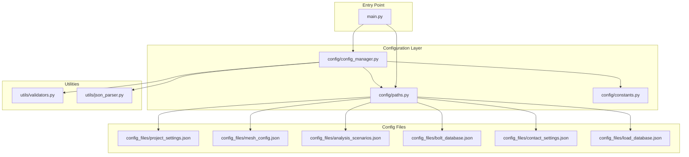
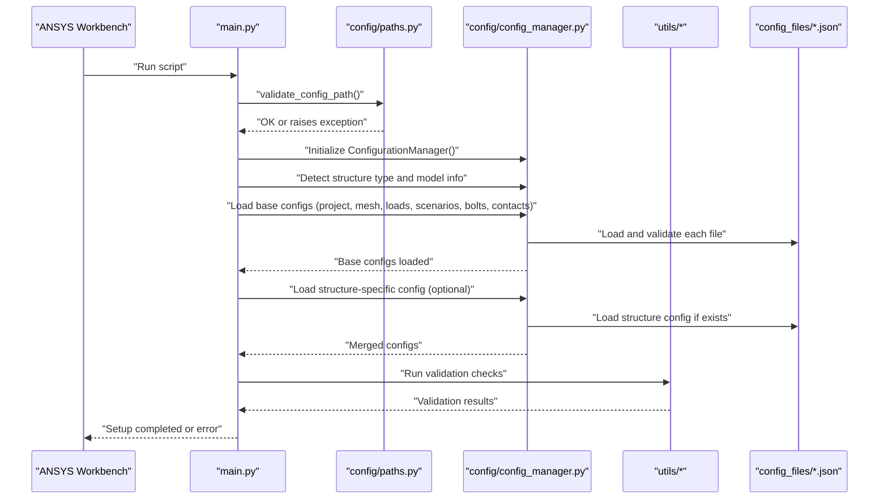
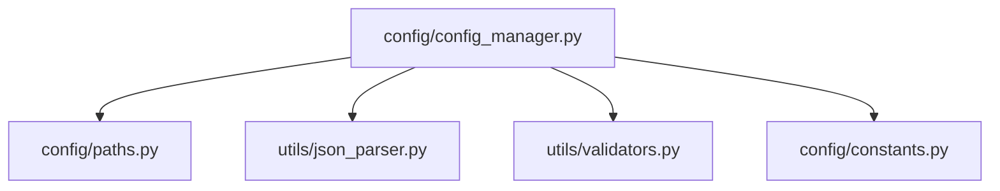

# Installation and Setup

<cite>
**Referenced Files in This Document**
- [paths.py](file://config/paths.py)
- [config_manager.py](file://config/config_manager.py)
- [constants.py](file://config/constants.py)
- [validators.py](file://utils/validators.py)
- [json_parser.py](file://utils/json_parser.py)
- [main.py](file://main.py)
- [project_settings.json](file://config_files/project_settings.json)
- [mesh_config.json](file://config_files/mesh_config.json)
- [analysis_scenarios.json](file://config_files/analysis_scenarios.json)
- [bolt_database.json](file://config_files/bolt_database.json)
- [contact_settings.json](file://config_files/contact_settings.json)
- [load_database.json](file://config_files/load_database.json)
</cite>

## Table of Contents
1. [Introduction](#introduction)
2. [Project Structure](#project-structure)
3. [Core Components](#core-components)
4. [Architecture Overview](#architecture-overview)
5. [Detailed Component Analysis](#detailed-component-analysis)
6. [Dependency Analysis](#dependency-analysis)
7. [Performance Considerations](#performance-considerations)
8. [Troubleshooting Guide](#troubleshooting-guide)
9. [Conclusion](#conclusion)
10. [Appendices](#appendices)

## Introduction
This document explains how to install and set up AnsysAutomation for use within ANSYS Workbench. It covers prerequisites, configuration directory layout, path configuration, validation routines, integration into ANSYS Workbench, and verification steps. It also highlights security considerations for enterprise environments.

## Project Structure
The repository is organized into modules that separate configuration, core logic, managers, utilities, and entry points. The configuration layer defines the configuration path and validates it, while the configuration manager loads and validates JSON configuration files. Utilities provide JSON parsing and validation helpers. The main entry point orchestrates initialization, validation, and execution.

**Diagram sources**
- [paths.py](file://config/paths.py#L1-L73)
- [config_manager.py](file://config/config_manager.py#L1-L209)
- [constants.py](file://config/constants.py#L1-L99)
- [validators.py](file://utils/validators.py#L1-L161)
- [json_parser.py](file://utils/json_parser.py#L1-L170)
- [main.py](file://main.py#L1-L270)
- [project_settings.json](file://config_files/project_settings.json#L1-L56)
- [mesh_config.json](file://config_files/mesh_config.json#L1-L85)
- [analysis_scenarios.json](file://config_files/analysis_scenarios.json#L1-L55)
- [bolt_database.json](file://config_files/bolt_database.json#L1-L47)
- [contact_settings.json](file://config_files/contact_settings.json#L1-L130)
- [load_database.json](file://config_files/load_database.json#L1-L414)

**Section sources**
- [paths.py](file://config/paths.py#L1-L73)
- [config_manager.py](file://config/config_manager.py#L1-L209)
- [main.py](file://main.py#L1-L270)

## Core Components
- Configuration path and file resolution: The configuration path is defined centrally and used to resolve all configuration files. A dedicated function validates that the path exists.
- Configuration manager: Loads and validates configuration files, merges base and structure-specific configurations, and provides default configurations when needed.
- Constants and validation: Defines default settings and required keys for validation, and provides validation utilities for files, keys, and model structure.
- JSON parsing: Handles file loading and comment removal for JSON files compatible with IronPython.

Key responsibilities:
- Centralized configuration path management
- Hierarchical configuration loading and merging
- Validation of required keys and file presence
- JSON parsing with comment support

**Section sources**
- [paths.py](file://config/paths.py#L1-L73)
- [config_manager.py](file://config/config_manager.py#L1-L209)
- [constants.py](file://config/constants.py#L1-L99)
- [validators.py](file://utils/validators.py#L1-L161)
- [json_parser.py](file://utils/json_parser.py#L1-L170)

## Architecture Overview
The setup process follows a structured flow:
- Validate configuration path
- Initialize configuration manager
- Detect structure type and model metadata
- Load base and structure-specific configurations
- Initialize managers
- Run validation checks
- Execute automated analysis setup

**Diagram sources**
- [main.py](file://main.py#L1-L270)
- [paths.py](file://config/paths.py#L1-L73)
- [config_manager.py](file://config/config_manager.py#L1-L209)
- [validators.py](file://utils/validators.py#L1-L161)
- [json_parser.py](file://utils/json_parser.py#L1-L170)
- [project_settings.json](file://config_files/project_settings.json#L1-L56)
- [mesh_config.json](file://config_files/mesh_config.json#L1-L85)
- [analysis_scenarios.json](file://config_files/analysis_scenarios.json#L1-L55)
- [bolt_database.json](file://config_files/bolt_database.json#L1-L47)
- [contact_settings.json](file://config_files/contact_settings.json#L1-L130)
- [load_database.json](file://config_files/load_database.json#L1-L414)

## Detailed Component Analysis

### Prerequisites
- ANSYS Workbench environment: The script runs inside ANSYS Workbench using IronPython. Ensure the Workbench environment is available and the script is executed from the user scripts interface.
- IronPython runtime: The code relies on IronPython’s System and System.IO namespaces for file operations and path handling.
- Directory structure: Place all configuration JSON files under a single directory and configure the configuration path to point to this directory.

**Section sources**
- [main.py](file://main.py#L1-L270)
- [paths.py](file://config/paths.py#L1-L73)

### Configuring the Configuration Path
- Locate the configuration path constant and update it to point to your configuration directory.
- Ensure the directory contains all required configuration files listed below.
- Use forward slashes or double backslashes in Windows paths to avoid escaping issues.

Steps:
1. Open the configuration path module.
2. Update the configuration path constant to your target directory.
3. Save the file.

Verification:
- Call the path validation function to confirm the directory exists.
- Optionally, list all expected configuration files to ensure they are present.

**Section sources**
- [paths.py](file://config/paths.py#L1-L73)

### Validating the Configuration Path
- The validation function checks whether the configured directory exists.
- If the directory does not exist, the function raises an exception with a descriptive message.
- Use this function during initialization to fail fast if the configuration path is incorrect.

Common issues:
- Incorrect path string (typo, wrong drive letter, missing separators)
- Permission errors preventing directory access
- Case sensitivity on case-sensitive filesystems

**Section sources**
- [paths.py](file://config/paths.py#L45-L58)

### Required Configuration Files and Their Purposes
Place these files in the configuration directory referenced by the configuration path:

- project_settings.json
  - Purpose: Project metadata, execution patterns, boundary conditions, load definitions, mesh defaults, solution settings, and units.
  - Example path: [project_settings.json](file://config_files/project_settings.json#L1-L56)

- mesh_config.json
  - Purpose: Mesh settings per component type, including coefficients, methods, and element orders.
  - Example path: [mesh_config.json](file://config_files/mesh_config.json#L1-L85)

- analysis_scenarios.json
  - Purpose: Standard sequences and alternative scenarios for automated analysis, including steps, load factors, and solver settings.
  - Example path: [analysis_scenarios.json](file://config_files/analysis_scenarios.json#L1-L55)

- bolt_database.json
  - Purpose: Bolt specifications (diameter and pretension) keyed by nominal sizes.
  - Example path: [bolt_database.json](file://config_files/bolt_database.json#L1-L47)

- contact_settings.json
  - Purpose: Contact rules and advanced contact settings for different component pairs.
  - Example path: [contact_settings.json](file://config_files/contact_settings.json#L1-L130)

- load_database.json
  - Purpose: Nominal forces and moments for various execution types and load groups.
  - Example path: [load_database.json](file://config_files/load_database.json#L1-L414)

Optional structure-specific configuration:
- structure_<type>_config.json
  - Purpose: Overrides and additions to base configuration for a specific structure type.
  - The configuration manager attempts to load this file and merges it into the base configuration.

**Section sources**
- [project_settings.json](file://config_files/project_settings.json#L1-L56)
- [mesh_config.json](file://config_files/mesh_config.json#L1-L85)
- [analysis_scenarios.json](file://config_files/analysis_scenarios.json#L1-L55)
- [bolt_database.json](file://config_files/bolt_database.json#L1-L47)
- [contact_settings.json](file://config_files/contact_settings.json#L1-L130)
- [load_database.json](file://config_files/load_database.json#L1-L414)
- [config_manager.py](file://config/config_manager.py#L119-L137)

### Integrating Into ANSYS Workbench
- Open ANSYS Workbench.
- Navigate to the user scripts interface.
- Add the main script entry point to the user scripts.
- Ensure the configuration path points to a directory containing all required JSON files.
- Run the script from the user scripts interface.

Notes:
- The script initializes managers and performs validations before executing analysis setup.
- Errors are reported with detailed messages to help diagnose configuration or model issues.

**Section sources**
- [main.py](file://main.py#L1-L270)

### Verification Steps
After integrating the script:
1. Run the initialization routine to validate the configuration path and load base configurations.
2. Execute the validation routine to check named selections, model structure, and configuration hierarchy.
3. Confirm that the automated analysis setup completes successfully and prints a success summary.

If validation fails:
- Review the printed warnings and error messages.
- Verify the presence and correctness of required configuration files.
- Re-run the validation routine after correcting issues.

**Section sources**
- [main.py](file://main.py#L1-L270)
- [config_manager.py](file://config/config_manager.py#L181-L209)

### Security Considerations for Enterprise Environments
- File permissions: Ensure the configuration directory and files are readable by the user account running ANSYS Workbench.
- Network drives: Prefer local paths for configuration directories to avoid latency and network access issues.
- Least privilege: Restrict write access to configuration files to authorized users only.
- Audit logs: Monitor access to configuration files in shared environments.

[No sources needed since this section provides general guidance]

## Dependency Analysis
The configuration manager depends on:
- Configuration path module for resolving file paths
- JSON parser for loading and parsing configuration files
- Validators for checking file existence and required keys
- Constants for default settings and required keys

**Diagram sources**
- [config_manager.py](file://config/config_manager.py#L1-L209)
- [paths.py](file://config/paths.py#L1-L73)
- [json_parser.py](file://utils/json_parser.py#L1-L170)
- [validators.py](file://utils/validators.py#L1-L161)
- [constants.py](file://config/constants.py#L1-L99)

**Section sources**
- [config_manager.py](file://config/config_manager.py#L1-L209)
- [paths.py](file://config/paths.py#L1-L73)
- [json_parser.py](file://utils/json_parser.py#L1-L170)
- [validators.py](file://utils/validators.py#L1-L161)
- [constants.py](file://config/constants.py#L1-L99)

## Performance Considerations
- Keep the configuration directory local to reduce I/O latency.
- Limit the number of structure-specific configuration files to only those needed.
- Avoid overly large JSON files; split into smaller, focused files if necessary.

[No sources needed since this section provides general guidance]

## Troubleshooting Guide
Common issues and resolutions:
- Missing configuration directory
  - Symptom: Path validation raises an exception.
  - Resolution: Update the configuration path constant to the correct directory and re-run validation.

- Missing configuration files
  - Symptom: Validation reports missing files.
  - Resolution: Ensure all required files are present in the configuration directory.

- Permission errors
  - Symptom: File not found or access denied errors.
  - Resolution: Adjust file permissions so the user account running ANSYS Workbench can read the files.

- Incorrect file paths or structure-specific configuration
  - Symptom: Structure-specific configuration not applied.
  - Resolution: Verify the filename pattern for structure-specific configuration and ensure it matches the detected structure type.

- Version compatibility
  - Symptom: Script fails due to IronPython or ANSYS Workbench differences.
  - Resolution: Confirm the script is executed within the supported ANSYS Workbench environment and that IronPython APIs are available.

**Section sources**
- [paths.py](file://config/paths.py#L45-L58)
- [config_manager.py](file://config/config_manager.py#L181-L209)
- [validators.py](file://utils/validators.py#L1-L161)

## Conclusion
By correctly configuring the configuration path, placing all required JSON files in the configuration directory, validating the setup, and integrating the script into ANSYS Workbench, you can automate analysis setup reliably. Use the provided validation routines to catch issues early and follow the troubleshooting steps to resolve common problems.

## Appendices

### Appendix A: Configuration File Reference
- project_settings.json: Project metadata, execution patterns, boundary conditions, load definitions, mesh defaults, solution settings, and units.
  - Reference: [project_settings.json](file://config_files/project_settings.json#L1-L56)

- mesh_config.json: Mesh settings per component type.
  - Reference: [mesh_config.json](file://config_files/mesh_config.json#L1-L85)

- analysis_scenarios.json: Analysis sequences and solver settings.
  - Reference: [analysis_scenarios.json](file://config_files/analysis_scenarios.json#L1-L55)

- bolt_database.json: Bolt specifications keyed by nominal sizes.
  - Reference: [bolt_database.json](file://config_files/bolt_database.json#L1-L47)

- contact_settings.json: Contact rules and advanced contact settings.
  - Reference: [contact_settings.json](file://config_files/contact_settings.json#L1-L130)

- load_database.json: Nominal forces and moments for execution types and load groups.
  - Reference: [load_database.json](file://config_files/load_database.json#L1-L414)

**Section sources**
- [project_settings.json](file://config_files/project_settings.json#L1-L56)
- [mesh_config.json](file://config_files/mesh_config.json#L1-L85)
- [analysis_scenarios.json](file://config_files/analysis_scenarios.json#L1-L55)
- [bolt_database.json](file://config_files/bolt_database.json#L1-L47)
- [contact_settings.json](file://config_files/contact_settings.json#L1-L130)
- [load_database.json](file://config_files/load_database.json#L1-L414)