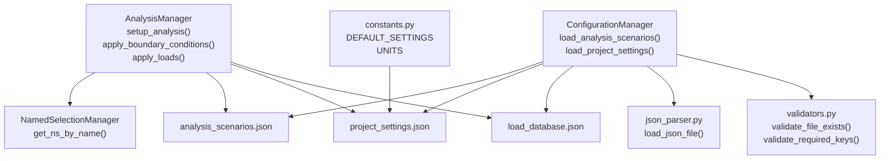
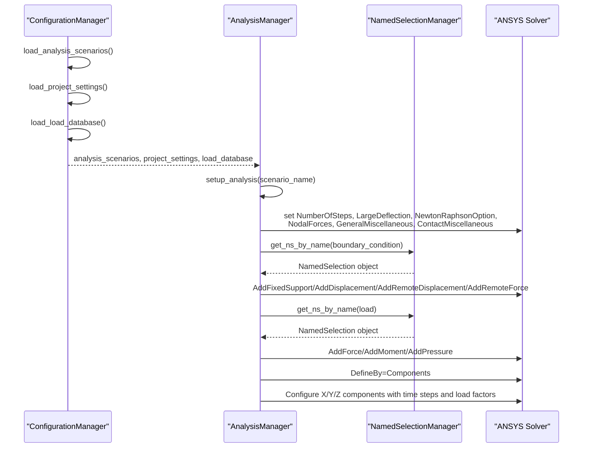
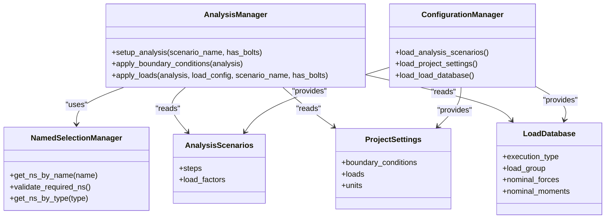
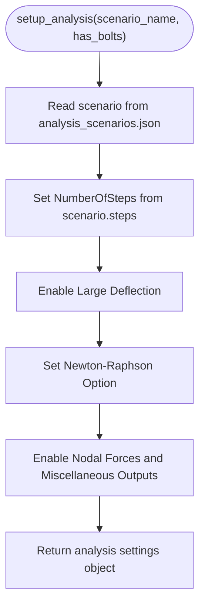
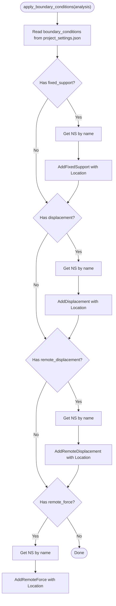
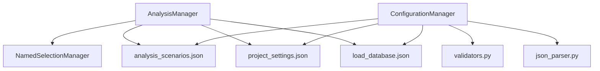

# Analysis Manager

<cite>
**Referenced Files in This Document**
- [analysis_manager.py](file://managers/analysis_manager.py)
- [named_selection_manager.py](file://core/named_selection_manager.py)
- [analysis_scenarios.json](file://config_files/analysis_scenarios.json)
- [project_settings.json](file://config_files/project_settings.json)
- [load_database.json](file://config_files/load_database.json)
- [config_manager.py](file://config/config_manager.py)
- [constants.py](file://config/constants.py)
- [validators.py](file://utils/validators.py)
- [json_parser.py](file://utils/json_parser.py)
</cite>

## Table of Contents
1. [Introduction](#introduction)
2. [Project Structure](#project-structure)
3. [Core Components](#core-components)
4. [Architecture Overview](#architecture-overview)
5. [Detailed Component Analysis](#detailed-component-analysis)
6. [Dependency Analysis](#dependency-analysis)
7. [Performance Considerations](#performance-considerations)
8. [Troubleshooting Guide](#troubleshooting-guide)
9. [Conclusion](#conclusion)

## Introduction
This document provides a comprehensive analysis of the AnalysisManager class responsible for configuring ANSYS simulation setups. It focuses on:
- Configuring solver settings and output controls via setup_analysis() using scenario definitions from analysis_scenarios.json
- Applying boundary conditions (fixed supports, displacements, remote displacements, remote forces) by referencing named selections managed by NamedSelectionManager
- Applying loads (forces, moments, pressure) with time step generation, load factor application across steps, and vector component handling with unit conversions (N, N·mm, MPa)
- Integrating with load configuration data and scenario-specific step counts
- Addressing common configuration issues and providing troubleshooting guidance
- Discussing performance considerations related to step count and output controls

## Project Structure
The AnalysisManager integrates with configuration files and utilities to orchestrate ANSYS setup:
- Managers: AnalysisManager orchestrates solver settings, boundary conditions, and loads
- Core: NamedSelectionManager manages named selections used by AnalysisManager
- Config: Configuration files define scenarios, project settings, and load databases
- Utilities: Validators and JSON parser support configuration loading and validation

**Diagram sources**
- [analysis_manager.py](file://managers/analysis_manager.py#L1-L116)
- [named_selection_manager.py](file://core/named_selection_manager.py#L1-L190)
- [analysis_scenarios.json](file://config_files/analysis_scenarios.json#L1-L55)
- [project_settings.json](file://config_files/project_settings.json#L1-L56)
- [load_database.json](file://config_files/load_database.json#L1-L414)
- [config_manager.py](file://config/config_manager.py#L1-L209)
- [constants.py](file://config/constants.py#L1-L99)
- [validators.py](file://utils/validators.py#L1-L161)
- [json_parser.py](file://utils/json_parser.py#L1-L170)

**Section sources**
- [analysis_manager.py](file://managers/analysis_manager.py#L1-L116)
- [named_selection_manager.py](file://core/named_selection_manager.py#L1-L190)
- [analysis_scenarios.json](file://config_files/analysis_scenarios.json#L1-L55)
- [project_settings.json](file://config_files/project_settings.json#L1-L56)
- [load_database.json](file://config_files/load_database.json#L1-L414)
- [config_manager.py](file://config/config_manager.py#L1-L209)
- [constants.py](file://config/constants.py#L1-L99)
- [validators.py](file://utils/validators.py#L1-L161)
- [json_parser.py](file://utils/json_parser.py#L1-L170)

## Core Components
- AnalysisManager: Central coordinator for solver settings, boundary conditions, and loads
- NamedSelectionManager: Retrieves named selections by name or pattern and validates required selections
- Configuration files: analysis_scenarios.json, project_settings.json, load_database.json
- ConfigurationManager: Loads and merges configuration files with validation
- Constants and validators: Provide defaults, units, and validation utilities

Key responsibilities:
- setup_analysis(): Applies scenario-defined solver settings and output controls
- apply_boundary_conditions(): Adds boundary condition objects using named selections
- apply_loads(): Generates time steps, applies load factors, and sets vector components with unit conversions

**Section sources**
- [analysis_manager.py](file://managers/analysis_manager.py#L1-L116)
- [named_selection_manager.py](file://core/named_selection_manager.py#L1-L190)
- [analysis_scenarios.json](file://config_files/analysis_scenarios.json#L1-L55)
- [project_settings.json](file://config_files/project_settings.json#L1-L56)
- [load_database.json](file://config_files/load_database.json#L1-L414)
- [config_manager.py](file://config/config_manager.py#L1-L209)
- [constants.py](file://config/constants.py#L1-L99)
- [validators.py](file://utils/validators.py#L1-L161)

## Architecture Overview
The AnalysisManager coordinates with configuration and named selection systems to configure ANSYS analyses. The flow below maps actual code relationships.

**Diagram sources**
- [analysis_manager.py](file://managers/analysis_manager.py#L1-L116)
- [named_selection_manager.py](file://core/named_selection_manager.py#L1-L190)
- [analysis_scenarios.json](file://config_files/analysis_scenarios.json#L1-L55)
- [project_settings.json](file://config_files/project_settings.json#L1-L56)
- [load_database.json](file://config_files/load_database.json#L1-L414)
- [config_manager.py](file://config/config_manager.py#L1-L209)

## Detailed Component Analysis

### AnalysisManager.setup_analysis()
Responsibilities:
- Reads scenario definition from analysis_scenarios.json
- Sets solver settings:
  - Number of steps
  - Large deflection enabled
  - Newton-Raphson option
  - Output controls for nodal forces, miscellaneous results
- Returns the analysis settings object for downstream use

Behavior highlights:
- Uses scenario steps to set NumberOfSteps
- Enables large deflection for geometric nonlinearities
- Selects Newton-Raphson type based on scenario settings
- Enables output controls for nodal forces and miscellaneous results

Integration points:
- Consumes analysis_scenarios.json for scenario metadata
- Uses ANSYS API to set solver settings

**Section sources**
- [analysis_manager.py](file://managers/analysis_manager.py#L14-L26)
- [analysis_scenarios.json](file://config_files/analysis_scenarios.json#L1-L55)

### AnalysisManager.apply_boundary_conditions()
Responsibilities:
- Applies boundary conditions using named selections
- Supports fixed support, displacement, remote displacement, and remote force
- Retrieves named selections via NamedSelectionManager.get_ns_by_name()

Boundary condition types:
- Fixed support: attaches a fixed support to the named selection
- Displacement: applies a displacement constraint to the named selection
- Remote displacement: applies a remote displacement to the named selection
- Remote force: applies a remote force to the named selection

Validation:
- If a named selection is missing, the operation is skipped for that BC type

**Section sources**
- [analysis_manager.py](file://managers/analysis_manager.py#L28-L59)
- [named_selection_manager.py](file://core/named_selection_manager.py#L17-L38)
- [project_settings.json](file://config_files/project_settings.json#L16-L32)

### AnalysisManager.apply_loads()
Responsibilities:
- Applies loads with proper step configuration
- Generates time steps based on scenario steps and presence of bolts
- Applies load factors across steps
- Handles vector components for force and moment loads
- Converts units appropriately (N, N·mm, MPa)

Load types and configuration:
- Force load:
  - Uses named selection for force
  - DefineBy set to Components
  - Iterates over X, Y, Z components
  - Dynamically accesses component objects by name (e.g., XComponent, YComponent, ZComponent)
  - Applies time steps and load factors with unit N
- Moment load:
  - Uses named selection for moment
  - DefineBy set to Components
  - Iterates over X, Y, Z components
  - Applies time steps and load factors with unit N·mm
- Pressure load:
  - Uses named selection for pressure
  - Applies magnitude with unit MPa

Time step generation:
- If bolts are present, time steps include an extra initial step (shifted load factors)
- Otherwise, time steps align with scenario steps

Unit handling:
- Forces: N
- Moments: N·mm
- Pressure: MPa
- Length unit: mm (as defined in project settings)
- Time unit: s (as defined in project settings)

Integration with load configuration:
- Loads are sourced from load_database.json based on execution type and load group
- Nominal force and moment components are accessed via keys fx/fy/fz and mx/my/mz
- Load factors are taken from scenario definitions

Dynamic component access:
- Components are accessed by constructing property names (e.g., "XComponent", "YComponent", "ZComponent")
- Values are computed as nominal component values multiplied by load factors

**Section sources**
- [analysis_manager.py](file://managers/analysis_manager.py#L60-L116)
- [load_database.json](file://config_files/load_database.json#L1-L414)
- [project_settings.json](file://config_files/project_settings.json#L49-L56)
- [analysis_scenarios.json](file://config_files/analysis_scenarios.json#L1-L55)

### NamedSelectionManager Integration
- get_ns_by_name(name): Retrieves a named selection by exact name with caching
- validate_required_ns(): Validates that required named selections for boundary conditions and loads exist
- get_ns_by_type(type): Finds named selections by type patterns (load, bc, bolt, contact, remote)

These utilities support robust boundary condition and load application by ensuring named selections exist before applying them.

**Section sources**
- [named_selection_manager.py](file://core/named_selection_manager.py#L17-L38)
- [named_selection_manager.py](file://core/named_selection_manager.py#L58-L85)
- [named_selection_manager.py](file://core/named_selection_manager.py#L95-L121)

### Configuration Loading and Validation
- ConfigurationManager.load_analysis_scenarios(), load_project_settings(), load_load_database(): Load and validate configuration files
- json_parser.load_json_file(): Parses JSON with comment removal and validation
- validators.validate_file_exists(), validate_required_keys(): Ensures files exist and required keys are present

Defaults and units:
- constants.DEFAULT_SETTINGS provides default names for boundary conditions and loads
- constants.UNITS defines standard units for force, moment, pressure, length, time

**Section sources**
- [config_manager.py](file://config/config_manager.py#L26-L117)
- [config_manager.py](file://config/config_manager.py#L119-L160)
- [json_parser.py](file://utils/json_parser.py#L142-L170)
- [validators.py](file://utils/validators.py#L9-L25)
- [validators.py](file://utils/validators.py#L26-L51)
- [constants.py](file://config/constants.py#L1-L99)

## Architecture Overview

**Diagram sources**
- [analysis_manager.py](file://managers/analysis_manager.py#L1-L116)
- [named_selection_manager.py](file://core/named_selection_manager.py#L1-L190)
- [config_manager.py](file://config/config_manager.py#L1-L209)
- [analysis_scenarios.json](file://config_files/analysis_scenarios.json#L1-L55)
- [project_settings.json](file://config_files/project_settings.json#L1-L56)
- [load_database.json](file://config_files/load_database.json#L1-L414)

## Detailed Component Analysis

### setup_analysis() Implementation Details
- Reads scenario steps and solver settings from analysis_scenarios.json
- Applies NumberOfSteps, LargeDeflection, NewtonRaphsonOption, NodalForces, GeneralMiscellaneous, ContactMiscellaneous
- Returns the analysis settings object for subsequent operations

**Diagram sources**
- [analysis_manager.py](file://managers/analysis_manager.py#L14-L26)
- [analysis_scenarios.json](file://config_files/analysis_scenarios.json#L1-L55)

**Section sources**
- [analysis_manager.py](file://managers/analysis_manager.py#L14-L26)
- [analysis_scenarios.json](file://config_files/analysis_scenarios.json#L1-L55)

### apply_boundary_conditions() Implementation Details
- Retrieves named selections for each boundary condition type from project_settings.json
- Applies fixed support, displacement, remote displacement, and remote force using the named selection
- Skips missing named selections

**Diagram sources**
- [analysis_manager.py](file://managers/analysis_manager.py#L28-L59)
- [named_selection_manager.py](file://core/named_selection_manager.py#L17-L38)
- [project_settings.json](file://config_files/project_settings.json#L16-L32)

**Section sources**
- [analysis_manager.py](file://managers/analysis_manager.py#L28-L59)
- [named_selection_manager.py](file://core/named_selection_manager.py#L17-L38)
- [project_settings.json](file://config_files/project_settings.json#L16-L32)

### apply_loads() Implementation Details
- Generates time steps based on scenario steps and bolt presence
- Applies load factors across steps
- Handles vector components for force and moment loads
- Converts units: N for forces, N·mm for moments, MPa for pressure
- Accesses components dynamically by constructing property names

```mermaid
flowchart TD
StartL(["apply_loads(analysis, load_config, scenario_name, has_bolts)"]) --> ReadCfg["Read scenario.steps and load_factors"]
ReadCfg --> StepsGen{"has_bolts?"}
StepsGen --> |Yes| TSteps1["Time steps: [0..steps]"]
StepsGen --> |No| TSteps2["Time steps: [0..steps-1]"]
TSteps1 --> ShiftLF["Shift load_factors by prepending 0"]
TSteps2 --> UseLF["Use load_factors as-is"]
ShiftLF --> ForceCheck{"Has force NS?"}
UseLF --> ForceCheck
ForceCheck --> |Yes| GetForceNS["Get NS by name"]
GetForceNS --> DefineForce["AddForce with DefineBy=Components"]
DefineForce --> LoopFX["Loop X,Y,Z"]
LoopFX --> CompX{"Component non-zero?"}
CompX --> |Yes| SetCompX["Access component by name<br/>Set Inputs[0].DiscreteValues=time_steps<br/>Set Output.DiscreteValues=[comp_value*factor for factor in load_factors]"]
CompX --> |No| NextComp["Next component"]
SetCompX --> NextComp
NextComp --> DoneForce["Done force"]
ForceCheck --> |No| MomentCheck{"Has moment NS?"}
DoneForce --> MomentCheck
MomentCheck --> |Yes| GetMomentNS["Get NS by name"]
GetMomentNS --> DefineMoment["AddMoment with DefineBy=Components"]
DefineMoment --> LoopMX["Loop X,Y,Z"]
LoopMX --> CompM{"Component non-zero?"}
CompM --> |Yes| SetCompM["Access component by name<br/>Set Inputs[0].DiscreteValues=time_steps<br/>Set Output.DiscreteValues=[comp_value*factor for factor in load_factors] (unit N·mm)"]
CompM --> |No| NextCompM["Next component"]
SetCompM --> NextCompM
NextCompM --> DoneMoment["Done moment"]
DoneMoment --> PressCheck{"Has pressure NS and value?"}
PressCheck --> |Yes| GetPressNS["Get NS by name"]
GetPressNS --> ApplyPress["AddPressure<br/>Set magnitude Output.DiscreteValues=[pressure*factor for factor in load_factors] (unit MPa)"]
PressCheck --> |No| EndL(["Done"])
```

**Diagram sources**
- [analysis_manager.py](file://managers/analysis_manager.py#L60-L116)
- [analysis_scenarios.json](file://config_files/analysis_scenarios.json#L1-L55)
- [project_settings.json](file://config_files/project_settings.json#L49-L56)
- [load_database.json](file://config_files/load_database.json#L1-L414)

**Section sources**
- [analysis_manager.py](file://managers/analysis_manager.py#L60-L116)
- [analysis_scenarios.json](file://config_files/analysis_scenarios.json#L1-L55)
- [project_settings.json](file://config_files/project_settings.json#L49-L56)
- [load_database.json](file://config_files/load_database.json#L1-L414)

## Dependency Analysis
- AnalysisManager depends on:
  - NamedSelectionManager for retrieving named selections
  - analysis_scenarios.json for scenario metadata
  - project_settings.json for boundary condition and load names
  - load_database.json for nominal load values
- ConfigurationManager centralizes loading and validation of configuration files
- validators and json_parser ensure configuration integrity

**Diagram sources**
- [analysis_manager.py](file://managers/analysis_manager.py#L1-L116)
- [named_selection_manager.py](file://core/named_selection_manager.py#L1-L190)
- [config_manager.py](file://config/config_manager.py#L1-L209)
- [validators.py](file://utils/validators.py#L1-L161)
- [json_parser.py](file://utils/json_parser.py#L1-L170)
- [analysis_scenarios.json](file://config_files/analysis_scenarios.json#L1-L55)
- [project_settings.json](file://config_files/project_settings.json#L1-L56)
- [load_database.json](file://config_files/load_database.json#L1-L414)

**Section sources**
- [analysis_manager.py](file://managers/analysis_manager.py#L1-L116)
- [named_selection_manager.py](file://core/named_selection_manager.py#L1-L190)
- [config_manager.py](file://config/config_manager.py#L1-L209)
- [validators.py](file://utils/validators.py#L1-L161)
- [json_parser.py](file://utils/json_parser.py#L1-L170)
- [analysis_scenarios.json](file://config_files/analysis_scenarios.json#L1-L55)
- [project_settings.json](file://config_files/project_settings.json#L1-L56)
- [load_database.json](file://config_files/load_database.json#L1-L414)

## Performance Considerations
- Step count impact:
  - Increasing NumberOfSteps increases solver iterations and result file size
  - Scenario steps are derived from analysis_scenarios.json; adjust steps to balance accuracy and performance
- Output controls:
  - Enabling NodalForces and Miscellaneous outputs increases result file size and post-processing overhead
  - Consider disabling unnecessary outputs for quick checks
- Load factor application:
  - More load factors increase discrete values arrays; keep load factors minimal while preserving accuracy
- Unit conversions:
  - Consistent units reduce solver errors and improve convergence
- Bolt presence:
  - Adding an extra initial step for bolts increases computation cost; use only when needed

[No sources needed since this section provides general guidance]

## Troubleshooting Guide
Common issues and resolutions:
- Missing named selections:
  - Symptom: Boundary condition or load not applied
  - Cause: Named selection not found
  - Resolution: Use NamedSelectionManager.validate_required_ns() to identify missing selections; create named selections with expected names from project_settings.json
- Incorrect load factors:
  - Symptom: Unexpected load magnitudes
  - Cause: Misconfigured load factors in scenario or missing load factors
  - Resolution: Verify analysis_scenarios.json steps and load_factors; ensure load_database.json contains expected execution and load group entries
- Wrong component values:
  - Symptom: Zero or missing component values
  - Cause: Missing component keys (fx/fy/fz or mx/my/mz)
  - Resolution: Confirm load_database.json keys and ensure apply_loads() dynamic component access matches expected keys
- Unit mismatches:
  - Symptom: Solver warnings or unexpected results
  - Cause: Inconsistent units
  - Resolution: Ensure units align with project_settings.json (N for forces, N·mm for moments, MPa for pressure)
- Excessive result files:
  - Symptom: Large disk usage
  - Cause: High NumberOfSteps and enabled output controls
  - Resolution: Reduce steps or disable unnecessary outputs in setup_analysis()

Diagnostic utilities:
- NamedSelectionManager.validate_required_ns(): Reports missing named selections
- validators.validate_file_exists(), validate_required_keys(): Validate configuration integrity
- json_parser.load_json_file(): Parses configuration files safely

**Section sources**
- [named_selection_manager.py](file://core/named_selection_manager.py#L58-L85)
- [validators.py](file://utils/validators.py#L9-L25)
- [validators.py](file://utils/validators.py#L26-L51)
- [json_parser.py](file://utils/json_parser.py#L142-L170)
- [analysis_scenarios.json](file://config_files/analysis_scenarios.json#L1-L55)
- [project_settings.json](file://config_files/project_settings.json#L1-L56)
- [load_database.json](file://config_files/load_database.json#L1-L414)

## Conclusion
AnalysisManager orchestrates ANSYS setup by:
- Configuring solver settings and output controls based on scenario definitions
- Applying boundary conditions via named selections managed by NamedSelectionManager
- Applying loads with time step generation, load factor application, and vector component handling with appropriate unit conversions
It integrates with configuration files and utilities to ensure robust, validated setups. Proper configuration of scenario steps, named selections, and load factors is essential for accurate and efficient simulations.

[No sources needed since this section summarizes without analyzing specific files]