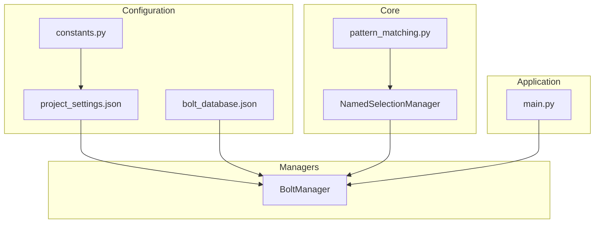
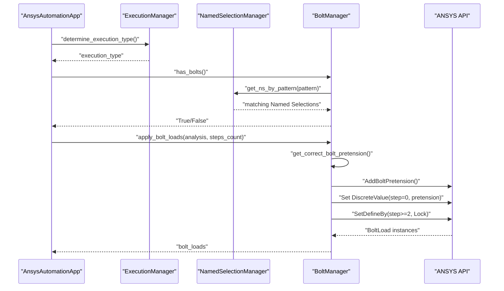
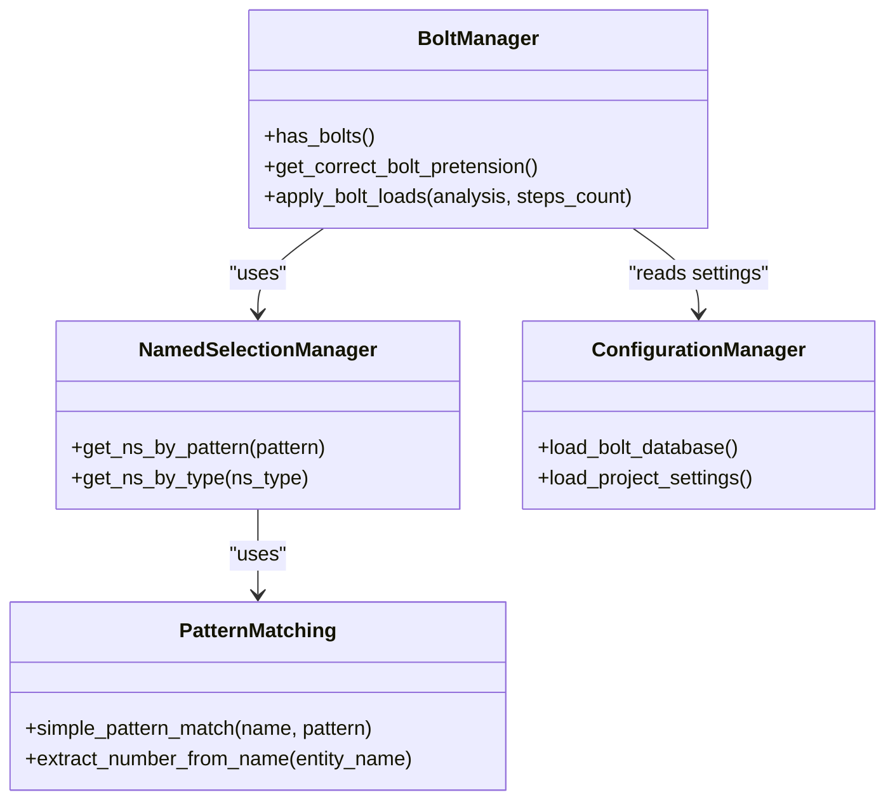

# Bolt Manager

<cite>
**Referenced Files in This Document**
- [bolt_manager.py](file://managers/bolt_manager.py)
- [named_selection_manager.py](file://core/named_selection_manager.py)
- [pattern_matching.py](file://utils/pattern_matching.py)
- [bolt_database.json](file://config_files/bolt_database.json)
- [project_settings.json](file://config_files/project_settings.json)
- [constants.py](file://config/constants.py)
- [main.py](file://main.py)
</cite>

## Table of Contents
1. [Introduction](#introduction)
2. [Project Structure](#project-structure)
3. [Core Components](#core-components)
4. [Architecture Overview](#architecture-overview)
5. [Detailed Component Analysis](#detailed-component-analysis)
6. [Dependency Analysis](#dependency-analysis)
7. [Performance Considerations](#performance-considerations)
8. [Troubleshooting Guide](#troubleshooting-guide)
9. [Conclusion](#conclusion)

## Introduction
This document explains the BoltManager class and its role in automating the detection and configuration of bolt pretension loads in ANSYS models. It covers how the class determines whether bolts are present, selects appropriate pretension values from a database, locates bolt regions using named selections, and applies bolt loads with step-based configurations. It also provides guidance on naming conventions, database maintenance, and performance considerations for large models.

## Project Structure
The BoltManager integrates with the broader automation framework:
- Configuration is loaded from JSON files and constants.
- Named selection pattern matching is handled by a dedicated manager.
- The main application orchestrates detection, configuration, and application of bolt loads.

**Diagram sources**
- [bolt_manager.py](file://managers/bolt_manager.py#L1-L68)
- [named_selection_manager.py](file://core/named_selection_manager.py#L1-L190)
- [pattern_matching.py](file://utils/pattern_matching.py#L1-L71)
- [bolt_database.json](file://config_files/bolt_database.json#L1-L47)
- [project_settings.json](file://config_files/project_settings.json#L1-L56)
- [constants.py](file://config/constants.py#L1-L99)
- [main.py](file://main.py#L1-L270)

**Section sources**
- [bolt_manager.py](file://managers/bolt_manager.py#L1-L68)
- [named_selection_manager.py](file://core/named_selection_manager.py#L1-L190)
- [pattern_matching.py](file://utils/pattern_matching.py#L1-L71)
- [bolt_database.json](file://config_files/bolt_database.json#L1-L47)
- [project_settings.json](file://config_files/project_settings.json#L1-L56)
- [constants.py](file://config/constants.py#L1-L99)
- [main.py](file://main.py#L1-L270)

## Core Components
- BoltManager: Central logic for bolt detection, pretension retrieval, and load application.
- NamedSelectionManager: Provides pattern-based discovery of named selections used to locate bolt regions.
- pattern_matching utilities: Implements wildcard matching and helper extraction functions.
- bolt_database.json: Stores pretension values keyed by bolt diameter.
- project_settings.json and constants.py: Define bolt pattern defaults and project-wide settings.
- main.py: Orchestrates the end-to-end workflow and invokes BoltManager.

Key responsibilities:
- has_bolts(): Determines presence of bolt regions via named selection patterns.
- get_correct_bolt_pretension(): Scans geometry bodies for diameter indicators and maps to pretension values.
- apply_bolt_loads(): Applies bolt pretension at step 0 and locks subsequent steps.

**Section sources**
- [bolt_manager.py](file://managers/bolt_manager.py#L1-L68)
- [named_selection_manager.py](file://core/named_selection_manager.py#L1-L190)
- [pattern_matching.py](file://utils/pattern_matching.py#L1-L71)
- [bolt_database.json](file://config_files/bolt_database.json#L1-L47)
- [project_settings.json](file://config_files/project_settings.json#L1-L56)
- [constants.py](file://config/constants.py#L1-L99)
- [main.py](file://main.py#L1-L270)

## Architecture Overview
The BoltManager participates in the automated analysis pipeline:
- The application initializes configuration and managers.
- It detects execution type and validates required named selections.
- It sets up analysis and applies loads, conditionally applying bolt loads if bolt regions are detected.
- Bolt loads are configured with step-dependent values.

**Diagram sources**
- [main.py](file://main.py#L160-L209)
- [bolt_manager.py](file://managers/bolt_manager.py#L17-L68)
- [named_selection_manager.py](file://core/named_selection_manager.py#L39-L57)

## Detailed Component Analysis

### BoltManager.has_bolts()
Purpose:
- Detects whether any bolt regions exist in the model by searching for named selections matching a configurable pattern.

Implementation highlights:
- Reads the bolt pattern from project settings under the loads section.
- Uses NamedSelectionManager.get_ns_by_pattern() to discover matching named selections.
- Returns True if any matches are found.

Operational notes:
- The default pattern is defined in project settings and constants.
- The method relies on efficient pattern matching to avoid scanning all named selections unnecessarily.

Common usage:
- Called during analysis setup to decide whether to configure bolt loads.

**Section sources**
- [bolt_manager.py](file://managers/bolt_manager.py#L17-L22)
- [project_settings.json](file://config_files/project_settings.json#L24-L32)
- [constants.py](file://config/constants.py#L23-L33)
- [named_selection_manager.py](file://core/named_selection_manager.py#L39-L57)

### BoltManager.get_correct_bolt_pretension()
Purpose:
- Automatically determine the correct pretension value for bolt loads by inspecting geometry bodies.

Implementation highlights:
- Enumerates all bodies in the model.
- Filters bodies whose names contain a diameter indicator using a case-insensitive pattern.
- Extracts the numeric diameter using a regular expression.
- Looks up the pretension value in the bolt database keyed by diameter.
- Falls back to a default value if no matching body is found or the diameter is not present in the database.

Example walkthrough:
- Body named "mbolt12":
  - Pattern match identifies the diameter "12".
  - Database contains a record for diameter "12" with a specific pretension value.
  - The method returns that pretension value.
- If no body matches or the diameter is missing:
  - Returns the default pretension value from the database.

Integration points:
- Uses the bolt_database dictionary injected at construction.
- Prints debug information to aid troubleshooting.

**Section sources**
- [bolt_manager.py](file://managers/bolt_manager.py#L23-L41)
- [bolt_database.json](file://config_files/bolt_database.json#L1-L47)

### BoltManager.apply_bolt_loads()
Purpose:
- Apply bolt pretension loads to detected bolt regions with step-based configuration.

Implementation highlights:
- Retrieves the bolt pattern and discovers matching named selections.
- Iterates over each named selection:
  - Computes the pretension value via get_correct_bolt_pretension().
  - Creates a bolt load object and assigns the named selection as its location.
  - Sets the pretension value at step 0.
  - Locks the bolt load for subsequent steps.
- Returns the list of created bolt load objects.

Step configuration:
- Step 0: Pretension value is set.
- Steps 2..(steps_count-1): Defined as locked to prevent reapplication of pretension.

Error handling:
- Catches exceptions during load creation and prints a warning with the named selection name.

Integration points:
- Uses ANSYS API objects to create and configure bolt loads.
- Relies on the analysis object and step count derived from analysis scenarios.

**Section sources**
- [bolt_manager.py](file://managers/bolt_manager.py#L43-L68)
- [main.py](file://main.py#L182-L209)

### Integration with NamedSelectionManager
- Pattern-based discovery:
  - BoltManager delegates the search for bolt regions to NamedSelectionManager.get_ns_by_pattern().
  - The pattern is configurable and defaults to a wildcard pattern suitable for bolt-related named selections.
- Caching and validation:
  - NamedSelectionManager caches previously found named selections to reduce repeated lookups.
  - Additional validation utilities exist for required named selections and type-based grouping.

**Section sources**
- [bolt_manager.py](file://managers/bolt_manager.py#L17-L22)
- [named_selection_manager.py](file://core/named_selection_manager.py#L1-L190)
- [pattern_matching.py](file://utils/pattern_matching.py#L1-L71)

### Pattern Matching Utilities
- simple_pattern_match():
  - Implements wildcard matching compatible with IronPython environments.
  - Supports "*" wildcards for prefix/suffix matching and substring inclusion.
- extract_number_from_name():
  - Extracts numeric values from entity names using regular expressions.
- match_any_pattern() and find_matching_names():
  - Helper functions to check or collect matches across lists of names.

These utilities underpin both bolt detection and broader entity name parsing tasks.

**Section sources**
- [pattern_matching.py](file://utils/pattern_matching.py#L1-L71)

## Dependency Analysis
Relationships among components:
- BoltManager depends on:
  - project_settings for bolt pattern configuration.
  - bolt_database for pretension values.
  - NamedSelectionManager for bolt region discovery.
- NamedSelectionManager depends on:
  - pattern_matching utilities for wildcard matching.
  - project_settings for validation and type-based grouping.
- main.py orchestrates:
  - Loading configurations and initializing managers.
  - Calling BoltManager.has_bolts() and apply_bolt_loads() during analysis setup.

**Diagram sources**
- [bolt_manager.py](file://managers/bolt_manager.py#L1-L68)
- [named_selection_manager.py](file://core/named_selection_manager.py#L1-L190)
- [pattern_matching.py](file://utils/pattern_matching.py#L1-L71)
- [main.py](file://main.py#L94-L131)

**Section sources**
- [bolt_manager.py](file://managers/bolt_manager.py#L1-L68)
- [named_selection_manager.py](file://core/named_selection_manager.py#L1-L190)
- [pattern_matching.py](file://utils/pattern_matching.py#L1-L71)
- [main.py](file://main.py#L94-L131)

## Performance Considerations
- Body scanning cost:
  - get_correct_bolt_pretension() iterates over all bodies to detect diameter indicators. In models with many bodies, this can be expensive.
  - Recommendation: Keep body naming consistent and minimal to reduce unnecessary iterations.
- Named selection discovery:
  - has_bolts() and apply_bolt_loads() rely on pattern matching. Ensure patterns are specific enough to avoid scanning large sets of unrelated named selections.
- Step configuration overhead:
  - Applying loads across many steps increases setup time. Limit steps to what is necessary for the analysis scenario.
- Caching:
  - NamedSelectionManager caches named selections to speed up repeated lookups. Leverage this by avoiding redundant calls within a single run.

[No sources needed since this section provides general guidance]

## Troubleshooting Guide
Common issues and resolutions:
- No bolt loads applied:
  - Verify that named selections matching the bolt pattern exist. Adjust the pattern in project settings if needed.
  - Confirm that has_bolts() returns True before applying bolt loads.
- Incorrect pretension value:
  - Ensure geometry bodies include a diameter indicator in the expected format (e.g., "mbolt12").
  - Confirm the diameter exists in bolt_database.json. If missing, add an entry or rely on the default.
- Missing database entries:
  - The method falls back to a default pretension value if the diameter is not found. Review the default value and update bolt_database.json accordingly.
- Step configuration anomalies:
  - Bolt loads are locked starting from step 2. If pretension appears in later steps, verify the step count and scenario configuration.
- Debugging tips:
  - Use printed debug statements from BoltManager to confirm detected bodies and selected pretension values.
  - Validate named selection names and types using NamedSelectionManager utilities.

Best practices:
- Naming conventions:
  - Bodies: Use a consistent prefix indicating bolt bodies and embed diameter digits (e.g., "mbolt12").
  - Named selections: Use patterns aligned with the bolt pattern setting to ensure reliable detection.
- Database maintenance:
  - Keep bolt_database.json synchronized with actual bolt sizes used in the model.
  - Maintain a default entry for robust fallback behavior.
- Scenario configuration:
  - Align analysis scenarios with the intended number of steps to minimize unnecessary processing.

**Section sources**
- [bolt_manager.py](file://managers/bolt_manager.py#L23-L41)
- [bolt_manager.py](file://managers/bolt_manager.py#L43-L68)
- [named_selection_manager.py](file://core/named_selection_manager.py#L1-L190)
- [project_settings.json](file://config_files/project_settings.json#L24-L32)
- [bolt_database.json](file://config_files/bolt_database.json#L1-L47)

## Conclusion
The BoltManager class automates bolt pretension detection and application by combining pattern-based named selection discovery with geometric body inspection and a structured database of pretension values. Its integration with the broader automation framework ensures consistent and repeatable setup of bolt loads across analysis scenarios. By following recommended naming conventions and maintaining the bolt database, teams can achieve reliable, scalable bolt load configuration even in complex models.