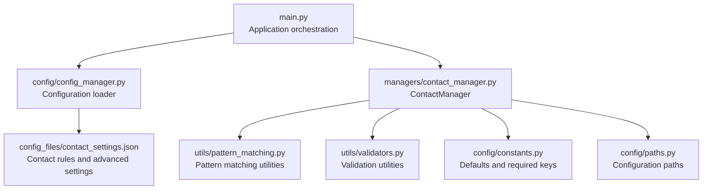
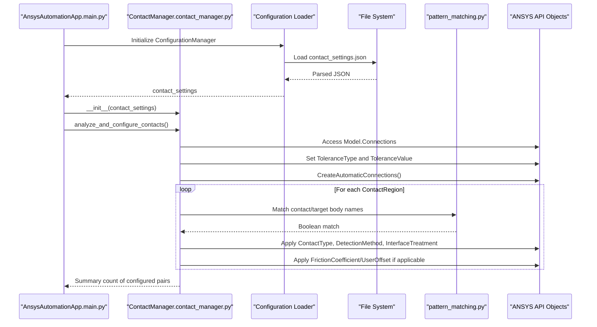
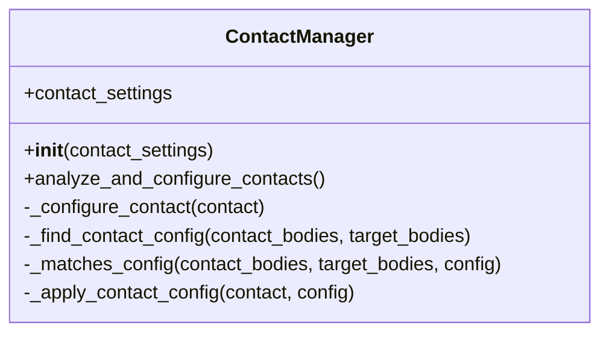
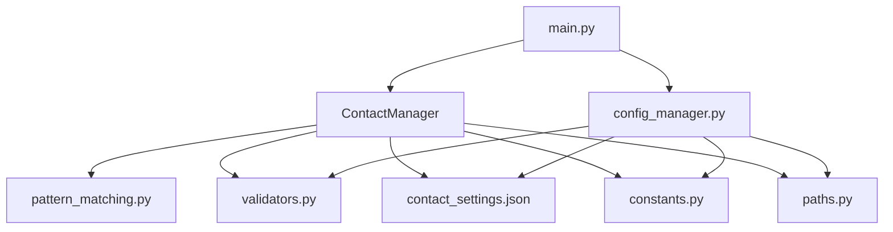

# Contact Manager

<cite>
**Referenced Files in This Document**
- [contact_manager.py](file://managers/contact_manager.py)
- [contact_settings.json](file://config_files/contact_settings.json)
- [pattern_matching.py](file://utils/pattern_matching.py)
- [main.py](file://main.py)
- [config_manager.py](file://config/config_manager.py)
- [validators.py](file://utils/validators.py)
- [constants.py](file://config/constants.py)
- [paths.py](file://config/paths.py)
</cite>

## Table of Contents
1. [Introduction](#introduction)
2. [Project Structure](#project-structure)
3. [Core Components](#core-components)
4. [Architecture Overview](#architecture-overview)
5. [Detailed Component Analysis](#detailed-component-analysis)
6. [Dependency Analysis](#dependency-analysis)
7. [Performance Considerations](#performance-considerations)
8. [Troubleshooting Guide](#troubleshooting-guide)
9. [Conclusion](#conclusion)

## Introduction
This document explains the ContactManager class and its role in automating contact pair configuration for ANSYS simulations. It focuses on how analyze_and_configure_contacts() initiates automatic contact detection, sets a global tolerance, and iterates through detected contact regions to apply rule-based configurations. It also details the _configure_contact() pipeline: identifying contact and target bodies, finding matching rules via _find_contact_config(), and applying settings through _apply_contact_config(). Concrete examples illustrate how body name patterns (e.g., "shov*" contacting "truba*") trigger specific contact types (Frictional, Bonded), friction coefficients, detection methods, and interface treatments defined in contact_settings.json. The document covers pattern matching logic in _matches_config(), the application of advanced settings like user offsets for frictional contacts, integration with ANSYS Connection objects, and the use of reflection-like getattr() calls to map string configuration values to API enum types. Finally, it addresses common issues such as unmatched contact pairs or invalid configuration rules and provides troubleshooting guidance, including performance considerations for complex assemblies and the impact of contact settings on convergence behavior.

## Project Structure
The ContactManager is part of a modular automation framework that orchestrates ANSYS setup. It is initialized with parsed contact settings and integrated into the main application flow.

**Diagram sources**
- [main.py](file://main.py#L1-L270)
- [config_manager.py](file://config/config_manager.py#L1-L209)
- [contact_settings.json](file://config_files/contact_settings.json#L1-L130)
- [contact_manager.py](file://managers/contact_manager.py#L1-L96)
- [pattern_matching.py](file://utils/pattern_matching.py#L1-L71)
- [validators.py](file://utils/validators.py#L1-L161)
- [constants.py](file://config/constants.py#L1-L99)
- [paths.py](file://config/paths.py#L1-L73)

**Section sources**
- [main.py](file://main.py#L1-L270)
- [config_manager.py](file://config/config_manager.py#L1-L209)

## Core Components
- ContactManager: Orchestrates automatic contact detection and applies rule-based configurations to contact pairs.
- contact_settings.json: Defines contact rules and advanced settings used by ContactManager.
- pattern_matching.py: Provides simple wildcard pattern matching compatible with IronPython.
- validators.py: Validates configuration structure and keys.
- constants.py: Supplies default contact settings and required keys.
- paths.py: Resolves configuration file paths and validates the configuration directory.

Key responsibilities:
- Automatic detection and tolerance setup
- Iteration over detected contact regions
- Rule-based configuration application
- Pattern matching for body names
- Reflection-based mapping of string enums to API types

**Section sources**
- [contact_manager.py](file://managers/contact_manager.py#L1-L96)
- [contact_settings.json](file://config_files/contact_settings.json#L1-L130)
- [pattern_matching.py](file://utils/pattern_matching.py#L1-L71)
- [validators.py](file://utils/validators.py#L1-L161)
- [constants.py](file://config/constants.py#L1-L99)
- [paths.py](file://config/paths.py#L1-L73)

## Architecture Overview
The ContactManager participates in the application’s execution pipeline. The main application initializes configuration, creates managers, and triggers contact configuration as part of the automated setup.

**Diagram sources**
- [main.py](file://main.py#L160-L205)
- [contact_manager.py](file://managers/contact_manager.py#L14-L38)
- [contact_manager.py](file://managers/contact_manager.py#L41-L96)
- [contact_settings.json](file://config_files/contact_settings.json#L1-L130)
- [pattern_matching.py](file://utils/pattern_matching.py#L1-L71)

## Detailed Component Analysis

### ContactManager Class
The ContactManager encapsulates the logic for automatic contact detection and rule-based configuration.

**Diagram sources**
- [contact_manager.py](file://managers/contact_manager.py#L1-L96)

Key methods and responsibilities:
- analyze_and_configure_contacts(): Initiates automatic contact detection, sets a global tolerance, and iterates through detected contact regions to configure them.
- _configure_contact(): Validates presence of contact and target bodies, finds a matching rule, and applies it.
- _find_contact_config(): Iterates through contact_rules to find a matching rule.
- _matches_config(): Uses wildcard pattern matching to check if any contact or target body matches the rule.
- _apply_contact_config(): Applies contact type, detection method, interface treatment, friction coefficient, and user offset (when applicable).

Integration points:
- ANSYS API: Uses Model.Connections, DataModel.GetObjectById, and ContactRegion properties/methods.
- Configuration: Reads contact_rules and advanced settings from contact_settings.json.
- Utilities: Uses simple_pattern_match() for wildcard matching.

**Section sources**
- [contact_manager.py](file://managers/contact_manager.py#L1-L96)

### Automatic Contact Detection and Global Tolerance
Behavior:
- Sets the tolerance type to a value-based tolerance and assigns a tolerance value.
- Creates automatic connections.
- Iterates through children of the connection group, identifies ContactRegion instances, renames them based on definition, and attempts to configure them.

Impact:
- Establishes a baseline tolerance for contact detection.
- Ensures downstream configuration applies consistently across detected pairs.

**Section sources**
- [contact_manager.py](file://managers/contact_manager.py#L14-L38)

### Rule-Based Configuration Pipeline
Behavior:
- For each ContactRegion, collect contact and target bodies.
- Find a matching rule by checking patterns against body names.
- Apply settings mapped from configuration to ANSYS API properties.

Outcome:
- ContactType, DetectionMethod, and InterfaceTreatment are set via reflection-like getattr() calls.
- For frictional contacts, FrictionCoefficient and optional UserOffset are applied.

**Section sources**
- [contact_manager.py](file://managers/contact_manager.py#L41-L96)

### Pattern Matching Logic
Behavior:
- _matches_config() checks whether any contact body matches the contact_pattern and any target body matches the target_pattern.
- Uses simple_pattern_match() which supports wildcard patterns and is compatible with IronPython.

Guidance:
- Patterns can include "*" for partial matches.
- The order of rules matters; the first matching rule is applied.

**Section sources**
- [contact_manager.py](file://managers/contact_manager.py#L60-L76)
- [pattern_matching.py](file://utils/pattern_matching.py#L1-L31)

### Applying Advanced Settings
Behavior:
- _apply_contact_config() maps string values from configuration to API enum types using getattr().
- Supports frictional contacts with friction coefficient and optional user offset.
- Uses Quantity for length units when setting offsets.

Notes:
- Ensure configuration keys align with API enum names.
- User offset is only applied for frictional contacts when present.

**Section sources**
- [contact_manager.py](file://managers/contact_manager.py#L77-L96)

### Concrete Examples from contact_settings.json
Examples of rule-driven configurations:
- Bolt-to-bolt contact: "mbolt*" contacting "mbolt*" -> Bonded, ProgramControlled detection, AdjustToTouch interface treatment.
- Bolt-to-washer contact: "mbolt*" contacting "shaiba*" -> Frictional, friction coefficient 0.3, ProgramControlled detection, AdjustToTouch interface treatment.
- Washer-to-washer contact: "shaiba*" contacting "shaiba*" -> Frictional, friction coefficient 0.3, ProgramControlled detection, AdjustToTouch interface treatment.
- Bolt-to-nut contact: "mbolt*" contacting "mgaika*" -> Bonded, ProgramControlled detection, AdjustToTouch interface treatment.
- Bolt-to-opora contact: "mbolt*" contacting "opora*" -> Frictional, friction coefficient 0.3, AddOffsetNoRamping interface treatment.
- Flange contact: "flanec*" contacting "flanec*" -> Frictional, NodalProjectedNormalFromContact detection, AdjustToTouch interface treatment.
- Support contact: "opora*" contacting "truba*" -> Frictional, NodalProjectedNormalFromContact detection, AdjustToTouch interface treatment.
- Base contact: "osnovanie*" contacting "opora*" -> Bonded, ProgramControlled detection, AdjustToTouch interface treatment.
- Weld contact: "shov*" contacting "*" -> Bonded, ProgramControlled detection, AdjustToTouch interface treatment.
- Default frictional contact: "*" contacting "*" -> Frictional, friction coefficient 0.3, ProgramControlled detection, AdjustToTouch interface treatment.

These examples demonstrate how body name patterns drive contact type, friction coefficient, detection method, and interface treatment.

**Section sources**
- [contact_settings.json](file://config_files/contact_settings.json#L1-L130)

### Integration with ANSYS Connection Objects
Behavior:
- Accesses Model.Connections and its Children collection.
- Retrieves the first connection group and sets ToleranceType and ToleranceValue.
- Calls CreateAutomaticConnections() to generate ContactRegion entries.
- Iterates over the connection group’s children, filters ContactRegion instances, and applies configuration.

Notes:
- The code assumes at least one connection exists and uses the first connection group.
- ContactRegion renaming is performed before configuration.

**Section sources**
- [contact_manager.py](file://managers/contact_manager.py#L14-L38)

### Reflection-like getattr() Mapping to API Enum Types
Behavior:
- _apply_contact_config() uses getattr() to map string values from configuration to API enum types for:
  - ContactType
  - ContactDetectionPoint
  - ContactInitialEffect
- This enables flexible configuration while maintaining strong typing at runtime.

Guidance:
- Ensure configuration values match the exact names of API enum members.
- Validate configuration structure to prevent runtime errors.

**Section sources**
- [contact_manager.py](file://managers/contact_manager.py#L77-L96)

## Dependency Analysis
The ContactManager depends on configuration, utilities, and validation modules. The main application composes these components and invokes ContactManager during automated setup.

**Diagram sources**
- [contact_manager.py](file://managers/contact_manager.py#L1-L96)
- [pattern_matching.py](file://utils/pattern_matching.py#L1-L71)
- [validators.py](file://utils/validators.py#L1-L161)
- [contact_settings.json](file://config_files/contact_settings.json#L1-L130)
- [constants.py](file://config/constants.py#L1-L99)
- [paths.py](file://config/paths.py#L1-L73)
- [main.py](file://main.py#L160-L205)
- [config_manager.py](file://config/config_manager.py#L1-L209)

**Section sources**
- [contact_manager.py](file://managers/contact_manager.py#L1-L96)
- [main.py](file://main.py#L160-L205)
- [config_manager.py](file://config/config_manager.py#L1-L209)

## Performance Considerations
- Complexity of pattern matching: For each ContactRegion, the matcher checks all bodies against all patterns in the rule list. In assemblies with many contact interfaces, this can become computationally intensive. Consider optimizing by:
  - Reducing the number of rules or ordering them to minimize repeated checks.
  - Limiting the number of bodies per region or pre-filtering candidates.
- Automatic connection creation: Creating automatic connections across many regions can be expensive. Ensure the model is reasonably structured to reduce unnecessary pairs.
- Convergence impact: Contact settings influence solver behavior. Frictional contacts with higher friction coefficients or aggressive interface treatments may increase iteration counts. Consider adjusting detection methods and interface treatments for stability when convergence issues arise.
- Global tolerance: A smaller tolerance improves accuracy but may increase computational cost. Balance tolerance with model scale and required precision.

[No sources needed since this section provides general guidance]

## Troubleshooting Guide
Common issues and resolutions:
- Unmatched contact pairs:
  - Cause: No rule matches the contact/target body name patterns.
  - Resolution: Add or adjust rules in contact_settings.json to cover observed body names. Verify patterns and ensure they match actual body names.
- Invalid configuration rules:
  - Cause: Missing required keys in contact_rules or mismatched enum names.
  - Resolution: Validate configuration structure using the validation utilities. Ensure keys like contact_pattern, target_pattern, type, and detection_method are present. Confirm that type, detection_method, and interface_treatment match API enum member names.
- API enum name mismatches:
  - Cause: String values in configuration do not match API enum member names.
  - Resolution: Align configuration values with the exact names of ContactType, ContactDetectionPoint, and ContactInitialEffect members.
- Missing configuration files:
  - Cause: Configuration path validation fails or files are not present.
  - Resolution: Verify the configuration directory and file paths. Use validate_config_path() and ensure all required files exist.
- Unexpected convergence behavior:
  - Cause: Aggressive detection methods or interface treatments.
  - Resolution: Adjust detection_method and interface_treatment in contact_settings.json. Consider reducing friction coefficients or enabling stabilization options.

**Section sources**
- [validators.py](file://utils/validators.py#L111-L131)
- [contact_settings.json](file://config_files/contact_settings.json#L1-L130)
- [paths.py](file://config/paths.py#L45-L58)
- [contact_manager.py](file://managers/contact_manager.py#L77-L96)

## Conclusion
The ContactManager automates contact pair configuration by initiating automatic detection, setting a global tolerance, iterating through detected regions, and applying rule-based settings derived from contact_settings.json. Its design leverages wildcard pattern matching, reflection-like mapping to API enums, and robust validation to ensure reliable configuration across diverse assemblies. By tuning rules, detection methods, and interface treatments, users can balance accuracy and performance while achieving stable convergence in ANSYS simulations.