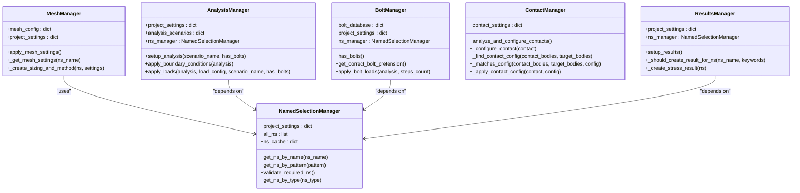
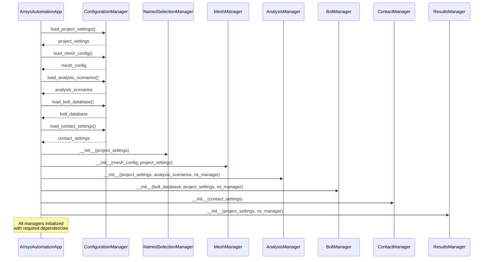
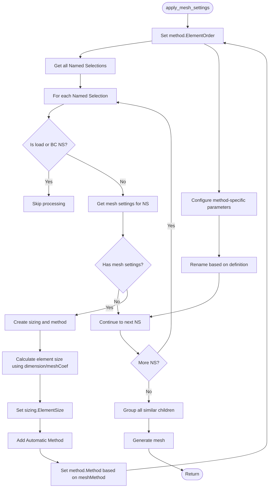
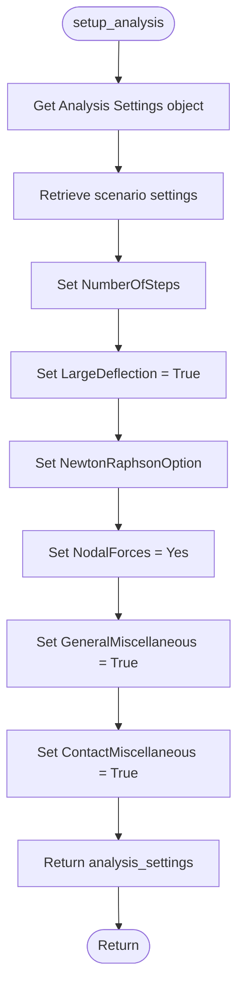
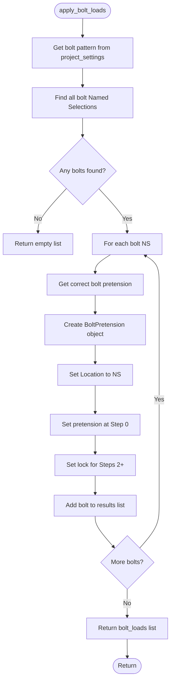
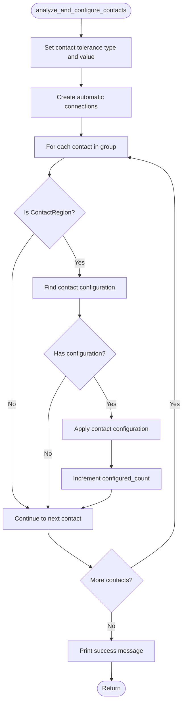
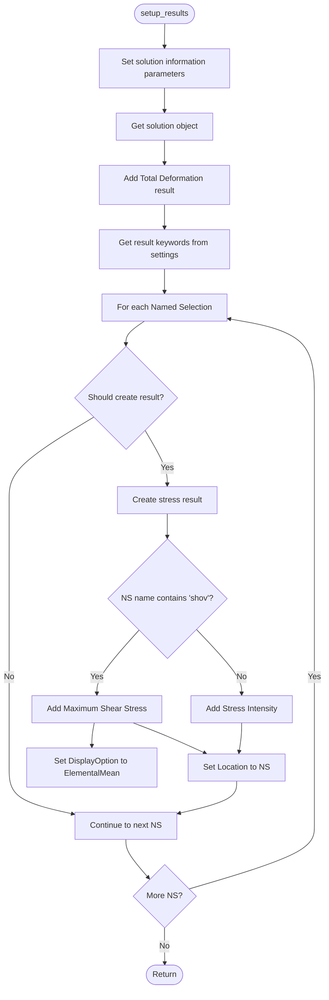
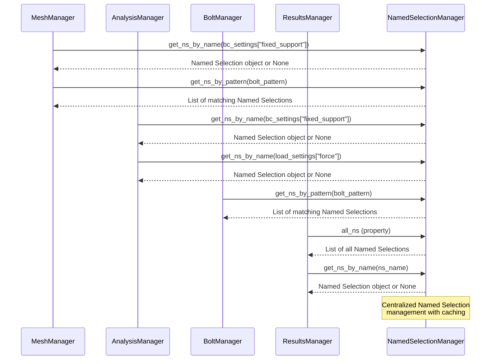
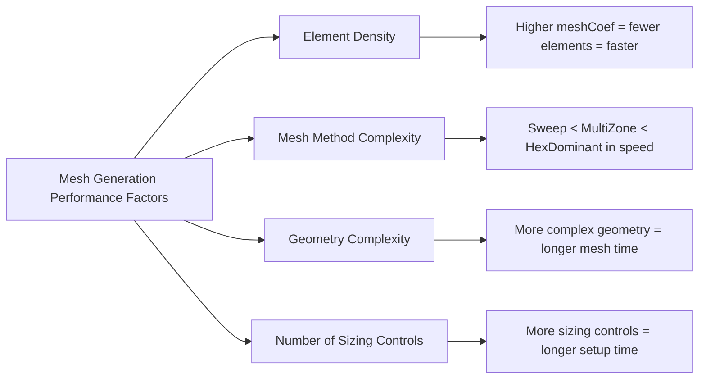

# Manager Modules

<cite>
**Referenced Files in This Document**   
- [mesh_manager.py](file://managers/mesh_manager.py)
- [analysis_manager.py](file://managers/analysis_manager.py)
- [bolt_manager.py](file://managers/bolt_manager.py)
- [contact_manager.py](file://managers/contact_manager.py)
- [results_manager.py](file://managers/results_manager.py)
- [named_selection_manager.py](file://core/named_selection_manager.py)
- [config_manager.py](file://config/config_manager.py)
- [main.py](file://main.py)
- [mesh_config.json](file://config_files/mesh_config.json)
- [analysis_scenarios.json](file://config_files/analysis_scenarios.json)
- [bolt_database.json](file://config_files/bolt_database.json)
- [contact_settings.json](file://config_files/contact_settings.json)
</cite>

## Table of Contents
1. [Introduction](#introduction)
2. [Manager Pattern Architecture](#manager-pattern-architecture)
3. [Initialization and Dependency Injection](#initialization-and-dependency-injection)
4. [MeshManager: Mesh Configuration](#meshmanager-mesh-configuration)
5. [AnalysisManager: Analysis Parameters](#analysismanager-analysis-parameters)
6. [BoltManager: Pretension Load Management](#boltmanager-pretension-load-management)
7. [ContactManager: Contact Pair Configuration](#contactmanager-contact-pair-configuration)
8. [ResultsManager: Result Request Handling](#resultsmanager-result-request-handling)
9. [Interaction with NamedSelectionManager](#interaction-with-namedselectionmanager)
10. [Configuration Issues and Best Practices](#configuration-issues-and-best-practices)
11. [Performance Considerations](#performance-considerations)
12. [Conclusion](#conclusion)

## Introduction
The ANSYS Automation project implements a modular manager pattern to encapsulate domain-specific functionality for simulation configuration. Each manager specializes in a particular aspect of the simulation setup, providing a clean separation of concerns and enabling maintainable, scalable code organization. This document details the architecture, responsibilities, and interactions of the five core manager modules: MeshManager, AnalysisManager, BoltManager, ContactManager, and ResultsManager. These components work together to automate the configuration of ANSYS simulations based on project-specific requirements and configuration files.

## Manager Pattern Architecture
The manager modules follow a consistent design pattern where each class encapsulates specific domain functionality while maintaining loose coupling with other components. This architectural approach enables specialized configuration handling while promoting code reusability and testability. Each manager exposes a clear interface through well-defined methods that abstract complex configuration logic.

**Diagram sources**
- [managers/mesh_manager.py](file://managers/mesh_manager.py#L9-L104)
- [managers/analysis_manager.py](file://managers/analysis_manager.py#L6-L116)
- [managers/bolt_manager.py](file://managers/bolt_manager.py#L9-L68)
- [managers/contact_manager.py](file://managers/contact_manager.py#L8-L96)
- [managers/results_manager.py](file://managers/results_manager.py#L8-L62)
- [core/named_selection_manager.py](file://core/named_selection_manager.py#L9-L190)

**Section sources**
- [managers/mesh_manager.py](file://managers/mesh_manager.py#L9-L104)
- [managers/analysis_manager.py](file://managers/analysis_manager.py#L6-L116)
- [managers/bolt_manager.py](file://managers/bolt_manager.py#L9-L68)
- [managers/contact_manager.py](file://managers/contact_manager.py#L8-L96)
- [managers/results_manager.py](file://managers/results_manager.py#L8-L62)

## Initialization and Dependency Injection
The manager modules are initialized through dependency injection from the main application, receiving both configuration data and references to shared resources. This initialization pattern ensures that each manager has access to the necessary data and services without creating tight coupling between components.

**Diagram sources**
- [main.py](file://main.py#L30-L270)
- [config/config_manager.py](file://config/config_manager.py#L14-L209)

**Section sources**
- [main.py](file://main.py#L122-L131)
- [config/config_manager.py](file://config/config_manager.py#L73-L117)

## MeshManager: Mesh Configuration
The MeshManager class is responsible for configuring mesh settings across different Named Selections in the ANSYS model. It applies element order, sizing parameters, and meshing methods based on configuration rules defined in external JSON files.

The `apply_mesh_settings()` method orchestrates the mesh configuration process by iterating through all Named Selections and applying appropriate settings based on naming patterns and configuration rules. The method first sets the global element order to linear, then processes each Named Selection to determine if it requires specific mesh settings.

**Diagram sources**
- [managers/mesh_manager.py](file://managers/mesh_manager.py#L20-L39)

**Section sources**
- [managers/mesh_manager.py](file://managers/mesh_manager.py#L12-L104)
- [config_files/mesh_config.json](file://config_files/mesh_config.json#L1-L85)

## AnalysisManager: Analysis Parameters
The AnalysisManager class handles the configuration of analysis parameters, boundary conditions, and loads in the ANSYS simulation. It provides methods to set up analysis scenarios, apply boundary conditions, and configure various types of loads with proper step configuration.

The `setup_analysis()` method configures the core analysis parameters such as the number of steps, large deflection settings, and solver options based on the specified scenario from the analysis_scenarios.json configuration file. The method retrieves the analysis settings object and applies the configured parameters.

**Diagram sources**
- [managers/analysis_manager.py](file://managers/analysis_manager.py#L14-L26)

**Section sources**
- [managers/analysis_manager.py](file://managers/analysis_manager.py#L9-L116)
- [config_files/analysis_scenarios.json](file://config_files/analysis_scenarios.json#L1-L55)

## BoltManager: Pretension Load Management
The BoltManager class specializes in handling bolt pretension loads within the ANSYS simulation. It automatically detects bolt diameters from geometry names and applies appropriate pretension forces based on a database of bolt specifications.

The `apply_bolt_loads()` method configures bolt pretension loads by first identifying all bolt Named Selections using pattern matching, then determining the correct pretension force for each bolt based on its diameter. The method creates bolt pretension objects and configures them with appropriate step settings.

**Diagram sources**
- [managers/bolt_manager.py](file://managers/bolt_manager.py#L43-L68)

**Section sources**
- [managers/bolt_manager.py](file://managers/bolt_manager.py#L12-L68)
- [config_files/bolt_database.json](file://config_files/bolt_database.json#L1-L47)

## ContactManager: Contact Pair Configuration
The ContactManager class automates the configuration of contact pairs in the ANSYS model. It analyzes the geometry and applies appropriate contact settings based on predefined rules that match contact and target patterns.

The `analyze_and_configure_contacts()` method orchestrates the contact configuration process by first setting up automatic contact detection parameters, then creating automatic connections, and finally configuring each individual contact pair according to the rules defined in the contact_settings.json file.

**Diagram sources**
- [managers/contact_manager.py](file://managers/contact_manager.py#L14-L37)

**Section sources**
- [managers/contact_manager.py](file://managers/contact_manager.py#L11-L96)
- [config_files/contact_settings.json](file://config_files/contact_settings.json#L1-L130)

## ResultsManager: Result Request Handling
The ResultsManager class manages the configuration of result requests in the ANSYS simulation. It determines which Named Selections require result outputs and creates appropriate stress and deformation results based on the configuration and naming patterns.

The `setup_results()` method configures the solution information and creates result outputs for important components identified by keywords in their names. The method first sets up solution information parameters, then iterates through all Named Selections to determine which ones should have result outputs created.

**Diagram sources**
- [managers/results_manager.py](file://managers/results_manager.py#L15-L30)

**Section sources**
- [managers/results_manager.py](file://managers/results_manager.py#L11-L62)

## Interaction with NamedSelectionManager
The manager modules interact extensively with the NamedSelectionManager to locate and validate Named Selections used in the simulation configuration. This shared resource provides caching and pattern matching capabilities that are leveraged by multiple managers.

**Diagram sources**
- [core/named_selection_manager.py](file://core/named_selection_manager.py#L17-L57)
- [managers/analysis_manager.py](file://managers/analysis_manager.py#L34-L57)
- [managers/bolt_manager.py](file://managers/bolt_manager.py#L46-L47)
- [managers/results_manager.py](file://managers/results_manager.py#L27-L28)

**Section sources**
- [core/named_selection_manager.py](file://core/named_selection_manager.py#L9-L190)

## Configuration Issues and Best Practices
Each manager module addresses specific configuration challenges and follows best practices to ensure reliable simulation setup. Understanding common issues and recommended approaches is essential for maintaining robust automation.

### MeshManager Configuration Issues
- **Missing mesh settings**: When a Named Selection doesn't match any configured mesh settings, it may receive default settings that are inappropriate for the component.
- **Incorrect pattern matching**: Overly broad or narrow patterns in the mesh_config.json can lead to incorrect settings being applied.
- **Dimension extraction failures**: The `extract_number_from_name()` utility may fail to parse dimensions from complex naming conventions.

**Best Practices**:
- Use specific, unambiguous naming patterns for components
- Order mesh settings by length in descending order to ensure proper matching
- Include fallback settings for common component types
- Validate mesh settings against component dimensions

### AnalysisManager Configuration Issues
- **Missing Named Selections**: Boundary condition or load Named Selections specified in project_settings.json may not exist in the model.
- **Incompatible scenarios**: Analysis scenarios may require more steps than supported by the current model configuration.
- **Conflicting load configurations**: Multiple load types may be configured for the same Named Selection.

**Best Practices**:
- Validate all required Named Selections before setup
- Use consistent naming conventions across projects
- Implement comprehensive error handling for missing resources
- Provide clear error messages for configuration issues

### BoltManager Configuration Issues
- **Undetected bolt diameters**: Geometry names may not follow the expected "mboltX" pattern, preventing automatic diameter detection.
- **Missing bolt database entries**: Bolt sizes in the model may not have corresponding entries in the bolt_database.json.
- **Incorrect pretension forces**: Default pretension values may be inappropriate for specific applications.

**Best Practices**:
- Standardize geometry naming conventions for bolts
- Maintain a comprehensive bolt database with common sizes
- Implement fallback mechanisms for unrecognized bolt sizes
- Validate pretension forces against material properties

### ContactManager Configuration Issues
- **Overlapping contact rules**: Multiple contact rules may match the same contact pair, leading to unpredictable behavior.
- **Missing contact configurations**: Important contact pairs may not be covered by any rule in the contact_settings.json.
- **Incorrect detection methods**: The wrong detection method may be applied, affecting simulation accuracy.

**Best Practices**:
- Order contact rules from specific to general
- Include a default rule as a catch-all
- Test contact configurations with representative models
- Document contact rule priorities and interactions

### ResultsManager Configuration Issues
- **Excessive result outputs**: Creating results for too many Named Selections can significantly increase output file size.
- **Missing important results**: Critical components may not be identified by the keyword matching system.
- **Inappropriate result types**: The wrong stress result type may be applied to certain components.

**Best Practices**:
- Use targeted keywords for important components
- Exclude load and boundary condition Named Selections from results
- Balance comprehensiveness with performance considerations
- Regularly review and update result keywords

## Performance Considerations
The manager modules handle computationally intensive operations that require careful performance optimization. Understanding the performance characteristics of each manager is crucial for efficient simulation setup.

### Mesh Generation Performance
Mesh generation is typically the most time-consuming aspect of simulation setup. The MeshManager implements several optimizations to improve performance:

- **Batch processing**: All mesh settings are applied before generating the mesh, minimizing ANSYS API calls
- **Efficient pattern matching**: The sorted_keys optimization ensures faster matching of Named Selections to mesh settings
- **Selective meshing**: Load and boundary condition Named Selections are excluded from mesh configuration

**Diagram sources**
- [managers/mesh_manager.py](file://managers/mesh_manager.py#L86-L88)
- [config_files/mesh_config.json](file://config_files/mesh_config.json#L1-L85)

### Contact Detection Performance
Contact detection can be computationally expensive, especially for models with many potential contact pairs. The ContactManager optimizes this process through:

- **Tolerance optimization**: Setting an appropriate tolerance value (0.5mm) balances accuracy and performance
- **Automatic connection creation**: Using ANSYS's built-in automatic connection functionality
- **Rule-based filtering**: Applying configuration rules only to identified contact pairs

### Memory Management
The managers implement several memory management strategies:

- **Caching**: The NamedSelectionManager caches Named Selection lookups to avoid repeated searches
- **Incremental processing**: Each manager processes items incrementally rather than loading everything into memory
- **Exception handling**: Robust error handling prevents memory leaks from unhandled exceptions

## Conclusion
The manager modules in the ANSYS Automation project provide a robust, modular framework for configuring simulation parameters. By following the manager pattern, each component encapsulates domain-specific functionality while maintaining loose coupling with other system components. The initialization process effectively injects configuration data and dependencies, enabling each manager to perform its specialized tasks.

The MeshManager, AnalysisManager, BoltManager, ContactManager, and ResultsManager collectively automate the complex process of simulation setup, reducing manual configuration errors and improving consistency across projects. Their interaction with the shared NamedSelectionManager demonstrates effective resource sharing and code reuse.

Understanding the configuration requirements, common issues, and performance characteristics of each manager is essential for maintaining and extending the automation system. By following the documented best practices, users can ensure reliable and efficient simulation setup while avoiding common pitfalls.

The modular design allows for easy extension and modification, making the system adaptable to new requirements and analysis types. As the automation system evolves, the manager pattern will continue to provide a solid foundation for organizing simulation configuration logic.