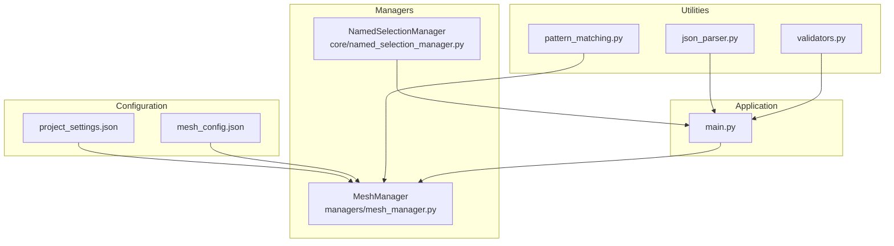
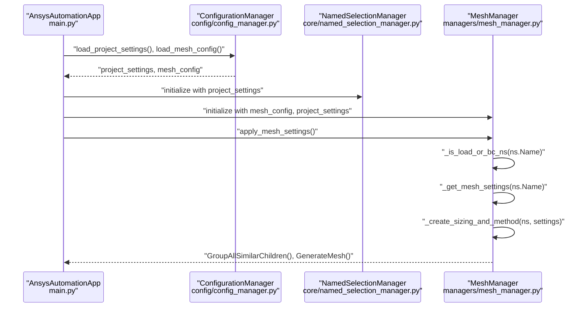
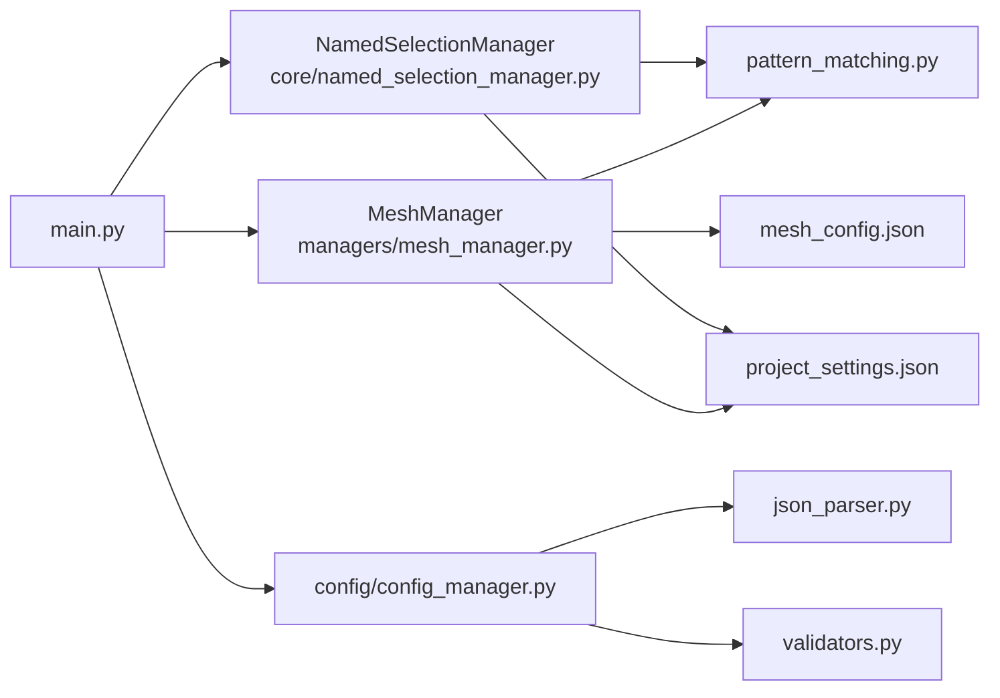

# Mesh Manager

<cite>
**Referenced Files in This Document**
- [mesh_manager.py](file://managers/mesh_manager.py)
- [mesh_config.json](file://config_files/mesh_config.json)
- [project_settings.json](file://config_files/project_settings.json)
- [named_selection_manager.py](file://core/named_selection_manager.py)
- [pattern_matching.py](file://utils/pattern_matching.py)
- [json_parser.py](file://utils/json_parser.py)
- [validators.py](file://utils/validators.py)
- [main.py](file://main.py)
</cite>

## Table of Contents
1. [Introduction](#introduction)
2. [Project Structure](#project-structure)
3. [Core Components](#core-components)
4. [Architecture Overview](#architecture-overview)
5. [Detailed Component Analysis](#detailed-component-analysis)
6. [Dependency Analysis](#dependency-analysis)
7. [Performance Considerations](#performance-considerations)
8. [Troubleshooting Guide](#troubleshooting-guide)
9. [Conclusion](#conclusion)
10. [Appendices](#appendices)

## Introduction
This document explains the MeshManager class and its role in automating mesh configuration within ANSYS simulations. The manager applies element order, sizing, and mesh methods based on named selection patterns and geometric dimensions extracted from component names. It integrates with project settings, configuration files, and utility functions to ensure consistent, repeatable mesh setups across models.

Key responsibilities:
- Iterate through all named selections in the model
- Skip named selections that represent boundary conditions or loads
- Resolve appropriate mesh settings via longest-prefix matching against configured patterns
- Compute element size from the numeric portion embedded in the named selection name and a coefficient
- Create sizing and automatic mesh method entries for each named selection
- Group and generate the final mesh

## Project Structure
The mesh automation pipeline spans configuration files, managers, and utilities:

**Diagram sources**
- [mesh_manager.py](file://managers/mesh_manager.py#L1-L104)
- [mesh_config.json](file://config_files/mesh_config.json#L1-L85)
- [project_settings.json](file://config_files/project_settings.json#L1-L56)
- [named_selection_manager.py](file://core/named_selection_manager.py#L1-L190)
- [pattern_matching.py](file://utils/pattern_matching.py#L1-L71)
- [json_parser.py](file://utils/json_parser.py#L1-L170)
- [validators.py](file://utils/validators.py#L1-L161)
- [main.py](file://main.py#L1-L200)

**Section sources**
- [mesh_manager.py](file://managers/mesh_manager.py#L1-L104)
- [mesh_config.json](file://config_files/mesh_config.json#L1-L85)
- [project_settings.json](file://config_files/project_settings.json#L1-L56)
- [main.py](file://main.py#L120-L180)

## Core Components
- MeshManager: Orchestrates mesh configuration by iterating named selections, filtering special-purpose selections, resolving mesh settings, computing element sizes, and creating sizing/method entries.
- Mesh configuration: Defines mesh settings keyed by base names, including mesh coefficient, mesh method, and element order.
- Project settings: Provides boundary condition and load named selection names, bolt pattern, and other mesh-related preferences.
- Utilities: Provide pattern matching and numeric extraction from names, and JSON parsing with comment support.
- NamedSelectionManager: Validates and discovers named selections, complementing MeshManager’s filtering logic.

**Section sources**
- [mesh_manager.py](file://managers/mesh_manager.py#L1-L104)
- [mesh_config.json](file://config_files/mesh_config.json#L1-L85)
- [project_settings.json](file://config_files/project_settings.json#L1-L56)
- [pattern_matching.py](file://utils/pattern_matching.py#L1-L71)
- [named_selection_manager.py](file://core/named_selection_manager.py#L1-L190)

## Architecture Overview
The MeshManager participates in the application initialization and analysis setup flow. It receives preloaded configuration dictionaries and applies mesh settings during the mesh creation phase.

**Diagram sources**
- [main.py](file://main.py#L94-L180)
- [mesh_manager.py](file://managers/mesh_manager.py#L1-L104)
- [named_selection_manager.py](file://core/named_selection_manager.py#L1-L190)

## Detailed Component Analysis

### MeshManager.apply_mesh_settings()
Purpose: Apply mesh settings to all named selections in the model while skipping special-purpose selections.

Processing logic:
- Set global element order for the mesh.
- Enumerate all named selections.
- Skip named selections identified as boundary conditions or loads using _is_load_or_bc_ns().
- Resolve mesh settings for each remaining named selection using _get_mesh_settings().
- Create sizing and method entries using _create_sizing_and_method().
- Group similar children and generate the mesh.

Error handling:
- Exceptions during sizing/method creation are caught and reported with the named selection name.

Performance considerations:
- Iterates through all named selections; skip logic avoids unnecessary work for BC/load selections.
- Uses longest-prefix matching to resolve settings efficiently.

**Section sources**
- [mesh_manager.py](file://managers/mesh_manager.py#L1-L40)

### MeshManager._is_load_or_bc_ns(ns_name)
Purpose: Determine whether a named selection corresponds to a boundary condition or load.

Logic:
- Collects expected named selection names from project settings for boundary conditions and loads.
- Checks for a bolt pattern from project settings.
- Returns True if the named selection matches the bolt pattern or is explicitly listed as a BC or load.

Integration:
- Uses simple pattern matching utilities for wildcard support.

**Section sources**
- [mesh_manager.py](file://managers/mesh_manager.py#L41-L57)
- [project_settings.json](file://config_files/project_settings.json#L16-L32)
- [pattern_matching.py](file://utils/pattern_matching.py#L1-L31)

### MeshManager._get_mesh_settings(ns_name)
Purpose: Resolve mesh settings for a named selection using longest-prefix matching.

Logic:
- Validates presence of mesh settings and non-empty name.
- Extracts base name and numeric value from the named selection name using numeric extraction utility.
- Sorts configured keys by length descending and checks for prefix matches.
- Returns the first matching configuration or None if no match.

Impact:
- Ensures robust mapping from component names to mesh settings.
- Supports hierarchical naming like "shov_50" -> "shov".

**Section sources**
- [mesh_manager.py](file://managers/mesh_manager.py#L58-L74)
- [mesh_config.json](file://config_files/mesh_config.json#L1-L85)
- [pattern_matching.py](file://utils/pattern_matching.py#L32-L46)

### MeshManager._create_sizing_and_method(ns, mesh_settings)
Purpose: Create sizing and automatic mesh method entries for a named selection.

Steps:
- Add sizing and set its location to the named selection.
- Extract dimension from the named selection name and compute element size using the mesh coefficient from settings.
- Add automatic method and set its location to the named selection.
- Set mesh method and element order from settings.
- Adjust method-specific parameters for MultiZone and Sweep methods.
- Rename entries based on definition.

Notes:
- Element order is applied globally at the start of mesh generation; per-NS element order is set here for consistency.
- Method-specific adjustments ensure appropriate surface mesh and axisymmetric algorithms.

**Section sources**
- [mesh_manager.py](file://managers/mesh_manager.py#L75-L104)

### Example: Named Selection 'shov_50'
Behavior:
- Base name extracted: "shov"
- Matching configuration: mesh coefficient 1.0, mesh method "HexDominant", element order "ProgramControlled".
- Numeric part: 50
- Computed element size: rounded to three decimals as dimension divided by coefficient (50 / 1.0).
- Sizing and method entries created for the named selection with the resolved settings.

Outcome:
- The named selection receives a sizing with computed element size and a HexDominant method with ProgramControlled element order.

**Section sources**
- [mesh_config.json](file://config_files/mesh_config.json#L59-L68)
- [mesh_manager.py](file://managers/mesh_manager.py#L75-L104)
- [pattern_matching.py](file://utils/pattern_matching.py#L32-L46)

### Interaction with NamedSelectionManager
- Shared project settings: Both managers rely on project settings for identifying BC/load named selections and bolt patterns.
- Discovery and validation: NamedSelectionManager provides utilities to locate and validate named selections, complementing MeshManager’s filtering logic.
- Usage context: MeshManager operates on Model.NamedSelections.Children, while NamedSelectionManager caches and validates named selections centrally.

**Section sources**
- [named_selection_manager.py](file://core/named_selection_manager.py#L1-L190)
- [project_settings.json](file://config_files/project_settings.json#L16-L32)

### Utility Functions
- extract_number_from_name(): Extracts base name and numeric value from a name string.
- simple_pattern_match(): Wildcard pattern matching for names.
- load_json_file()/parse_json(): Loads and parses JSON with comments support.

**Section sources**
- [pattern_matching.py](file://utils/pattern_matching.py#L1-L71)
- [json_parser.py](file://utils/json_parser.py#L142-L170)

## Dependency Analysis

**Diagram sources**
- [mesh_manager.py](file://managers/mesh_manager.py#L1-L104)
- [named_selection_manager.py](file://core/named_selection_manager.py#L1-L190)
- [pattern_matching.py](file://utils/pattern_matching.py#L1-L71)
- [project_settings.json](file://config_files/project_settings.json#L1-L56)
- [mesh_config.json](file://config_files/mesh_config.json#L1-L85)
- [main.py](file://main.py#L120-L180)
- [json_parser.py](file://utils/json_parser.py#L142-L170)
- [validators.py](file://utils/validators.py#L93-L110)

**Section sources**
- [mesh_manager.py](file://managers/mesh_manager.py#L1-L104)
- [named_selection_manager.py](file://core/named_selection_manager.py#L1-L190)
- [main.py](file://main.py#L120-L180)

## Performance Considerations
- Prefix matching: Longest-prefix matching ensures efficient resolution of mesh settings by sorting keys by length descending.
- Skipping BC/load NS: Avoids unnecessary sizing/method creation for named selections reserved for boundary conditions or loads.
- Grouping and generation: Grouping similar children reduces overhead before mesh generation.
- Large models: For models with many named selections, ensure mesh settings are minimal and targeted to reduce runtime.

[No sources needed since this section provides general guidance]

## Troubleshooting Guide
Common issues and resolutions:
- Missing mesh configurations:
  - Symptom: No mesh settings resolved for a named selection.
  - Resolution: Verify the base name exists in mesh_config.json under mesh_settings and that the numeric extraction yields a valid dimension.
- Invalid named selection formats:
  - Symptom: Numeric extraction fails, resulting in no element size computation.
  - Resolution: Ensure named selections follow the expected pattern with a trailing number (e.g., "shov_50").
- Bolt pattern mismatches:
  - Symptom: Bolt-related named selections are skipped unintentionally.
  - Resolution: Confirm the bolt pattern in project settings aligns with actual bolt NS names.
- Unsupported mesh method or element order:
  - Symptom: Errors when setting method or element order.
  - Resolution: Ensure mesh_method and elementOrder values exist in the target API and are correctly spelled.
- JSON parsing errors:
  - Symptom: Configuration loading failures due to comments or formatting.
  - Resolution: Use the JSON loader that strips comments and whitespace before parsing.

Validation utilities:
- Mesh settings validation ensures required keys exist for each configuration.
- Model structure validation confirms availability of Model, Geometry, and NamedSelections.

**Section sources**
- [validators.py](file://utils/validators.py#L93-L110)
- [validators.py](file://utils/validators.py#L68-L92)
- [json_parser.py](file://utils/json_parser.py#L142-L170)

## Conclusion
MeshManager automates mesh configuration by correlating named selections to predefined settings, extracting geometric dimensions from names, and applying sizing and methods consistently. Its design leverages configuration-driven patterns, utility functions for pattern matching and numeric extraction, and integration with project settings and the broader application flow. Properly defined mesh_config.json and adherence to naming conventions yield predictable, repeatable mesh generation suitable for large-scale simulations.

[No sources needed since this section summarizes without analyzing specific files]

## Appendices

### Best Practices for mesh_config.json
- Define base names that reflect component families (e.g., "shov", "opora", "truba").
- Choose mesh coefficients that balance accuracy and solve time; lower coefficients produce finer meshes.
- Select mesh methods appropriate for geometry:
  - Sweep: Good for axisymmetric or extruded geometries.
  - MultiZone: Suitable for complex volumes requiring structured zones.
  - HexDominant: Effective for general solid regions requiring hex-dominant quality.
- Ensure elementOrder is set appropriately; quadratic orders improve accuracy at higher computational cost.

**Section sources**
- [mesh_config.json](file://config_files/mesh_config.json#L1-L85)

### Example Workflows
- Named selection "shov_50":
  - Base name "shov" resolves to HexDominant method with ProgramControlled element order and coefficient 1.0.
  - Element size computed as 50 mm / 1.0 = 50 mm.
  - Sizing and method entries created for the named selection.

**Section sources**
- [mesh_config.json](file://config_files/mesh_config.json#L59-L68)
- [mesh_manager.py](file://managers/mesh_manager.py#L75-L104)