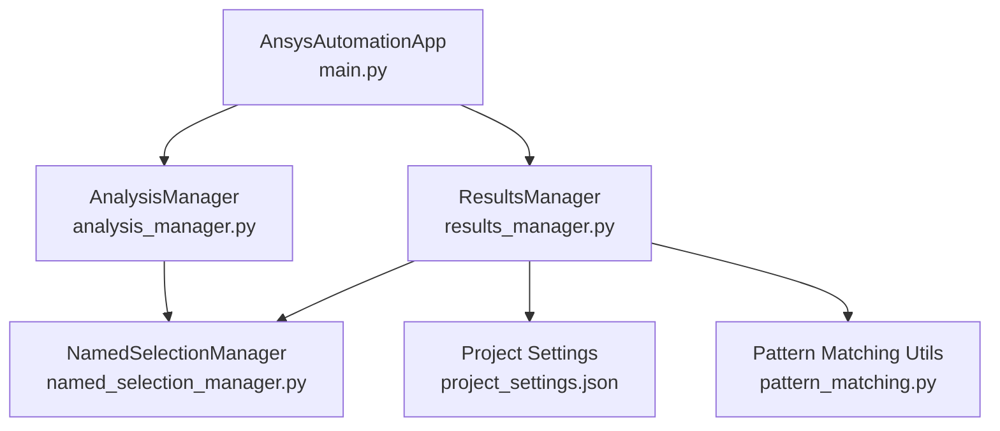
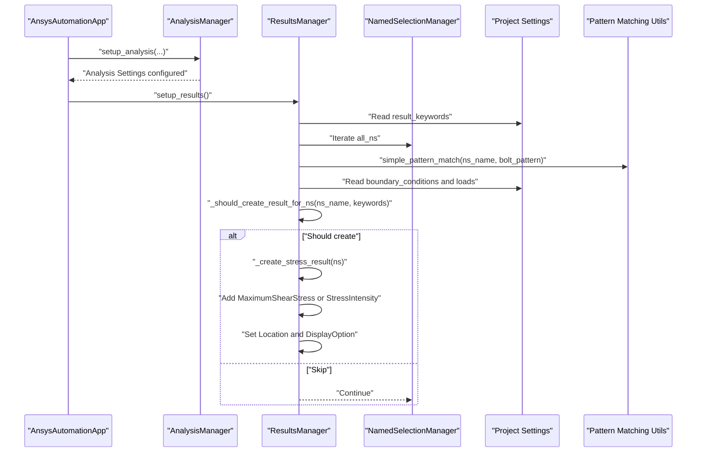
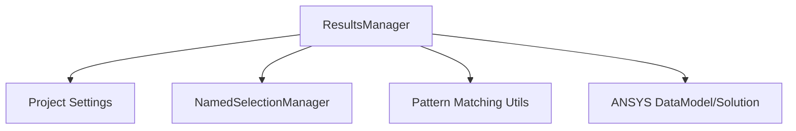

# Results Manager

<cite>
**Referenced Files in This Document**
- [results_manager.py](file://managers/results_manager.py)
- [project_settings.json](file://config_files/project_settings.json)
- [named_selection_manager.py](file://core/named_selection_manager.py)
- [pattern_matching.py](file://utils/pattern_matching.py)
- [main.py](file://main.py)
- [analysis_manager.py](file://managers/analysis_manager.py)
</cite>

## Table of Contents
1. [Introduction](#introduction)
2. [Project Structure](#project-structure)
3. [Core Components](#core-components)
4. [Architecture Overview](#architecture-overview)
5. [Detailed Component Analysis](#detailed-component-analysis)
6. [Dependency Analysis](#dependency-analysis)
7. [Performance Considerations](#performance-considerations)
8. [Troubleshooting Guide](#troubleshooting-guide)
9. [Conclusion](#conclusion)

## Introduction
This document explains the ResultsManager class and its role in automating result setup for ANSYS simulations. It focuses on:
- How setup_results() configures solution information settings (Newton-Raphson residuals and element violation identification) and adds total deformation output.
- How stress results are created for critical components by scanning named selections against keywords defined in project_settings.json.
- The logic behind _should_create_result_for_ns(), including exclusion of boundary condition/load named selections and keyword matching.
- The implementation of _create_stress_result(), including stress selection and display options.
- Integration with NamedSelectionManager and ANSYS Solution objects.
- Common issues, best practices for result_keywords, and performance considerations.

## Project Structure
ResultsManager participates in the automated workflow orchestrated by the main application. The typical flow is:
- Application initializes managers and loads configuration.
- Analysis setup is performed (including boundary conditions and loads).
- Results setup is executed, which configures solution information and creates stress results for critical named selections.

**Diagram sources**
- [main.py](file://main.py#L160-L205)
- [analysis_manager.py](file://managers/analysis_manager.py#L14-L27)
- [results_manager.py](file://managers/results_manager.py#L15-L30)
- [named_selection_manager.py](file://core/named_selection_manager.py#L12-L19)
- [project_settings.json](file://config_files/project_settings.json#L24-L48)
- [pattern_matching.py](file://utils/pattern_matching.py#L8-L31)

**Section sources**
- [main.py](file://main.py#L160-L205)
- [results_manager.py](file://managers/results_manager.py#L15-L30)

## Core Components
- ResultsManager: Orchestrates result setup, including solution information configuration and stress result creation for critical named selections.
- NamedSelectionManager: Provides access to all named selections and utilities for pattern-based filtering.
- Project settings: Supplies result_keywords and other result-related configuration.
- Pattern matching utilities: Provide simple wildcard matching used by ResultsManager and NamedSelectionManager.

Key responsibilities:
- Configure solution information (Newton-Raphson residuals, element violations).
- Add total deformation output.
- Scan named selections and create stress results for critical components.
- Exclude boundary condition and load named selections from result creation.

**Section sources**
- [results_manager.py](file://managers/results_manager.py#L15-L62)
- [named_selection_manager.py](file://core/named_selection_manager.py#L12-L19)
- [project_settings.json](file://config_files/project_settings.json#L24-L48)
- [pattern_matching.py](file://utils/pattern_matching.py#L8-L31)

## Architecture Overview
ResultsManager integrates with the broader automation pipeline. The following sequence illustrates how results are set up after analysis:

**Diagram sources**
- [main.py](file://main.py#L199-L203)
- [analysis_manager.py](file://managers/analysis_manager.py#L14-L27)
- [results_manager.py](file://managers/results_manager.py#L15-L62)
- [named_selection_manager.py](file://core/named_selection_manager.py#L12-L19)
- [project_settings.json](file://config_files/project_settings.json#L24-L48)
- [pattern_matching.py](file://utils/pattern_matching.py#L8-L31)

## Detailed Component Analysis

### ResultsManager.setup_results()
Purpose:
- Configure solution information settings.
- Add total deformation output.
- Iterate named selections and create stress results for critical components.

Implementation highlights:
- Retrieves the "Solution Information" object and sets Newton-Raphson residuals and element violation identification counts.
- Adds total deformation using the parent "Solution" object.
- Reads result_keywords from project settings to define critical component naming patterns.
- Iterates all named selections and decides whether to create stress results based on _should_create_result_for_ns().

Behavioral notes:
- Uses project settings to exclude special named selections (boundary conditions and loads).
- Applies a bolt pattern to exclude bolt-related named selections.
- Keyword matching determines if a named selection qualifies as critical.

**Section sources**
- [results_manager.py](file://managers/results_manager.py#L15-L30)
- [project_settings.json](file://config_files/project_settings.json#L24-L48)

### ResultsManager._should_create_result_for_ns(ns_name, important_keywords)
Decision logic:
- Excludes named selections that match the bolt pattern defined in project settings.
- Excludes named selections that appear in boundary conditions or loads configuration.
- Includes named selections if any of the result_keywords appears in the name.

Common pitfalls:
- If result_keywords are too broad or too narrow, critical components may be missed or excessive results may be generated.
- If bolt_pattern is misconfigured, bolt-related named selections may be incorrectly included or excluded.

Best practices:
- Keep result_keywords aligned with component families (e.g., shov, bolt, opora).
- Ensure bolt_pattern matches the actual naming convention used for bolt-related named selections.
- Verify boundary_conditions and loads entries correspond to actual named selections in the model.

**Section sources**
- [results_manager.py](file://managers/results_manager.py#L31-L50)
- [project_settings.json](file://config_files/project_settings.json#L24-L48)
- [pattern_matching.py](file://utils/pattern_matching.py#L8-L31)

### ResultsManager._create_stress_result(ns)
Behavior:
- Creates stress results for a given named selection.
- If the name contains a specific keyword (e.g., "shov"), adds MaximumShearStress and sets the location and display option to elemental mean averaging.
- Otherwise, adds StressIntensity and sets the location.

Integration points:
- Uses the "Solution" object to add results.
- Sets the Location property to the named selection object.
- Applies ResultAveragingType.ElementalMean for MaximumShearStress.

Notes:
- The choice between MaximumShearStress and StressIntensity aligns with project settings and component semantics.
- Display option affects post-processing efficiency and result volume.

**Section sources**
- [results_manager.py](file://managers/results_manager.py#L52-L62)
- [project_settings.json](file://config_files/project_settings.json#L43-L48)

### Integration with NamedSelectionManager
- ResultsManager receives a NamedSelectionManager instance and iterates all_ns to scan all named selections.
- NamedSelectionManager provides:
  - all_ns: collection of all named selections in the model.
  - get_ns_by_name(): retrieves a named selection by its configured name.
  - get_ns_by_pattern(): filters named selections by wildcard patterns.
  - get_ns_by_type(): categorizes named selections (load, bc, bolt, contact, remote).

Impact:
- Ensures robust access to named selections regardless of their order or naming variations.
- Supports validation and filtering prior to result creation.

**Section sources**
- [results_manager.py](file://managers/results_manager.py#L15-L30)
- [named_selection_manager.py](file://core/named_selection_manager.py#L12-L19)
- [named_selection_manager.py](file://core/named_selection_manager.py#L39-L57)
- [named_selection_manager.py](file://core/named_selection_manager.py#L95-L121)

### Integration with ANSYS Solution Objects
- ResultsManager uses DataModel.GetObjectsByName to locate "Solution Information" and "Solution".
- It then calls methods on the Solution object to add total deformation and stress results.
- The Location property binds results to specific named selections.

Operational note:
- These calls assume a live ANSYS session with a valid model and analyses.

**Section sources**
- [results_manager.py](file://managers/results_manager.py#L15-L30)
- [results_manager.py](file://managers/results_manager.py#L52-L62)

## Dependency Analysis
ResultsManager depends on:
- Project settings for result_keywords, bolt_pattern, and stress averaging preferences.
- NamedSelectionManager for enumeration and filtering of named selections.
- Pattern matching utilities for wildcard matching.

**Diagram sources**
- [results_manager.py](file://managers/results_manager.py#L15-L62)
- [project_settings.json](file://config_files/project_settings.json#L24-L48)
- [named_selection_manager.py](file://core/named_selection_manager.py#L12-L19)
- [pattern_matching.py](file://utils/pattern_matching.py#L8-L31)

**Section sources**
- [results_manager.py](file://managers/results_manager.py#L15-L62)
- [project_settings.json](file://config_files/project_settings.json#L24-L48)
- [named_selection_manager.py](file://core/named_selection_manager.py#L12-L19)
- [pattern_matching.py](file://utils/pattern_matching.py#L8-L31)

## Performance Considerations
- Result output volume:
  - Creating stress results for many critical named selections increases result volume and post-processing time.
  - Limit result_keywords to essential component families to reduce unnecessary outputs.
- Elemental mean averaging:
  - Applying ResultAveragingType.ElementalMean reduces result granularity and can improve post-processing efficiency.
  - However, it may smooth out localized peaks; verify whether peak resolution is required for specific components.
- Keyword specificity:
  - Broad keywords may match unintended named selections, increasing result count.
  - Narrow keywords may miss legitimate critical components; validate against actual model naming.

[No sources needed since this section provides general guidance]

## Troubleshooting Guide
Common issues and resolutions:
- Missing critical components in results:
  - Verify result_keywords in project settings include the intended component families.
  - Confirm that named selections actually contain the expected keywords.
  - Ensure bolt_pattern does not inadvertently exclude bolt-related named selections.
- Incorrect keyword configuration:
  - Adjust result_keywords to match actual naming conventions.
  - Use get_ns_by_type() or find_ns_with_keywords() to preview matches before enabling result creation.
- Boundary condition/load named selections being processed:
  - Confirm boundary_conditions and loads entries in project settings match actual named selections.
  - Review _should_create_result_for_ns() logic to ensure exclusions are effective.
- Post-processing performance concerns:
  - Reduce result_keywords scope or disable elemental mean averaging if needed.
  - Consider selective result creation for specific scenarios.

Validation utilities:
- NamedSelectionManager.validate_required_ns() and validate_ns_for_analysis() help identify missing or mismatched named selections.

**Section sources**
- [results_manager.py](file://managers/results_manager.py#L31-L50)
- [project_settings.json](file://config_files/project_settings.json#L24-L48)
- [named_selection_manager.py](file://core/named_selection_manager.py#L58-L85)
- [named_selection_manager.py](file://core/named_selection_manager.py#L138-L155)

## Conclusion
ResultsManager automates the setup of solution outputs and stress results for critical components by leveraging project settings, named selection filtering, and ANSYS Solution APIs. By carefully configuring result_keywords, bolt_pattern, and boundary/load exclusions, teams can ensure targeted, efficient post-processing while avoiding unnecessary result volumes. Regular validation of named selections and periodic review of result_keyword scope will maintain reliability across diverse models.