# Project Overview

<cite>
**Referenced Files in This Document**
- [main.py](file://main.py)
- [config/config_manager.py](file://config/config_manager.py)
- [config/paths.py](file://config/paths.py)
- [config/constants.py](file://config/constants.py)
- [core/structure_detector.py](file://core/structure_detector.py)
- [core/execution_manager.py](file://core/execution_manager.py)
- [managers/analysis_manager.py](file://managers/analysis_manager.py)
- [managers/mesh_manager.py](file://managers/mesh_manager.py)
- [managers/contact_manager.py](file://managers/contact_manager.py)
- [managers/results_manager.py](file://managers/results_manager.py)
- [managers/bolt_manager.py](file://managers/bolt_manager.py)
- [utils/json_parser.py](file://utils/json_parser.py)
- [utils/pattern_matching.py](file://utils/pattern_matching.py)
- [utils/validators.py](file://utils/validators.py)
- [config_files/project_settings.json](file://config_files/project_settings.json)
- [config_files/analysis_scenarios.json](file://config_files/analysis_scenarios.json)
- [config_files/load_database.json](file://config_files/load_database.json)
</cite>

## Table of Contents
1. [Introduction](#introduction)
2. [Project Structure](#project-structure)
3. [Core Components](#core-components)
4. [Architecture Overview](#architecture-overview)
5. [Detailed Component Analysis](#detailed-component-analysis)
6. [Dependency Analysis](#dependency-analysis)
7. [Performance Considerations](#performance-considerations)
8. [Troubleshooting Guide](#troubleshooting-guide)
9. [Conclusion](#conclusion)
10. [Appendices](#appendices)

## Introduction
AnsysAutomation is a desktop automation tool for ANSYS finite element analysis software, built with IronPython to integrate seamlessly within the ANSYS environment. It streamlines repetitive setup tasks such as meshing, contact definition, load application, and result configuration through a configuration-driven, modular architecture. The tool reduces human error, improves consistency, and accelerates analysis workflows by automating the entire setup pipeline from model detection to execution readiness.

Key capabilities:
- Structure detection from model naming and Named Selections
- Execution type determination from model name patterns
- Manager initialization for mesh, contact, analysis, bolt, and results
- JSON-based configuration hierarchy with structure-specific overrides
- Automated contact pair configuration and mesh generation
- Standardized load application across multiple analysis scenarios
- Intelligent bolt pretension detection and step-wise load application

## Project Structure
The project follows a layered, modular design:
- Entry point orchestrates initialization, validation, and execution
- Configuration subsystem manages JSON-based settings and structure-specific overrides
- Core subsystem detects structure type and determines execution type
- Managers encapsulate domain-specific automation logic
- Utilities provide JSON parsing, pattern matching, and validation helpers
- Configuration files define project-wide settings, analysis scenarios, and load databases

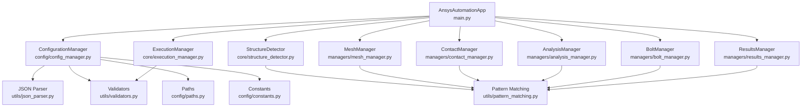

**Diagram sources**
- [main.py](file://main.py#L1-L270)
- [config/config_manager.py](file://config/config_manager.py#L1-L209)
- [core/structure_detector.py](file://core/structure_detector.py#L1-L158)
- [core/execution_manager.py](file://core/execution_manager.py#L1-L154)
- [managers/mesh_manager.py](file://managers/mesh_manager.py#L1-L104)
- [managers/contact_manager.py](file://managers/contact_manager.py#L1-L96)
- [managers/analysis_manager.py](file://managers/analysis_manager.py#L1-L116)
- [managers/bolt_manager.py](file://managers/bolt_manager.py#L1-L68)
- [managers/results_manager.py](file://managers/results_manager.py#L1-L62)
- [utils/json_parser.py](file://utils/json_parser.py#L1-L170)
- [utils/pattern_matching.py](file://utils/pattern_matching.py#L1-L71)
- [utils/validators.py](file://utils/validators.py#L1-L161)
- [config/paths.py](file://config/paths.py#L1-L73)
- [config/constants.py](file://config/constants.py#L1-L99)

**Section sources**
- [main.py](file://main.py#L1-L270)
- [config/config_manager.py](file://config/config_manager.py#L1-L209)
- [config/paths.py](file://config/paths.py#L1-L73)
- [config/constants.py](file://config/constants.py#L1-L99)
- [core/structure_detector.py](file://core/structure_detector.py#L1-L158)
- [core/execution_manager.py](file://core/execution_manager.py#L1-L154)
- [managers/analysis_manager.py](file://managers/analysis_manager.py#L1-L116)
- [managers/mesh_manager.py](file://managers/mesh_manager.py#L1-L104)
- [managers/contact_manager.py](file://managers/contact_manager.py#L1-L96)
- [managers/results_manager.py](file://managers/results_manager.py#L1-L62)
- [managers/bolt_manager.py](file://managers/bolt_manager.py#L1-L68)
- [utils/json_parser.py](file://utils/json_parser.py#L1-L170)
- [utils/pattern_matching.py](file://utils/pattern_matching.py#L1-L71)
- [utils/validators.py](file://utils/validators.py#L1-L161)

## Core Components
- AnsysAutomationApp: Orchestrates the entire workflow from initialization to execution readiness. It validates configuration paths, initializes managers, runs validations, and executes the automated setup.
- ConfigurationManager: Loads and validates JSON configuration files, merges base and structure-specific configurations, and exposes helper methods for validation and default creation.
- StructureDetector: Determines structure type and category from model naming and Named Selections, and gathers model metadata for downstream decisions.
- ExecutionManager: Determines execution type from model name using configurable patterns, validates execution existence in the load database, and retrieves load configurations.
- MeshManager: Applies mesh settings per Named Selection, skipping load and boundary condition selections, and generates the mesh.
- ContactManager: Automatically configures contact pairs based on body name patterns and predefined contact rules.
- AnalysisManager: Sets up analysis parameters and applies boundary conditions and loads according to selected scenario and detected load configuration.
- BoltManager: Detects presence of bolts, derives pretension from model bodies, and applies bolt pretension and subsequent load steps.
- ResultsManager: Creates result requests for important Named Selections based on keywords and project settings.

**Section sources**
- [main.py](file://main.py#L27-L270)
- [config/config_manager.py](file://config/config_manager.py#L1-L209)
- [core/structure_detector.py](file://core/structure_detector.py#L1-L158)
- [core/execution_manager.py](file://core/execution_manager.py#L1-L154)
- [managers/mesh_manager.py](file://managers/mesh_manager.py#L1-L104)
- [managers/contact_manager.py](file://managers/contact_manager.py#L1-L96)
- [managers/analysis_manager.py](file://managers/analysis_manager.py#L1-L116)
- [managers/bolt_manager.py](file://managers/bolt_manager.py#L1-L68)
- [managers/results_manager.py](file://managers/results_manager.py#L1-L62)

## Architecture Overview
The system is orchestrated by AnsysAutomationApp, which coordinates ConfigurationManager, StructureDetector, and the manager classes. Configuration-driven behavior ensures that structure-specific overrides are applied, while JSON-based settings govern execution type determination, meshing, contact rules, and analysis scenarios.

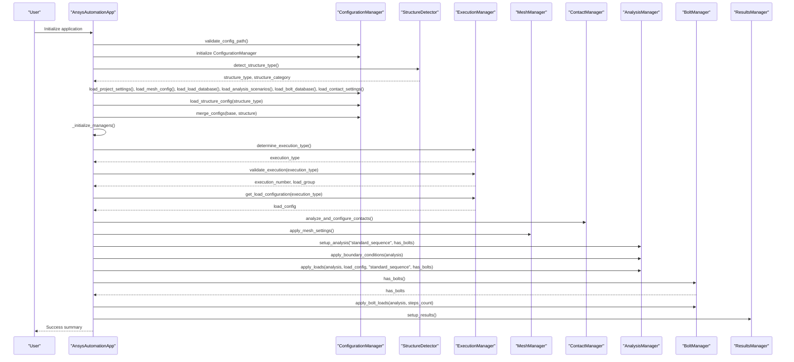

**Diagram sources**
- [main.py](file://main.py#L51-L205)
- [core/structure_detector.py](file://core/structure_detector.py#L30-L52)
- [core/execution_manager.py](file://core/execution_manager.py#L16-L107)
- [managers/mesh_manager.py](file://managers/mesh_manager.py#L20-L40)
- [managers/contact_manager.py](file://managers/contact_manager.py#L14-L40)
- [managers/analysis_manager.py](file://managers/analysis_manager.py#L14-L116)
- [managers/bolt_manager.py](file://managers/bolt_manager.py#L17-L68)
- [managers/results_manager.py](file://managers/results_manager.py#L15-L62)

## Detailed Component Analysis

### AnsysAutomationApp
- Responsibilities:
  - Validates configuration path and initializes ConfigurationManager
  - Detects structure type and category, analyzes Named Selection patterns, and collects model info
  - Loads base and structure-specific configurations and merges them
  - Initializes all manager instances
  - Runs validation checks for Named Selections, model structure, and configuration hierarchy
  - Executes the complete analysis setup pipeline
- Key methods:
  - initialize_application(): orchestrates initialization steps
  - run_validation(): validates NS presence, model structure, and configuration hierarchy
  - execute_analysis_setup(): performs execution type determination, contact configuration, meshing, analysis setup, bolt loads, and results configuration
  - run(): main entry point that coordinates the entire workflow

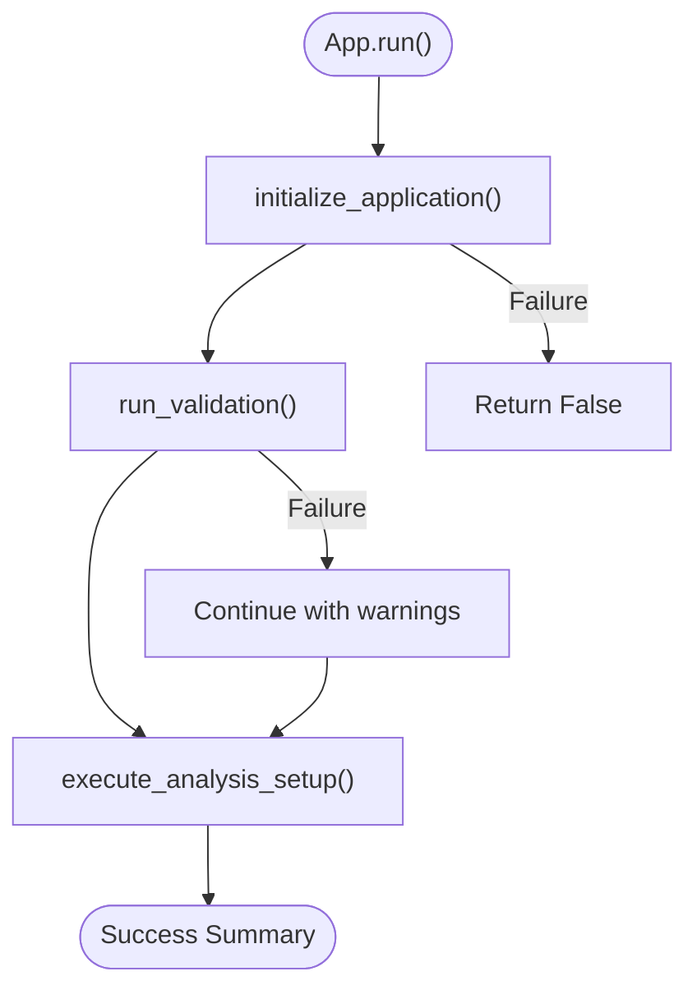

**Diagram sources**
- [main.py](file://main.py#L132-L205)

**Section sources**
- [main.py](file://main.py#L51-L205)

### ConfigurationManager
- Responsibilities:
  - Loads JSON configuration files with validation
  - Validates required keys per file type
  - Loads structure-specific configuration and merges it into base configuration
  - Provides default configuration creation and validation of configuration hierarchy
- Key methods:
  - load_config(file_path): loads and validates a single configuration file
  - load_all_configs(): loads all main configuration files
  - load_structure_config(structure_type): loads structure-specific overrides
  - merge_configs(base_config, structure_config): merges structure overrides with base
  - validate_config_hierarchy(structure_type): checks required files and optional structure-specific file

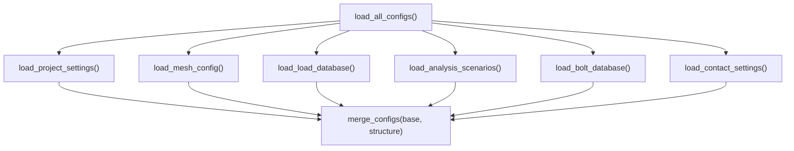

**Diagram sources**
- [config/config_manager.py](file://config/config_manager.py#L103-L160)

**Section sources**
- [config/config_manager.py](file://config/config_manager.py#L1-L209)
- [config/paths.py](file://config/paths.py#L1-L73)
- [config/constants.py](file://config/constants.py#L1-L99)

### StructureDetector
- Responsibilities:
  - Detects structure type and category from model name using regex patterns
  - Analyzes Named Selection patterns to infer configuration (bolts, pressure, contact, remote, supports)
  - Detects load configuration and boundary conditions from NS names
  - Gathers model metadata (bodies count, body types, materials)
- Key methods:
  - detect_structure_type(): returns structure_type and category
  - analyze_ns_patterns(): returns analysis flags and counts
  - detect_load_configuration(): detects presence of various load types
  - detect_boundary_conditions(): detects boundary condition types
  - get_model_info(): returns comprehensive model information

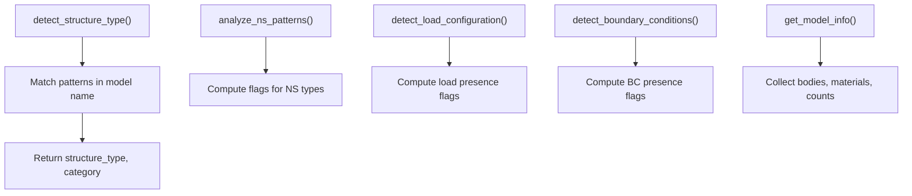

**Diagram sources**
- [core/structure_detector.py](file://core/structure_detector.py#L30-L158)

**Section sources**
- [core/structure_detector.py](file://core/structure_detector.py#L1-L158)
- [utils/pattern_matching.py](file://utils/pattern_matching.py#L1-L71)

### ExecutionManager
- Responsibilities:
  - Determines execution type from model name using structure-specific and default patterns
  - Validates execution existence in load database and returns execution_number and load_group
  - Retrieves load configuration for the determined execution type
  - Provides lists of available executions and load groups
- Key methods:
  - determine_execution_type(): resolves execution type from model name
  - validate_execution(execution_type): validates against load database
  - get_load_configuration(execution_type): constructs load_config with forces, moments, and load factors
  - get_available_executions()/get_available_load_groups(): introspection helpers

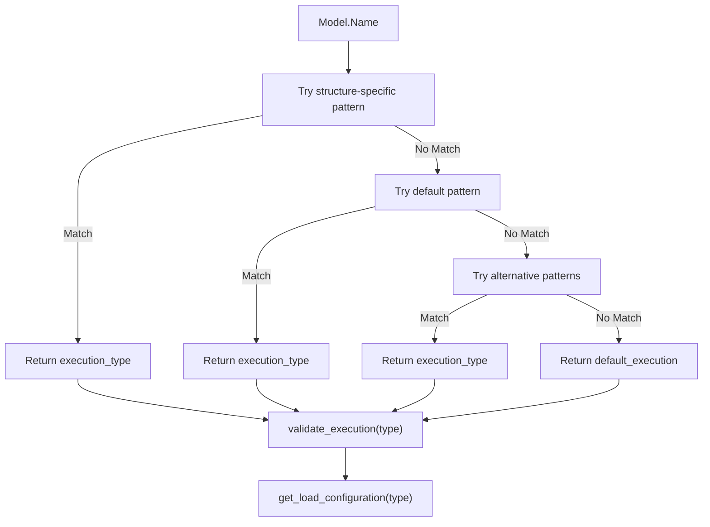

**Diagram sources**
- [core/execution_manager.py](file://core/execution_manager.py#L16-L107)

**Section sources**
- [core/execution_manager.py](file://core/execution_manager.py#L1-L154)
- [utils/validators.py](file://utils/validators.py#L133-L161)

### MeshManager
- Responsibilities:
  - Applies mesh settings to Named Selections, skipping load and boundary condition NS
  - Derives element size from entity names and applies sizing and automatic method
  - Groups similar children and generates the mesh
- Key methods:
  - apply_mesh_settings(): iterates NS, filters special NS, applies settings, and generates mesh
  - _is_load_or_bc_ns(): identifies NS used for loads or BCs
  - _get_mesh_settings(): maps NS to mesh settings using structure-specific keys
  - _create_sizing_and_method(): creates sizing and method with computed element size

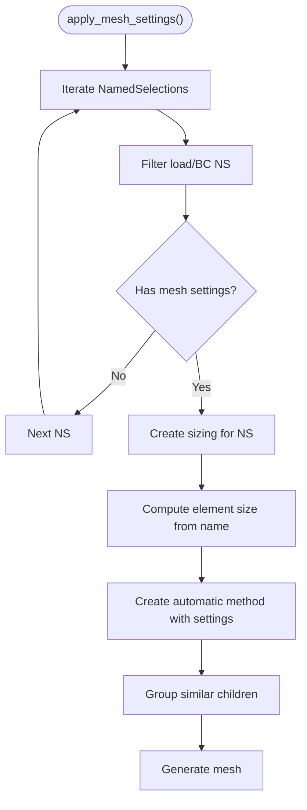

**Diagram sources**
- [managers/mesh_manager.py](file://managers/mesh_manager.py#L20-L104)

**Section sources**
- [managers/mesh_manager.py](file://managers/mesh_manager.py#L1-L104)
- [utils/pattern_matching.py](file://utils/pattern_matching.py#L1-L71)

### ContactManager
- Responsibilities:
  - Configures automatic contacts, sets tolerance, and applies contact rules to contact pairs
  - Matches contact and target bodies against configured patterns
  - Applies contact type, friction coefficient, detection method, and interface treatment
- Key methods:
  - analyze_and_configure_contacts(): configures automatic connections and applies rules
  - _configure_contact(): applies configuration to individual contact pair
  - _find_contact_config(): finds matching rule for contact/target bodies
  - _matches_config(): checks pattern matches for bodies
  - _apply_contact_config(): sets contact properties

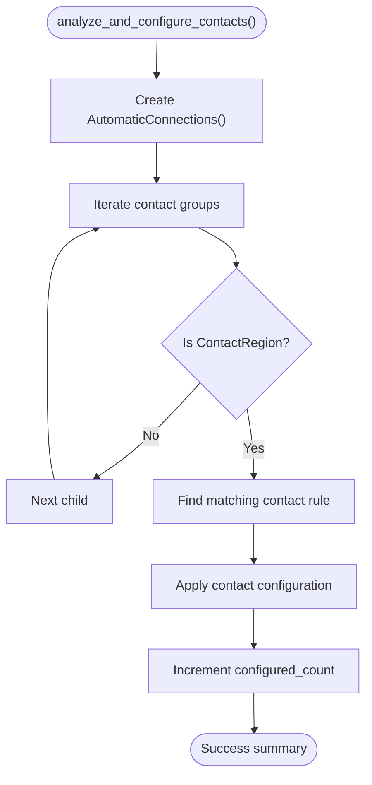

**Diagram sources**
- [managers/contact_manager.py](file://managers/contact_manager.py#L14-L96)

**Section sources**
- [managers/contact_manager.py](file://managers/contact_manager.py#L1-L96)

### AnalysisManager
- Responsibilities:
  - Sets analysis parameters (steps, large deflection, Newton-Raphson option, output controls)
  - Applies boundary conditions based on project settings and Named Selections
  - Applies loads (force, moment, pressure) with step-wise load factors
  - Handles bolt-related load sequences when bolts are present
- Key methods:
  - setup_analysis(scenario_name, has_bolts): configures analysis settings
  - apply_boundary_conditions(analysis): adds fixed support, displacement, remote displacement/force
  - apply_loads(analysis, load_config, scenario_name, has_bolts): applies loads with time steps and load factors

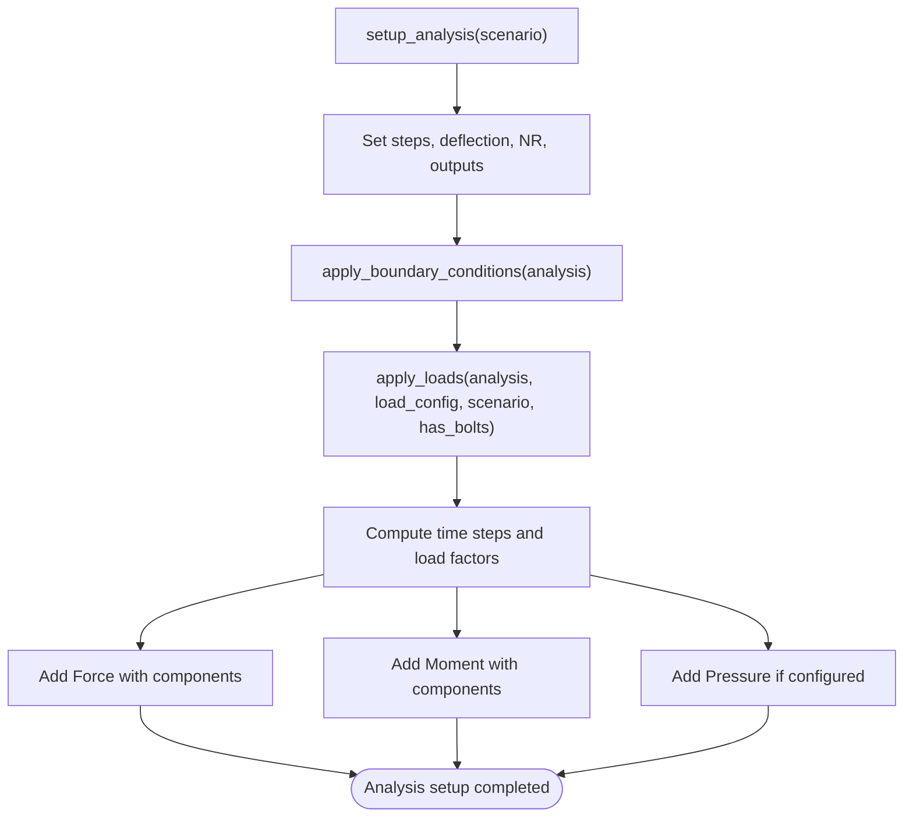

**Diagram sources**
- [managers/analysis_manager.py](file://managers/analysis_manager.py#L14-L116)

**Section sources**
- [managers/analysis_manager.py](file://managers/analysis_manager.py#L1-L116)

### BoltManager
- Responsibilities:
  - Detects presence of bolts by pattern matching Named Selections
  - Derives bolt pretension from model body names (e.g., mbolt diameter) or falls back to defaults
  - Applies bolt pretension at step 0 and locks at subsequent steps
- Key methods:
  - has_bolts(): checks for bolt NS
  - get_correct_bolt_pretension(): extracts diameter from body name and selects pretension
  - apply_bolt_loads(analysis, steps_count): creates bolt pretension loads and sets lock steps

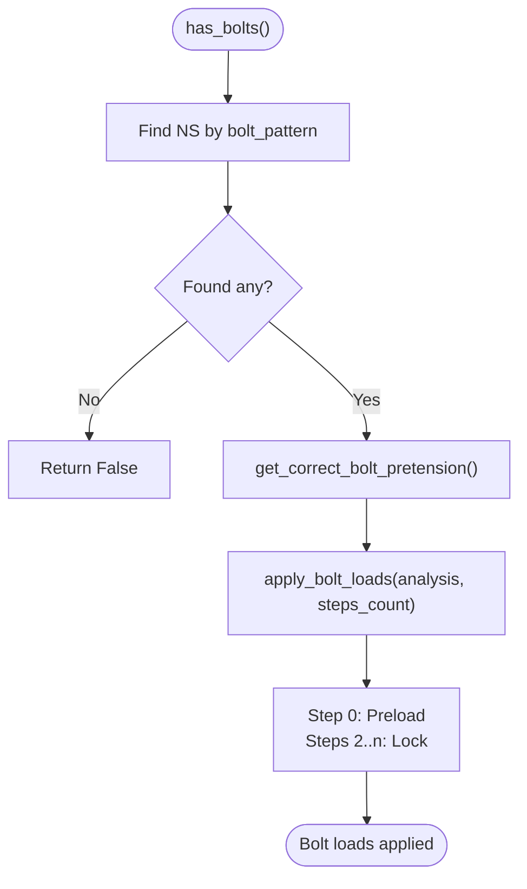

**Diagram sources**
- [managers/bolt_manager.py](file://managers/bolt_manager.py#L17-L68)

**Section sources**
- [managers/bolt_manager.py](file://managers/bolt_manager.py#L1-L68)

### ResultsManager
- Responsibilities:
  - Sets solution information parameters
  - Adds total deformation
  - Creates stress intensity or maximum shear stress for important Named Selections based on keywords
- Key methods:
  - setup_results(): configures solution info and creates results
  - _should_create_result_for_ns(): excludes load/BC/bolt NS and checks keywords
  - _create_stress_result(): creates appropriate result type

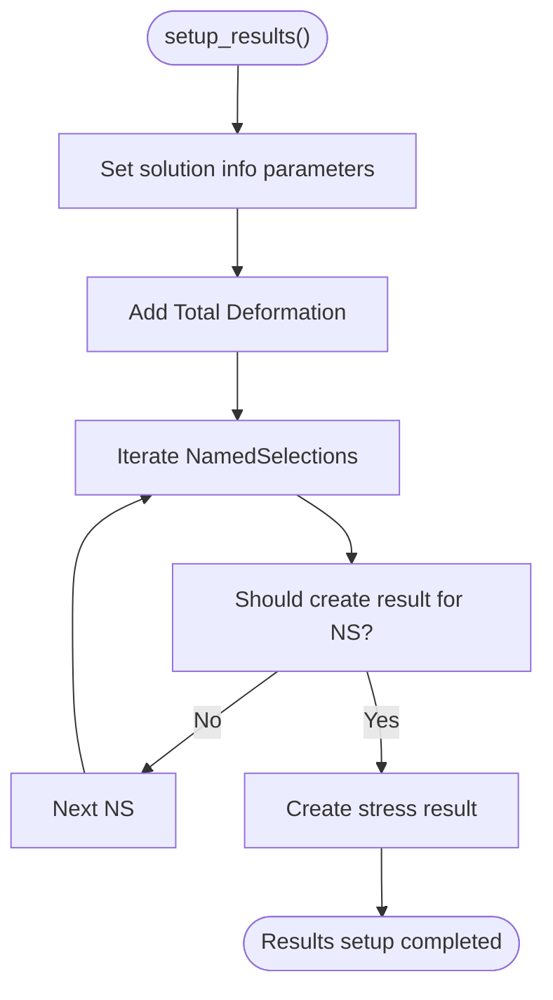

**Diagram sources**
- [managers/results_manager.py](file://managers/results_manager.py#L15-L62)

**Section sources**
- [managers/results_manager.py](file://managers/results_manager.py#L1-L62)

## Dependency Analysis
- Coupling:
  - AnsysAutomationApp depends on all managers and ConfigurationManager for orchestration
  - Managers depend on project settings and Named Selections; some also depend on bolt and contact databases
  - ConfigurationManager depends on JSON parser and validators for robust configuration handling
- Cohesion:
  - Each manager encapsulates a single domain concern (meshing, contacts, analysis, etc.)
  - Utilities provide reusable functionality across components
- External dependencies:
  - ANSYS Model object and DataModel APIs are used throughout managers for creating objects and accessing model metadata
- Potential circular dependencies:
  - None observed; managers are consumers of configuration and NS data rather than providers

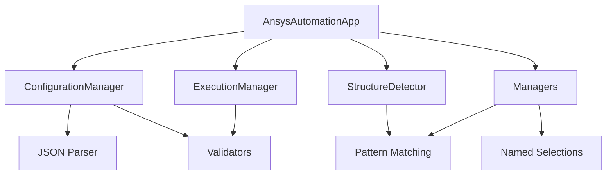

**Diagram sources**
- [main.py](file://main.py#L1-L270)
- [config/config_manager.py](file://config/config_manager.py#L1-L209)
- [utils/json_parser.py](file://utils/json_parser.py#L1-L170)
- [utils/validators.py](file://utils/validators.py#L1-L161)
- [utils/pattern_matching.py](file://utils/pattern_matching.py#L1-L71)

**Section sources**
- [main.py](file://main.py#L1-L270)
- [config/config_manager.py](file://config/config_manager.py#L1-L209)
- [utils/json_parser.py](file://utils/json_parser.py#L1-L170)
- [utils/validators.py](file://utils/validators.py#L1-L161)
- [utils/pattern_matching.py](file://utils/pattern_matching.py#L1-L71)

## Performance Considerations
- Configuration loading and merging:
  - Use structure-specific overrides judiciously to minimize unnecessary merges
  - Keep configuration files lean and avoid redundant entries
- Mesh generation:
  - Avoid applying mesh settings to load/BC Named Selections to reduce unnecessary operations
  - Ensure mesh settings keys are ordered to optimize matching performance
- Contact configuration:
  - Limit contact rules to necessary patterns to reduce matching overhead
- Analysis setup:
  - Reuse analysis settings across scenarios to avoid repeated object creation
- Error handling:
  - Exceptions are raised early to prevent wasted computation; handle them gracefully in the application layer

[No sources needed since this section provides general guidance]

## Troubleshooting Guide
Common issues and resolutions:
- Configuration path not found:
  - Verify configuration path exists and all required files are present
  - Use validate_config_path() and validate_config_hierarchy(structure_type)
- Missing required keys in configuration:
  - Ensure project_settings, mesh_config, analysis_scenarios, bolt_database, and contact_settings contain required keys
- Execution type cannot be determined:
  - Adjust execution.name_pattern or provide structure-specific pattern in project settings
  - Confirm model name matches expected patterns
- Load database mismatch:
  - Validate execution_number and load_group exist in load_database
  - Use get_available_executions() and get_available_load_groups() for inspection
- Named Selections missing:
  - Confirm NS names match project settings and patterns
  - Use NS analysis to verify presence of required NS types
- Mesh settings invalid:
  - Ensure mesh settings include meshCoef, meshMethod, and elementOrder
- Contact configuration warnings:
  - Review contact rules and body name patterns
  - Confirm contact bodies and target bodies match configured patterns

**Section sources**
- [config/paths.py](file://config/paths.py#L45-L73)
- [config/config_manager.py](file://config/config_manager.py#L181-L209)
- [utils/validators.py](file://utils/validators.py#L1-L161)
- [core/execution_manager.py](file://core/execution_manager.py#L130-L154)
- [managers/mesh_manager.py](file://managers/mesh_manager.py#L93-L104)
- [managers/contact_manager.py](file://managers/contact_manager.py#L60-L96)

## Conclusion
AnsysAutomation delivers a robust, configuration-driven automation framework for ANSYS finite element analysis. By leveraging structure detection, execution type determination, and manager-based automation, it significantly reduces setup time, minimizes errors, and standardizes workflows across diverse analysis scenarios. The modular design enables easy extension and customization through JSON-based configurations and structure-specific overrides.

[No sources needed since this section summarizes without analyzing specific files]

## Appendices

### Practical Usage Scenarios
- Standard sequence analysis:
  - Model name pattern determines execution type; load database supplies forces and moments; analysis manager applies boundary conditions and loads across steps; bolt manager applies pretension and locks; results manager creates stress outputs for critical NS
- Quick check analysis:
  - Uses fewer steps and load factors; suitable for preliminary assessments
- Detailed analysis:
  - Higher resolution load factors and steps for comprehensive evaluation
- Pretension-only analysis:
  - Single step focusing on bolt pretension

**Section sources**
- [config_files/analysis_scenarios.json](file://config_files/analysis_scenarios.json#L1-L55)
- [config_files/load_database.json](file://config_files/load_database.json#L1-L414)
- [managers/analysis_manager.py](file://managers/analysis_manager.py#L14-L116)
- [managers/bolt_manager.py](file://managers/bolt_manager.py#L43-L68)
- [managers/results_manager.py](file://managers/results_manager.py#L15-L62)