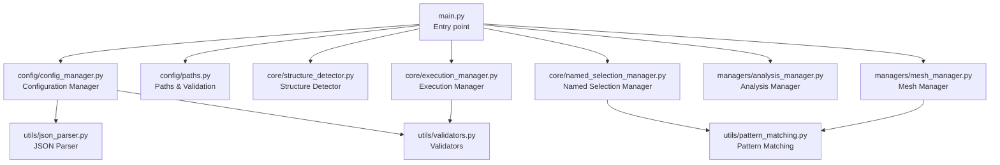
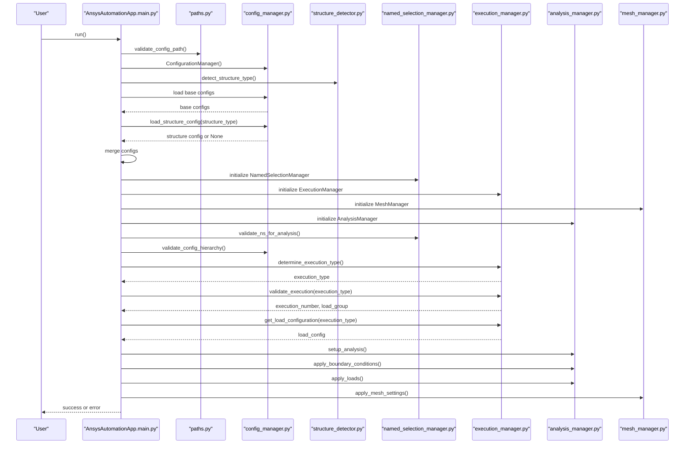
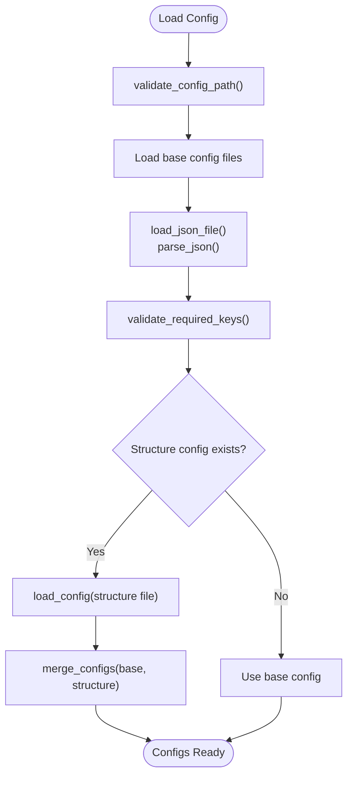
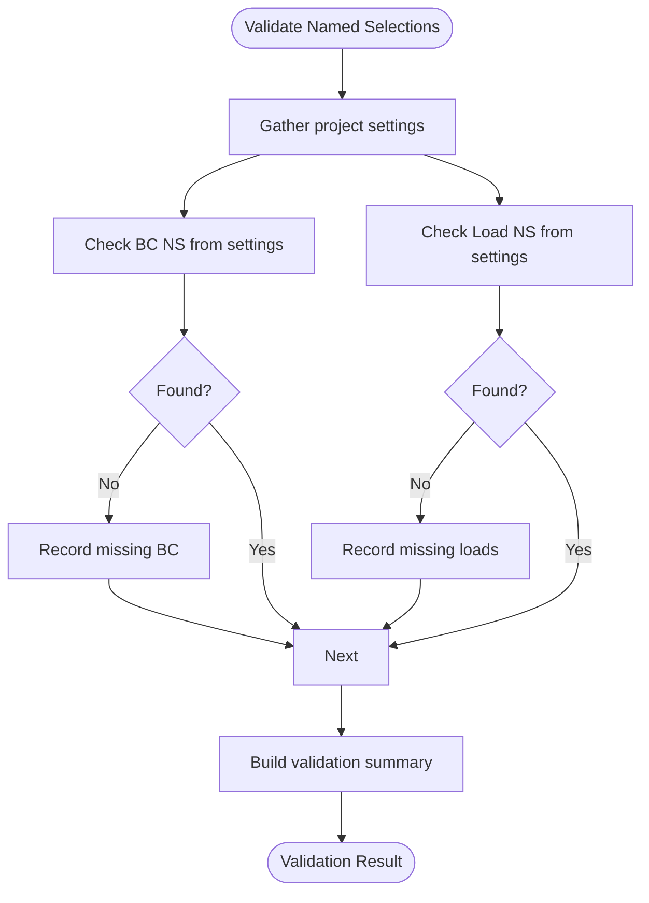
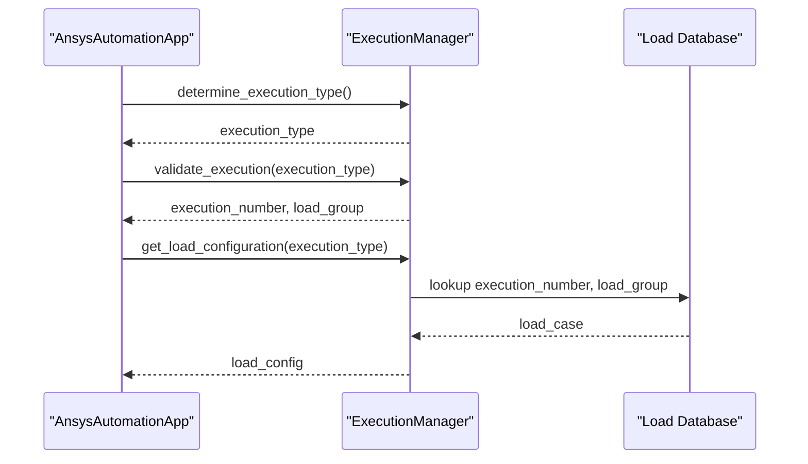
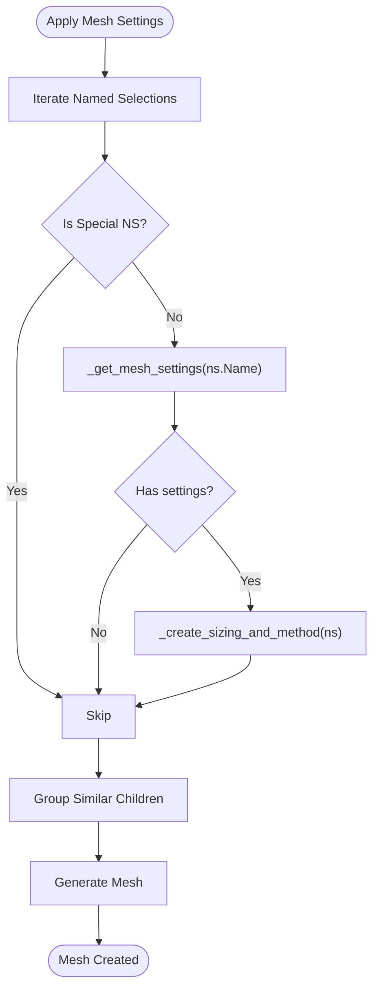
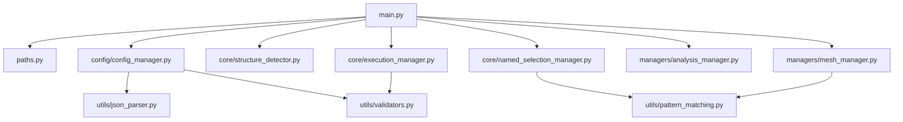
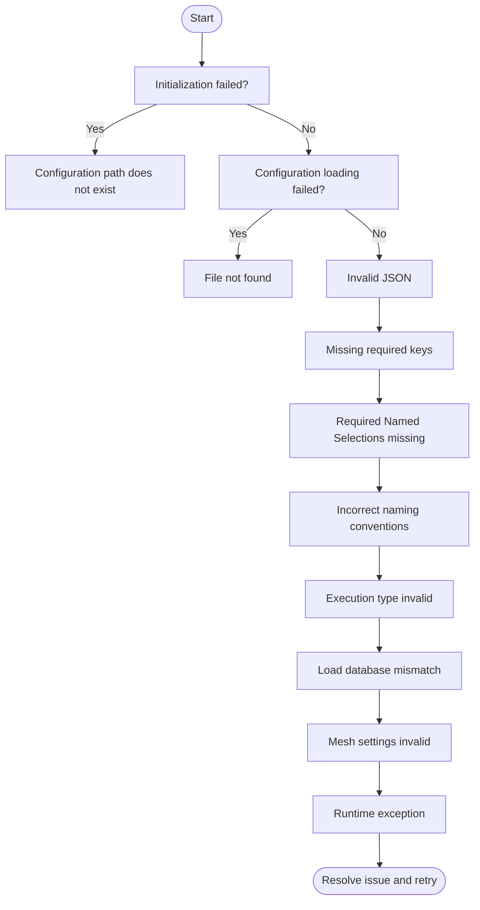

# Troubleshooting Guide

<cite>
**Referenced Files in This Document**
- [main.py](file://main.py)
- [config/config_manager.py](file://config/config_manager.py)
- [config/paths.py](file://config/paths.py)
- [config/constants.py](file://config/constants.py)
- [utils/json_parser.py](file://utils/json_parser.py)
- [utils/validators.py](file://utils/validators.py)
- [utils/pattern_matching.py](file://utils/pattern_matching.py)
- [core/named_selection_manager.py](file://core/named_selection_manager.py)
- [core/execution_manager.py](file://core/execution_manager.py)
- [core/structure_detector.py](file://core/structure_detector.py)
- [managers/analysis_manager.py](file://managers/analysis_manager.py)
- [managers/mesh_manager.py](file://managers/mesh_manager.py)
</cite>

## Table of Contents
1. [Introduction](#introduction)
2. [Project Structure](#project-structure)
3. [Core Components](#core-components)
4. [Architecture Overview](#architecture-overview)
5. [Detailed Component Analysis](#detailed-component-analysis)
6. [Dependency Analysis](#dependency-analysis)
7. [Performance Considerations](#performance-considerations)
8. [Troubleshooting Guide](#troubleshooting-guide)
9. [Conclusion](#conclusion)
10. [Appendices](#appendices)

## Introduction
This Troubleshooting Guide focuses on diagnosing and resolving common issues in AnsysAutomation. It covers configuration errors (missing files, invalid JSON, missing keys), model preparation issues (missing named selections, incorrect naming conventions), and runtime exceptions (ANSYS API errors, file access problems). It also provides a decision tree for diagnosing problems based on error messages and console output, specific solutions for frequent issues, interpretation of validation warnings, debugging techniques, and guidance for collecting diagnostic information.

## Project Structure
AnsysAutomation follows a modular architecture:
- Entry point initializes configuration, detects structure type, validates model and configs, and orchestrates analysis setup.
- Configuration manager handles loading and merging base and structure-specific configuration files.
- Validators enforce required keys, file existence, and model structure.
- Managers coordinate mesh, bolts, contacts, analysis, and results.
- Utilities provide JSON parsing, pattern matching, and validation helpers.

**Diagram sources**
- [main.py](file://main.py#L51-L248)
- [config/config_manager.py](file://config/config_manager.py#L26-L160)
- [config/paths.py](file://config/paths.py#L45-L73)
- [utils/json_parser.py](file://utils/json_parser.py#L142-L170)
- [utils/validators.py](file://utils/validators.py#L9-L51)
- [utils/pattern_matching.py](file://utils/pattern_matching.py#L1-L71)
- [core/named_selection_manager.py](file://core/named_selection_manager.py#L1-L190)
- [core/execution_manager.py](file://core/execution_manager.py#L1-L154)
- [managers/analysis_manager.py](file://managers/analysis_manager.py#L1-L116)
- [managers/mesh_manager.py](file://managers/mesh_manager.py#L1-L104)

**Section sources**
- [main.py](file://main.py#L51-L248)
- [config/config_manager.py](file://config/config_manager.py#L26-L160)
- [config/paths.py](file://config/paths.py#L45-L73)

## Core Components
- Configuration Manager: Loads and validates configuration files, merges base and structure-specific configs, and reports missing files.
- Paths Validator: Ensures the configuration path exists and provides helper paths for all config files.
- JSON Parser: Reads and parses JSON with comment removal and IronPython compatibility.
- Validators: Enforce file existence, required keys, model structure, mesh settings, contact settings, and execution type validation.
- Named Selection Manager: Validates required named selections, supports pattern matching, and provides diagnostics.
- Execution Manager: Determines execution type from model name, validates against load database, and retrieves load configuration.
- Structure Detector: Detects structure type and analyzes model/named selection patterns.
- Analysis Manager: Applies boundary conditions and loads to the analysis.
- Mesh Manager: Applies mesh settings per named selection with warnings on failures.

**Section sources**
- [config/config_manager.py](file://config/config_manager.py#L26-L209)
- [config/paths.py](file://config/paths.py#L45-L73)
- [utils/json_parser.py](file://utils/json_parser.py#L142-L170)
- [utils/validators.py](file://utils/validators.py#L9-L161)
- [core/named_selection_manager.py](file://core/named_selection_manager.py#L1-L190)
- [core/execution_manager.py](file://core/execution_manager.py#L1-L154)
- [core/structure_detector.py](file://core/structure_detector.py#L1-L158)
- [managers/analysis_manager.py](file://managers/analysis_manager.py#L1-L116)
- [managers/mesh_manager.py](file://managers/mesh_manager.py#L1-L104)

## Architecture Overview
The application initializes by validating the configuration path, loading base and optional structure-specific configurations, detecting structure type, and initializing managers. Validation runs to check named selections and configuration completeness. Execution determines the load case, and analysis setup applies boundary conditions and loads. Mesh and contact settings are configured, and results are prepared.

**Diagram sources**
- [main.py](file://main.py#L51-L248)
- [config/paths.py](file://config/paths.py#L45-L73)
- [config/config_manager.py](file://config/config_manager.py#L73-L160)
- [core/structure_detector.py](file://core/structure_detector.py#L30-L52)
- [core/named_selection_manager.py](file://core/named_selection_manager.py#L138-L155)
- [core/execution_manager.py](file://core/execution_manager.py#L16-L75)
- [managers/analysis_manager.py](file://managers/analysis_manager.py#L14-L116)
- [managers/mesh_manager.py](file://managers/mesh_manager.py#L20-L40)

## Detailed Component Analysis

### Configuration Management and Validation
- Configuration path validation ensures the base configuration directory exists.
- Configuration loading validates file existence and parses JSON, removing comments and whitespace.
- Required keys are enforced per configuration file type.
- Structure-specific configuration is loaded and merged with base configuration, with warnings if structure config fails to load.

**Diagram sources**
- [config/paths.py](file://config/paths.py#L45-L73)
- [utils/json_parser.py](file://utils/json_parser.py#L142-L170)
- [utils/validators.py](file://utils/validators.py#L26-L51)
- [config/config_manager.py](file://config/config_manager.py#L26-L160)

**Section sources**
- [config/paths.py](file://config/paths.py#L45-L73)
- [utils/json_parser.py](file://utils/json_parser.py#L142-L170)
- [utils/validators.py](file://utils/validators.py#L26-L51)
- [config/config_manager.py](file://config/config_manager.py#L26-L160)

### Named Selection Validation and Diagnostics
- Validates required named selections for boundary conditions and loads.
- Provides detailed missing-named-selection diagnostics and counts for each category.
- Supports pattern matching and keyword-based discovery to help identify suitable named selections.

**Diagram sources**
- [core/named_selection_manager.py](file://core/named_selection_manager.py#L58-L155)
- [utils/pattern_matching.py](file://utils/pattern_matching.py#L1-L71)

**Section sources**
- [core/named_selection_manager.py](file://core/named_selection_manager.py#L58-L155)
- [utils/pattern_matching.py](file://utils/pattern_matching.py#L1-L71)

### Execution Type Determination and Load Configuration
- Determines execution type from model name using multiple patterns and fallbacks.
- Validates execution type against load database and retrieves load configuration including forces, moments, and pressure.

**Diagram sources**
- [core/execution_manager.py](file://core/execution_manager.py#L16-L107)
- [config/constants.py](file://config/constants.py#L1-L99)

**Section sources**
- [core/execution_manager.py](file://core/execution_manager.py#L16-L107)
- [config/constants.py](file://config/constants.py#L1-L99)

### Mesh Settings Application
- Applies mesh settings per named selection, skipping special load/bc named selections.
- Handles exceptions per named selection with warnings and continues processing.

**Diagram sources**
- [managers/mesh_manager.py](file://managers/mesh_manager.py#L20-L104)
- [utils/pattern_matching.py](file://utils/pattern_matching.py#L1-L71)

**Section sources**
- [managers/mesh_manager.py](file://managers/mesh_manager.py#L20-L104)
- [utils/pattern_matching.py](file://utils/pattern_matching.py#L1-L71)

## Dependency Analysis
Key dependencies:
- Entry point depends on configuration manager, paths validator, structure detector, and managers.
- Configuration manager depends on JSON parser and validators.
- Named selection manager depends on pattern matching and validators.
- Execution manager depends on validators.
- Mesh manager depends on pattern matching.

**Diagram sources**
- [main.py](file://main.py#L51-L248)
- [config/config_manager.py](file://config/config_manager.py#L26-L160)
- [utils/json_parser.py](file://utils/json_parser.py#L142-L170)
- [utils/validators.py](file://utils/validators.py#L9-L51)
- [utils/pattern_matching.py](file://utils/pattern_matching.py#L1-L71)
- [core/named_selection_manager.py](file://core/named_selection_manager.py#L1-L190)
- [core/execution_manager.py](file://core/execution_manager.py#L1-L154)
- [managers/mesh_manager.py](file://managers/mesh_manager.py#L1-L104)

**Section sources**
- [main.py](file://main.py#L51-L248)
- [config/config_manager.py](file://config/config_manager.py#L26-L160)
- [utils/json_parser.py](file://utils/json_parser.py#L142-L170)
- [utils/validators.py](file://utils/validators.py#L9-L51)
- [utils/pattern_matching.py](file://utils/pattern_matching.py#L1-L71)
- [core/named_selection_manager.py](file://core/named_selection_manager.py#L1-L190)
- [core/execution_manager.py](file://core/execution_manager.py#L1-L154)
- [managers/mesh_manager.py](file://managers/mesh_manager.py#L1-L104)

## Performance Considerations
- JSON parsing removes comments and whitespace to reduce overhead.
- Pattern matching uses simple wildcard logic to avoid heavy regex overhead.
- Mesh application iterates named selections and continues on per-item exceptions to minimize total failure.
- Configuration merging prioritizes structure-specific settings while preserving base defaults.

[No sources needed since this section provides general guidance]

## Troubleshooting Guide

### Decision Tree for Diagnosing Problems
Use this flowchart to quickly identify the root cause based on error messages and console output.

[No sources needed since this diagram shows conceptual workflow, not actual code structure]

### Common Error Categories and Solutions

- Configuration path does not exist
  - Symptom: Initialization prints a critical error indicating the configuration path does not exist.
  - Cause: The base configuration directory configured in paths.py is missing or inaccessible.
  - Solution:
    - Verify the path set in the configuration path module.
    - Ensure the directory exists and is readable by the ANSYS environment.
    - Update the path constant if needed and rerun initialization.

  **Section sources**
  - [config/paths.py](file://config/paths.py#L45-L57)
  - [main.py](file://main.py#L58-L67)

- Required Named Selections missing
  - Symptom: Validation prints a warning listing missing named selections for boundary conditions and loads.
  - Cause: Project settings reference named selections that do not exist in the model.
  - Solution:
    - Create the named selections in the model with names matching project settings.
    - Alternatively, update project settings to match existing named selections.
    - Use the named selection manager’s validation to identify missing entries and adjust accordingly.

  **Section sources**
  - [core/named_selection_manager.py](file://core/named_selection_manager.py#L58-L84)
  - [config/constants.py](file://config/constants.py#L17-L33)

- Structure-specific config not loading
  - Symptom: Warning printed when structure-specific configuration fails to load; base configuration is used.
  - Cause: Structure-specific configuration file is missing or invalid JSON.
  - Solution:
    - Confirm the structure-specific configuration file exists under the configured path.
    - Validate JSON syntax and required keys for the structure-specific file.
    - Fix or remove the file to allow base configuration usage.

  **Section sources**
  - [config/config_manager.py](file://config/config_manager.py#L119-L136)

- Missing configuration files
  - Symptom: Validation warns about missing configuration files.
  - Cause: One or more required base configuration files are absent.
  - Solution:
    - Place all required configuration files in the configured directory.
    - Ensure filenames match expected names.

  **Section sources**
  - [config/config_manager.py](file://config/config_manager.py#L181-L209)
  - [config/paths.py](file://config/paths.py#L59-L73)

- Invalid JSON
  - Symptom: JSON parsing raises an error during configuration load.
  - Cause: Comments or malformed JSON in configuration files.
  - Solution:
    - Remove comments and fix syntax errors.
    - Validate with an external JSON validator to confirm correctness.

  **Section sources**
  - [utils/json_parser.py](file://utils/json_parser.py#L142-L170)

- Missing required keys
  - Symptom: Validation error lists missing required keys for a configuration file.
  - Cause: Configuration file lacks mandatory keys.
  - Solution:
    - Add missing keys with appropriate values based on required keys definitions.
    - Compare with defaults to ensure compatibility.

  **Section sources**
  - [utils/validators.py](file://utils/validators.py#L26-L51)
  - [config/constants.py](file://config/constants.py#L35-L42)

- Incorrect naming conventions
  - Symptom: Named selection validation fails due to mismatched names.
  - Cause: Named selections do not match expected patterns or explicit names.
  - Solution:
    - Rename named selections to match project settings or adjust settings to match existing names.
    - Use pattern-based discovery to identify suitable named selections.

  **Section sources**
  - [core/named_selection_manager.py](file://core/named_selection_manager.py#L138-L155)
  - [utils/pattern_matching.py](file://utils/pattern_matching.py#L1-L71)

- Execution type invalid
  - Symptom: Error indicates execution type could not be determined or not found in load database.
  - Cause: Model name does not match expected patterns or load database does not contain the execution.
  - Solution:
    - Adjust model name to match expected patterns or update project settings’ name pattern.
    - Ensure the load database contains the execution number and load group.

  **Section sources**
  - [core/execution_manager.py](file://core/execution_manager.py#L16-L75)
  - [config/constants.py](file://config/constants.py#L13-L16)

- Mesh settings invalid
  - Symptom: Error indicates invalid mesh settings for a named selection group.
  - Cause: Missing required mesh keys for a mesh setting entry.
  - Solution:
    - Add required mesh keys for the affected named selection group.
    - Ensure values are valid according to mesh settings expectations.

  **Section sources**
  - [utils/validators.py](file://utils/validators.py#L93-L110)

- Contact settings invalid
  - Symptom: Error indicates missing contact rules or missing keys in contact rules.
  - Cause: Missing required keys in contact settings or individual contact rules.
  - Solution:
    - Add required keys for contact settings and each contact rule.
    - Ensure all required fields are populated.

  **Section sources**
  - [utils/validators.py](file://utils/validators.py#L111-L131)

- Runtime exception
  - Symptom: Unknown error or critical error printed during execution.
  - Cause: Unhandled exception in ANSYS API calls or unexpected model state.
  - Solution:
    - Review the error message and stack trace context.
    - Validate model structure and named selections.
    - Retry with minimal configuration to isolate the issue.

  **Section sources**
  - [main.py](file://main.py#L234-L248)

### Interpreting Validation Warnings
- Named Selections validation warnings indicate missing required named selections. These can prevent boundary conditions or loads from being applied. Address missing named selections or update project settings to match available named selections.
- Configuration hierarchy warnings indicate missing base configuration files. Resolve missing files before proceeding.
- Structure-specific configuration warnings indicate the structure-specific file could not be loaded. Fix or remove the file to ensure base configuration is used.

**Section sources**
- [core/named_selection_manager.py](file://core/named_selection_manager.py#L58-L84)
- [config/config_manager.py](file://config/config_manager.py#L181-L209)

### Debugging Techniques
- Enable verbose logging: Rely on the console output generated by the application to trace initialization, validation, and execution steps.
- Use the IronPython console for interactive testing: Inspect model objects, named selections, and configuration loading in the ANSYS IronPython environment.
- Validate configuration files with external JSON validators: Ensure JSON syntax and structure are correct before loading in the application.
- Collect diagnostic information for support requests:
  - Capture the full console output from initialization through execution.
  - Include the model name, structure type detected, and any warnings or errors.
  - Provide the configuration files used and any structure-specific overrides.
  - Attach the stack trace from System.Exception errors when available.

**Section sources**
- [main.py](file://main.py#L58-L248)
- [utils/json_parser.py](file://utils/json_parser.py#L142-L170)

### Specific Issue Resolution Examples
- Configuration path does not exist
  - Action: Verify and correct the configuration path constant; ensure directory exists and is accessible.
  - Reference: [config/paths.py](file://config/paths.py#L45-L57)

- Required Named Selections missing
  - Action: Create named selections matching project settings or update settings to match existing names.
  - Reference: [core/named_selection_manager.py](file://core/named_selection_manager.py#L58-L84), [config/constants.py](file://config/constants.py#L17-L33)

- Structure-specific config not loading
  - Action: Validate JSON and required keys; fix or remove the structure-specific file.
  - Reference: [config/config_manager.py](file://config/config_manager.py#L119-L136)

- Invalid JSON
  - Action: Remove comments and fix syntax; validate with an external JSON validator.
  - Reference: [utils/json_parser.py](file://utils/json_parser.py#L142-L170)

- Missing required keys
  - Action: Add missing keys based on required keys definitions.
  - Reference: [utils/validators.py](file://utils/validators.py#L26-L51), [config/constants.py](file://config/constants.py#L35-L42)

- Incorrect naming conventions
  - Action: Rename named selections to match patterns or settings; use pattern-based discovery.
  - Reference: [core/named_selection_manager.py](file://core/named_selection_manager.py#L138-L155), [utils/pattern_matching.py](file://utils/pattern_matching.py#L1-L71)

- Execution type invalid
  - Action: Adjust model name to match patterns or update load database entries.
  - Reference: [core/execution_manager.py](file://core/execution_manager.py#L16-L75), [config/constants.py](file://config/constants.py#L13-L16)

- Mesh settings invalid
  - Action: Add required mesh keys for named selection groups.
  - Reference: [utils/validators.py](file://utils/validators.py#L93-L110)

- Contact settings invalid
  - Action: Add required keys for contact settings and rules.
  - Reference: [utils/validators.py](file://utils/validators.py#L111-L131)

- Runtime exception
  - Action: Review stack trace and model state; validate structure and named selections; retry with minimal configuration.
  - Reference: [main.py](file://main.py#L234-L248)

## Conclusion
This guide provides a structured approach to diagnosing and resolving common issues in AnsysAutomation. By following the decision tree, validating configuration and model elements, and applying targeted fixes, most problems can be resolved efficiently. Use the provided references to locate relevant code and configuration definitions for precise troubleshooting.

[No sources needed since this section summarizes without analyzing specific files]

## Appendices

### Quick Reference: Error Messages and Likely Causes
- Configuration path does not exist: Configuration path missing or inaccessible.
- File not found: Missing configuration file.
- Invalid JSON: Malformed JSON or comments in configuration files.
- Missing required keys: Configuration file lacks mandatory keys.
- Required Named Selections missing: Project settings reference non-existent named selections.
- Structure-specific config not loading: Structure-specific file invalid or missing.
- Execution type invalid: Model name does not match patterns or load database mismatch.
- Mesh settings invalid: Missing required mesh keys for named selection groups.
- Contact settings invalid: Missing required keys in contact settings or rules.
- Runtime exception: Unhandled exception in ANSYS API calls.

**Section sources**
- [config/paths.py](file://config/paths.py#L45-L57)
- [utils/json_parser.py](file://utils/json_parser.py#L142-L170)
- [utils/validators.py](file://utils/validators.py#L26-L51)
- [core/named_selection_manager.py](file://core/named_selection_manager.py#L58-L84)
- [config/config_manager.py](file://config/config_manager.py#L119-L136)
- [core/execution_manager.py](file://core/execution_manager.py#L16-L75)
- [utils/validators.py](file://utils/validators.py#L93-L131)
- [main.py](file://main.py#L234-L248)